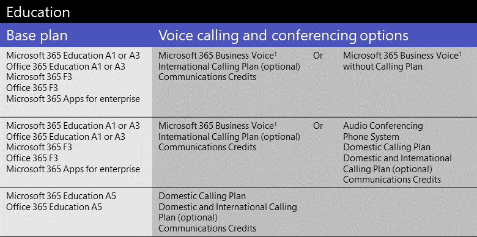

# Licenças de complemento do Microsoft TeamsMicrosoft Teams add-on licenses

## O que são licenças complementares?What are add-on licenses?

As licenças complementares são licenças para recursos específicos do Microsoft Teams.Add-on licenses are licenses for specific Microsoft Teams features. Eles oferecem a flexibilidade de adicionar recursos apenas para usuários em sua organização que precisam deles.They give you the flexibility to add features only for users in your organization who need them. Para adicionar um recurso, compre uma licença complementar para cada usuário que a usará.To add a feature, buy one add-on license for each user who will use it.

## Quais recursos posso obter com licenças complementares?What features can I get with add-on licenses?

Aqui está uma lista de recursos que você pode adicionar com licenças de complemento do Teams.Here's a list of features that you can add with Teams add-on licenses. As opções de licenciamento de complemento disponíveis dependem do plano do Microsoft 365 ou office 365 que você tem.The add-on licensing options available to you depend on the Microsoft 365 or Office 365 plan you have.

|||||
|:-----|:-----|:-----|:-----|
|**Recurso****Feature**   |**Descrição****Description**   |**Pequenas empresas (<300 usuários)****Small business (<300 users)**|**Grandes empresas (>300 usuários)****Large business (>300 users)**|
**Microsoft 365 Business Voice****Microsoft 365 Business Voice**   | [O Business Voice](../business-voice/whats-business-voice.md) é uma solução de telefonia projetada para pequenas e médias empresas de até 300 usuários que agrupam Sistema de Telefonia, Audioconferência, Plano de Chamadas Domésticas e muito mais.[Business Voice](../business-voice/whats-business-voice.md) is a telephony solution designed for small and medium businesses of up to 300 users that bundles Phone System, Audio Conferencing, a Domestic Calling Plan, and more. Os recursos do Sistema de Telefonia que você obterá incluem caixa postal, ID do chamador, estacionamento de chamadas, encaminhamento de chamadas, atendedores automáticos e filas de chamadas.Phone System capabilities that you'll get include voicemail, caller ID, call park, call forwarding, auto attendants, and call queues.   Para saber se o Business Voice está disponível em seu país ou região, consulte Disponibilidade de país e região [para o Business Voice.](../business-voice/country-region-availability.md)To find out whether Business Voice is available in your country or region, see [Country and region availability for Business Voice](../business-voice/country-region-availability.md). Para obter informações sobre preços, consulte [Pricing for Business Voice](https://go.microsoft.com/fwlink/?linkid=2127221).For pricing info, see [Pricing for Business Voice](https://go.microsoft.com/fwlink/?linkid=2127221).   |&#x2713;&#x2713;||
|**Audioconferência****Audio Conferencing**   |Às vezes, as pessoas em sua organização precisarão usar um telefone para ligar para uma reunião do Teams, em vez disso, no computador.Sometimes people in your organization will need to use a phone to call in to a Teams meeting instead their computer. Configurar [Audioconferência para](../audio-conferencing-in-office-365.md) usuários que agendam ou conduzem reuniões.Set up [Audio Conferencing](../audio-conferencing-in-office-365.md) for users who schedule or lead meetings.   Para descobrir se a Audioconferência está disponível em seu país ou região, consulte [Disponibilidade de Audioconferência e Planos de Chamadas por país e região](../country-and-region-availability-for-audio-conferencing-and-calling-plans/country-and-region-availability-for-audio-conferencing-and-calling-plans.md).To find out whether Audio Conferencing is available in your country or region, see [Country and region availability for Audio Conferencing and Calling Plans](../country-and-region-availability-for-audio-conferencing-and-calling-plans/country-and-region-availability-for-audio-conferencing-and-calling-plans.md). Para informações de preços, consulte [Preços de Audioconferência](https://go.microsoft.com/fwlink/?linkid=799762).For pricing info, see [Pricing for Audio Conferencing](https://go.microsoft.com/fwlink/?linkid=799762).     Se você for uma pequena ou média empresa com até 300 usuários e atualmente não tiver licenças de Audioconferência, poderá obter Audioconferência gratuita por um ano.If you're a small or medium-sized business with up to 300 users and you currently don’t have Audio Conferencing licenses, you can get Audio Conferencing free for one year. A partir de 1º de outubro de 2020, a oferta gratuita de Audioconferência está disponível para usuários que têm licenças do Microsoft 365 Business Basic, Business Standard, Business Premium, Enterprise E1 ou Enterprise E3.Starting October 1, 2020, the free Audio Conferencing offer is available to users who have Microsoft 365 Business Basic, Business Standard, Business Premium, Enterprise E1, or Enterprise E3 licenses. Para saber mais, confira [Configurar Audioconferência para pequenas e médias empresas.](../audio-conferencing-smb.md)To learn more, see [Set up Audio Conferencing for small and medium businesses](../audio-conferencing-smb.md).|&#x2713;&#x2713;|&#x2713;&#x2713;|
|**Números gratuitos****Toll free numbers** |Se você quiser números de chamada gratuita para Audioconferência, atendimentos automáticos ou filas de chamada, você deve [configurar Créditos de Comunicação](../set-up-communications-credits-for-your-organization.md).If you want toll-free numbers for Audio Conferencing, auto attendants, or call queues, you must [set up Communications Credits](../set-up-communications-credits-for-your-organization.md).   |&#x2713;&#x2713;|&#x2713;&#x2713;|
|**Sistema de Telefonia****Phone System**   |[O Sistema de](../what-is-phone-system-in-office-365.md) Telefonia é um serviço de telefonia hospedado que oferece controle de chamada e recursos pbx (Private Branch Exchange), com opções para se conectar à PSTN (Rede Telefônica Pública Comucionada).[Phone System](../what-is-phone-system-in-office-365.md) is a hosted telephone service that gives you call control and Private Branch Exchange (PBX) capabilities, with options for connecting to the Public Switched Telephone Network (PSTN). Os recursos do Sistema de Telefonia incluem caixa postal na nuvem, ID do chamador, estacionamento de chamadas, encaminhamento de chamadas, atendedores automáticos, filas de chamadas, transferência de chamada, ID do chamador e muito mais.Phone System features include cloud voicemail, caller ID, call park, call forwarding, auto attendants, call queues, call transfer, caller ID, and more.  Para saber mais, [confira Aqui está o que você obter com o Sistema de Telefonia.](../here-s-what-you-get-with-phone-system.md)To learn more, see [Here's what you get with Phone System](../here-s-what-you-get-with-phone-system.md). Para obter informações sobre preços, consulte [Pricing for Phone System](https://go.microsoft.com/fwlink/?linkid=799763).For pricing info, see [Pricing for Phone System](https://go.microsoft.com/fwlink/?linkid=799763).    |&#x2713;1&#x2713;1|&#x2713;&#x2713;|
|**Planos de Chamadas****Calling Plans**   |Se você quiser que os usuários sejam capazes de chamar números de telefone fora da sua organização, obter um [Plano de Chamadas](../calling-plans-for-office-365.md).If you want users to be able to call phone numbers outside your organization, get a [Calling Plan](../calling-plans-for-office-365.md). Há Planos de Chamada Doméstica e Planos de Chamada Domésticas e Internacionais.There are Domestic Calling Plans and Domestic and International Calling Plans. Para obter informações sobre preços, consulte [Pricing for Calling Plans](https://go.microsoft.com/fwlink/?linkid=799761 ).For pricing info, see [Pricing for Calling Plans](https://go.microsoft.com/fwlink/?linkid=799761 ).    |&#x2713;1&#x2713;1|&#x2713;&#x2713;|
|**Salas do Microsoft Teams****Microsoft Teams Rooms**   |[Salas do Microsoft Teams](../rooms/index.md) não é um complemento, mas um recurso que traz vídeo, áudio e compartilhamento de conteúdo para salas de conferência.[Microsoft Teams Rooms](../rooms/index.md) isn't an add-on, but a feature that brings video, audio, and content sharing to conference rooms. Consulte [Licenciamento da Sala de Reunião do Teams](../rooms/rooms-licensing.md).See [Teams Meeting Room Licensing](../rooms/rooms-licensing.md).    |&#x2713;&#x2713;|&#x2713;&#x2713;|
|**Comunicações Avançadas****Advanced Communications**   |[As Comunicações Avançadas](advanced-communications.md) incluem personalização avançada de reuniões e ferramentas para gerenciar as políticas de comunicação da sua organização.[Advanced Communications](advanced-communications.md) includes advanced meetings customization and tools to manage your organization's communication policies. Recursos adicionais incluem lobby de reunião de marca personalizada para adaptar suas reuniões e ferramentas para monitorar, rastrear e analisar dados de usuários e dispositivos.Additional features include custom branded meeting lobby to tailor your meetings, and tools to monitor, track, and analyze data on users and devices.   |&#x2713;&#x2713;|&#x2713;&#x2713;|

1 Se você for uma pequena ou média empresa que tenha um plano do Microsoft 365 Enterprise, ainda poderá comprar licenças de complemento para esses recursos de voz, no entanto, recomendamos que você considere um plano do [Microsoft 365 Business](https://www.microsoft.com/microsoft-365/compare-all-microsoft-365-products?&activetab=tab:primaryr2) e [o Business Voice.](https://www.microsoft.com/microsoft-365/business/business-voice)1 If you're a small or medium-sized business who has a Microsoft 365 Enterprise plan, you can still buy add-on licenses for these voice features, however, we recommend that you consider a [Microsoft 365 Business](https://www.microsoft.com/microsoft-365/compare-all-microsoft-365-products?&activetab=tab:primaryr2) plan and [Business Voice](https://www.microsoft.com/microsoft-365/business/business-voice).

## Quais recursos de voz estão disponíveis com meu plano?What voice features are available with my plan?

Confira quais licenças de complemento você precisa para obter recursos de voz no Teams, dependendo do plano que você tem.See what add-on licenses you need to get voice features in Teams, depending on the plan you have.

Dependendo dos recursos de voz que você deseja, recomendamos comparar se é mais econômico mudar para um plano que inclua esses recursos.Depending on the voice features that you want, we recommend comparing whether it's more cost effective for you to switch to a plan that includes those features. Por exemplo, para a maioria das grandes organizações, comprar um pacote de software em um plano do Microsoft 365 Enterprise resultará em um custo geral menor.For example, for most large organizations, buying a bundle of software in a Microsoft 365 Enterprise plan will result in lower overall cost. Normalmente, quando você compra várias licenças de complemento individualmente, em vez de como parte de um plano, pode acabar com um custo combinado maior.Typically, when you buy several add-on licenses individually instead of as part of a plan, you may end up with a higher combined cost.

#### [**Pequena Empresa****Small business**](#tab/small-business/)

Se você for uma pequena ou média empresa (menos de 300 usuários), terá quatro maneiras de obter recursos de voz:If you're a small or medium-sized business (less than 300 users), you have four ways to get voice features:

- Compre um plano do Microsoft 365 Business e o Microsoft 365 Business Voice.Buy a Microsoft 365 Business plan and Microsoft 365 Business Voice.
- Compre um plano Enterprise E1 ou E3 e o Microsoft 365 Business Voice.Buy an Enterprise E1 or E3 plan and Microsoft 365 Business Voice.
- Compre um plano enterprise E1 ou E3 e adicione recursos de voz individualmente.Buy an Enterprise E1 or E3 plan and add voice features individually.
- Compre um plano enterprise E5, que inclui recursos de voz.Buy an Enterprise E5 plan, which includes voice features.

Para o Microsoft 365 Business Voice, você tem duas opções para escolher:For Microsoft 365 Business Voice, you have two options to choose from:

- **Microsoft 365 Business Voice com** um Plano de Chamadas : Receba isso se quiser que todo o gerenciamento de números de telefone e cobrança sejam manipulados pela Microsoft.**Microsoft 365 Business Voice with a Calling Plan**: Get this if you want all phone number management and billing to be handled by Microsoft.
- **Microsoft 365 Business Voice** sem um Plano de Chamadas (Roteamento Direto) : Receba isso se quiser que todo o gerenciamento de números de telefone e cobrança sejam manipulados pelo provedor de telefonia de terceiros.**Microsoft 365 Business Voice without a Calling Plan (Direct Routing)**: Get this if you want all phone number management and billing to be handled by your third-party telephone provider. Você precisará configurar e implantar  o Roteamento Direto para conectar seus Controladores de Borda de Sessão (SBCs) locais ao Microsoft 365 ou Office 365.You'll need to set up and deploy [Direct Routing](../direct-routing-landing-page.md) to connect your on-premises Session Border Controllers (SBCs) to Microsoft 365 or Office 365.

Para saber mais, confira [O que preciso comprar para usar o Microsoft 365 Business Voice?](../business-voice/what-to-buy.md).To learn more, see [What do I need to buy to use Microsoft 365 Business Voice?](../business-voice/what-to-buy.md).

Aqui está um resumo, com base no plano de licenciamento.Here's a summary, based on licensing plan.

  

Se a Audioconferência não tiver suporte em seu país ou região, você terá a opção de obter um Microsoft 365 Enterprise E5 sem plano de Audioconferência ou um Office 365 Enterprise E5 sem plano de Audioconferência.If Audio Conferencing isn't supported in your country or region, you have the option to get a Microsoft 365 Enterprise E5 without Audio Conferencing plan or an Office 365 Enterprise E5 without Audio Conferencing plan.

Se você já tiver um plano do Microsoft 365 Enterprise ou office 365 Enterprise, ainda poderá comprar licenças de complemento para recursos de voz individuais.If you already have a Microsoft 365 Enterprise or Office 365 Enterprise plan, you can still buy add-on licenses for individual voice features. No entanto, você tem a opção de mudar para um [plano do Microsoft 365 Business](https://www.microsoft.com/microsoft-365/compare-all-microsoft-365-products?&activetab=tab:primaryr2) e o Microsoft [365 Business Voice.](https://www.microsoft.com/microsoft-365/business/business-voice)However, you have the option to switch to a [Microsoft 365 Business](https://www.microsoft.com/microsoft-365/compare-all-microsoft-365-products?&activetab=tab:primaryr2) plan and [Microsoft 365 Business Voice](https://www.microsoft.com/microsoft-365/business/business-voice). Em alguns casos, dependendo dos recursos que você deseja, pode ser mais econômico obter um plano do Microsoft 365 Business com o Microsoft 365 Business Voice.In some cases, depending on the features that you want, it might be more cost effective to get a Microsoft 365 Business plan with Microsoft 365 Business Voice.

> [!NOTE]
> Se você precisar usar um serviço telefônico de [terceiros,](../direct-routing-landing-page.md) o Roteamento Direto será implantado em sua organização ou se os Planos de Chamadas não estão disponíveis em seu país ou região, você precisará usar o Roteamento Direto para recursos de voz.If you need to use a third-party telephone service, [Direct Routing](../direct-routing-landing-page.md) is deployed in your organization, or if Calling Plans aren't available in your country or region, you need to use Direct Routing for voice features.

#### [**Enterprise****Enterprise**](#tab/enterprise/)

Se você for uma grande empresa ou organização corporativa (mais de 300 usuários), terá duas maneiras de obter recursos de voz:If you're a large business or enterprise organization (more than 300 users), you have two ways to get voice features:

- Compre um plano enterprise E1 ou E3 e adicione recursos de voz individualmente.Buy an Enterprise E1 or E3 plan and add voice features individually.
- Compre um plano enterprise E5, que inclui recursos de voz.Buy an Enterprise E5 plan, which includes voice features.

Aqui está um resumo, com base no plano de licenciamento.Here's a summary, based on licensing plan.

  

Se a Audioconferência não tiver suporte em seu país ou região, você terá a opção de obter um Microsoft 365 Enterprise E5 sem plano de Audioconferência ou um Office 365 Enterprise E5 sem plano de Audioconferência.If Audio Conferencing isn't supported in your country or region, you have the option to get a Microsoft 365 Enterprise E5 without Audio Conferencing plan or an Office 365 Enterprise E5 without Audio Conferencing plan.

Para saber mais, confira Planos do [Microsoft 365 Enterprise e](https://www.microsoft.com/microsoft-365/compare-microsoft-365-enterprise-plans) planos do Office [365 Enterprise.](https://www.microsoft.com/microsoft-365/business/compare-more-office-365-for-business-plans)To learn more, see [Microsoft 365 Enterprise plans](https://www.microsoft.com/microsoft-365/compare-microsoft-365-enterprise-plans) and [Office 365 Enterprise plans](https://www.microsoft.com/microsoft-365/business/compare-more-office-365-for-business-plans).

> [!NOTE]
> Se você precisar usar um serviço telefônico de [terceiros,](../direct-routing-landing-page.md) o Roteamento Direto será implantado em sua organização ou se os Planos de Chamadas não estão disponíveis em seu país ou região, você precisará usar o Roteamento Direto para recursos de voz.If you need to use a third-party telephone service, [Direct Routing](../direct-routing-landing-page.md) is deployed in your organization, or if Calling Plans aren't available in your country or region, you need to use Direct Routing for voice features.

#### [**Educação****Education**](#tab/education/)

Para escolas e outras organizações acadêmicas, você tem três maneiras de obter recursos de voz.For schools and other academic organizations, you have three ways to get voice features.

- Compre um plano EDU A1 ou A3 e o Microsoft 365 Business Voice.Buy an EDU A1 or A3 plan and Microsoft 365 Business Voice.
- Compre um plano EDU A1 ou A3 e adicione recursos de voz individualmente.Buy an EDU A1 or A3 plan and add voice features individually.
- Compre um plano do EDU A5, que inclui recursos de voz.Buy an EDU A5 plan, which includes voice features.

Aqui está um resumo, com base no plano de licenciamento.Here's a summary, based on licensing plan.

  

  1 Disponível somente para organizações com menos de 300 usuários.1 Only available for organizations with less than 300 users.

Para saber mais, confira Planos do [Microsoft 365 Education](https://www.microsoft.com/education/buy-license/microsoft365) e [Office 365 Education.](https://www.microsoft.com/education/products/office)To learn more, see [Microsoft 365 Education](https://www.microsoft.com/education/buy-license/microsoft365) and [Office 365 Education plans](https://www.microsoft.com/education/products/office).

> [!NOTE]
> Se você precisar usar um serviço telefônico de [terceiros,](../direct-routing-landing-page.md) o Roteamento Direto será implantado em sua organização ou se os Planos de Chamadas não estão disponíveis em seu país ou região, você precisará usar o Roteamento Direto para recursos de voz.If you need to use a third-party telephone service, [Direct Routing](../direct-routing-landing-page.md) is deployed in your organization, or if Calling Plans aren't available in your country or region, you need to use Direct Routing for voice features.

#### [**Governo****Government**](#tab/government/)

Para organizações governamentais dos EUA (somente GCC), há três maneiras de obter recursos de voz.For US government organizations (GCC only), there are three ways to get voice features.

- Compre um plano GOV G1 ou G3 e o Microsoft 365 Business Voice.Buy a GOV G1 or G3 plan and Microsoft 365 Business Voice.
- Compre um plano GOV G1 ou G3 e adicione recursos de voz na nuvem individualmente.Buy a GOV G1 or G3 plan and add cloud voice features individually.
- Compre um plano GOV G5, que inclui recursos de voz.Buy a GOV G5 plan, which includes voice features.

Aqui está um resumo, com base no plano de licenciamento.Here's a summary, based on licensing plan.

  

  1 Disponível somente para organizações com menos de 300 usuários.1 Only available for organizations with less than 300 users.

Para saber mais, confira [Planos do Microsoft 365 Government](https://www.microsoft.com/microsoft-365/government/) e Office [365 Government.](https://www.microsoft.com/microsoft-365/government/compare-office-365-government-plans)To learn more, see [Microsoft 365 Government](https://www.microsoft.com/microsoft-365/government/) and [Office 365 Government plans](https://www.microsoft.com/microsoft-365/government/compare-office-365-government-plans).

> [!NOTE]
> Se você precisar usar um serviço telefônico de [terceiros,](../direct-routing-landing-page.md) o Roteamento Direto será implantado em sua organização ou se os Planos de Chamadas não estão disponíveis em seu país ou região, você precisará usar o Roteamento Direto para recursos de voz.If you need to use a third-party telephone service, [Direct Routing](../direct-routing-landing-page.md) is deployed in your organization, or if Calling Plans aren't available in your country or region, you need to use Direct Routing for voice features.

#### [**Sem fins lucrativos****Nonprofit**](#tab/nonprofit/)

Se você for uma organização sem fins lucrativos, terá quatro maneiras de obter recursos de voz.If you're a nonprofit organization, you have four ways to get voice features.

- Compre um plano Microsoft 365 Business Basic ou Microsoft 365 Nonprofit Business Standard e o Microsoft 365 Business Voice.Buy a Microsoft 365 Nonprofit Business Basic or Microsoft 365 Nonprofit Business Standard plan and Microsoft 365 Business Voice.
- Compre um plano E1 ou E3 sem fins lucrativos e o Microsoft 365 Business Voice.Buy a Nonprofit E1 or E3 plan and Microsoft 365 Business Voice.
- Compre um plano E1 ou E3 sem fins lucrativos e adicione recursos de voz individualmente.Buy a Nonprofit E1 or E3 plan and add voice features individually.
- Compre um E5 sem fins lucrativos, que inclui recursos de voz.Buy a Nonprofit E5, which includes voice features.

Aqui está um resumo, com base no plano de licenciamento.Here's a summary, based on licensing plan.

  

  1 Disponível somente para organizações com menos de 300 usuários.1 Only available for organizations with less than 300 users.

Para saber mais, confira Ofertas sem fins lucrativos do [Microsoft 365 e Office 365.](https://www.microsoft.com/microsoft-365/nonprofit/office-365-nonprofit-plans-and-pricing)To learn more, see [Microsoft 365 and Office 365 Nonprofit offers](https://www.microsoft.com/microsoft-365/nonprofit/office-365-nonprofit-plans-and-pricing).

> [!NOTE]
> Se você precisar usar um serviço telefônico de [terceiros,](../direct-routing-landing-page.md) o Roteamento Direto será implantado em sua organização ou se os Planos de Chamadas não estão disponíveis em seu país ou região, você precisará usar o Roteamento Direto para recursos de voz.If you need to use a third-party telephone service, [Direct Routing](../direct-routing-landing-page.md) is deployed in your organization, or if Calling Plans aren't available in your country or region, you need to use Direct Routing for voice features.

#### [**Ofertas de avaliação****Trial offers**](#tab/trial/)

### Ofertas de avaliação para planos de licenciamentoTrial offers for licensing plans

Em resposta a uma necessidade maior de as pessoas trabalharem remotamente (ou trabalharem em casa), a Microsoft tem várias ofertas de avaliação gratuitas do Teams para organizações governamentais, educacionais e sem fins lucrativos.In response to an increased need for people to work remotely (or work from home), Microsoft has several free Teams trial offers for government, educational, and non-profit organizations. As avaliação estão disponíveis para estes planos:Trials are available for these plans:

- Avaliação do Office 365 Enterprise [E1](../e1-trial-license.md) (descontinuada a partir de 1º de julho de 2020), avaliação do E3 e avaliação do E5Office 365 Enterprise [E1 trial](../e1-trial-license.md) (discontinued as of July 1, 2020), E3 trial, and E5 trial
- Avaliação do Office 365 Education [A1](../teams-edu-licensing.md)Office 365 Education [A1 trial](../teams-edu-licensing.md)
- Avaliação do Office 365 Government [G1](../g1-trial-license.md) (descontinuada a partir de 1º de julho de 2020)Office 365 Government [G1 trial](../g1-trial-license.md) (discontinued as of July 1, 2020)

Para inscrever-se em uma oferta de avaliação, consulte [Inscrever-se para uma oferta de avaliação](https://transform.microsoft.com/customer-trials?tab=requestnewtrial).To sign up for a trial offer, see [Sign up for a trial offer](https://transform.microsoft.com/customer-trials?tab=requestnewtrial).

### Ofertas de avaliação para recursos de vozTrial offers for voice features

Veja um resumo das ofertas de avaliação de recursos de voz.Here's a summary of voice feature trial offers.

  

 Seu plano base não precisa ser uma oferta de avaliação para usar qualquer uma dessas avaliação para recursos de voz.Your base plan doesn't have to be a trial offer to use any of these trials for voice features. Você pode usar um plano do Microsoft 365 Business ou um plano Enterprise, Government, Education ou Nonprofit com qualquer uma das ofertas de avaliação para recursos de voz.You can use a Microsoft 365 Business plan or an Enterprise, Government, Education, or Nonprofit plan with any of the trial offers for voice features. Para ver ofertas de avaliação e complementos disponíveis, no Centro de administração do Microsoft 365, vá para Cobrança Serviços de Compra , selecione Outras categorias que podem lhe interessar e selecione  >   **Complementos** .To see available trial offers and add-ons, in the Microsoft 365 admin center, go to **Billing** > **Purchase services**, select **Other categories that might interest you**, and then select **Add-ons**.

  Para cada uma dessas opções de voz e conferência, os Créditos de Comunicação são necessários se você tiver números de chamada gratuita ou se precisar adicionar minutos adicionais para os usuários discarem de reuniões ou para que os usuários façam chamadas PSTN [domésticas](../set-up-communications-credits-for-your-organization.md) e internacionais.For each these voice and conferencing options, [Communications Credits](../set-up-communications-credits-for-your-organization.md) are required if you have toll-free numbers or if you need to add additional minutes for users to dial out from meetings or for users to make domestic and international PSTN calls.

 Além disso, confira:Also, check out:

- [Versão gratuita do TeamsFree version of Teams](../manage-freemium.md)
- [Experiência do Teams Exploratory](../teams-exploratory.md) - atualmente, não há ofertas de avaliação para recursos de voz para uso com a experiência do Teams Exploratory.[Teams Exploratory experience](../teams-exploratory.md) - currently there are no trial offers for voice features for use with the Teams Exploratory experience.
- [Microsoft Phone System - Licença de usuário](virtual-user.md) virtual[Microsoft Phone System - Virtual User](virtual-user.md) license

* * *

## Precisa de ajuda?Need help?

Precisa falar com alguém sobre as opções de complemento?Need to talk to someone about the add-on options? [Entre em contato com o suporte de produtos para empresas – ajuda para administradores](https://support.office.com/article/32a17ca7-6fa0-4870-8a8d-e25ba4ccfd4b).[Contact support for business products - Admin Help](https://support.office.com/article/32a17ca7-6fa0-4870-8a8d-e25ba4ccfd4b).

## Tópicos relacionadosRelated topics

- [Atribuir licenças de complemento do TeamsAssign Teams add-on licenses](assign-teams-add-on-licenses.md)
- [Gerenciamento do acesso de usuários ao TeamsManage user access to Teams](../user-access.md)
- [Descrição do serviço do TeamsTeams service description](https://docs.microsoft.com/office365/servicedescriptions/teams-service-description)
