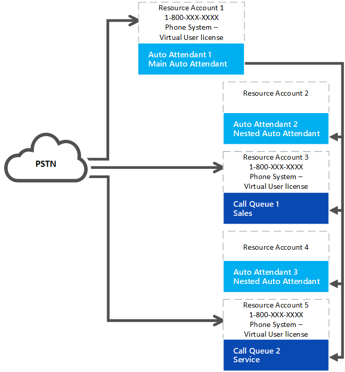

# Sistema telefônico – licença de usuário virtual 

A partir de 2 de julho de 2019, uma organização com usuários licenciados de sistema telefônico agora pode obter e atribuir um sistema telefônico gratuito – licença de usuário virtual ou uma licença de usuário do sistema de telefonia paga para contas de recursos. Um plano de chamada não é mais necessário. Todos os atendedores automáticos ou filas de chamadas exigem uma conta de recurso associada. As contas de recursos que exigem um número de telefone precisam de um sistema telefônico gratuito – licença de usuário virtual ou uma licença de usuário paga do sistema de telefonia antes que um número de telefone possa ser aplicado à conta do recurso.

> [!TIP]
> Nenhuma licença é necessária para contas de recursos que serão usadas com atendedores automáticos aninhados ou filas de chamadas que não tenham um número de telefone atribuído. Consulte o diagrama a seguir para referência: 

## Atribuição de licença de usuário virtual

Sua organização é um sistema de telefonia alocado – licenças de usuário virtual, dependendo do seu tamanho geral. Qualquer organização que tenha pelo menos uma licença incluindo o sistema de telefonia ou um sistema de telefonia adicionado tem 25 licenças de usuário virtual disponíveis sem custo. Quando você adiciona 10 licenças de usuário do sistema telefônico em sua organização, um mais sistema telefônico – licença de usuário virtual torna-se disponível.

> [!NOTE]
> O sistema telefônico é uma licença complementar disponível com o Office 365 E1 e E3. O sistema de telefonia também está incluído como parte das licenças do Office 365 e5.

Se sua organização usa o sistema de telefonia livre disponível – licenças de usuário virtual na criação de atendedor automático ou nós da fila de chamada, você ainda pode usar as licenças do sistema telefônico pago com uma conta de recurso. A maioria das organizações terá licenças de usuário virtual suficientes com base no plano de dimensionamento. 

### Exemplo de alocação de licença

Contoso, Inc. adquiriu licenças do 600 que incluíam o sistema telefônico (um para cada funcionário). A contoso foi alocada para um sistema telefônico inicial de 25 mais 60 – licenças de usuário virtual, 85 no total. Sua organização tem 90 filas de chamadas e atendedores automáticos que têm números de telefone. Eles precisam atribuir todo o sistema telefônico – licenças de usuário virtual e obter cinco licenças de sistema telefônico com preço regular. 

A Contoso deve considerar a reformulação do atendedor automático e o sistema da fila de chamadas. Se eles usarem menos números de telefone e nós aninhados que não precisam de um número de telefone, eles simplificarão a implementação e reduzirão os custos. 

## Como adquirir um sistema telefônico – licenças de usuário virtual 

> [!NOTE] 
> Ao seguir essas instruções, desative o modo de visualização para comprar um sistema telefônico-licença de usuário virtual.

1. Entre no centro de administração do Microsoft 365.
2. Acesse**assinaturas complementares** de**Serviços** > de compra de **cobrança** > 
3. Role até o fim para localizar a licença **"sistema de telefonia – usuário virtual"** . Selecione **comprar agora**.

> [!WARNING]
> Lembre-se que você ainda deve **comprar** a licença, mesmo que tenha um custo de zero. 

## Alterar uma conta de recurso existente para usar um sistema telefônico – licença de usuário virtual

Se você decidir mudar a licença da sua conta de recurso de uma licença do sistema de telefonia para um sistema telefônico – licença de usuário virtual: 

1. Obter o novo sistema telefônico – licença de usuário virtual. 
2. Siga as etapas vinculadas no centro de administração do Microsoft 365 para [mover os usuários para uma assinatura diferente](https://docs.microsoft.com/en-us/office365/admin/subscriptions-and-billing/assign-licenses-to-users?redirectSourcePath=%252farticle%252f997596b5-4173-4627-b915-36abac6786dc&view=o365-worldwide#move-users-to-a-different-subscription). 

> [!WARNING]
> Sempre remova uma licença completa do sistema de telefonia e atribua o sistema de telefone – licença de usuário virtual na mesma atividade de licença. Se você remover a antiga licença, salvar as alterações da conta, adicionar a nova licença e salvar as configurações da conta novamente, a conta do recurso talvez não funcione mais como esperado. Se isso acontecer, recomendamos que você crie uma nova conta de recurso para o sistema telefônico – licença de usuário virtual e remova a conta de recurso quebrada. 

## Informações relacionadas

[Atualização do serviço de atendedor automático e filas de chamadas](https://techcommunity.microsoft.com/t5/Microsoft-Teams-Blog/Auto-Attendant-and-Call-Queues-Service-Update/ba-p/564521)

[Gerenciar contas de recursos no Microsoft Teams](../manage-resource-accounts.md)
