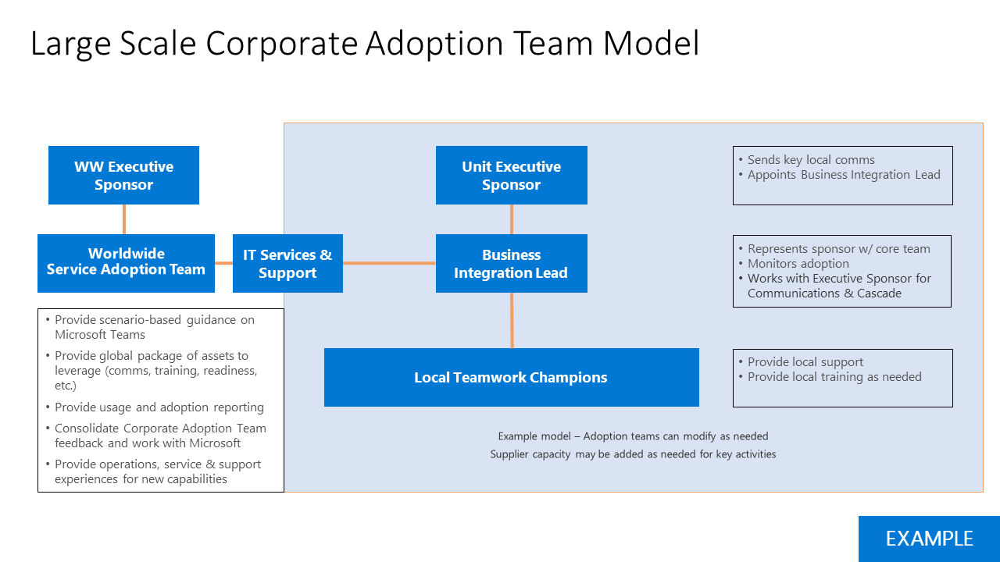

# Definir os resultados e o sucesso da adoção do Microsoft Teams

Para cada cenário de negócios ou serviço que você modernizar, é fundamental definir a aparência de sucesso para sua empresa. Você terá coletado essas informações para seus cenários iniciais à medida que as mapeou na fase anterior. Ao se preparar para sua implementação de escala, você precisará revisitar e expandir esses critérios de sucesso importantes.
  
A seguir, uma estratégia recomendada para mapear esses critérios. Há muitas abordagens válidas para esta etapa. Você pode seguir nosso guia ou seguir o guia do parceiro da Microsoft com o que você pode estar trabalhando. Seja qual for o método escolhido, certifique-se de que os resultados da sua empresa sejam suportados pela implementação técnica de seus serviços e objetivos gerais da sua organização.
  
Há quatro categorias de resultados que podem ser priorizados para sua empresa. Eles são interconectados e formam a base da modernização e transformação digital que os funcionários individuais experimentarão.  

Exemplo de resultados em cada categoria são:

- **Organizacional**
   - Transformação cultural
   - Retenção de funcionários
   - Aquisição de talentos
   - Envolvimento social
   - Agilidade operacional 

- **Cultural**
   - Sentimento dos funcionários
   - Recomendações de funcionários
   - Comentários do cliente
   - Medidas de inovação (por exemplo, contribuições do fórum de ideias, hackathons, compromissos de inovação do produto)

- **Tangible**
   - Impactos na experiência do cliente (serviço mais rápido, redução de incidentes de serviço, indicações do cliente/participação no programa de fidelidade)
   - Economia de custo
   - Geração de receita
   - Segurança de dados
   - Simplificação de processos
   - Aposentadoria de sistemas herdamentos
   
- **Individual**
   - Uso de ferramentas desejadas
   - Ânimo dos funcionários
   - Produtividade do funcionário
   - Envolvimento de funcionários
   - Geração de ideias
 
Em geral, você deve pensar nessas medidas agregando para criar um quociente de alteração para sua empresa dessa maneira:

## Selecionar uma estratégia de habilitação de serviço

Teams é uma tecnologia transformativa, portanto, dependendo do tamanho da sua organização e das tecnologias existentes, você pode tomar diferentes abordagens. Considere estas estratégias:

| Teams First | Teams Core | Teams Grande | Skype lado a lado | Migração |
|------------ | ---------- | ------------ | ------------------ | --------- |
| Liderar a implantação na nuvem com Teams | Habilitar cenários de colaboração de líder com Teams | Todos os funcionários em equipes Teams e de toda a organização | Habilitar Teams e Skype for Business | Migrar usuários de Skype for Business para Teams |
| - Aplicável a clientes novos ou de baixo uso Microsoft 365 ou Office 365 clientes  - Liderar com Teams cenário específico do cliente  - Realça a experiência integrada do usuário e o tempo acelerado para valor para Microsoft 365 ou Office 365  - Conduzir a habilitação da carga de trabalho de planejamento em conjunto para evitar a implementação em série | - Habilitar Teams com o OneDrive e SharePoint Online  - Criar uma intranet da empresa para compartilhar recursos de notícias e vídeo com o Microsoft Stream **Melhor juntos**:  Teams SharePoint Yammer Planner PowerApps |- Para clientes com menos de 5.000 assentos (limitação atual) - Habilitar a colaboração entre organizações com uma equipe para todos – Automatizar tarefas comuns (solicitações de férias, pesquisas de funcionários, envolvimento executivo) |- Usar Teams principais táticas para acelerar a colaboração - Realce as diretrizes do cenário de reunião com base no tamanho e no conjunto de recursos necessários - Use Skype for Business para chamar empresas, interoperabilidade e cenários híbridos - Use o roteiro público para o planejamento de funcionalidades. |- Planeje mover para Teams de Skype for Business criando roteiro de estratégia de serviço para o cliente - Anexar ao cronograma de lançamento de recursos - Recomenda incluir Lado a Lado e Teams Core para facilitar a transição

A seguir estão nossas recomendações para a maioria das organizações de clientes. No entanto, há exceções. Para obter orientações sobre qualquer cenário não abordado aqui, faça suas perguntas em nossa comunidade de Adoção de Direção ou entre em contato com a equipe FastTrack ou a rede de parceiros da Microsoft.

- **Escolha Teams First ou Teams Core**: a maioria das organizações tem um investimento existente na tecnologia Microsoft. Você pode estar habilitando mais de uma carga de trabalho por vez, como Exchange Online, OneDrive for Business ou SharePoint. Nesses casos, selecionar Teams First ou Teams Core é uma escolha sensata. Ele permitirá que seus usuários se adprimoram com a experiência de colaboração aprimorada de Teams. Sua equipe de projeto de colaboração pode então planejar a adoção de recursos adicionais e o treinamento e o suporte necessários para que eles sejam bem-sucedidos. 

- **Escolha Teams Go Big**: em novas organizações de clientes Microsoft 365 ou Office 365, geralmente é melhor fazer uma abordagem Teams Go Big para minimizar o fatiga da mudança causada pelo aprendizado de novas tecnologias várias vezes. Você obterá o maior benefício habilitando o Teams para colaboração principal e reuniões, SharePoint, OneDrive, Planner e outras cargas de trabalho e permitindo que seus funcionários aprendam sobre eles no contexto de sua implantação Teams. 

    Teams Go Big também é a estratégia de habilitação preferencial para organizações com menos de 1.000 funcionários que querem simplificar a comunicação e o envolvimento dos funcionários. O uso da equipe de toda a organização pode reunir as pessoas para revisar tarefas e iniciativas comuns em qualquer dispositivo. 

- **Escolha** Lado a lado: Para organizações que estão usando o Skype for Business para audioconferência, suporte para dispositivos de sala de conferência ou recursos de voz na nuvem, recomendamos executar o Teams e o Skype lado a lado para familiarizar seus funcionários com os principais recursos de colaboração, enquanto planeja sua migração fora de Skype for Business em um momento conveniente para sua empresa. Observe que executar ambos os clientes lado a lado pode introduzir confusão do usuário sobre qual ferramenta usar, portanto, recomendamos manter essa fase em sua jornada de adoção curta. 

- **Escolha Migração**: migrar do Skype for Business para o Teams tem componentes adicionais de uma perspectiva técnica, mas a jornada de adoção do usuário tem os mesmos componentes de uma implementação Teams Go Big. Além disso, você estará educando as pessoas sobre Teams experiência de reunião e interface, o novo comportamento de chat persistente e outros elementos da experiência que são diferentes de Skype for Business.

Para cada estratégia de habilitação, é essencial trabalhar em estreita cooperação com sua equipe de preparação técnica para garantir que seu ambiente proporcionará uma ótima experiência de funcionário. 

 Decisão: selecione uma estratégia de habilitação que dará suporte melhor aos resultados da sua empresa para Microsoft Teams e que possa ser habilitada pela sua equipe de implementação técnica. Esta é uma decisão conjunta entre liderança de TI, líderes de gerenciamento de programas e especialistas em adoção de usuários. Essa decisão geralmente se deve ao stakeholder executivo que é o proprietário de sucesso final para Microsoft Teams ou serviços de colaboração em sua organização.

Prática prática: as estratégias de habilitação podem ser apropriadas para uma determinada fase do seu projeto ou cronograma de implementação divisional. Use as personas-chave e suas necessidades para fazer seleções. Trabalhe em estreita cooperação com sua equipe de implementação técnica para garantir uma experiência de alta qualidade para seus usuários.  

## Envolver as partes interessadas

A comunicação e o gerenciamento de expectativas são elementos fundamentais em um projeto de mudança bem-sucedido. É importante comunicar regularmente sua visão geral e seu progresso em direção a essa meta para seus participantes e outras pessoas em sua organização. 

 Decisão: decida seu ritmo e método para se comunicar com seus participantes em alinhamento com a cultura da sua empresa. Direcionar suas comunicações para os vários níveis de envolvimento e interesse em toda a sua organização. 

Opção: Para criar uma base de conhecimento contínua de informações sobre seu projeto, considere usar páginas de notícias em seu site de SharePoint de comunicação. Sua biblioteca de páginas de notícias (páginas de site SharePoint site associado à sua equipe de planejamento) pode ser pública para que elas possam ser compartilhadas com todas as partes interessadas.

## Expandir sua equipe de implementação

Em uma organização grande, você deve tentar incorporar várias funções diferentes em sua fase ampla de habilitação. Isso pode incluir patrocinadores corporativos adicionais, equipe de suporte de IT, membros adicionais em sua comunidade de campeões e, em alguns casos, gerenciamento de alterações formais ou equipe de treinamento. A ilustração a seguir mostra uma equipe de adoção em grande escala que permite uma separação de funções.

Em uma organização menor, uma ou mais dessas funções podem ser executadas por um único indivíduo, mas as habilidades necessárias permanecem as mesmas.  Habilidades técnicas, de comunicação e treinamento são importantes em um projeto de mudança bem-sucedido. 

## Expanda suas políticas de gerenciamento de informações e governança

Depois de selecionar sua estratégia de habilitação, você estará pronto para revisitar e dimensionar as decisões de governança que você fez na Fase 1. Revisite as decisões de 1 a 6 desde o início rápido de [Governança](teams-adoption-governance-quick-start.md) para expandir essas políticas em alinhamento com os usuários de negócios que estarão usando Teams. 

| Nível de equipe | Escopo/finalidade | Associação padrão | Duração |
|----------- | ------------- | ------------------- | -------- |
|Nível 1 | A equipe autoritativa de uma unidade de divisão ou de negócios | Normalmente restrito aos membros oficiais desta divisão/unidade | Em perpetuidade, desde que a divisão exista (por exemplo, departamento de IT, Recursos Humanos, Marketing)|
| Nível 2 | Project, serviço ou equipes de iniciativa com um escopo menor |  Normalmente entre organizações e pode incluir convidados | Enquanto esse projeto ou serviço está sendo trabalhado |
| Nível 3 | Projetos de ponto no tempo | Pequena equipe de malha com escopo individual; pode incluir convidados | Ciclo de vida curto vinculado ao produto principal |

Exemplo de práticas recomendadas de provisionamento e gerenciamento de nível de equipe:

|Nível de equipe | Who cria? | Lavels and retention | Considerações |
| --------- | ------------ | -------------------- | -------------- |
| Nível 1 - Divisional | IT ou champion para esse grupo nomeá-lo corretamente | Confidencial com política de retenção padrão aplicada e política de renovação de 1 ano | Pense nisso como reservar um nome de domínio. Você deseja controlar como as equipes de divisão são nomeadas e o que está incluído.  Projete a equipe antes de adicionar usuários adicionais.|
| Nível 2 - Project/serviço | Project proprietário ou campeão | Confidencial ou altamente confidencial, dependendo do conteúdo. Pode ter uma política de retenção. Renovação de 6 meses. | Antes de criar isso, pense um pouco além do limite do projeto ou serviço em que você está trabalhando. Faria mais sentido combinar forças com outra equipe? Faça todo o esforço para minimizar o número de equipes que os usuários individuais têm que visitar ao trabalhar no mesmo projeto ou serviço.|
| Nível 3 – Pequena equipe de projeto sob demanda | Qualquer pessoa na organização | Rótulo geral com retenção padrão e renovação de 6 meses. Pode incluir convenção de nomenis (prefixo/sufixo)| Equipes de autoatendida sob demanda. Provisionamento sem atrito. Elas facilitam a colaboração e comunicações suaves para pequenas equipes de projeto que procuram obter valor imediato dos serviços fornecidos pela empresa. |

## Simplificar o envolvimento empresarial

Uma parte essencial da transformação digital e do uso no Microsoft Teams é trabalhar com suas unidades de negócios para entender quais necessidades, oportunidades e dificuldades elas têm. Embora seja semelhante à conversa tradicional de IT para empresas, seu foco deve estar no que é necessário. Ouvir antes de passar para requisitos técnicos. Em muitos casos, os recursos de caixa de correio Teams atenderão às necessidades da sua organização.   

Prática prática: antes de considerar o desenvolvimento de uma solução personalizada, certifique-se de que sua organização está usando totalmente as funcionalidades fora da caixa de Microsoft 365 ou Office 365. O desenvolvimento de soluções personalizadas sempre incorre em custos de longo prazo para seus departamentos de SUPORTE e DEHs.
 
Tome as etapas a seguir para simplificar seu trabalho com unidades de negócios.  Reconheça que, em corporações multi-nacionais muito grandes, esse processo pode continuar muito depois da sua primeira implantação em grande escala de Microsoft Teams:

1. Encontre-se com os principais influenciadores em uma unidade de negócios antes de envolver o executivo para obter informações e alinhamento.
2. Entenda suas soluções atuais para cenários comuns (email, SharePoint, Yammer e outros produtos).
3. Comece pequeno selecionando cenários que mapeiam para dificuldade de alto impacto, de baixo/médio à medida que você dimensiona,
4. Capturar comentários e desenvolver campeões com conhecimento da unidade de negócios para dar suporte à transição,
5. Configurar pontos de verificação mensais para discutir o progresso e priorizar o backlog de projetos adicionais.

 Em seguida: [Otimizar comentários e relatórios](teams-adoption-optimize-feedback-and-reporting.md)
