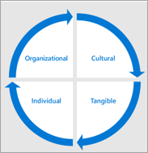

# Definir os resultados e o sucesso da adoção do Microsoft TeamsDefine outcomes and success for your Microsoft Teams adoption

Para cada cenário de negócios ou serviço modernizado, é fundamental definir a aparência de sucesso para sua empresa.For every business scenario or service you modernize, it is critical to define what success looks like for your business. Você terá coletado essas informações para seus cenários iniciais conforme as mapeou na fase anterior.You will have gathered that information for your initial scenarios as you mapped them in your prior phase. Conforme você se prepara para a implementação de escala, precisará revisitar e expandir esses critérios de sucesso importantes.As you prepare for your scale implementation, you will need to revisit and expand these important success criteria.
  
A seguir, uma estratégia recomendada para mapear esses critérios.What follows is a recommended strategy for mapping these criteria. Há muitas abordagens válidas para esta etapa.There are many valid approaches to this step. Você pode seguir nosso guia ou seguir o guia do parceiro da Microsoft com o que você pode estar trabalhando.You can follow our guide or follow the guide of the Microsoft partner you may be working with. Seja qual for o método escolhido, certifique-se de que seus resultados de negócios sejam suportados pela implementação técnica de seus serviços e objetivos gerais da sua organização.Whatever method you choose, make sure that your business outcomes are supported by the technical implementation of your services and overall objectives of your organization.
  
Há quatro categorias de resultados que podem ser priorizados para sua empresa.There are four categories of outcomes that can be prioritized for your business. Eles são interconectados e formam a base da modernização e da transformação digital que os funcionários individuais experimentarão.They are interconnected and form the foundation of the modernization and digital transformation that individual employees will experience.  

Exemplos de resultados em cada categoria são:Example of outcomes in each category are:

- **Organizacional****Organizational**
   - Transformação culturalCultural transformation
   - Retenção de funcionáriosEmployee retention
   - Aquisição de talentosTalent acquisition
   - Envolvimento socialSocial engagement
   - Agilidade operacionalOperational agility 

- **Cultural****Cultural**
   - Sentimento dos funcionáriosEmployee sentiment
   - Recomendações de funcionáriosEmployee recommendations
   - Comentários do clienteCustomer feedback
   - Medidas de inovação (por exemplo, contribuições do fórum de ideias, hackathons, compromissos de inovação do produto)Innovation measures (for example, idea forum contributions, hackathons, product innovation engagements)

- **Tangível****Tangible**
   - Impactos na experiência do cliente (serviço mais rápido, redução de incidentes de serviço, participação do programa de referência/fidelidade do cliente)Customer experience impacts (faster service, reduction in service incidents, customer referral/loyalty program participation)
   - Economia de custoCost savings
   - Geração de receitaRevenue generation
   - Segurança de dadosData security
   - Simplificação de processosProcess simplification
   - Aposentadoria de sistemas herddosRetirement of legacy systems
   
- **Individual****Individual**
   - Uso das ferramentas desejadasUse of desired tools
   - Funcionários " "Employee morale
   - Produtividade do funcionárioEmployee productivity
   - Envolvimento do funcionárioEmployee engagement
   - Geração de ideiasIdea generation
 
Em geral, você deve pensar nessas medidas agregando para criar um quociente de alteração para sua empresa desta maneira:In general, you should think of these measures aggregating to create a change quotient for your company in this manner:

## Selecionar uma estratégia de habilitação de serviçoSelect a service enablement strategy

O Teams é uma tecnologia transformativa, portanto, dependendo do tamanho da sua organização e das tecnologias existentes, você pode tomar abordagens diferentes.Teams is a transformative technology, so depending on the size of your organization and your existing technologies, you may take different approaches. Considere estas estratégias:Consider these strategies:

| Teams FirstTeams First | Teams CoreTeams Core | O Teams está em grandeTeams Go Big | Skype Lado a LadoSkype Side by Side | MigraçãoMigration |
|------------ | ---------- | ------------ | ------------------ | --------- |
| Liderar a implantação na nuvem com o TeamsLead cloud deployment with Teams | Habilitar cenário de colaboração de líder com o TeamsLead collaboration scenario enablement with Teams | Todos os funcionários no Teams e em equipes de toda a organizaçãoAll employees on Teams and organization-wide teams | Habilitar o Teams e o Skype for BusinessEnable Teams and Skype for Business | Migrar usuários do Skype for Business para o TeamsMigrate users from Skype for Business to Teams |
| - Aplicável a clientes do Microsoft 365 ou Office 365 de uso novo ou baixo- Applicable to new or low usage Microsoft 365 or Office 365 customers  – Conduza com o Teams em cenário específico do cliente- Lead with Teams in customer-specific scenario  – Realça a experiência integrada do usuário e o tempo acelerado para valor para o Microsoft 365 ou Office 365- Highlight integrated user experience and accelerated time to value for Microsoft 365 or Office 365  - Conduzir o planejamento da habilitação da carga de trabalho para evitar a implementação em série- Conduct planning workload enablement together to avoid serial implementation | - Habilitar o Teams junto com o OneDrive e o SharePoint Online- Enable Teams along with OneDrive and SharePoint Online  - Criar uma intranet da empresa para compartilhar recursos de notícias e vídeo com o Microsoft Stream- Create a company intranet to share news resources and video with Microsoft Stream **Melhor juntos:****Better together**:  TeamsTeams SharePointSharePoint YammerYammer PlannerPlanner PowerAppsPowerApps |- Para clientes com menos de 5.000 assentos (limitação atual)- For customers with less than 5000 seats (current limitation) - Habilitar a colaboração entre organizações com uma equipe para todos- Enable cross organization collaboration with one team for all – Automatizar tarefas comuns (solicitações de férias, pesquisas de funcionários, envolvimento executivo)- Automate common tasks (vacation requests, employee surveys, executive engagement) |- Usar táticas fundamentais do Teams para acelerar a colaboração- Use Teams Core tactics to accelerate collaboration - Realce as diretrizes do cenário de reunião com base no tamanho e no conjunto de recursos necessários- Highlight meeting scenario guidance based on size and feature set required - Usar o Skype for Business para cenários híbridos, de chamadas, interoperabilidade e de chamadas corporativas- Use Skype for Business for enterprise calling, interoperability, and hybrid scenarios - Use o mapa público para o planejamento de funcionalidades.- Use public roadmap for capability planning. |- Planejar a mudança para o Teams do Skype for Business criando um roteiro de estratégia de serviço para o cliente-    Plan move to Teams from Skype for Business by creating service strategy roadmap for the customer - Anexar ao cronograma de lançamento de recursos- Attach to feature release schedule - Recomendamos incluir o Lado a Lado e o Teams Core para facilitar a transição- Recommend including Side by Side and Teams Core to ease transition

A seguir estão nossas recomendações para a maioria das organizações de clientes.The following are our recommendations for most customer organizations. No entanto, há exceções.However, there are exceptions. Para obter orientações sobre qualquer cenário não abordado aqui, faça suas perguntas em nossa comunidade de Adoção de Direção ou entre em contato com a equipe do FastTrack ou com a rede de parceiros da Microsoft.To get guidance for any scenario not covered here, ask your questions in our Driving Adoption community or reach out to the FastTrack team or Microsoft partner network.

- **Escolha o Teams First ou o Teams Core:** a maioria das organizações tem um investimento existente na tecnologia da Microsoft.**Choose Teams First or Teams Core**: Most organizations have an existing investment in Microsoft technology. Você pode estar habilitando mais de uma carga de trabalho por vez, como Exchange Online, OneDrive for Business ou SharePoint.You may be enabling more than one workload at a time, such as Exchange Online, OneDrive for Business, or SharePoint. Nesses casos, selecionar o Teams First ou o Teams Core é uma escolha inteligente.In these cases, selecting Teams First or Teams Core is a wise choice. Ele permitirá que os usuários se adprimoram com a experiência de colaboração aprimorada do Teams.It will enable your users to get used to the enhanced collaboration experience of Teams. Sua equipe de projeto de colaboração pode então planejar a adoção de recursos adicionais e o treinamento e o suporte necessários para que eles sejam bem-sucedidos.Your collaboration project team can then plan to roll out additional capabilities and the  training and support required for them to be successful. 

- **Choose Teams Go Big**: In new Microsoft 365 or Office 365 customer organizations it is often best to take a Teams Go Big approach to minimize the change fat caused by learning new technology multiple times.**Choose Teams Go Big**: In new Microsoft 365 or Office 365 customer organizations it is often best to take a Teams Go Big approach to minimize the change fatigue caused by learning new technology multiple times. Você obterá o maior benefício habilitando o Teams para colaboração principal e reuniões, SharePoint, OneDrive, Planner e outras cargas de trabalho, e permitindo que seus funcionários aprendam sobre eles no contexto da implantação do Teams.You'll get the greatest benefit by enabling Teams for both core collaboration and meetings, SharePoint, OneDrive, Planner, and other workloads, and allowing your employees to learn about them in the context of your Teams deployment. 

    O Teams Go Big também é a estratégia de habilitação preferencial para organizações com menos de 1.000 funcionários que querem simplificar a comunicação e o envolvimento dos funcionários.Teams Go Big is also the preferred enablement strategy for organizations under 1,000 employees who want to simplify their employee communication and engagement. Usar a equipe de toda a organização pode reunir as pessoas para revisar tarefas comuns e iniciativas em qualquer dispositivo.Using the organization-wide team can bring people together to review common tasks and initiatives on any device. 

- Escolha Lado a **Lado:** Para organizações que estão usando o Skype for Business para audioconferência, suporte para dispositivos de sala de conferência ou recursos de voz na nuvem, recomendamos executar o Teams e o Skype lado a lado para familiarizar seus funcionários com os principais recursos de colaboração, enquanto planeja sua migração fora do Skype for Business em um momento conveniente para sua empresa.**Choose Side by Side**: For organizations that are using Skype for Business for audio conferencing, support for conference room devices, or cloud voice capabilities, we recommend running Teams and Skype side by side to familiarize your employees with the core collaboration features, while planning your migration off of Skype for Business at a time that is convenient for your company. Observe que executar ambos os clientes lado a lado pode causar confusão para o usuário sobre qual ferramenta usar, portanto, recomendamos manter essa fase em sua jornada de adoção curta.Note that running both clients side by side can introduce user confusion about which tool to use, so we recommend keeping this phase in your adoption journey short. 

- **Escolha Migração**: Migrar do Skype for Business para o Teams tem componentes adicionais de uma perspectiva técnica, mas a jornada de adoção do usuário tem os mesmos componentes de uma implementação do Teams Go Big.**Choose Migration**: Migrating from Skype for Business to Teams has additional components from a technical perspective, but the user adoption journey has the same components as a Teams Go Big implementation. Além disso, você ensinará as pessoas sobre a experiência e a interface de reunião do Teams, o novo comportamento de chat persistente e outros elementos da experiência que são diferentes do Skype for Business.In addition, you will be educating people about the Teams meeting experience and interface, the new persistent chat behavior, and other elements of the experience that are different from Skype for Business.

Para cada estratégia de habilitação, é essencial trabalhar de perto com sua equipe de preparação técnica para garantir que seu ambiente proporcionará uma excelente experiência de funcionário.For each enablement strategy, it's essential to work closely with your technical readiness team to ensure that your environment will deliver a great employee experience. 

 Decisão: selecione uma estratégia de habilitação que dará melhor suporte aos resultados de negócios do Microsoft Teams e que possa ser habilitada pela sua equipe de implementação técnica.Decision: Select an enablement strategy that will best support your business outcomes for Microsoft Teams and that can be enabled by your technical implementation team. Esta é uma decisão conjunta entre liderança de TI, líderes de gerenciamento de programas e especialistas em adoção de usuários.This is a joint decision between IT leadership, program management leads, and user adoption specialists. Essa decisão geralmente fica com o stakeholder executivo que é o proprietário final do sucesso do Microsoft Teams ou dos serviços de colaboração em sua organização.This decision often rests with the executive stakeholder who is the ultimate success owner for Microsoft Teams or collaboration services in your organization.

Práticas práticas: as estratégias de habilitação podem ser apropriadas para uma determinada fase do seu projeto ou cronograma de implementação divisional.Best Practice: Enablement strategies can be appropriate for a given phase of your project or divisional implementation schedule. Use personas importantes e suas necessidades para fazer seleções.Use key personas and their needs to make selections. Trabalhe em contato com sua equipe de implementação técnica para garantir uma experiência de alta qualidade para seus usuários.Work closely with your technical implementation team to ensure a high-quality experience for your users.  

## Envolver os stakeholdersEngage stakeholders

A comunicação e o gerenciamento de expectativas são elementos-chave em um projeto de alteração bem-sucedido.Communication and managing expectations are key elements in a successful change project. É importante comunicar regularmente sua visão geral e seu progresso em relação a essa meta para seus stakeholders e outras pessoas em sua organização.It's important to regularly communicate your overall vision and your progress toward that goal to your stakeholders and others in your organization. 

 Decisão: decida seu ritmo e método para se comunicar com seus participantes em alinhamento com a cultura da sua empresa.Decision: Decide your rhythm and method for communicating with your stakeholders in alignment with your company culture. Direcionar suas comunicações para os vários níveis de envolvimento e interesse em toda a organização.Target your communications to the various levels of engagement and interest across your organization. 

Opção: para criar uma base de conhecimento contínua de informações sobre seu projeto, considere usar páginas de notícias em seu site de comunicação do SharePoint.Option: To create an ongoing knowledge base of information about your project, consider using news pages in your SharePoint communication site. Sua biblioteca de páginas de notícias (páginas de site no site do SharePoint associadas à sua equipe de planejamento) pode ser pública para que elas possam ser compartilhadas com todas as partes interessadas.Your news page library (site pages in the SharePoint site associated with your planning team) can be made public so they can be shared with all interested parties.

## Expandir sua equipe de implementaçãoExpand your implementation team

Em uma grande organização, você deve tentar incorporar várias funções diferentes em sua fase de adoção ampla.In a large organization you should try to incorporate many different roles in your broad enablement phase. Isso pode incluir patrocinadores corporativos adicionais, equipe de suporte de IT, membros adicionais em sua comunidade de campeões e, em alguns casos, gerenciamento formal de alterações ou pessoal de treinamento.This may include additional business sponsors, IT support staff, additional members in your champion community, and in some cases formal change management or training personnel. A ilustração abaixo mostra uma equipe de adoção em grande escala que permite uma separação de direitos.The illustration below shows a large scale adoption team that allows for a separation of duties.

Em uma organização menor, uma ou mais dessas funções podem ser executadas por um único indivíduo, mas as habilidades necessárias permanecem as mesmas.In a smaller organization one or more of these roles might be performed by a single individual, but the skills required remain the same.  Habilidades técnicas, de comunicação e treinamento são importantes em um projeto de mudança bem-sucedido.Technical, communication and training skills are important in a successful change project. 

## Expandir sua governança e políticas de gerenciamento de informaçõesExpand your governance and information management policies

Depois de selecionar sua estratégia de habilitação, você estará pronto para revisitar e dimensionar as decisões de governança tomadas na Fase 1.Once you've selected your enablement strategy you'll be ready to revisit and scale governance decisions you made in Phase 1. Revisite as decisões de  1 a 6 do início rápido de Governança para expandir essas políticas em alinhamento com os usuários comerciais que usarão o Teams.Revisit decisions 1 through 6 from the [Governance quick start](teams-adoption-governance-quick-start.md) to expand these policies in alignment with the business users who will be using Teams. 

| Nível de equipeTeam level | Escopo/finalidadeScope/purpose | Associação padrãoStandard membership | DuraçãoDuration |
|----------- | ------------- | ------------------- | -------- |
|Nível 1Level 1 | A equipe autoritativa de uma divisão ou unidade de negóciosThe authoritative team for a division or business unit | Geralmente restrito a membros oficiais desta divisão/unidadeUsually restricted to official members of this division/unit | Em perpetuidade enquanto a divisão existir (por exemplo, departamento de IT, Recursos Humanos, Marketing)In perpetuity for as long as the division exists (for example, IT department, Human Resources, Marketing)|
| Nível 2Level 2 | Equipes de projeto, serviço ou iniciativa com um escopo menorProject, service, or initiative teams with a smaller scope |  Normalmente entre organizações e pode incluir convidadosNormally cross-organizational and may include guests | Enquanto esse projeto ou serviço está sendo trabalhadoFor as long as that project or service is being worked on |
| Nível 3Level 3 | Projetos de ponto no tempoPoint in time projects | Equipe pequena e rígida com escopo individual; pode incluir convidadosSmall tight knit team with individual scope; may include guests | Ciclo de vida curto vinculado ao produto principalShort lifecycle tied to core deliverable |

Exemplo de práticas recomendadas de provisionamento e gerenciamento de nível de equipe:Example team level provisioning and management best practices:

|Nível de equipeTeam level | Quem cria?Who creates? | Lavels and retentionLavels and retention | ConsideraçõesConsiderations |
| --------- | ------------ | -------------------- | -------------- |
| Nível 1 - DivisionalLevel 1 - Divisional | IT ou champion for that group to name it properlyIT or champion for that group to name it properly | Confidencial com política de retenção padrão aplicada e política de renovação de 1 anoConfidential with standard retention policy applied and 1 year renewal policy | Pense nisso como reservar um nome de domínio.Think of this like reserving a domain name. Você deseja controlar como as equipes de divisão são nomeadas e o que está incluído.You want control of how division teams are named and what's included.  Projete a equipe antes de adicionar usuários adicionais.Design the team before adding additional users.|
| Nível 2 - Projeto/serviçoLevel 2 - Project/service | Proprietário ou defensor do projetoProject owner or champion | Confidencial ou altamente confidencial, dependendo do conteúdo.Confidential or highly confidential depending on content. Pode ter uma política de retenção.May have a retention policy. Renovação de seis meses.6 month renewal. | Antes de criar isso, pense um pouco além do limite do projeto ou serviço em que você está trabalhando.Before creating this, think just beyond the boundary of the project or service you are working on. Faria mais sentido combinar as forças com outra equipe?Would it make more sense to combine forces with another team? Faça todo o esforço para minimizar o número de equipes que usuários individuais têm que visitar ao trabalhar no mesmo projeto ou serviço.Make every effort to minimize the number of teams individual users have to visit when working on the same project or service.|
| Nível 3 – Pequena equipe de projeto sob demandaLevel 3 – Small on-demand project team | Qualquer pessoa na organizaçãoAnyone in the organization | Rótulo geral com retenção padrão e renovação de seis meses.General label with standard retention and 6 month renewal. Pode incluir convenção de nomen por nome (prefixo/sufixo)May include naming convention (prefix/suffix)| Autoatendida em equipes sob demanda.Self-service on demand teams. Provisionamento sem atrito.Frictionless provisioning. Elas facilitam a colaboração e as comunicações suaves para pequenas equipes de projeto que procuram obter valor imediato dos serviços fornecidos pela empresa.These facilitate smooth collaboration and communications for small project teams looking to get immediate value from company provided services. |

## Simplificar o envolvimento dos negóciosStreamline business engagement

Uma parte essencial da transformação digital e do uso no Microsoft Teams é trabalhar com suas unidades de negócios para entender quais necessidades, oportunidades e dificuldades elas têm.An essential part of driving digital transformation and usage in Microsoft Teams is working with your business units to understand what needs, opportunities, and difficulties they have. Embora semelhante à conversa tradicional de IT para negócios, seu foco deve estar no que é necessário.While similar to the traditional IT to business conversation, your focus should be on what is needed. Ouça antes de passar para requisitos técnicos.Listen before moving to technical requirements. Em muitos casos, os recursos do Teams vão atender às necessidades da sua organização.In many cases, out of the box features in Teams will meet the needs of your organization.   

Práticas práticas: antes de considerar o desenvolvimento de uma solução personalizada, certifique-se de que sua organização está usando totalmente os recursos do Microsoft 365 ou Office 365.Best practice: Before you consider developing a custom solution, be sure that your organization is fully using the out-of-the-box capabilities of Microsoft 365 or Office 365. O desenvolvimento de soluções personalizadas sempre incorre em custos de longo prazo para seus departamentos de SUPORTE e DES.Custom solution development always incurs long term cost for your IT and support departments.
 
Tome as etapas a seguir para simplificar seu trabalho com unidades de negócios.Take the following steps to streamline your work with business units.  Reconheça que, em grandes corporações multinacionais, esse processo pode continuar muito depois da sua primeira implantação em grande escala do Microsoft Teams:Recognize that in very large, multi-national corporations this process may continue long after your first large scale deployment of Microsoft Teams:

1. Reunir-se com os principais influenciadores em uma unidade de negócios antes de envolver o executivo para obter insights e alinhamento.Meet with key influencers within a business unit before engaging the executive to gain insight and alignment.
2. Entenda suas soluções atuais para cenários comuns (email, SharePoint, Yammer e outros produtos).Understand their current solutions for common scenarios (email, SharePoint, Yammer, and other products).
3. Comece pequeno selecionando cenários que mapeiam para dificuldade de alto impacto, de baixo/médio à medida que você dimensiona,Start small by selecting scenarios that map to high impact, low/medium difficulty as you scale,
4. Capturar comentários e desenvolver campeões com conhecimento da unidade de negócios para dar suporte à transição,Capture feedback and develop champions with business unit knowledge to support the transition,
5. Configurar pontos de verificação mensais para discutir o progresso e priorizar o backlog de projetos adicionais.Set up monthly check points to discuss progress and prioritize the backlog of additional projects.

 Next: [Otimizar comentários e relatórios](teams-adoption-optimize-feedback-and-reporting.md) Next: [Optimize feedback and reporting](teams-adoption-optimize-feedback-and-reporting.md)
