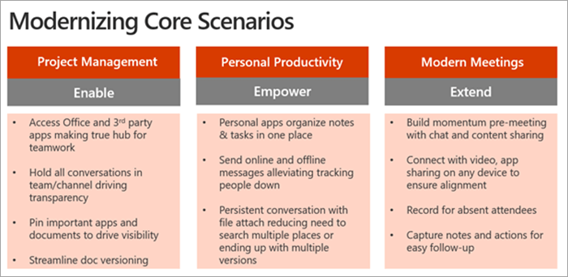

# Definir cenários de uso do Microsoft Teams

Certifique-se de entender os projetos de negócios (cenários) que estarão no escopo desta fase da sua implementação. Dê uma olhada nesta lista de cenários de exemplo que são ótimos candidatos para um programa de adotante antecipado. Você pode começar a usar as mais fáceis, como:

- Produtividade pessoal
- Gerenciamento de projeto moderno
- Reuniões modernas

Cenários adicionais a considerar são:

- Envolvimento e comunicação de funcionários
- Trazer campanhas para o mercado com mais rapidez
- Aumentar a produtividade de vendas e aumentar a receita
- Simplificar análises de negócios

Pense nesse movimento de modernização de cenário como um processo cumulativo – faz com que as coisas andem com cenários mais básicos para criar entusiasmo, familiaridade e fidelidade com essa nova maneira de trabalhar. Em seguida, vá para áreas mais abrangentes de impacto. À medida que mais impacto no Microsoft Teams for demonstrado para seus colegas de negócios, mais deles se envolverão e a dinâmica será construída. Para muitos dos nossos clientes, depois que eles receberem esse processo, eles descobrirão que os participantes da empresa os abordarão depois de saber como seus colegas têm valor do Microsoft Teams.

## Entrevista participantes de negócios

Para confirmar a seleção desses projetos anteriores, recomendamos uma reunião diretamente com as partes interessadas identificadas anteriormente neste processo. Seu objetivo neste momento é ouvir e aprender informações adicionais sobre seus negócios. Considere as seguintes perguntas para conduzir a conversa:

- Quais são alguns dos desafios ou pontos de dor da organização relacionados à comunicação e à colaboração?
- Quais são as áreas nas quais sua organização gostaria de melhorar?
- Quais são as iniciativas estratégicas da organização ou projetos de transformação atuais aos quais o Teams pode dar suporte?
- Quais métodos de comunicação e colaboração geralmente são melhor recebidos por sua organização do que outros?
- Qual é o processo de rascunho, distribuição e compartilhamento de informações?

## Mapear e priorizar cenários de negócios

Para ter certeza de que você tem as informações corretas sobre o cenário de negócios, considere usar o seguinte formato para documentar o cenário da perspectiva do funcionário concluindo o trabalho e o proprietário do processo. Ambas as perspectivas são necessárias para criar um caminho bem-sucedido.

Depois de falar com um ou mais participantes de negócios, você pode priorizar seus cenários com base no impacto versus na dificuldade. (Seus cenários podem ser além dos cenários que sugerimos acima.) Os candidatos apropriados para sua fase de experimentação devem ter maior impacto e dificuldade de baixa a média. Isso garantirá que seu projeto não seja afetado por problemas técnicos ou de escopo antes de poder mostrar o valor do seu trabalho. Um gráfico de exemplo é mostrado abaixo.

> [!Note]
> Estamos sempre ansiosos para saber como nossos clientes usam o Teams de novas maneiras inovadoras. Compartilhe sua #TeamsStories conosco no fórum de discussão sobre a [adoção de direção.](https://techcommunity.microsoft.com/t5/driving-adoption/ct-p/DrivingAdoption) Inclua a hashtag **#TeamsStories** na sua postagem. Estamos sempre interessados em como você usa o Teams em sua organização.

 Next: [integração de usuários inserdos e coleta de comentários.](teams-adoption-onboard-early-adopters.md)
