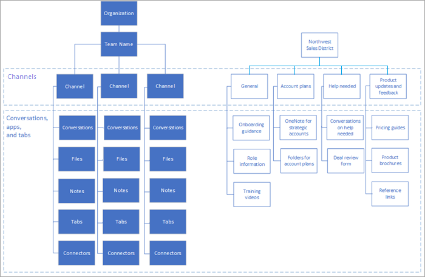

# Compreender as equipes e os canais no Microsoft Teams

Os conceitos de equipes e canais são fundamentais para uma implementação íntegra e produtiva do Microsoft Teams. 

- Uma equipe é um conjunto de pessoas, conteúdo e ferramentas que trabalham em conjunto para produzir um resultado comercial para a sua empresa. As equipes são criadas em Grupos do Microsoft 365. Alterações na associação a um grupo do Office 365 são sincronizadas com a equipe. 

- Os canais são os espaços de colaboração dentro de uma equipe na qual o trabalho real está concluído. 

Para saber mais sobre equipes e canais, consulte a [visão geral de equipes e canais no Microsoft Teams](teams-channels-overview.md). Para obter orientação de adoção em equipes abrangentes, acesse o [Guia de adoção do teams](https://aka.ms/teamstoolkit). Para saber mais sobre o Teams e grupos do Microsoft 365, consulte [microsoft 365 groups and Microsoft Teams](office-365-groups.md) e [saiba mais sobre os grupos do Microsoft 365](https://support.office.com/article/Learn-about-Office-365-groups-b565caa1-5c40-40ef-9915-60fdb2d97fa2).

|  |  |
|---------|---------|
| Veja este breve vídeo   | <iframe width="350" height="200" src="https://www.youtube.com/embed/hjJWtoaRJeE" frameborder="0" allowfullscreen></iframe>   |

Os tipos de acesso à equipe determinam quem pode ingressar em uma equipe:

- As equipes *privadas* estão restritas aos membros da equipe aprovados pelo(s) proprietário(s) dela. Essa é uma configuração típica para equipes de projeto e equipes virtuais em uma grande organização.

- As equipes *públicas* estão abertas para qualquer pessoa na organização, e os usuários podem participar delas diretamente. As equipes públicas são úteis para a colaboração em tópicos de interesse geral para pessoas em diferentes departamentos ou para pessoas que trabalham em diferentes projetos. Essa é uma boa configuração padrão para organizações menores.

## Usar o Microsoft Teams para conduzir a colaboração entre organizações

É uma prática recomendada usar o Microsoft Teams para melhorar a colaboração entre organizações e muitos projetos se entantoão com esse modelo. Além disso, líderes ou divisões dentro de uma organização podem querer uma equipe dedicada para as pessoas. Considere os modelos organizacionais e de projeto mostrados na ilustração a seguir.

Em uma equipe organizacional (mostrada à esquerda), informações importantes sobre a forma pela qual a organização executa seus negócios, eventos de equipe, estratégias essenciais e outras informações operacionais, como análises comerciais, podem ser compartilhadas. Para a equipe exibida à direita, as informações do distrito são divididas em canais que representam as categorias de trabalho que estão sendo realizadas pela equipe. Os membros da equipe podem ou não se reportam para a mesma pessoa, mas estão todos envolvidos na condução dos resultados do distrito.
  
Você trabalhará mais na estrutura de suas equipes na [fase 2](teams-adoption-phase2-experiment.md) da implementação.

 seguinte: [criar suas primeiras equipes](teams-adoption-your-first-teams.md)
