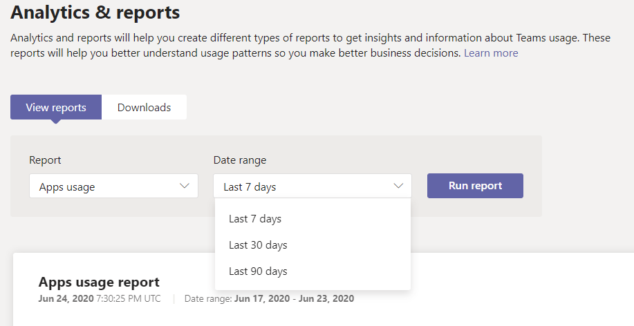

# Relatório de uso do aplicativo Microsoft Teams

O relatório de uso do aplicativo Teams no Centro de administração do Microsoft Teams fornece informações sobre quais aplicativos os usuários estão usando no Teams.  

## Exibir o relatório Uso do Aplicativo

1.  Na navegação à esquerda do centro de administração em , clique em <https://admin.teams.microsoft.com> **Análise & relatórios** \> **uso.** Na guia **Exibir relatórios,** em **Relatório,** selecione **Uso de Aplicativos.**

     :::image type="content" source="media/app-usage-report1.png" alt-text="Captura de tela do item de menu Relatórios de Uso":::

2.  Em **Intervalo de dados**, selecione intervalo e em seguida clique em **Executar relatório**.

      :::image type="content" source="media/app-usage-report2.png" alt-text="Captura de tela do relatório Uso de Aplicativos":::

## Interpretar relatório

|Texto Explicativo |Descrição  |
|--------|-------------|
|**1**   |O relatório de uso de Aplicativos do Teams pode ser consultado sobre tendências dos últimos 7, 30 ou 90 dias. |
|**2**   |Cada relatório tem uma data para quando o relatório foi gerado. Os relatórios geralmente refletem uma latência de 24 horas a partir do momento em que um aplicativo foi aberto.   |
|**3**    | <ul><li>O eixo X nos gráficos representa o intervalo de datas selecionado para esse relatório específico.</li><li>O eixo Y é o número de usuários que, durante um determinado dia, passe o mouse sobre o gráfico, esses usuários abriram um aplicativo pelo menos uma vez e, ao fazer isso, são considerados usuários ativos e acumulados em direção ao total visto ao passar o mouse.</li></ul>|
|**4**   |Passe o mouse sobre o ponto que representa um Uso de Aplicativos em uma determinada data para ver o número de instâncias do Total de Usuários Ativos desse Aplicativo nessa determinada data.  |
|**5**   |Todos os aplicativos serão incluídos, mas escolhendo o ícone filtro, filtros adicionais estarão disponíveis.  |
|**6**   |A tabela fornece uma divisão dos usuários ativos e das equipes pelo nome do aplicativo. <ul><li>**Nome do** aplicativo é o nome de exibição do aplicativo usado no Teams.</li><li>**Usuários ativos** é o número de usuários que abriram o aplicativo pelo menos uma vez durante o período especificado.</li><li>**O tipo** de aplicativo é um valor estático da "Microsoft" ou "Terceiros".</li><li>**Equipes** ativas é o número de equipes que abriram o Aplicativo por pelo menos um membro da equipe e durante os períodos de tempo especificados.</li><li>**O Publisher** é o editor de software do aplicativo.</li><li>**A** versão é a versão de software do aplicativo, do editor de aplicativos.</li></ul>   |
|**7**  |Selecione **Editar colunas** para adicionar ou remover colunas na tabela.    |
|**8**  |Você pode exportar o relatório para um arquivo CSV para análise offline. Clique **em Exportar para o Excel** e, na guia **Downloads,** clique em **Baixar** para baixar o relatório quando estiver pronto.   |
|**9**   |Ao exibir o relatório no Excel, você também verá uma coluna **de ID,** que representa a ID do aplicativo. Uma ID de equipe geralmente é uma cadeia alfanumérico. Se a **coluna Id** aparecer como **\n****, isso significa que um usuário solicitou que suas informações sejam excluídas.   |

## Tópicos relacionados

- [Análises e relatórios do Teams](teams-reporting-reference.md)