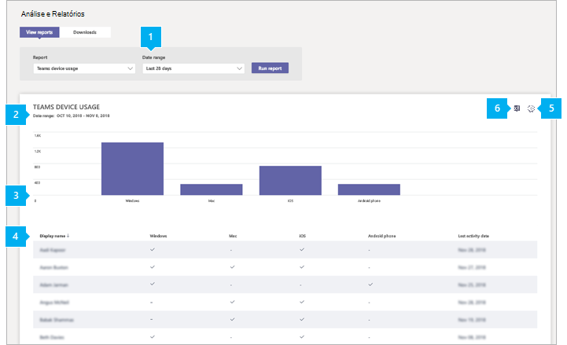

# Relatório de uso de dispositivos do Microsoft Teams

O Teams de uso do dispositivo no centro de administração Microsoft Teams fornece informações sobre como os usuários se conectam ao Teams. Você pode usar o relatório para ver os dispositivos usados em toda a sua organização, incluindo quantos usam Teams de seus dispositivos móveis quando estão em uso.  

## Exibir o relatório de uso do dispositivo

1. Na navegação à esquerda do centro de administração Microsoft Teams, clique **em Análise & relatórios** de  >  **uso.** Na guia **Exibir relatórios,** em **Relatório**, selecione **Teams uso do dispositivo**.
2. Em **Intervalo de dados**, selecione intervalo e em seguida clique em **Executar relatório**.

    

## Interpretar relatório

|Texto Explicativo |Descrição  |
|--------|-------------|
|**1**   |O Teams de uso do dispositivo pode ser exibido para tendências nos últimos 7 ou 30 dias.  |
|**2**   |Cada relatório tem uma data para quando o relatório foi gerado. Os relatórios geralmente refletem uma latência de 24 horas do tempo de atividade. |
|**3**   |<ul><li>O eixo X no gráfico representa os diferentes dispositivos (**Windows,** **Mac,** **Linux**, **iOS,** **Android Telefone**, **Web**) usados para se conectar a Teams. </li><li>O eixo Y é o número de usuários que usam o dispositivo durante o período de tempo selecionado.</li> </ul>Passe o mouse sobre a barra que representa um dispositivo para ver o número de usuários que usam o dispositivo para se conectar Teams.|
|**4**   |A tabela fornece uma divisão do uso do dispositivo pelo usuário. <ul><li>**Nome** de usuário é o nome de exibição do usuário. Você pode clicar no nome de exibição para ir para a página de configuração do usuário no Microsoft Teams de administração. </li><li>**Windows** é selecionado se o usuário estava ativo no Teams da área de trabalho em um computador Windows baseado em computador.</li><li>**Mac** estará selecionado se o usuário estiver ativo no cliente de desktop do Teams em um computador com macOS. </li> <li>**O Linux** é selecionado se o usuário estava ativo no Teams da área de trabalho em um computador Linux. </li> <li>**iOS** estará selecionado se o usuário estiver ativo no cliente do Mobile Teams para iOS.</li><li>**O telefone Android** será selecionado se o usuário estiver ativo no cliente Teams celular para Android. <li><li>**Web** estará selecionado se o usuário estiver ativo no cliente Web do Teams. <li>**A última** atividade é a última data (UTC) que o usuário participou de uma atividade Teams.</li> </ul> Observe que, se uma conta de usuário não existir mais no Azure AD, o nome de usuário será exibido como "--" na tabela.   Para ver as informações desejadas na tabela, certifique-se de adicionar as colunas à tabela. |
|**5**   |Selecione **Editar colunas** para adicionar ou remover colunas na tabela. |
|**6**   |Você pode exportar o relatório para um arquivo CSV para análise offline. Clique **em Exportar para Excel** e, na guia **Downloads,** clique em **Baixar** para baixar o relatório quando estiver pronto.  |

## Tornar os dados específicos do usuário anônimos

Para tornar os dados no Teams de uso do dispositivo anônimo, você precisa ser um administrador global. Isso ocultará informações identificáveis, como nome de exibição, email e AAD ID no relatório e sua exportação.

1. Em Centro de administração do Microsoft 365, vá para **a** Configurações \> **Org Configurações** e, em **Serviços,** escolha **Relatórios**.
    
2. Selecione **Relatórios** e escolha Exibir **identificadores anônimos.** Essa configuração é aplicada aos relatórios de uso no Centro de administração do Microsoft 365, bem como Teams centro de administração.
  
3. Selecione **Salvar alterações**.

## Tópicos relacionados

- [Análises e relatórios do Teams](teams-reporting-reference.md)
