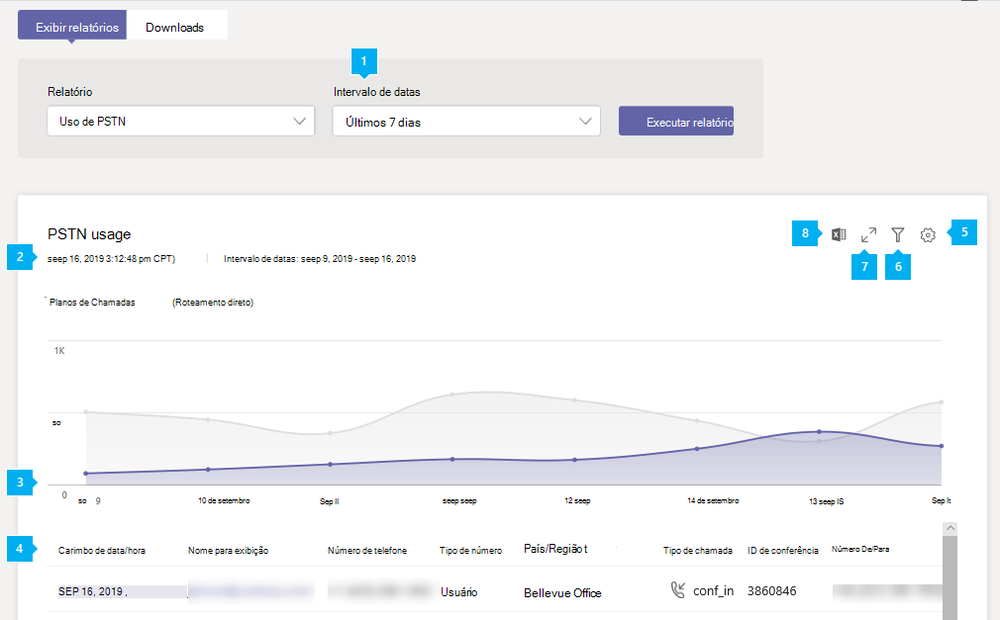
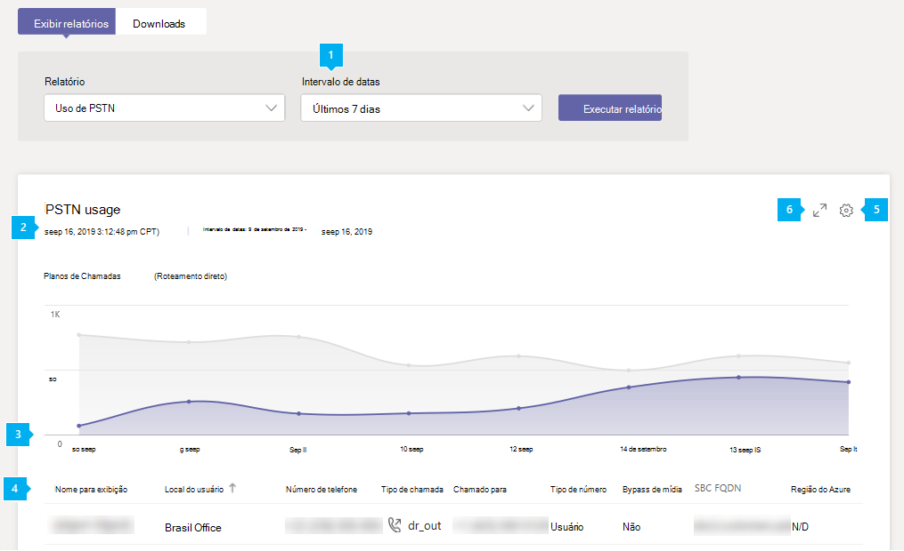

# Relatório de uso de PSTN do Microsoft Teams

O relatório de uso do PSTN (Rede Telefônica Pública Comuada) do Teams no Centro de administração do Microsoft Teams fornece uma visão geral da atividade de chamada e audioconferência em sua organização. Você poderá exibir a atividade de chamada detalhada para Planos de Chamadas se usar a Microsoft como sua operadora de telefonia e para o Roteamento Direto se usar sua própria operadora de telefonia.

A **guia Planos de** Chamadas mostra informações, incluindo o número de minutos que os usuários gastaram em chamadas PSTN de entrada e saída e o custo dessas chamadas. A **guia Roteamento** Direto mostra informações, incluindo o endereço SIP e as horas de início e término da chamada. Use as informações neste relatório para obter informações sobre o uso de PSTN em sua organização e ajudá-lo a investigar, planejar e tomar decisões de negócios.

> [!NOTE]
> Se você tiver um plano de chamada Telstra ou Softbank, não verá nenhum registro de detalhes de chamada no relatório de uso PSTN. Entre em contato com Telstra ou Softbank para suas necessidades de relatório. 

## Exibir o relatório de uso de PSTN

1. No painel de navegação esquerdo do Centro de administração do Microsoft Teams, clique **em Análise & relatórios** > **de uso**. Na guia **Exibir relatórios** , em **Relatório**, selecione **o relatório de uso de PSTN**.
2. Em **Intervalo de datas**, selecione um intervalo predefinido de 7 ou 28 dias ou defina um intervalo personalizado e, em seguida, **selecione Executar relatório**.

## Interpretar relatório

### Planos de Chamadas

   

|Texto Explicativo |Descrição  |
|--------|-------------|
|**1**   |O relatório pode ser visualizado para tendências nos últimos 7, 28 dias ou um intervalo de datas personalizado que você definiu. |
|**2**   |Cada relatório tem uma data para quando ele foi gerado. O relatório geralmente reflete um período de latência de atividade de 24 a 48 horas. |
|**3**   |O eixo X é o intervalo de datas selecionado para o relatório específico. O eixo Y é o número total de chamadas durante o período de tempo selecionado.  Passe o mouse sobre o ponto em uma determinada data para ver o total de chamadas nessa data.  |
|**4**   |A tabela fornece um detalhamento do uso de PSTN por chamada. <ul><li>**Carimbo de data/hora (UTC)** é a hora em que a chamada foi iniciada.</li><li>**Nome de** exibição é o nome de exibição do usuário. Você pode clicar no nome de exibição para ir para a página de configuração do usuário no Centro de administração do Microsoft Teams.</li><li>**Nome** de usuário é o nome de entrada do usuário.</li><li>**O número de** telefone é o número que recebeu a chamada para chamadas de entrada ou o número discado para chamadas de saída.</li><li>**O tipo de** chamada é se a chamada foi uma chamada de saída ou de entrada PSTN e o tipo de chamada, como uma chamada feita por um usuário ou uma conferência de áudio. Os tipos de chamadas que você pode ver incluem:  **Tipos de chamada de usuário do Teams**<ul><li>**user_in** - o usuário recebeu uma chamada PSTN de entrada</li><li>**user_out** - o usuário fez uma chamada PSTN de saída</li><li>**user_out_conf** - o usuário adicionou dois ou mais participantes PSTN à chamada, como uma chamada em conferência bidirecional</li><li>**user_out_transfer** - o usuário transferiu a chamada para um número PSTN</li><li>**user_out_forwarding** - o usuário encaminhou a chamada para um número PSTN</li><li>**conf_in** - uma chamada de entrada para a ponte de Audioconferência</li><li>**conf_out** - uma chamada de saída da ponte de Audioconferência geralmente para adicionar um número PSTN à conferência</li><li>**unassigned_in** - uma chamada PSTN de entrada por meio do Plano de Chamada para um número não atribuído</li></ul> **Tipos de chamada de bots do Teams**<ul><li>**ucap_in** - uma chamada PSTN de entrada para o bot do Teams, como atendedor automático ou fila de chamadas</li><li>**ucap_out** - uma chamada PSTN de saída de um bot do Teams, como atendedor automático ou fila de chamadas</li></ul> <li>**Chamado para** é o número discado.</li><li>**Para país ou região** é o país ou região discada.</li><li>**Chamado de** é o número que fez a chamada.</li><li>**De país ou região é** o país ou região de onde a chamada foi feita.</li><li>**A** cobrança é a quantidade de dinheiro ou custo da chamada que é cobrada em sua conta. </li><li>**Conversor de Moedas** é o tipo de moeda usado para calcular o custo da chamada. </li><li>**Duração** é o tempo em que a chamada esteve conectada.</li><li>**Doméstica/Internacional** informa se a chamada foi doméstica (dentro de um país ou região) ou internacional (fora de um país ou região) com base na localização do usuário.</li><li>**A ID da** chamada é a ID de chamada para uma chamada. É um identificador para a chamada que você pode usar ao chamar Suporte da Microsoft.</li><li>**O tipo** de número é o tipo de número de telefone do usuário, como um serviço de número de chamada gratuita. </li><li>**País ou região é** o local de uso. </li> <li>**A ID de conferência** é a ID de conferência da audioconferência. </li><li>**A funcionalidade** é a licença usada para a chamada. Os tipos de licença que você pode ver incluem:<ul><li>**MCOEV ou MCOEV_VIRTUALUSER ou MCOEV_VIRTUALUSER_GOV** - Aplicativos de voz, como Atendedor Automático ou Filas de Chamadas</li><li>**FREECALL** - No caso de um problema técnico que nos impede de fazer preços de uma chamada, a chamada é fornecida gratuitamente e será exibida com essa funcionalidade</li><li>**MCOPSTN1** - Plano de Chamadas Domésticas (3000 min US / 1200 min planos da UE)</li><li>**MCOPSTN2** – Plano de Chamada Internacional</li><li>**MCOPSTN5 – Plano** de Chamadas Domésticas (plano de chamada de 120 minutos)</li><li>**MCOPSTN6** – Plano de Chamadas Domésticas (plano de chamada de 240 min)</li><li>**MCOPSTN8** – Plano de Chamadas Domésticas 120 minutos por usuário (não em pool entre usuários, como os outros planos de chamada)</li><li>**MCOPSTN9** – Plano de Chamada Internacional</li><li>**MCOPSTNCAP** – Telefone de Área Comum</li><li>**MCOPSTNPP** – Créditos de comunicação</li><li>**MCOMEETADD** - Audioconferência</li><li>**MCOMEETADD_DIALOUT_US** - Plano de discagem de Audioconferência dos EUA e do Canadá</li><li>**MCOMEETADD_CN_GLOBAL** - Audioconferência para usuários que não são da China</li><li>**MCOMEETADD_TATA** - Tata Communications Connections</li><li>**MCOMEETACPEA** – Audioconferência paga por minuto </li><li>**MCOMEETACPEA_GOV** - Audioconferência paga por minuto para o governo</li></ul></li></ul> Para ver as informações desejadas na tabela, certifique-se de adicionar as colunas à tabela.|
|**5**   |Selecione **Editar colunas** para adicionar ou remover colunas na tabela. |
|**6**   |Selecione **Filtrar** para filtrar o relatório por nome de usuário ou tipo de chamada. |
|**7**   |Selecione **Tela inteira** para exibir o relatório no modo de tela inteira. |
|**8**   |Você pode exportar o relatório para um arquivo CSV para análise offline. Clique **em Exportar para Excel** e, na **guia Downloads**, clique em  Baixar para baixar o relatório quando ele estiver pronto.|

### Roteamento Direto

   

|Texto Explicativo |Descrição  |
|--------|-------------|
|**1**   |O relatório pode ser visualizado para tendências nos últimos 7 ou 28 dias. |
|**2**   |Cada relatório tem uma data para quando ele foi gerado. O relatório geralmente reflete um período de latência de atividade de 24 a 48 horas. |
|**3**   |O eixo X é o intervalo de datas selecionado para o relatório específico. O eixo Y é o número total de chamadas durante o período de tempo selecionado. Passe o mouse sobre o ponto em uma determinada data para ver o total de chamadas nessa data.  |
|**4**   |A tabela fornece um detalhamento do uso de PSTN por chamada. <ul><li>**Carimbo de data/hora (UTC)** é a hora em que a chamada foi iniciada.</li><li>**Nome de** exibição é o nome de exibição do usuário. Você pode clicar no nome de exibição para ir para a página de configurações do usuário no Centro de administração do Microsoft Teams. O nome também pode ser o nome de um bot, por exemplo, a Fila de Chamadas ou o Atendedor Automático de Nuvem. </li><li>**O endereço SIP** é o endereço SIP do usuário ou de um bot que recebeu ou fez a chamada.</li><li>**O número do** chamador é o número do usuário ou do bot que fez a chamada. </li><li>**O número do receptor** é o número do usuário ou do bot que recebeu a chamada. Em uma chamada de entrada para um usuário do Teams, ele será o usuário do Teams, em uma chamada de saída de um usuário do Teams, ele será o Usuário PSTN. </li><li>**O tipo de** chamada é se a chamada foi uma chamada de saída ou de entrada PSTN e o tipo de chamada, como uma chamada feita por um usuário ou uma conferência de áudio. Os tipos de chamada que você pode ver incluem:  **Tipos de chamada de usuário do Teams**<ul><li>**dr_in** - o usuário recebeu uma chamada PSTN de entrada</li><li>**dr_out** - o usuário fez uma chamada PSTN de saída</li><li>**dr_out_user_conf** - o usuário adicionou um participante PSTN à chamada</li><li>**user_out_transfer** - o usuário transferiu a chamada para um número PSTN</li><li>**dr_out_user_forwarding** - o usuário encaminhou a chamada para um número PSTN</li><li>**dr_out_user_transfer** - o usuário transferiu a chamada para um número PSTN</li><li>**dr_emergency_out** - o usuário fez uma chamada de emergência</li><li>**dr_unassigned_in** - uma chamada PSTN de entrada por meio do Roteamento Direto para um número não atribuído</li></ul> **Tipos de chamada de bots do Teams**<ul><li>**dr_in_bot** - uma chamada PSTN de entrada para um bot do Teams, como atendedor automático ou fila de chamadas</li><li>**dr_out_bot** - uma chamada PSTN de saída de um bot do Teams, como atendedor automático ou fila de chamadas</li></ul> <li>**Chamado é** o número do usuário que recebeu a chamada.</li><li>A hora de início **(UTC)** é a hora em que o proxy SIP recebeu a resposta final (Mensagem SIP "200 OK") do SBC em uma chamada de saída (Teams/Bot para um Usuário PSTN) ou depois que o Proxy SIP envia o Convite para o próximo salto dentro do back-end do Teams em uma chamada de entrada (Usuário PSTN para um Teams/Bot). </li><li>A hora do convite **(UTC)** é a hora em que o Convite inicial foi enviado em uma chamada de saída de um usuário do Teams ou chamada de bot para o SBC ou recebido em uma chamada de entrada para uma chamada do Teams ou bot pelo componente proxy SIP do Roteamento Direto do SBC.</li><li>**Tempo de falha (UTC)** é a hora em que a chamada falhou. Somente para chamadas com falha. O código SIP final, o Subcódigo Final da Microsoft e a Frase SIP Final fornecem os motivos pelos quais a chamada falhou e podem ajudar na solução de problemas. </li><li>**Hora de término (UTC)** é a hora em que a chamada foi encerrada (somente para chamadas bem-sucedidas).</li><li>**A** duração é por quanto tempo a chamada foi conectada, desde o convite até o fim da chamada ou a falha. Para encaminhamento de chamadas, a duração inclui toque na Fila de Chamadas.</li><li>**O tipo** de número é o tipo de número de telefone do usuário, como um serviço de número de chamada gratuita. </li><li>**O bypass de** mídia indica se o tronco foi habilitado para bypass de mídia. </li> <li>**O FQDN SBC** é o FQDN (nome de domínio totalmente qualificado) do Controlador de Borda de Sessão (SBC). </li><li>**A região do Azure para Mídia** é o data center que foi usado como caminho de mídia em uma chamada sem bypass. </li><li>**A região do Azure para Sinalização** é o data center que foi usado para sinalização para chamadas de bypass e sem bypass. </li><li>**O tipo de** evento é o tipo de evento da chamada. Você verá Êxito para chamadas bem-sucedidas e Tentativa de chamadas com falha. </li><li>**O código SIP final** é o código com o qual a chamada terminou.</li><li>**O subcódigo** final da Microsoft é um código que indica ações específicas que ocorreram.</li><li>**A frase SIP** final é a descrição do código SIP e do subcódigo da Microsoft.</li><li>**A ID de** correlação é um identificador exclusivo para a chamada que você pode usar ao chamar Suporte da Microsoft.</li><li>**A ID de Correlação** Compartilhada só é visível no arquivo CSV para download e não existe no portal. A ID de correlação compartilhada existe em pelo menos duas chamadas relacionadas. Confira a descrição detalhada abaixo.</li></ul> Para ver as informações desejadas na tabela, certifique-se de adicionar as colunas à tabela.|
|**5**   |Selecione **Editar colunas** para adicionar ou remover colunas na tabela. |
|**6**   |Selecione **Tela inteira** para exibir o relatório no modo de tela inteira. |
|**7**   |Selecione **Exportar para Excel** para baixar os dados em um arquivo separado por vírgula (CSV) para análise offline ou para usá-los como entrada para o sistema de cobrança. |

#### Considerações sobre campos de chamador/receptor

Dependendo da direção da chamada, os nomes de Chamador ou Receptor podem conter números não E164.

Esses campos podem vir dos SBC(s) do cliente. Há três formatos que o SBC pode enviar para o Roteamento Direto: números E.164, números não E.164 e cadeias de caracteres.

- Número de telefone E.164 de um usuário que tem um número E.164 para um usuário que também tem um número E.164. 
- Chamada de um número não E.164. Um usuário de um PBX de terceiros interconectado com o Roteamento Direto faz uma chamada para um usuário do Teams. Nesse caso, o número do chamador pode ser qualquer número não E.164, por exemplo +1001. 
- Um remetente de spam chama e não apresenta um número, apenas um nome, por exemplo, "Serviço de Receita Interna". Essa cadeia de caracteres será mostrada nos relatórios.

#### Ofuscação de número de telefone
Os requisitos de privacidade por país incluem a ofuscação dos números de telefone externos (não pertencentes ao cliente). Os três ou quatro últimos dígitos do número de telefone são substituídos por asteriscos (+123 456789***). 

Para as chamadas de entrada, o número do chamador é ofuscado, para chamadas de saída, o número do computador chamado é ofuscado. Isso se aplica aos relatórios PSTN e Roteamento Direto no Centro de Administração Locatário, à exportação de dados e aos logs de chamada disponíveis por meio do Microsoft Graph.

A ofuscação é baseada na localização da organização (país). Números de telefone completos são mostrados para os países que não estão listados na tabela a seguir:

| País | Número de dígitos de ofuscação |
| :-: | :- |
|BE – Bélgica | 3 |
|CH – Suíça | 4 |
|DE - Alemanha | 3 |
|DK – Dinamarca | 3 |
|ES – Espanha | 3 |
|FI – Finlândia | 3 |
|FR – França | 4 |
|TI – Itália | 3 |
|NL - Países Baixos | 3 |
|NÃO - Noruega | 3 |
|SE - Suécia | 3 |

#### Sobre a ID de Correlação Compartilhada

A ID de Correlação Compartilhada só existe no arquivo exportado do Excel que você baixa e indica que duas ou mais chamadas estão relacionadas. O exemplo a seguir explica os diferentes cenários e quando a ID de Correlação Compartilhada está presente.

1.    Usuário PSTN 1 em um ponto de extremidade PSTN chamado Usuário do Teams 1 no cliente do Teams, tipo de chamada Dr_In, ID de correlação 57f28917-42k5-4c0c-9433-79734873f2ac, sem ID de correlação compartilhada.
2.    Usuário do Teams 1 no cliente teams chamado PSTN User 1 em um ponto de extremidade PSTN, tipo de chamada Dr_Out 2c12b8ca-62eb-4c48-b68d-e451f518ff4, sem ID de correlação compartilhada.
3.    Usuário PSTN 1 em um ponto de extremidade PSTN chamado usuário do Teams 2 no cliente do Teams, tipo de chamada Dr_In f45e9a25-9f94-46e7-a457-84f5940efde9, ID de correlação compartilhada f45e9a25-9f94-46e7-a457-84f5940efde9.
4.    Chamada 3 existente com a ID de correlação "f45e9a25-9f94-46e7-a457-84f5940efde9". Usuário PSTN 1 em uma chamada com o Usuário do Teams 2. O Usuário do Teams 2 transferiu (cego ou consultativo) uma chamada para o Usuário PSTN ou do Teams, tipo de chamada Dr_Out_User_Transfer 45a1da7c-9e97-481a-8a05-3fe19a9a77e0, ID de correlação compartilhada f45e9a25-9f94-46e7-a457-84f5940efde9.

## Exportando os relatórios
Clique **em Exportar para Excel** e, na **guia Downloads**, clique em  Baixar para baixar o relatório quando ele estiver pronto. O processo de exportação pode levar de alguns segundos a vários minutos para ser concluído, dependendo da quantidade de dados.

Esse protocolo exporta os dados de todos os usuários e permite que você execute a classificação e a filtragem simples para análises posteriores. Os arquivos exportados contêm campos adicionais que não estão disponíveis no relatório online. Eles podem ser usados para solução de problemas e fluxos de trabalho automatizados.

 Você receberá um arquivo zip chamado "**Calls.Export.`[identifier]`.zip**", com o identificador sendo uma ID exclusiva para a exportação que pode ser usada para solução de problemas.

Se você tiver Planos de Chamadas e Roteamento Direto, o arquivo exportado poderá conter dados para ambos os produtos. O arquivo de relatório de uso PSTN terá o nome de arquivo "**PSTN.calls.`[UTC date]`.csv**" e roteamento direto "**DirectRouting.calls.`[UTC date]`.csv**".

 Além dos arquivos PSTN e roteamento direto, o arquivo contém o arquivo "**parameters.json**", com o intervalo de tempo de exportação e os recursos selecionados.

Os arquivos exportados estão no formato CSV (Valores Separados por Vírgula), em conformidade com o [padrão RFC 4180](https://tools.ietf.org/html/rfc4180) . Os arquivos podem ser abertos no Excel ou em qualquer outro editor compatível com padrões sem a necessidade de transformações.

A primeira linha do CSV contém nomes de coluna. Todas as datas são UTC e [no formato ISO 8601](https://en.wikipedia.org/wiki/ISO_8601) .

### Relatório de uso de PSTN exportado

 Você pode exportar dados de até um ano a partir da data atual, a menos que os regulamentos específicos do país proibirem a retenção dos dados por 12 meses.

> [!div class="has-no-wrap"]  
> | # | Nome | [Tipo de dados (SQL Server)](/sql/t-sql/data-types/data-types-transact-sql) | Descrição |
> | :-: | :-: | :-: |:------------------- |
> | 0 | UsageId | `uniqueidentifier` | Identificador de chamada exclusivo |
> | 1 | ID da chamada | `nvarchar(64)` | Identificador de chamada. Não há garantia de ser exclusivo |
> | 2 | ID de conferência | `nvarchar(64)` | ID da audioconferência |
> | 3 | Localização do usuário | `nvarchar(2)` | Código do país do usuário, [ISO 3166-1 alpha-2](https://en.wikipedia.org/wiki/ISO_3166-1_alpha-2) |
> | 4 | AAD ObjectId | `uniqueidentifier` | Chamando a ID do usuário no Azure Active Directory.  Essa e outras informações do usuário serão nulas/vazias para tipos de chamada de bot (ucap_in, ucap_out) |
> | 5 | UPN | `nvarchar(128)` | UserPrincipalName (nome de entrada) no Azure Active Directory. Isso geralmente é o mesmo que o endereço SIP do usuário e pode ser o mesmo que o endereço de email do usuário |
> | 6 | Nome de Exibição do Usuário | `nvarchar(128)` | Nome de exibição do usuário |
> | 7 | ID do chamador | `nvarchar(128)` | Número que recebeu a chamada para chamadas de entrada ou o número discado para chamadas de saída. [Formato E.164](https://en.wikipedia.org/wiki/E.164) |
> | 8 | Tipo de Chamada | `nvarchar(32)` | Se a chamada foi uma chamada de saída ou de entrada PSTN e o tipo de chamada, como uma chamada feita por um usuário ou uma conferência de áudio |
> | 9 | Tipo de Número | `nvarchar(16)` | Tipo de número de telefone do usuário, como um serviço de número de chamada gratuita |
> | 10 | Nacionais/Internacionais | `nvarchar(16)` | Se a chamada foi doméstica (dentro de um país ou região) ou internacional (fora de um país ou região) com base na localização do usuário |
> | 11 | Destino Discado | `nvarchar(64)` | País ou região discada |
> | 12 | Número de Destino | `nvarchar(32)` | Número discado no [formato E.164](https://en.wikipedia.org/wiki/E.164) |
> | 13 | Hora de Início | `datetimeoffset` | Hora de início da chamada |
> | 14 | Hora de término | `datetimeoffset` | Hora de término da chamada |
> | 15 | Segundos de Duração | `int` | Por quanto tempo a chamada foi conectada |
> | 16 | Taxa de conexão | `numeric(16, 2)` | Preço da taxa de conexão |
> | 17 | Carga | `numeric(16, 2)` | Quantidade de dinheiro ou custo da chamada que é cobrada em sua conta |
> | 18 | Moeda | `nvarchar(3)` | Tipo de moeda usado para calcular o custo da chamada ([ISO 4217](https://en.wikipedia.org/wiki/ISO_4217)) |
> | 19 | Recursos | `nvarchar(32)` | A licença usada para a chamada |

### Relatório de uso do Roteamento Direto Exportado

Você pode exportar dados de até cinco meses (150 dias) a partir da data atual, a menos que os regulamentos específicos do país proibirem a retenção dos dados para esse período.

> [!div class="has-no-wrap"]  
> | # | Nome | [Tipo de dados (SQL Server)](/sql/t-sql/data-types/data-types-transact-sql) | Descrição |
> | :-: | :-: | :-: |:------------------- |
> | 0 | Correlationid | `uniqueidentifier` | Identificador de chamada. Várias pernas da mesma chamada podem compartilhar a mesma CorrelationId |
> | 1 | AAD ObjectId | `uniqueidentifier` | Chamando a ID do usuário no Azure Active Directory.  Essa e outras informações do usuário podem ser nulas/vazias para tipos de chamada de bot |
> | 2 | UPN | `nvarchar(128)` | UserPrincipalName (nome de entrada, Azure Active Directory) do usuário ou bot que fez ou recebeu a chamada. Isso geralmente é o mesmo que o endereço SIP do usuário e pode ser o mesmo que o endereço de email do usuário |
> | 3 | Nome de Exibição | `nvarchar(128)` | O nome de um usuário ou um bot de chamada (por exemplo, Fila de Chamadas ou Atendedor Automático), conforme definido Centro de administração do Microsoft 365 |
> | 4 | País do usuário | `nvarchar(2)` | Código do país do usuário, [ISO 3166-1 alpha-2](https://en.wikipedia.org/wiki/ISO_3166-1_alpha-2) |
> | 5 | Hora do convite | `datetimeoffset` | Quando o convite inicial é enviado na saída do usuário ou da chamada de bot do Teams para o SBC ou recebido na entrada para o Teams ou chamada de bot pelo componente proxy SIP do Roteamento Direto do SBC |
> | 6 | Hora de início | `datetimeoffset` | Hora em que o proxy SIP recebeu a resposta final (Mensagem SIP "200 OK") do SBC na saída (Teams/Bot para um usuário PSTN) ou depois que o Proxy SIP envia o Convite para o próximo salto no back-end do Teams na chamada de entrada (Usuário PSTN para um Teams/Bot). Para chamadas com falha e sem resposta, isso pode ser igual ao tempo de convite ou de falha |
> | 7 | Tempo de falha | `datetimeoffset` | Existe somente para chamadas com falha (não totalmente estabelecidas) |
> | 8 | Hora de término | `datetimeoffset` | Existe somente para chamadas bem-sucedidas (totalmente estabelecidas). Hora em que a chamada foi encerrada |
> | 9 | Duração (segundos) | `int` | Duração da chamada, do convite ao final da chamada ou à falha. Para encaminhamento de chamadas, a duração inclui toque na Fila de Chamadas. |
> | 10 | Sucesso | `nvarchar(3)` | Sim/Não. Êxito ou tentativa |
> | 11 | Número do Chamador | `nvarchar(32)` | Número do usuário ou bot que fez a chamada. Ao entrar em uma chamada de usuário de equipe, ele será um Usuário PSTN, na saída da chamada de usuário do Teams, ele será o número de usuário do Teams |
> | 12 | Número do receptor | `nvarchar(32)` | Número do usuário ou bot que recebeu a chamada. Ao entrar em uma chamada de usuário da equipe, ele será o usuário do Teams, na saída da chamada de usuário do Teams, ele será o Usuário PSTN |
> | 13 | Tipo de chamada | `nvarchar(32)` | Tipo de chamada e direção |
> | 14 | Região do Azure para Mídia | `nvarchar(8)` | O datacenter usado para o caminho de mídia em chamada sem bypass |
> | 15 | Região do Azure para Sinalização | `nvarchar(8)` | O datacenter usado para sinalização para chamadas de bypass e não bypass |
> | 16 | Código SIP final | `int` | O código com o qual a chamada foi encerrada, [RFC 3261](https://tools.ietf.org/html/rfc3261) |
> | 17 | Subcódigo final da Microsoft | `int` | Além dos códigos SIP, a Microsoft tem subcódigos próprios que indicam o problema específico |
> | 18 | Frase SIP final | `nvarchar(256)` | Descrição do código SIP e do subcódigo da Microsoft |
> | 19 | SBC FQDN | `nvarchar(64)` | Nome de domínio totalmente qualificado do controlador de borda da sessão |
> | 20 | Bypass de mídia | `nvarchar(3)` | Sim/Não. Indica se o tronco foi habilitado para bypass de mídia ou não |
> | 21 | ID de correlação compartilhada | `uniqueidentifier` | Indica que duas ou mais chamadas estão relacionadas |

## Tópicos relacionados

- [Análises e relatórios do Teams](teams-reporting-reference.md)
- [Relatório de chamadas PSTN no Microsoft Graph](/graph/api/callrecords-callrecord-getpstncalls?view=graph-rest-1.0&tabs=http)
- [Relatório de roteamento direto no Microsoft Graph](/graph/api/callrecords-callrecord-getdirectroutingcalls?view=graph-rest-1.0&tabs=http)
