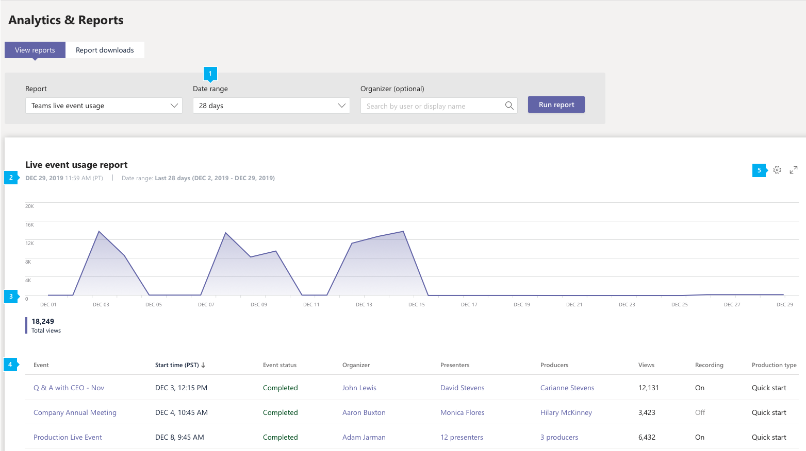

# Relatório de uso de eventos ao vivo do Microsoft Teams

O relatório de uso de eventos ao vivo do Teams no centro de administração do Microsoft Teams mostra a visão geral da atividade para eventos ao vivo realizados em sua organização. Você pode exibir informações de uso, incluindo status do evento, hora de início, exibições e tipo de produção para cada evento. Você pode obter informações sobre tendências de uso e ver quem em sua organização agenda, apresenta e produz eventos ao vivo.

## Exibir o relatório de uso de eventos ao vivo

1. Na navegação à esquerda do centro de administração do Microsoft Teams, clique em **Análise & relatórios** de  >  **uso.** Na guia **Exibir relatórios,** em **Relatório,** selecione **o uso de eventos ao vivo do Teams.**
2. Em **Intervalo de datas**, selecione um intervalo predefinido ou de definir um intervalo personalizado. Você pode definir um intervalo para mostrar dados até um ano, seis meses antes e depois da data atual.
3. (Opcional) Em **Organizador,** você pode optar por mostrar apenas eventos ao vivo organizados por um usuário específico.
4. Clique **em Executar relatório**.  

    

## Interpretar relatório

|Texto Explicativo |Descrição  |
|--------|-------------|
|**1**   |O relatório de eventos ao vivo do Teams pode ser consultado sobre tendências dos últimos 7, 28 dias ou um intervalo de datas personalizado que você definiu. |
|**2**   |Cada relatório tem uma data para quando ele foi gerado. O relatório reflete a atividade quase em tempo real quando a página é atualizada. |
|**3**   |<ul><li>O eixo X no gráfico representa o intervalo selecionado de datas para o relatório.</li> <li> O eixo Y é a contagem total de visualização.</li> </ul>Passe o mouse sobre o ponto em uma determinada data para ver o número de visualizações em todos os eventos ao vivo nessa data.|
|**4**   |A tabela fornece uma divisão de cada evento ao vivo. <ul><li>**Evento** é o nome de exibição do evento ao vivo. Clique no nome do evento para [obter mais detalhes](#view-event-details) sobre o evento. </li> <li>**Hora de** Início refere-se à data e hora de início do evento.</li> <li>**O Status do** Evento mostra se o evento ocorreu.  </li><li>**Organizador** é o nome do organizador do evento.</li> <li>**Os apresentadores** são os nomes dos apresentadores do evento.</li><li>**Produtores** são os nomes dos produtores de eventos.</li><li>**Exibições** é o número de exibições exclusivas após a conclusão do evento.</li><li>**A** gravação mostra se a configuração de gravação está ou não.</li><li>**O Tipo de** Produção mostra se o evento é produzido no Teams ou por um aplicativo ou dispositivo externo.</li></li> </ul>Observe que, se uma conta de usuário não existir mais no Azure AD, o nome de usuário será exibido como "--" na tabela.   Para ver as informações desejadas na tabela, certifique-se de adicionar as colunas à tabela. |
|**5**   |Selecione **Editar colunas** para adicionar ou remover colunas na tabela.|

## Observações
Mostrando até 100 eventos ao vivo que corresponderem aos critérios atuais do relatório. Para ver mais eventos ao vivo, aplique filtros de data para reduzir o tamanho da lista.

## Exibir detalhes do evento

A página de detalhes do evento ao vivo fornece um resumo dos detalhes de um evento ao vivo e lista todos os arquivos, incluindo transcrições e gravações, associados ao evento. Clique em um nome de arquivo para exibir ou baixar o arquivo.

Se sua organização estiver habilitada para [Hive](https://www.hivestreaming.com/partners/integration-partners/microsoft/) eCDN ou [Kollective](https://kollective.com) eCDN, você poderá obter análises de participantes adicionais clicando no link de relatório do parceiro.

## Tópicos relacionados

- [Análises e relatórios do Teams](teams-reporting-reference.md)
- [O que são os eventos ao vivo do Teams?](../teams-live-events/what-are-teams-live-events.md)
