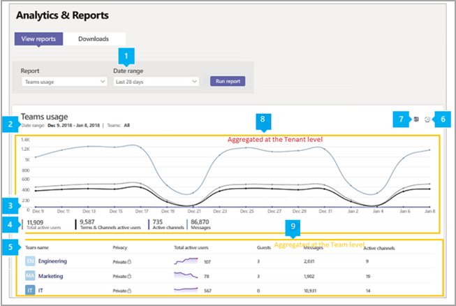

# Relatório de uso do Microsoft Teams

O relatório de uso do Teams no centro de administração do Microsoft Teams apresenta uma visão geral da atividade de uso no Teams, incluindo o número de usuários e canais ativos, para que você possa ver rapidamente quantos usuários na sua organização estão usando o Teams para se comunicar e colaborar. Você pode visualizar as informações de uso de equipes, incluindo o número de usuários e canais ativos, convidados e mensagens em cada equipe.

## Exibir o relatório de uso

1. No painel de navegação esquerdo do Centro de administração do Microsoft Teams, clique **em Análise & relatórios** > **de uso**. Na guia **Exibir relatórios** , em **Relatório**, selecione **Uso do Teams**.
2. Em **Intervalo de dados**, selecione intervalo e em seguida clique em **Executar relatório**.

    

## Interpretar relatório

|Texto Explicativo |Descrição  |
|--------|-------------|
|**1**   |O relatório de atividades de uso do Teams pode ser exibido para ver tendências nos últimos 7 dias, 30 ou 90 dias. |
|**2**   |Cada relatório tem uma data de geração. O relatório geralmente reflete um período de latência de atividade de 24 a 48 horas. |
|**3**   |<ul><li>O eixo X no gráfico representa o intervalo selecionado de datas para o relatório.</li> <li> O eixo Y representa a contagem dos itens ativos ou atividade.</li> </ul>Passe o mouse sobre o ponto que representa um item ou atividade em uma determinada data para ver o número de instâncias de tal item ou atividade na data determinada.|
|**4**   |Você pode filtrar o que se vê no gráfico clicando em um item na legenda. Por exemplo, clique em **Total** de usuários ativos, Teams **&** Canais ativos **, Canais** ativos ou  Mensagens para ver apenas as informações relacionadas a cada um deles. Ao alterar esta seleção, as informações da tabela não são alteradas. |
|**5**   |A tabela oferece um detalhamento do uso por equipe. <ul><li>**O nome da** equipe é o nome de exibição da equipe. Você pode clicar no nome da equipe para ir para a página de configurações da equipe no Centro de administração do Microsoft Teams. </li> <li>**Privacidade** refere-se à equipe ser particular ou pública.</li> <li>**Usuários ativos** é o número de usuários ativos na equipe no período de tempo especificado.</li><li>**Convidados** é o número de convidados na equipe no período de tempo especificado.</li> <li>**Canais ativos** são o número de canais que têm pelo menos um usuário ativo no período de tempo especificado.</li> <li>**Mensagens de** Postagem é o número de todas as mensagens de postagem em canais no período de tempo especificado.</li> <li>**As mensagens de** resposta são o número de todas as mensagens de resposta nos canais no período de tempo especificado.</li> <li>**As reuniões organizadas** são o número de reuniões agendadas e ad hoc que um usuário organizou durante o período de tempo especificado. </li><li>**Mensagens urgentes** é o número de todas as mensagens urgentes no período de tempo especificado.</li><li>**Reações** é o número de todas as reações a mensagens no período de tempo especificado.</li><li>**Menções** é o número de todas as menções usadas em mensagens no período de tempo especificado.</li><li>**As mensagens** de canal são o número de mensagens exclusivas que os usuários da equipe postam em chats de equipe durante o período de tempo especificado.</li> </li> </ul>Observe que, se uma equipe não existir mais, o nome será exibido como "--" na tabela.   Para ver as informações desejadas na tabela, certifique-se de adicionar as colunas à tabela. |
|**6**   |Selecione **Editar colunas** para adicionar ou remover colunas na tabela.|
|**7**   |Você pode exportar o relatório para um arquivo CSV para análise offline. Clique **em Exportar para Excel** e, na **guia Downloads**, clique em  Baixar para baixar o relatório quando ele estiver pronto.  |
|**8** |Os pontos de dados de série temporal no grafo mostram diferentes métricas de uso agregadas no locatário|
|**9** |Os dados tabulares representaram diferentes métricas de uso agregadas por equipe|

[!INCLUDE [teams-reports-definitions](../includes/teams-reports-definitions.md)]

## Tópicos relacionados

- [Análises e relatórios do Teams](teams-reporting-reference.md)
