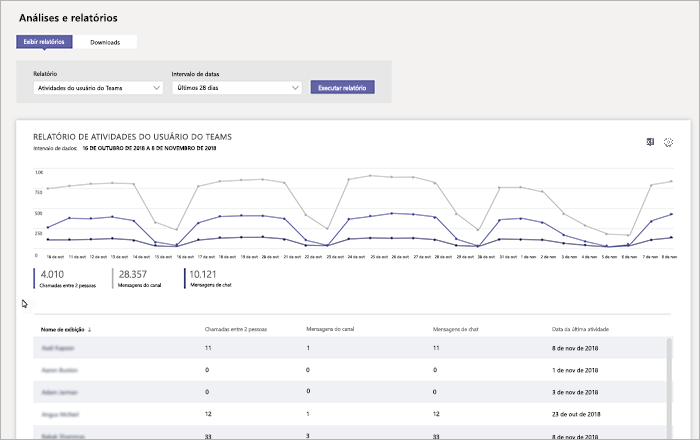

# Relatório de atividades do usuário do Microsoft TeamsMicrosoft Teams user activity report

O relatório de atividade de usuários do teams fornece informações sobre os tipos de atividades que os usuários da sua organização executam no Teams.The Teams user activity report gives you insight into the types of activities that users in your organization perform in Teams. Por exemplo, você pode ver quantos usuários comunicam-se através de chamadas do 1:1, quantos usuários se comunicam por meio de mensagens de canal e quantos usuários participam de mensagens de chat privadas.For example, you can see how many users communicate through 1:1 calls, how many users communicate through channel messages, and how many users engage in private chat messages.

![Captura de tela do relatório de atividade de usuários do teams] (../media/teams-reports-user-activity.png "Captura de tela do relatório de atividade de usuários do teams no centro de administração do Microsoft Teams")

## Exibir o relatórioView the report

1. Vá para o centro de administração do Microsoft Teams, no painel de navegação esquerdo, clique em **relatórios do Analytics &** e, em **relatório**, selecione **atividades do usuário**do teams.Go to the Microsoft Teams admin center, in the left navigation, click **Analytics & reports**, and then under **Report**, select **Teams user activity**. 
2. Em **Intervalo de dados**, selecione intervalo e em seguida clique em **Executar relatório**.Under **Date range**, select a range, and then click **Run report**. 

## Interpretar relatórioInterpret the report

![Captura de tela do relatório de atividades do usuário do teams com textos explicativos numerados] (../media/teams-reports-user-activity-with-callouts.png "Captura de tela do relatório de atividade de usuários do teams no centro de administração do Microsoft Teams com textos explicativos numerados")

|Texto explicativoCallout |DescriçãoDescription  |
|--------|-------------|
|**1****1**   |O relatório de atividade de usuários do teams pode ser exibido para obter tendências nos últimos sete dias ou 28 dias.The Teams user activity report can be viewed for trends over the last 7 days or 28 days. |
|**2****2**   |Cada relatório tem uma data de geração. O relatório geralmente reflete um período de latência de atividade de 24 a 48 horas.Each report has a date for when this report was generated. The reports usually reflect a 24 to 48 hour latency from time of activity. |
|**3****3**   |<ul><li>O eixo X nos gráficos é o intervalo de datas selecionado para o relatório específico.The X axis on the charts is the selected date range for the specific report. </li><li>O eixo Y é o número de usuários que participam da atividade.The Y axis is the number of users participating in the activity.</li></ul>Passe o mouse sobre o ponto que representa uma atividade em uma determinada data para ver o número de ocorrências dessa atividade nessa determinada data.Hover over the dot representing an activity on a given date to see the number of instances of that activity on that given date. |
|**4****4**   |Você pode filtrar o que se vê no gráfico clicando em um item na legenda.You can filter what you see on the chart by clicking an item in the legend. Por exemplo, clique em **1:1 chamadas**, **mensagens de canal**ou mensagens de **chat** para ver apenas as informações relacionadas a cada uma delas.For example, click **1:1 calls**, **Channel messages**, or **Chat messages** to see only the info related to each one. Alterar a seleção não altera as informações na tabela.Changing the selection doesn’t change the information in the table. |
|**5****5**   |A tabela oferece uma divisão de uso por usuário.The table gives you a breakdown of usage by user.   <ul><li>**Nome para exibição** é o nome de exibição do usuário.**Display name** is the display name of the user. Você pode clicar no nome para exibição para acessar a página de configuração do usuário no centro de administração do Microsoft Teams.You can click the display name to go to the user's setting page in the Microsoft Teams admin center.</li><li>**chamadas 1:1** é o número de chamadas do 1:1 nas quais o usuário participou durante o período especificado.**1:1 calls** is the number of 1:1 calls that the user participated in during the specified time period.</li><li>**Mensagens de canal** é o número de mensagens exclusivas que o usuário publicou em um chat de equipe durante o período de tempo especificado.**Channel messages** is the number of unique messages that the user posted in a team chat during the specified time period.</li> <li>**Mensagens de chat** é o número de mensagens exclusivas que o usuário publicou em um chat particular durante o período de tempo especificado.**Chat messages** is the number of unique messages that the user posted in a private chat during the specified time period.</li>  <li>**Última atividade** é a última data (UTC) que o usuário participou em uma atividade do teams.**Last activity** is the last date (UTC) that the user participated in a Teams activity.</li> </ul>Observe que, se uma conta de usuário não existir mais no Azure AD, o nome de usuário será exibido como "--" na tabela.Note that if a user account no longer exists in Azure AD, the user name is displayed as "--" in the table.   Para ver as informações desejadas na tabela, certifique-se de adicionar as colunas à tabela.To see the information that you want in the table, make sure to add the columns to the table.
|**6****6**   |Selecione **Editar colunas** para adicionar ou remover colunas na tabela.Select **Edit columns** to add or remove columns in the table. |
|**7****7**   |Você pode exportar o relatório para um arquivo CSV para análise offline.You can export the report to a CSV file for offline analysis. Clique em **exportar para o Excel**e, na guia **downloads** , clique em **baixar** para baixar o relatório quando ele estiver pronto.Click **Export to Excel**, and then on the **Downloads** tab, click **Download** to download the report when it's ready.   Ao exibir o relatório no Excel, você também verá uma coluna de **identificação** , que representa a ID da equipe.When you view the report in Excel, you'll also see an **Id** column, which represents the team ID. Uma ID de equipe geralmente é uma cadeia de caracteres alfanumérica.A team ID is typically an alphanumeric string. Se a coluna **ID** aparecer como **\n**, isso significará que um usuário solicitou as informações a serem excluídas.If the **Id** column shows as **\n**, this means that a user requested their information to be deleted. ||

## Tópicos relacionadosRelated topics
- [Análises e relatórios do TeamsTeams analytics and reporting](teams-reporting-reference.md)