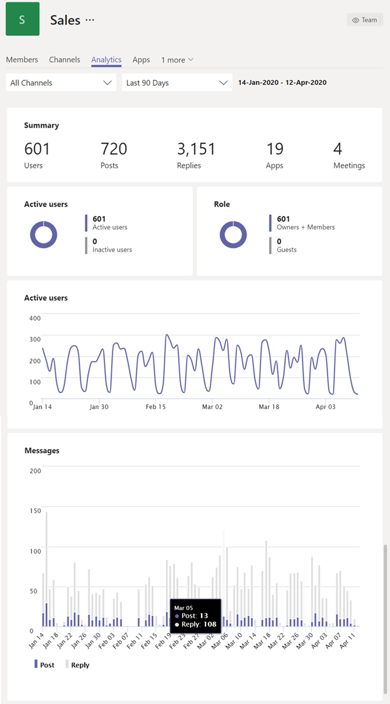

# Exibir análise no Teams

No Microsoft Teams, os usuários podem exibir análises para equipes e canais dos quais fazem parte. Essas informações fornecem aos usuários informações sobre padrões de uso e atividades em suas equipes. Os usuários podem ver dados como o número de usuários ativos, postagens, respostas e muito mais em três níveis.

- **A análise entre equipes fornece aos usuários** uma visão geral ampla dos dados de uso para todas as equipes das quais eles são membros ou proprietários em uma única exibição de lista.
- **A análise por equipe oferece aos usuários** uma exibição mais granular, mostrando dados de uso de uma equipe específica.
- **A análise por canal oferece aos usuários** uma exibição ainda mais granular, mostrando dados de uso de um canal específico.

Os usuários podem filtrar qualquer uma dessas exibições para ver dados por um período de tempo especificado.

## Exibir análise entre equipes

1. No Teams, na parte inferior da lista de equipes, ao lado de **Ingressar ou criar uma equipe**, clique em **Gerenciar equipes**.
2. Clique na guia **Análise** .
3. Selecione um intervalo de datas para mostrar dados de uso para todas as equipes das quais você é membro ou proprietário.

    

    |Item |Descrição  |
    |--------|-------------|
    |**Nome**   |Nome da equipe. |
    |**Usuários ativos**   |Número de usuários ativos na equipe e na linha de tendência da atividade de equipe durante o período de tempo especificado.
    |**Pessoas**   |Número total de pessoas na equipe no período de tempo especificado. Isso inclui proprietários de equipe, membros da equipe e convidados.|
    |**Convidados**   |Número de convidados na equipe durante o período de tempo especificado. |
    |**Posts**   |Número de novas mensagens postadas no chat da equipe durante o período de tempo especificado. |
    |**Respostas**   |Número de respostas no chat em equipe durante o período de tempo especificado. |
    |**Tipo**   |Se a equipe é uma equipe privada ou uma equipe pública.|

## Exibir análise por equipe

1. No Teams, acesse a equipe desejada, clique em **Mais opções (...)** e clique em **Gerenciar equipe**.
2. Clique na guia **Análise** .
4. Selecione um intervalo de datas para mostrar dados de uso para a equipe.  

    

    |Item |Descrição  |
    |--------|-------------|
    |**Resumo**   |Resumo da atividade da equipe, incluindo o seguinte:<ul><li>**Usuários**: número total de usuários no período de tempo especificado. Isso inclui proprietários de equipe, membros da equipe e convidados.</li> <li>**Postagens**: Número de novas mensagens postadas no chat da equipe durante o período de tempo especificado.</li><li>**Respostas**: número de respostas no chat da equipe durante o período de tempo especificado.</li> <li>**Aplicativos**: número de aplicativos adicionados à equipe.</li><li>**Reuniões**: Número de reuniões do Teams organizadas no nível da equipe.</li> </ul> |
    |**Usuários ativos**   |Número de usuários ativos e inativos.|
    |**Função**   |Número de usuários por função, incluindo proprietários de equipe, membros da equipe e convidados.|
    |**Gráfico de usuários ativos**  |Número de ativos diários. Passe o mouse sobre o ponto em uma determinada data para ver o número de usuários ativos nessa data.|
    |**Gráfico de mensagens**  |Número total de mensagens postadas no chat da equipe por data. Passe o mouse sobre o ponto em uma determinada data para ver o número de novas postagens e respostas postadas nessa data.|

> [!TIP]
> Você também pode exibir análise por equipe clicando em uma equipe na lista na [exibição de análise entre equipes](#view-cross-team-analytics).

## Exibir análise por canal

1. No Teams, acesse o canal desejado, clique em **Mais opções (...)** e clique em **Gerenciar canal**.
2. Clique na guia **Análise** .
3. Selecione um intervalo de datas para mostrar dados de uso para o canal.  

    

    |Item |Descrição  |
    |--------|-------------|
    |**Resumo**   |Resumo da atividade do canal, incluindo o seguinte:<ul><li>**Usuários**: número total de usuários no período de tempo especificado. Isso inclui proprietários de equipe, membros da equipe e convidados.</li> <li>**Postagens**: Número de novas mensagens postadas no canal durante o período de tempo especificado.</li><li>**Respostas**: número de respostas no canal durante o período de tempo especificado.</li> <li>**Aplicativos**: número de aplicativos adicionados ao canal.</li> </ul> |
    |**Gráfico de mensagens**  |Número total de mensagens postadas no chat do canal por data. Passe o mouse sobre o ponto em uma determinada data para ver o número de novas postagens e respostas postadas nessa data.|

> [!TIP]
> Você também pode exibir análise por canal selecionando um canal na caixa de lista suspensa na [exibição de análise por equipe](#view-per-team-analytics).
    
> [!NOTE]
> Definimos usuários ativos como usuários que executam uma ação intencional no cliente da área de trabalho, cliente móvel e cliente Web. Exemplos de uma ação intencional incluem iniciar um chat, fazer uma chamada, compartilhar um arquivo, editar um documento dentro das equipes, participar de uma reunião e assim por diante. Eliminamos ações passivas, como inicialização automática, minimização de uma tela ou fechamento do aplicativo. Também eliminamos todas as ações em uma única ID de usuário.

## Tópicos relacionados

- [Exibir análise para suas equipes](https://support.office.com/article/view-analytics-for-your-teams-5b8ad4b1-af34-4217-aff4-cd11a820b56b)
- [Análises e relatórios do Teams](teams-reporting-reference.md)