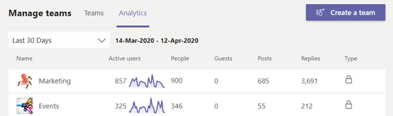

# Exibir análise no TeamsView analytics in Teams

No Microsoft Teams, os usuários podem exibir análises para equipes e canais dos que fazem parte.In Microsoft Teams, users can view analytics for teams and channels that they are part of. Essas informações dão aos usuários informações sobre padrões de uso e atividade em suas equipes.This information gives users insight into usage patterns and activity on their teams. Os usuários podem ver dados como o número de usuários ativos, postagens, respostas e muito mais em três níveis.Users can see data such as the number of active users, posts, replies, and more at three levels.

- **A análise entre equipes** fornece aos usuários uma visão geral ampla dos dados de uso de todas as equipes das que são membros ou proprietários em um único modo de exibição de lista.**Cross-team analytics** gives users a broad overview of usage data for all teams that they are a member or owner of in a single list view.
- **A análise por equipe** oferece aos usuários uma exibição mais granular, mostrando dados de uso para uma equipe específica.**Per-team analytics** gives users a more granular view, showing usage data for a specific team.
- **A análise por canal** oferece aos usuários uma exibição ainda mais granular, mostrando dados de uso para um canal específico.**Per-channel analytics** gives users an even more granular view, showing usage data for a specific channel.

Os usuários podem filtrar qualquer uma dessas exibições para ver dados para um período de tempo especificado.Users can filter any of these views to see data for a specified time period.

## Exibir análise entre equipesView cross-team analytics

1. Na Teams, na parte inferior da lista de equipes, ao lado de Ingressar ou criar uma **equipe,** clique em **Gerenciar equipes**.In Teams, at the bottom of the teams list, next to **Join or create a team**, click **Manage teams**.
2. Clique na **guia Análise.**Click the **Analytics** tab.
3. Selecione um intervalo de datas para mostrar dados de uso para todas as equipes das que você é membro ou proprietário.Select a date range to show usage data for all teams that you're a member or owner of.

    

    |ItemItem |DescriçãoDescription  |
    |--------|-------------|
    |**Nome****Name**   |Nome da equipe.Name of the team. |
    |**Usuários ativos****Active users**   |Número de usuários ativos na equipe e na linha de tendência da atividade da equipe durante o período de tempo especificado.Number of active users on the team and trend line of team activity during the specified time period.
    |**Pessoas****People**   |Número total de pessoas na equipe no período de tempo especificado.Total number of people on the team in the specified time period. Isso inclui proprietários de equipe, membros da equipe e convidados.This includes team owners, team members, and guests.|
    |**Convidados****Guests**   |Número de convidados na equipe durante o período de tempo especificado.Number of guests on the team during the specified time period. |
    |**Postagens****Posts**   |Número de novas mensagens postadas no chat de equipe durante o período de tempo especificado.Number of new messages posted in team chat during the specified time period. |
    |**Respostas****Replies**   |Número de respostas no chat de equipe durante o período especificado.Number of replies in team chat during the specified time period. |
    |**Tipo****Type**   |Se a equipe é uma equipe privada ou pública.Whether the team is a private team or public team.|

## Exibir análise por equipeView per-team analytics

1. Em Teams, vá para a equipe que você deseja, clique em Mais opções **(...)** e clique em **Gerenciar equipe**.In Teams, go to the team that you want, click **More options (...)**, and then click **Manage team**.
2. Clique na **guia Análise.**Click the **Analytics** tab.
4. Selecione um intervalo de datas para mostrar dados de uso para a equipe.Select a date range to show usage data for the team.  

    

    |ItemItem |DescriçãoDescription  |
    |--------|-------------|
    |**Resumo****Summary**   |Resumo da atividade da equipe, incluindo o seguinte:Summary of team activity including the following:<ul><li>**Usuários**: Número total de usuários no período de tempo especificado.**Users**: Total number of users in the specified time period. Isso inclui proprietários de equipe, membros da equipe e convidados.This includes team owners, team members, and guests.</li> <li>**Postagens**: Número de novas mensagens postadas no chat de equipe durante o período de tempo especificado.**Posts**: Number of new messages posted in team chat during the specified time period.</li><li>**Respostas :** Número de respostas no chat de equipe durante o período de tempo especificado.**Replies**: Number of replies in team chat during the specified time period.</li> <li>**Aplicativos**: número de aplicativos adicionados à equipe.**Apps**: Number of apps added to the team.</li><li>**Reuniões**: número de Teams reuniões organizadas no nível da equipe.**Meetings**: Number of Teams meetings organized at the team level.</li> </ul> |
    |**Usuários ativos****Active users**   |Número de usuários ativos e inativos.Number of active and inactive users.|
    |**Função****Role**   |Números de usuários por função, incluindo proprietários de equipe, membros da equipe e convidados.Numbers of users by role, including team owners, team members, and guests.|
    |**Gráfico de usuários** ativos**Active users** chart  |Número de ativos diários.Number of daily active. Passe o mouse sobre o ponto em uma determinada data para ver o número de usuários ativos nessa data.Hover over the dot on a given date to see the number of active users on that date.|
    |**Gráfico de** mensagens**Messages** chart  |Número total de mensagens postadas no chat de equipe por data.Total number of messages posted in team chat by date. Passe o mouse sobre o ponto em uma determinada data para ver o número de novas postagens e respostas postadas nessa data.Hover over the dot on a given date to see the number of new posts and replies posted on that date.|

> [!TIP]
> Você também pode exibir a análise por equipe clicando em uma lista de equipes no ponto de vista de análise [entre equipes.](#view-cross-team-analytics)You can also view per-team analytics by clicking a team in list in the [cross-team analytics view](#view-cross-team-analytics).

## Exibir análise por canalView per-channel analytics

1. Em Teams, vá para o canal que você deseja, clique em Mais opções **(...)** e clique em **Gerenciar canal**.In Teams, go to the channel that you want, click **More options (...)**, and then click **Manage channel**.
2. Clique na **guia Análise.**Click the **Analytics** tab.
3. Selecione um intervalo de datas para mostrar dados de uso para o canal.Select a date range to show usage data for the channel.  

    

    |ItemItem |DescriçãoDescription  |
    |--------|-------------|
    |**Resumo****Summary**   |Resumo da atividade do canal, incluindo o seguinte:Summary of channel activity including the following:<ul><li>**Usuários**: Número total de usuários no período de tempo especificado.**Users**: Total number of users in the specified time period. Isso inclui proprietários de equipe, membros da equipe e convidados.This includes team owners, team members, and guests.</li> <li>**Postagens**: Número de novas mensagens postadas no canal durante o período de tempo especificado.**Posts**: Number of new messages posted to the channel during the specified time period.</li><li>**Respostas**: Número de respostas no canal durante o período de tempo especificado.**Replies**: Number of replies in the channel during the specified time period.</li> <li>**Aplicativos**: Número de aplicativos adicionados ao canal.**Apps**: Number of apps added to the channel.</li> </ul> |
    |**Gráfico de** mensagens**Messages** chart  |Número total de mensagens postadas no chat do canal por data.Total number of messages posted to the channel chat by date. Passe o mouse sobre o ponto em uma determinada data para ver o número de novas postagens e respostas postadas nessa data.Hover over the dot on a given date to see the number of new posts and replies posted on that date.|

> [!TIP]
> Você também pode exibir a análise por canal selecionando um canal na caixa de listagem lista listada na exibição análise [por equipe.](#view-per-team-analytics)You can also view per-channel analytics by selecting a channel in the drop-down list box in the [per-team analytics view](#view-per-team-analytics).
    
> [!NOTE]
> Definimos usuários ativos como usuários que executam uma ação intencional no cliente da área de trabalho, no cliente móvel e no cliente Web.We define active users as users who perform an intentional action in the desktop client, mobile client, and web client. Exemplos de uma ação intencional incluem iniciar um chat, fazer uma chamada, compartilhar um arquivo, editar um documento dentro de equipes, participar de uma reunião e assim por diante.Examples of an intentional action include starting a chat, placing a call, sharing a file, editing a document within teams, participating in a meeting, and so on. Eliminamos ações passivas como inicialização automática, minimizando uma tela ou fechando o aplicativo.We strip out passive actions like auto boot, minimizing a screen, or closing the app. Também eliminamos todas as ações em uma única ID de usuário.We also de-dupe all actions across a single user ID.

## Tópicos relacionadosRelated topics

- [Exibir análises para suas equipesView analytics for your teams](https://support.office.com/article/view-analytics-for-your-teams-5b8ad4b1-af34-4217-aff4-cd11a820b56b)
- [Análises e relatórios do TeamsTeams analytics and reporting](teams-reporting-reference.md)