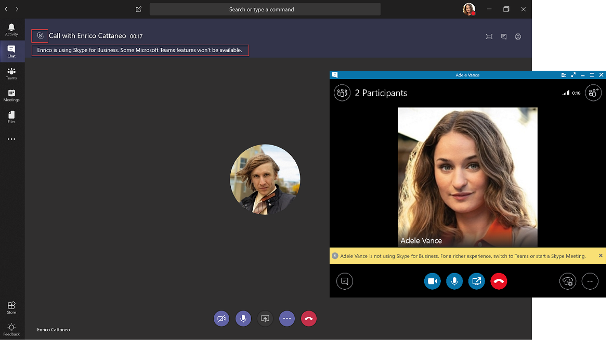

# Entender o Microsoft Teams e Skype for Business coexistência e interoperabilidade

Este artigo faz parte do estágio de Definição do Projeto da sua jornada de atualização. Conclua depois de criar uma coalizão de patrocínio e equipe de projeto e defina o escopo, as metas e o plano para o seu projeto. Antes de prosseguir, confirme se você concluiu as seguintes atividades:

- [Alistou as partes envolvidas no seu projeto](upgrade-enlist-stakeholders.md)
- [Definiu o escopo do seu projeto](./upgrade-define-project-scope.md)

Se sua organização usa Skype for Business hoje e você está começando a usar o Teams ao lado de Skype for Business— ou você está começando a atualizar para o Teams — é importante entender como os dois aplicativos coexistem, quando e como eles interoperam e como gerenciar a migração de seus usuários até a atualização eventual de Skype for Business para o Teams.

> [!Tip]
> Assista à sessão a seguir para saber mais sobre [Coexistência e Interoperabilidade](https://aka.ms/teams-upgrade-coexistence-interop).
>
> Além disso, você pode se juntar a nós para workshops interativos e dinâmicos nos quais compartilharemos diretrizes, práticas recomendadas e recursos projetados para iniciar o planejamento e a implementação de atualização.
>
> Para começar, participe primeiro da sessão de [Planejamento da atualização](./upgrade-workshops-landing-page.yml).

## Coexistência do Teams e visão geral Skype for Business

Desde a aposentadoria do Skype for Business Online, todos os usuários de uma organização online pura (ou seja, uma organização que não tem uma implantação local de Skype for Business) têm um modo de coexistência do TeamsOnly. O modo TeamsOnly garante que os usuários tenham funcionalidade completa do Teams. No entanto, organizações com uma implantação local de Skype for Business Server podem ter usuários que ainda estão hospedados no local; esses usuários não podem ser TeamsOnly. Usuários com uma conta Skype for Business Server local podem ter qualquer modo de coexistência *diferente do TeamsOnly.* As seções a seguir descrevem os modos de coexistência que estão disponíveis antes de você decidir atualizar Skype for Business usuários locais para o TeamsOnly e os recursos que cada modo oferece. Além disso, as seções descrevem a interoperabilidade (interoperabilidade) que ocorre entre usuários em Skype for Business clientes e usuários em clientes do Teams e como o interoperabilidade é afetado pelo modo de coexistência escolhido.

O Teams oferece recursos de colaboração, chat, chamada e recursos de reunião.  A funcionalidade de chat, chamada e reunião também estava historicamente disponível em Skype for Business. Dependendo de qual configuração você escolher ao fornecer o Teams, esses recursos podem se sobrepor aos recursos fornecidos por Skype for Business para um determinado usuário. O modo de coexistência padrão para usuários locais é Islands. O modo Islands permite que o usuário execute o Teams junto com Skype for Business com funcionalidade semelhante disponível em ambos os clientes; ou seja, os recursos se sobrepõem. No entanto, um usuário pode receber outros modos de coexistência para evitar a sobreposição desse recurso para o usuário, nesse caso, a interoperabilidade entre o Teams e Skype for Business está disponível. Por exemplo, se você tiver ativos locais Skype for Business Server significativos com uma implantação Enterprise Voice complexa, mas quiser que seus usuários aproveitem reuniões modernas o mais rápido possível, talvez você queira avaliar usando o Skype for Business com o modo colaboração e reuniões do Teams, também conhecido como [Reuniões Primeiro](meetings-first.md).

Recomendamos que você examine os seguintes modos de coexistência para ajudar a determinar qual caminho é o certo para sua organização.

> [!Important]
> Os modos de coexistência continuam a existir após a aposentadoria do Skype for Business Online, no entanto, os usuários hospedados online só podem ter um modo de TeamsOnly. Não é mais possível atribuir qualquer modo diferente do TeamsOnly a um usuário hospedado online.  Como foi o caso antes da aposentadoria do Skype for Business Online, os usuários hospedados no local podem receber qualquer modo *diferente do TeamsOnly*.

### Somente Equipes

**O Teams Only** é o único modo disponível para usuários online puros. Um usuário **do Teams Only** (no passado, às vezes chamado de usuário *atualizado*) tem acesso a todos os recursos no Teams e pode continuar a se comunicar com outros usuários (seja na mesma organização ou externa) que ainda usam Skype for Business (desde que os usuários Skype for Business não estejam no modo **Islands**). **Usuários do Teams Somente** usuários recebem chats e chamadas de entrada no Teams e também agendam reuniões no Teams. Eles não podem iniciar chats ou chamadas ou agendar reuniões em Skype for Business. 

Somente os usuários **do Teams** podem manter o cliente Skype for Business para ingressar em qualquer Skype for Business reuniões que já tenham ou possam receber no futuro (ou seja, de partes externas ou possivelmente de usuários Skype for Business Server locais em sua própria organização). *No entanto, depois que a Microsoft remover a infraestrutura do Skype for Business Online para um determinado usuário somente do Teams, os usuários do Teams somente poderão participar Skype for Business reuniões anonimamente.* Após 30 de junho de 2022, os usuários do TeamsOnly recém-criados não serão mais provisionados com a infraestrutura Skype for Business Online. Se esses usuários forem convidados para uma reunião Skype for Business, eles precisarão ingressar anonimamente. Após outubro de 2022, os usuários movidos do local para a nuvem (ou seja, eles se tornam TeamsOnly) não serão mais provisionados com a infraestrutura Skype for Business Online.  Se esses usuários forem convidados para uma reunião Skype for Business, eles também precisarão ingressar anonimamente.

Assim que sua organização estiver pronta para que alguns ou todos os usuários usem o Teams como sua única ferramenta de comunicação e colaboração, atualize esses usuários para o modo **Somente Do Teams** . Se você estiver atualizando do modo **Islands** , aconselhamos que primeiro saturar a adoção do Teams em toda a sua organização antes de iniciar o processo de atualização. Essa adoção evita cenários de comunicação quebrados devido ao modo **Islands** não fornecer interoperabilidade.

Quando no modo **Somente Do Teams** , o Teams é o aplicativo padrão para o protocolo SIP/Tel. Os links no cartão de contato de um usuário no Outlook para chamadas ou chat serão tratados pelo Teams.

Para obter considerações extras sobre como migrar para o modo **Somente Do Teams** , consulte [Considerações do modo Somente do Teams](teams-only-mode-considerations.md).

### Modo islands

No modo **Islands, os usuários** podem executar o Teams junto com Skype for Business como duas soluções separadas que fornecem recursos semelhantes e sobrepostos. Os recursos incluem presença, chat, chamadas e reuniões. Os usuários do Teams também podem aproveitar novos recursos de colaboração, como equipes e canais, acesso a arquivos no Microsoft 365 e aplicativos.

Nesse modo de coexistência, cada um dos aplicativos cliente opera como uma ilha separada. Skype for Business conversa com Skype for Business e o Teams conversa com o Teams. Espera-se que os usuários executem os dois clientes o tempo todo e possam se comunicar nativamente no cliente do qual a comunicação foi iniciada. Como tal, não há necessidade de interoperabilidade no modo **Islands** .

Para evitar uma experiência de Skype for Business confusa ou regredida, o Skype for Business manipula as seguintes integrações que não são **tratadas no modo Teams Islands**:

- Comunicações externas (federadas).
- Serviços de voz PSTN e aplicativos de voz, integração do Office.
- Controles HID para dispositivos USB.
- Várias outras integrações.

não há suporte para Telefonia do Microsoft Teams System no modo Teams in **Islands**. 

> [!Important]
>  - No modo Ilhas, todas as mensagens e chamadas de **usuários** federados (pessoas fora de sua organização) são entregues a Skype for Business. Depois de atualizar para o modo **Somente Do Teams** , todas as mensagens e chamadas de fora de sua organização são entregues ao Teams.
>  - Talvez você queira exigir que os usuários de Ilhas sempre agendem reuniões no Teams atribuindo-lhes uma instância do TeamsMeetingPolicy com o PreferredMeetingProviderForIslandsMode=Teams. Isso garante que todos os usuários agendem reuniões usando o Teams, que dá suporte à entrada autenticada e à junção de reunião para qualquer usuário da organização, independentemente de o usuário ser TeamsOnly ou ainda usar Skype for Business Server. Por outro lado, depois que a Microsoft retirar a infraestrutura herdada do Skype for Business Online para organizações híbridas a partir de outubro de 2022, os usuários do TeamsOnly só poderão participar Skype for Business reuniões anonimamente.

### Somente Skype for Business

Nesse modo de coexistência, os usuários permanecem em Skype for Business- não do Teams - para recursos de chat, reunião e chamada, e não usam o Teams para equipes e canais. Esse modo está disponível hoje; no entanto, na implementação atual, as equipes e os canais não são desativados automaticamente para o usuário. Isso pode ser obtido usando a política de Configuração de Aplicativo para ocultar equipes e arquivos.

Esse modo pode ser usado antes de iniciar uma implantação gerenciada do Teams para impedir que os usuários comecem a usar o Teams antes de terem uma preparação criada. Esse modo também é uma maneira de habilitar a participação autenticada em reuniões do Teams para usuários Skype for Business, desde que os usuários sejam licenciados para o Teams.

### Skype for Business com a Colaboração do Teams

Use esse modo para apresentar o Teams em seu ambiente enquanto você continua a usar o investimento existente em Skype for Business. Deixe Skype for Business inalterado para recursos de chat, chamada e reunião. Adicionar recursos de colaboração do Teams:

- Equipes e canais.
- Acesso a arquivos no Microsoft 365 ou Office 365.
- Aplicativos. Recursos de comunicação do Teams: reuniões privadas de chat, chamada e agendamento.

As reuniões privadas, chamadas e agendamento do Teams estão desativadas por padrão neste modo.

As organizações que começam com Skype for Business Server no local têm esse modo como uma alternativa ao modo Islands se desejarem fornecer aos seus **usuários** interoperabilidade e previsibilidade para suas comunicações durante a migração. Esse modo também fornece uma linha do tempo previsível para sua atualização para o Teams (em vez de depender da saturação de adoção no modo **Islands** ).

### Skype for Business com a Colaboração e Reuniões do Teams, também conhecidas como Reuniões Primeiro

Nesse modo, a funcionalidade de chat privado e chamada permanece em Skype for Business enquanto o Teams é usado para agendar e realizar reuniões, bem como para colaboração usando conversas baseadas em canais.  Esse modo de coexistência ajuda a acelerar a disponibilidade de recursos de reunião e colaboração do Teams em sua organização e permite que seus usuários aproveitem a experiência de reuniões superiores do Teams:

- Ótima qualidade.
- Transcrição e tradução.
- Desfoque em segundo plano.
- Experiência superior do usuário em todas as plataformas, incluindo dispositivos móveis e navegadores.

As equipes e Skype for Business se beneficiam de uma série de recursos "melhores juntos", como reconciliação de presença, retenção/destenção automática e suporte a dispositivo HID em ambos os aplicativos. É possível ocultar equipes e canais, se desejado, usando a política de Configuração de Aplicativo do Teams.

Esse modo de coexistência é especialmente útil para organizações com Skype for Business implantações locais com Enterprise Voice. É provável que essas organizações levem algum tempo para atualizar para o Teams e desejam se beneficiar das reuniões superiores do Teams o mais rápido possível.

> [!NOTE]
> A partir de outubro de 2022, esse modo é recomendado para todos os usuários locais que foram atribuídos anteriormente **Skype for Business Somente** ou **Skype for Business com modos de Colaboração do Teams**. Esse modo oferece a mesma funcionalidade que os outros dois, exceto novas reuniões agendadas pelo usuário serão reuniões do Teams em vez de reuniões Skype for Business. Isso garante que os usuários agendem suas reuniões como reuniões do Teams, o que dá suporte à entrada autenticada e à junção de reunião para qualquer usuário da organização, independentemente de o usuário ser TeamsOnly ou ainda usar Skype for Business Server.  Por outro lado, à medida que a Microsoft aposenta a infraestrutura herdada Skype for Business Online, os usuários do TeamsOnly não poderão mais se autenticar ao ingressar em reuniões Skype for Business, no entanto, eles ainda podem ingressar anonimamente. Para obter detalhes, confira [O que esperar após a aposentadoria](skype-for-business-online-retirement.md#what-to-expect-post-retirement).

> [!TIP]
> Para ajudar a identificar o modo de atualização recomendado com base nos recursos que você deseja habilitar no Teams enquanto Skype for Business ainda estiver em uso, aproveite o [Assistente de Atualização do Skype to Teams](https://aka.ms/SkypeToTeamsWizard).

Para obter mais informações sobre modos de coexistência, pré-requisitos e gerenciamento, confira [Diretrizes de migração e interoperabilidade para organizações que usam o Teams juntamente com Skype for Business](./migration-interop-guidance-for-teams-with-skype.md) e [Configurando suas configurações de coexistência e atualização](./setting-your-coexistence-and-upgrade-settings.md).

|Ícone ponto de decisão |Definição de ícone |Descrição |
|---|---|---|
||Ponto de decisão|<ul><li>Quais modos de coexistência melhor atendem às necessidades da sua organização e dos usuários?</li></ul>|
||Próxima etapa|<ul><li>Escolha a melhor abordagem para sua jornada de atualização.</li></ul>|

### Interoperabilidade do Teams e Skype for Business

A interoperabilidade é a capacidade do Teams e Skype for Business usuários da mesma organização se comunicarem entre o Teams e Skype for Business.

A interoperabilidade é governada pelo modo de coexistência (também conhecido como modo de atualização) do receptor. Não há interoperabilidade quando o receptor está no modo **Islands** .

> [!Note]
> Quando implantados em qualquer modo de coexistência, exceto **Ilhas, Equipes** e Skype for Business podem [interoperar](#interoperability-of-teams-and-skype-for-business), permitindo que os usuários conversem e chamem uns aos outros e garantam que as comunicações permaneçam fluidas em toda a sua organização durante sua jornada de atualização para o Teams. Os modos de coexistência regem a interoperabilidade. O modo de coexistência do receptor determina se a interoperabilidade estará disponível. Por exemplo, se o receptor estiver em um modo no qual o chat só está disponível em um cliente (por exemplo, Teams), a interoperabilidade de chat geralmente estará disponível caso o iniciador use o outro cliente (nesse caso, Skype for Business) para iniciar o chat. Por outro lado, se o receptor estiver no modo em que o chat está disponível em ambos os clientes (modo Islands), a interoperabilidade não estará disponível para o chat. A mensagem será recebida pelo receptor no mesmo cliente no qual o iniciador iniciou o chat. Portanto, a comunicação adequada no modo **Islands** requer saturação de adoção do Teams; ou seja, todos os usuários usam e monitoram ativamente ambos os clientes.

> [!Note]
> **Para ter a experiência de coexistência mais recente, a versão do cliente deve ser o cliente mais recente disponível no canal de implantação do Office do usuário.**

#### Interoperabilidade nativa e escalonamento de interoperabilidade

Há dois tipos de experiências de interoperabilidade: escalonamento nativo e interoperabilidade.

- Uma experiência _de interoperabilidade nativa_ ocorre no cliente que o usuário está usando no momento. Um usuário estará no Skype for Business cliente, o outro no Teams. Uma experiência de interoperabilidade nativa não os levará a outro cliente para se comunicar. Os usuários poderão conduzir sua conversa no cliente que estão usando no momento. As experiências de interoperabilidade nativas são um para um chat e chamadas.
- Uma experiência de _escalonamento de interoperabilidade_ significa que, como parte de ajudar os usuários a executar uma ação avançada (como compartilhar sua área de trabalho), o cliente facilita a criação de uma reunião na qual os usuários podem ingressar para continuar a experiência nessa reunião. A reunião é criada na plataforma do iniciador da ação. O usuário ou os usuários que não estão nessa plataforma recebem um link de junção de reunião. Ao clicar neste link, eles são unidos à reunião em um cliente compatível (navegador, aplicativo Web ou cliente completo, dependendo da configuração). O escalonamento de interoperabilidade de Skype for Business requer um cliente recente. O escalonamento de interoperabilidade do Teams agora está disponível. Ambos têm suporte em experiências de interoperabilidade no locatário e em interlocatários de comunicação federados.

#### Experiências de interoperabilidade nativas

Dependendo dos modos de coexistência atribuídos aos usuários (conforme descrito anteriormente), as seguintes experiências de interoperabilidade nativas estão disponíveis:

Skype for Business usuários podem conversar um a um com os usuários do Teams e vice-versa. Um chat de interoperabilidade precisa passar por um gateway de interoperabilidade que faz parte dos serviços de nuvem do Teams (e, portanto, só existe online). Chats de interoperabilidade são texto simples: texto rico e emoticons não têm suporte. Usuários no Teams e em Skype for Business são notificados de que a conversa é uma conversa de interoperabilidade.

<!---->

Skype for Business usuários podem fazer chamadas de voz e vídeo um-a-um para usuários do Teams, e os usuários do Teams podem fazer o mesmo.

<!---->

> [!Important]
> Experiências de interoperabilidade com usuários locais em uma organização com uma mistura de usuários locais e do Teams exigem que o ambiente local esteja no modo híbrido com o Teams. Para obter detalhes, [configure a conectividade híbrida entre Skype for Business Server e o Microsoft 365 ou Office 365](/SkypeForBusiness/hybrid/configure-hybrid-connectivity).

Essas experiências de interoperabilidade estão disponíveis para e entre usuários que têm um dos seguintes modos de coexistência atribuídos: **Skype for Business com a Colaboração do Teams**, **Skype for Business com Colaboração do Teams e reuniões**, **Somente Skype for Business** ou **Somente Teams**. Não há interoperabilidade para usuários no modo **Islands** .

#### Limitações de experiência de interoperabilidade nativa

Devido à diferença de protocolos e tecnologia, não é possível dar suporte a todas as funcionalidades nativamente. Especificamente, os seguintes recursos não estão disponíveis:

- Markdown, texto avançado e o conjunto de emoticon completo não têm suporte do Teams ou Skype for Business. Não há suporte para outros recursos nativos da caixa de composição nos chats do Teams.
- Não há suporte para compartilhamento de tela (desktop ou compartilhamento de aplicativos) entre o Teams e Skype for Business nativamente. No entanto, ele é suportado por meio de escalonamento de interoperabilidade.
- Os chats em grupo (conversas de várias partes) no Teams só podem incluir participantes que estão usando o Teams.
- Conversas de IM de várias partes (chats em grupo) no Skype for Business só podem incluir participantes que estão usando Skype for Business. No entanto, o escalonamento de interoperabilidade para vários partidos está disponível de Skype for Business.
- Não há suporte para escalar uma chamada de voz ou vídeo ponto a ponto em andamento para uma chamada de várias partes envolvendo usuários do Teams e Skype for Business.
- Não há suporte para transferência de arquivos para chats de duas partes ou anexo de arquivo em chats de grupo, do Teams para Skype for Business e vice-versa.
- Não há interoperabilidade com Skype for Business Chat Persistente.

Para todas essas limitações (exceto o Chat Persistente), uma solução alternativa possível é que um usuário inicie uma reunião e convide o outro usuário a ingressar nele.

Essa solução alternativa é a base para o escalonamento de interoperabilidade. Em particular, o compartilhamento de tela e o escalonamento para várias partes não são alcançáveis nativamente, mas são suportados por meio de escalonamento de interoperabilidade.

#### Experiências de escalonamento de interoperabilidade

O escalonamento de interoperabilidade consiste em complementar as funcionalidades de interoperabilidade nativa com escalonamentos gerenciados para reuniões. As reuniões oferecem experiências avançadas disponíveis para qualquer pessoa, independentemente de qual cliente eles tenham.

Quando o escalonamento de interoperabilidade é disparado pelo usuário do Teams, uma reunião do Teams é criada. Quando ele é disparado pelo usuário Skype for Business, uma reunião Skype for Business é criada. Em ambos os casos, a reunião criada é uma reunião **do Meet now** , que não se reflete no calendário do usuário.

A outra parte recebe o link de junção da reunião por meio do chat de interoperabilidade e se junta clicando nesse link. Se o usuário Skype for Business tiver uma conta do Teams e for convidado pelo usuário do Teams, ele participará da reunião autenticada. Caso contrário, eles se juntarão como um participante anônimo. Os usuários do Teams quase sempre têm uma conta Skype for Business e um cliente Skype for Business que podem usar para participar de uma reunião Skype for Business como participante autenticado, mas também podem ingressar como um participante anônimo, por exemplo, usando o aplicativo Reunião do Skype.

Depois que as partes ingressarem na reunião, elas poderão realizar qualquer atividade com suporte em reuniões, como compartilhamento de conteúdo ou área de trabalho, compartilhamento ou transferência de arquivos, adição de outros participantes e assim por diante.

#### Escalonamento de interoperabilidade de Skype for Business

O escalonamento entre opções e interoperabilidade de Skype for Business foi atualizado na compilação de julho de 2019 do C2R mensal. Anteriormente, Skype for Business não tinha a consciência avançada de que a parte remota estava usando o Teams. Ele só supõe que a partir da sinalização recebida após uma sessão foi estabelecida.

Quando a sinalização indicava que a resposta vinha (ou por meio) do gateway de interoperabilidade, ela exibia a barra de negócios amarela (faixa) indicando que a outra parte não estava usando Skype for Business. Com a evolução do nosso serviço, isso resultou em falsos positivos em que Skype for Business usuários veriam a barra de negócios quando estavam conectados ao Serviço de Caixa postal na Nuvem ou outros serviços de voz na nuvem, em vez de a um usuário **real do Teams Only**.

Para evitar falsos positivos, o serviço de presença agora está informando o Skype for Business cliente quando a outra parte é um usuário real **do Teams Only**. Isso permite que Skype for Business crie uma conversa de interoperabilidade e a janela de conversa seja específica para interoperabilidade.

Se o usuário Skype for Business quiser compartilhar sua área de trabalho, por exemplo, ele será informado de que iniciaremos uma reunião e seremos guiados pelas etapas.

Enquanto isso, o usuário do Teams recebe uma mensagem de chat de entrada com o link para a reunião e é orientado a ingressar.

Essa escalada para uma reunião Skype for Business está disponível para interoperabilidade e chats federados entre locatários. Ele está ativado por padrão e não há nenhuma configuração que o administrador tenha que provisionar.

#### Escalonamento de interoperabilidade do Teams

O escalonamento de interoperabilidade do Teams para uma reunião do Teams agora está disponível quando o usuário do Teams seleciona o botão de compartilhamento de área de trabalho em um thread de interoperabilidade no locatário com um usuário Skype for Business ou em um thread de federação de interoperabilidade entre locatários. Há suporte para escalonamento de interoperabilidade de uma conversa de chat 1:1 ou de uma chamada 1:1.

O recurso tem suporte no cliente da área de trabalho do Teams para Windows, no cliente da área de trabalho do Teams para Mac e no cliente Web do Teams em navegadores em que há suporte para compartilhamento de conteúdo, enquanto estiver em comunicação com qualquer Skype for Business versão do cliente.

Em threads de interoperabilidade e em threads de interoperabilidade de federação, o usuário do Teams agora tem os controles (botão) para iniciar o compartilhamento de conteúdo. Quando o usuário do Teams seleciona o botão, ele é apresentado com um menu adicional que informa que para compartilhar conteúdo, ele precisará iniciar uma reunião do Teams.

Se os usuários estiverem em uma chamada, o menu avisará que sua chamada atual entre o Teams e Skype for Business será encerrada quando forem colocadas em uma reunião do Teams. Se eles escolherem, eles podem avisar o usuário Skype for Business antes de aceitar.

Após a aceitação, eles são colocados na reunião do Teams; eles devem começar a compartilhar da bandeja de compartilhamento na reunião.

Enquanto isso, o usuário Skype for Business recebe uma mensagem de chat de entrada com o link para a reunião e é orientado a ingressar.

Esse escalonamento para uma reunião do Teams está disponível para chamadas e chats federados entre locatários e interlocatários. Ele está ativado por padrão e não há nenhuma configuração que o administrador tenha que provisionar. No entanto, ele será desativado para o usuário se o administrador definir ``-AllowPrivateMeetNow`` como ``CsTeamsMeetingPolicy`` ``$false``.

Depois de examinar este artigo, confira [Escolher sua jornada de atualização](upgrade-and-coexistence-of-skypeforbusiness-and-teams.md), [Diretrizes de migração e interoperabilidade](./migration-interop-guidance-for-teams-with-skype.md), [Coexistência com Skype for Business](coexistence-chat-calls-presence.md) e [Definir suas configurações de coexistência e atualização](./setting-your-coexistence-and-upgrade-settings.md) para obter detalhes da implementação. Também recomendamos o seguinte vídeo: [Vídeo: Gerenciar coexistência e interoperabilidade entre o SfB e o Teams](https://www.youtube.com/watch?v=wEc9u4S3GIA&list=PLaSOUojkSiGnKuE30ckcjnDVkMNqDv0Vl&index=11)

## Detalhes técnicos do Teams e Skype for Business coexistência

As seções a seguir resumem o comportamento que pode ser experimentado ao executar o Teams e Skype for Business clientes na mesma organização, independentemente do modo e qual método de atualização é usado:

- [Reuniões](#meetings)
- [Interoperabilidade](#interoperability)
- [Threads de conversa interoperabilidade versus nativo](#interop-versus-native-conversation-threads)
- [Presença](#presence)
- [Federação](#federation)
- [Contatos](#contacts)

### Reuniões

Independentemente do modo, os usuários sempre podem participar de qualquer tipo de reunião para a qual são convidados, seja Skype for Business ou Teams.  No entanto, os usuários devem ingressar na reunião com um cliente correspondente que corresponda ao tipo de reunião:

- Se a reunião for uma reunião do Teams, todos os participantes (sejam TeamsOnly, Islands ou Skype for Business usuários) usarão o cliente do Teams para participar da reunião. Se o Teams não estiver instalado, o usuário será direcionado para a Web ao tentar ingressar em uma reunião.

- Se a reunião for uma reunião Skype for Business, todos os participantes (sejam teamsonly, islands ou usuários Skype for Business) usarão o cliente Skype for Business para participar da reunião. Se o Skype for Business cliente não estiver instalado, o usuário será direcionado à Web para ingressar por meio do aplicativo Reunião do Skype. 

  Em alguns casos, os participantes do modo TeamsOnly só poderão participar Skype for Business reuniões usando Skype for Business Web App ou o Aplicativo de Reuniões do Skype como usuário anônimo. Eventualmente, esse caso será verdadeiro para todos os usuários no modo TeamsOnly. Para obter mais informações, consulte [Skype for Business Aposentadoria online](skype-for-business-online-retirement.md#what-to-expect-post-retirement).

Ao organizar reuniões, o tipo de reunião que é agendado baseia-se no modo do organizador, conforme mostrado na tabela a seguir:

| Modo de organizador    |      Comportamento |
| :------------------ | :---------------- |
| TeamsOnly, SfbWithTeamsCollabAndMeetings | Todas as reuniões agendadas no Teams. Skype for Business suplemento não está disponível no Outlook. |
| SfbWithTeamsCollab, SfbOnly | Todas as reuniões agendadas em Skype for Business. O suplemento do Teams não está disponível no Outlook. Considere usar o SfbWithTeamsCollabAndMeetings em vez disso, o que permite que todos os usuários locais ou TeamsOnly usem o Teams para reuniões.|
| Ilhas | Por padrão, as reuniões podem ser agendadas no Skype for Business ou no Teams. Ambos os suplementos estão disponíveis no Outlook. No entanto, opcionalmente, você pode exigir que os usuários em Ilhas sempre agendem reuniões no Teams atribuindo-lhes uma instância do TeamsMeetingPolicy com o PreferredMeetingProviderForIslandsMode=Teams.|

### Interoperabilidade

Conforme descrito acima em [Interoperabilidade do Teams e Skype for Business](#interoperability-of-teams-and-skype-for-business), o Teams dá suporte ao interoperabilidade com Skype for Business em determinados cenários. Comunicação de interoperabilidade refere-se a um chat ou chamada entre um usuário Skype for Business e um usuário do Teams. A comunicação de interoperabilidade só é possível entre dois usuários; Não há suporte para chat/chamada de vários partidos ou adição de usuários adicionais.

Um chat de interoperabilidade ou chamada entre dois usuários é criado quando cada um deles é verdadeiro:

- Um usuário está usando o Teams e o outro está usando Skype for Business.

- O modo do destinatário da comunicação inicial não é Islands (caso contrário, a comunicação pousaria no mesmo cliente) se ambos os usuários estiverem na mesma organização. Em cenários federados, o usuário de envio está usando o Teams e o destinatário não está no modo TeamsOnly.

- O usuário do Teams NÃO também tem uma conta de Skype for Business abrigada localmente.

Na comunicação de interoperabilidade, o chat é somente texto simples. Além disso, o compartilhamento de arquivos e o compartilhamento de tela não são *possíveis no chat de interoperabilidade em si*. No entanto, os usuários em uma conversa de interoperabilidade podem facilmente alcançar o compartilhamento de arquivo e/ou tela criando uma reunião sob demanda, de dentro do chat de interoperabilidade, conforme descrito abaixo:

- Se o usuário do Teams tentar compartilhar sua tela, uma reunião do Teams sob demanda será criada automaticamente e um link de convite para essa reunião será enviado para o cliente do Skype for Business usuário. Ao clicar no link, o usuário Skype for Business abrirá o Teams e ingressará na reunião. Ambos os usuários estão agora em uma reunião do Teams e podem compartilhar conforme necessário.

- Se o usuário Skype for Business estiver usando um cliente de 2018 ou posterior e tentar compartilhar qualquer conteúdo, uma reunião Skype for Business sob demanda será criada automaticamente e um link de convite para essa reunião será enviado ao cliente do usuário do Teams. Ao clicar no link, o usuário do Teams tentará ingressar na reunião Skype for Business. Se o usuário do Teams tiver o cliente Skype for Business instalado, ele será aberto e o usuário será solicitado a entrar (se ainda não estiver conectado).  Se o usuário do Teams não tiver o cliente Skype for Business instalado, o usuário será solicitado a usar a versão da Web. Depois que ambos os usuários são conectados, eles estão em uma reunião Skype for Business e podem compartilhar conforme necessário.

### Threads de conversa interoperabilidade versus nativo

Como as comunicações de interoperabilidade não dão suporte a todos os recursos da conversa nativa do Teams, o cliente do Teams mantém threads de conversa separados para comunicação teams-to-teams e teams-to-Skype for Business. Essas conversas são renderizadas de forma diferente na interface do usuário: os threads de interoperabilidade podem ser diferenciados de um thread nativo regular do Teams por:

- Falta de controles para texto avançado, compartilhamento de arquivo/tela, incapacidade de adicionar usuários.
- Uma modificação no ícone do usuário de destino, mostrando um "S" para Skype for Business.

Essas diferenças são mostradas nas seguintes capturas de tela:

Uma conversa nativa do Teams para o Teams com o Teste G3 do Usuário

Uma conversa de interoperabilidade com o mesmo teste G3 do usuário

Depois que um thread de conversa é criado, seu tipo nunca é alterado. Depois de criado, um thread de interoperabilidade no Teams sempre roteará para o cliente Skype for Business do usuário de destino. Um thread nativo sempre roteará para o cliente do Teams do usuário de destino.  Se o modo de um usuário destinatário for alterado, os threads existentes do Teams para esse usuário não funcionarão mais e uma nota será exibida nesse chat com um link para iniciar uma nova conversa nativa, conforme mostrado na captura de tela a seguir.

### Presença

A presença de um determinado usuário baseia-se na atividade do usuário no serviço por meio do cliente. Em seguida, a presença é publicada para outros usuários verem.  Skype for Business e o Teams são serviços separados com clientes separados, portanto, cada serviço tem seu próprio estado de presença para um usuário.   Há também a sincronização entre os serviços de presença no Teams e no Skype for Business Online.  Isso permite que um serviço possa publicar a presença do usuário do outro serviço, se necessário.

O comportamento de publicação de presença baseia-se no modo do usuário. Há três casos básicos:

- Se um usuário estiver no modo TeamsOnly, todos os outros usuários verão a presença do Teams para esse usuário, independentemente de qual cliente eles usem.

- Se um usuário estiver em qualquer um dos modos Skype for Business, todos os outros usuários verão Skype for Business presença para esse usuário, independentemente de qual cliente ele use.

- Se um usuário estiver no modo Islands, a presença publicada no Skype for Business e no Teams é independente, portanto, a presença mostrada aos usuários dentro da mesma organização dependerá do cliente do outro usuário. Os usuários de organizações federadas verão a presença desse usuário com base em sua atividade Skype for Business, já que o tráfego federado para um usuário do modo Islands pousa em Skype for Business.

Por exemplo, Suponha que o usuário A esteja no modo Islands. Se o Usuário A estiver ativo no Teams, mas não estiver conectado ao Skype for Business, outros usuários verão o Usuário A como ativo de seu cliente do Teams, mas em seu cliente Skype for Business eles veriam o Usuário A como offline. Isso é por design, já que o Usuário A não pode ser acessado se não estiver executando o cliente.

### Federação

A federação do Teams para outro usuário usando Skype for Business exige que o usuário do Teams seja hospedado online em Skype for Business. TeamsUpgradePolicy determina o roteamento para chamadas e conversas federadas e de entrada. O comportamento de roteamento federado é o mesmo para cenários de mesmo locatário, exceto no modo de Ilhas. Quando os destinatários estiverem no modo de Ilhas:

- Chats e chamadas iniciadas do Teams chegam em Skype for Business se o destinatário estiver em um locatário federado.
- Chats e chamadas iniciados a partir do Teams são recebidos no Teams se o destinatário estiver no mesmo locatário.
- Chats e chamadas iniciadas de Skype for Business sempre aterrissam em Skype for Business.

Um chat federado pode ser um thread nativo ou um thread de interoperabilidade. Consulte [Interop versus threads de conversa nativa](#interop-versus-native-conversation-threads).

- Se o receptor e o remetente estiverem no modo de atualização do TeamsOnly, a conversa será uma experiência de chat nativa, que inclui todas as funcionalidades avançadas de mensagens e chamadas. Para saber mais, leia [Experiência de chat nativo para usuários externos (federados) no Teams](native-chat-for-external-users.md).

- Se um dos participantes da conversa NÃO estiver no modo de atualização do TeamsOnly, a conversa continuará sendo uma experiência de interoperabilidade com mensagens somente texto. A interface do usuário expõe chats federados de maneira semelhante aos threads de interoperabilidade do mesmo locatário, exceto que há uma nota indicando que o usuário é externo.

Para obter mais detalhes, confira [Gerenciar acesso externo no Microsoft Teams](manage-external-access.md) e [experiência de chat nativo para usuários externos (federados) no Teams](native-chat-for-external-users.md).

### Contatos

Equipes e Skype for Business têm listas separadas de contatos. Isso significa que adições de contato, remoção e modificações feitas em um sistema não são sincronizadas com o outro sistema. No entanto, os contatos de Skype for Business são automaticamente copiados para o Teams quando ocorrem dois eventos específicos:

- Para qualquer usuário do Skype for Business Online, na primeira vez que fizer logon no Teams, os contatos de Skype for Business serão copiados para o Teams. Esse comportamento não está disponível para usuários com uma conta local em Skype for Business Server.

- Depois que um usuário for atualizado para o TeamsOnly (por meio da atribuição do TeamsUpgradePolicy ou por meio de Move-CsUser -MoveToTeams), na próxima vez que um usuário fizer logon no Teams, os contatos existentes no Skype for Business serão mesclados com os contatos existentes já no Teams. Esse comportamento acontece se o usuário foi movido para o TeamsOnly do local ou online.

Em ambos os casos, a transferência de contatos de Skype for Business para o Teams é assíncrona, portanto, pode levar alguns minutos até que os contatos apareçam no Teams. Os dois eventos acima são o que disparam a cópia.

### Links relacionados

[Orientações de migração e interoperabilidade para organizações que usam o Teams em conjunto com o Skype for Business](migration-interop-guidance-for-teams-with-skype.md)

[Configurar a conectividade híbrida entre Skype for Business Server e o Microsoft 365 ou Office 365](/SkypeForBusiness/hybrid/configure-hybrid-connectivity)

[Mover os usuários entre um ambiente local e a nuvem](/SkypeForBusiness/hybrid/move-users-between-on-premises-and-cloud)

[Definir suas configurações de coexistência e atualização](setting-your-coexistence-and-upgrade-settings.md)

[Grant-CsTeamsUpgradePolicy](/powershell/module/skype/grant-csteamsupgradepolicy)

[Usando o Meeting Migration Service (MMS)](/skypeforbusiness/audio-conferencing-in-office-365/setting-up-the-meeting-migration-service-mms)
