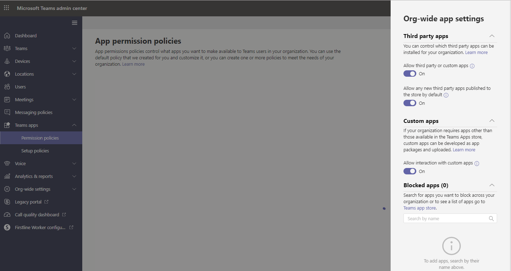

# <a name="manage-app-permission-policies-in-microsoft-teams"></a><span data-ttu-id="33789-103">Gerenciar políticas de permissões de aplicativo no Microsoft Teams</span><span class="sxs-lookup"><span data-stu-id="33789-103">Manage app permission policies in Microsoft Teams</span></span>

> [!INCLUDE [feature coming soon](includes/new-feature-coming-soon-article.md)]

<span data-ttu-id="33789-104">Como um administrador, você pode usar políticas de permissão de aplicativo para controlar quais aplicativos estão disponíveis para usuários do Microsoft Teams em sua organização.</span><span class="sxs-lookup"><span data-stu-id="33789-104">As an admin, you can use app permission policies to control what apps are available to Microsoft Teams users in your organization.</span></span> <span data-ttu-id="33789-105">Você pode permitir ou bloquear todos os aplicativos ou aplicativos específicos publicados pela Microsoft, terceiros e sua organização.</span><span class="sxs-lookup"><span data-stu-id="33789-105">You can allow or block all apps or specific apps published by Microsoft, third-parties, and your organization.</span></span> <span data-ttu-id="33789-106">Quando você bloqueia um aplicativo, os usuários não conseguem instalá-lo do repositório de app equipes.</span><span class="sxs-lookup"><span data-stu-id="33789-106">When you block an app, users are unable to install it from the Teams app store.</span></span>

<span data-ttu-id="33789-107">Você gerenciar políticas de permissão do aplicativo no Centro de administração do Microsoft Teams.</span><span class="sxs-lookup"><span data-stu-id="33789-107">You manage app permission policies in the Microsoft Teams admin center.</span></span> <span data-ttu-id="33789-108">Você pode aplicar configurações toda a organização, use a política global de (padrão de toda a organização) e criar e atribuir políticas personalizadas para usuários individuais ou de usuários em um grupo.</span><span class="sxs-lookup"><span data-stu-id="33789-108">You can apply settings org-wide, use the global (Org-wide default) policy, and create and assign custom policies to individual users or users in a group.</span></span>  


> [!NOTE]
> <span data-ttu-id="33789-110">Usuários em sua organização receberá automaticamente a política global, a menos que você criar e atribuir uma política personalizada.</span><span class="sxs-lookup"><span data-stu-id="33789-110">Users in your organization will automatically get the global policy unless you create and assign a custom policy.</span></span> <span data-ttu-id="33789-111">Configurações de aplicativo de toda a organização substituem a política global e quaisquer políticas personalizadas que você criar e atribuir aos usuários.</span><span class="sxs-lookup"><span data-stu-id="33789-111">Org-wide app settings override the global policy and any custom policies that you create and assign to users.</span></span>

<span data-ttu-id="33789-112">Digamos, por exemplo, que você deseja bloquear todos os aplicativos de terceiros e permitir que aplicativos específicos da Microsoft para a equipe de RH em sua organização.</span><span class="sxs-lookup"><span data-stu-id="33789-112">Say, for example, you want to block all third-party apps and allow specific apps from Microsoft for the HR team in your organization.</span></span> <span data-ttu-id="33789-113">Você seria criar uma política personalizada denominada política de permissão do aplicativo de RH, defini-la para bloquear e permitir que os aplicativos que deseja e atribuí-la aos usuários na equipe de RH.</span><span class="sxs-lookup"><span data-stu-id="33789-113">You would create a custom policy named HR App Permission Policy, set it to block and allow the apps that you want, and then assign it to users on the HR team.</span></span>

## <a name="manage-org-wide-app-settings"></a><span data-ttu-id="33789-114">Gerenciar configurações de aplicativo de toda a organização</span><span class="sxs-lookup"><span data-stu-id="33789-114">Manage org-wide app settings</span></span>

<span data-ttu-id="33789-115">Use as configurações de aplicativo de toda a organização para controlar quais aplicativos estão disponíveis em toda a organização.</span><span class="sxs-lookup"><span data-stu-id="33789-115">Use org-wide app settings to control which apps are available across your organization.</span></span> <span data-ttu-id="33789-116">Configurações de aplicativo de toda a organização determinam o comportamento para todos os usuários e substituem quaisquer outras políticas de permissão app atribuídas aos usuários.</span><span class="sxs-lookup"><span data-stu-id="33789-116">Org-wide app settings govern the behavior for all users and override any other app permission policies assigned to users.</span></span> <span data-ttu-id="33789-117">Configurações de aplicativo de toda a organização entrarão em vigor imediatamente e você pode usá-los para controlar aplicativos mal-intencionados ou problemáticos.</span><span class="sxs-lookup"><span data-stu-id="33789-117">Org-wide app settings take effect immediately and you can use them to control malicious or problematic apps.</span></span>

1. <span data-ttu-id="33789-118">No painel de navegação à esquerda do Centro de administração do Microsoft Teams, vá para **equipes app** > **políticas de permissão**.</span><span class="sxs-lookup"><span data-stu-id="33789-118">In the left navigation of the Microsoft Teams admin center, go to **Teams app** > **Permission policies**.</span></span>
2. <span data-ttu-id="33789-119">Selecione **configurações de toda a organização**.</span><span class="sxs-lookup"><span data-stu-id="33789-119">Select **Org-wide settings**.</span></span> <span data-ttu-id="33789-120">Em seguida, você pode configurar as configurações que você deseja no painel.</span><span class="sxs-lookup"><span data-stu-id="33789-120">You can then configure the settings you want in the panel.</span></span> 
<span data-ttu-id="33789-121"></span><span class="sxs-lookup"><span data-stu-id="33789-121"></span></span>
3. <span data-ttu-id="33789-122">Em **aplicativos de terceiros**, desativar ou ativar essas configurações para controlar o acesso aos aplicativos de terceiros:</span><span class="sxs-lookup"><span data-stu-id="33789-122">Under **Third-party apps**, turn off or turn on these settings to control access to third-party apps:</span></span>

    - <span data-ttu-id="33789-123">**Permitir que aplicativos de terceiros em equipes**: essa opção controla se os usuários podem usar aplicativos de terceiros.</span><span class="sxs-lookup"><span data-stu-id="33789-123">**Allow third-party apps in Teams**: This controls whether users can use third-party apps.</span></span>
    - <span data-ttu-id="33789-124">**Permitir que qualquer novos aplicativos de terceiros publicados no armazenamento por padrão**: esta controla se os novos aplicativos de terceiros que são publicados para o aplicativo de equipes armazenam se tornam disponíveis automaticamente nas equipes.</span><span class="sxs-lookup"><span data-stu-id="33789-124">**Allow any new third-party apps published to the store by default**: This controls whether new third-party apps that are published to the Teams app store become automatically available in Teams.</span></span> <span data-ttu-id="33789-125">Você só pode definir essa opção se você permitir que aplicativos de terceiros.</span><span class="sxs-lookup"><span data-stu-id="33789-125">You can only set this option if you allow third-party apps.</span></span>

4. <span data-ttu-id="33789-126">Em **aplicativos personalizados**, desativar ou ativar **Permitir a interação com aplicativos personalizados**.</span><span class="sxs-lookup"><span data-stu-id="33789-126">Under **Custom apps**, turn off or turn on **Allow interaction with custom apps**.</span></span> <span data-ttu-id="33789-127">Esta configuração controla se os usuários podem interagir com os aplicativos personalizados (sideloaded).</span><span class="sxs-lookup"><span data-stu-id="33789-127">This setting controls whether users can interact with custom (sideloaded) apps.</span></span> <span data-ttu-id="33789-128">Tenha em mente que isso é diferente da permitindo que os usuários *carreguem* aplicativos personalizados.</span><span class="sxs-lookup"><span data-stu-id="33789-128">Keep in mind that this is different from allowing users to *upload* custom apps.</span></span>
5. <span data-ttu-id="33789-129">Em **aplicativos bloqueado**, procurar e adicionar os aplicativos que você deseja bloquear em sua organização.</span><span class="sxs-lookup"><span data-stu-id="33789-129">Under **Blocked apps**, search for and add the apps that you want to block across your organization.</span></span> <span data-ttu-id="33789-130">Você pode escolher os aplicativos do catálogo de aplicativos locatário ou app store equipes.</span><span class="sxs-lookup"><span data-stu-id="33789-130">You can choose apps from the tenant app catalog or the Teams app store.</span></span>
6. <span data-ttu-id="33789-131">Clique em **Salvar** para que as configurações de aplicativos de toda a organização entrem em vigor.</span><span class="sxs-lookup"><span data-stu-id="33789-131">Click **Save** for org-wide app settings to take effect.</span></span>

## <a name="create-a-custom-app-permission-policy"></a><span data-ttu-id="33789-132">Criar uma política de permissão do aplicativo personalizado</span><span class="sxs-lookup"><span data-stu-id="33789-132">Create a custom app permission policy</span></span>

<span data-ttu-id="33789-133">Se você deseja controlar os aplicativos que estão disponíveis para diferentes grupos de usuários em sua organização, crie e atribua uma ou mais políticas de permissão de aplicativo personalizado.</span><span class="sxs-lookup"><span data-stu-id="33789-133">If you want to control the apps that are available for different groups of users in your organization, create and assign one or more custom app permission policies.</span></span> <span data-ttu-id="33789-134">Você pode criar e atribuir separadas políticas personalizadas com base em se os aplicativos são publicados pela Microsoft,-terceiros, ou a sua organização.</span><span class="sxs-lookup"><span data-stu-id="33789-134">You can create and assign separate custom policies based on whether apps are published by Microsoft, third-parties, or your organization.</span></span> <span data-ttu-id="33789-135">É importante saber que depois de criar uma política personalizada, você não pode alterá-lo se os aplicativos de terceiros são desabilitados nas configurações de toda a organização.</span><span class="sxs-lookup"><span data-stu-id="33789-135">It's important to know that after you create a custom policy, you can't change it if third-party apps are disabled in org-wide settings.</span></span> 

1. <span data-ttu-id="33789-136">No painel de navegação à esquerda do Centro de administração do Microsoft Teams, vá para **equipes app** > **políticas de permissão**.</span><span class="sxs-lookup"><span data-stu-id="33789-136">In the left navigation of the Microsoft Teams admin center, go to **Teams app** > **Permission policies**.</span></span>
2. <span data-ttu-id="33789-137">Selecione **nova política**.</span><span class="sxs-lookup"><span data-stu-id="33789-137">Select **New policy**.</span></span>
    <span data-ttu-id="33789-138"></span><span class="sxs-lookup"><span data-stu-id="33789-138"></span></span>
3. <span data-ttu-id="33789-139">Insira um nome descritivo para a política.</span><span class="sxs-lookup"><span data-stu-id="33789-139">Enter a descriptive name for the policy.</span></span>
4. <span data-ttu-id="33789-140">Em **aplicativos Microsoft**, **aplicativos de terceiros**e **aplicativos de locatário**, selecione uma das seguintes opções:</span><span class="sxs-lookup"><span data-stu-id="33789-140">Under **Microsoft apps**, **Third-party apps**, and **Tenant apps**, select one of the following:</span></span>

    - <span data-ttu-id="33789-141">**Permitir que todos os aplicativos**</span><span class="sxs-lookup"><span data-stu-id="33789-141">**Allow all apps**</span></span>
    - <span data-ttu-id="33789-142">**Permitir aplicativos específicos e bloquear todas as outras pessoas**</span><span class="sxs-lookup"><span data-stu-id="33789-142">**Allow specific apps and block all others**</span></span>
    - <span data-ttu-id="33789-143">**Bloquear aplicativos específicos e permitir que todos os outros**</span><span class="sxs-lookup"><span data-stu-id="33789-143">**Block specific apps and allow all others**</span></span>
    - <span data-ttu-id="33789-144">**Bloquear todos os aplicativos**</span><span class="sxs-lookup"><span data-stu-id="33789-144">**Block all apps**</span></span>

5. <span data-ttu-id="33789-145">Se você selecionou **Permitir aplicativos específicos e impedir que outros usuários**, adicione os aplicativos que você deseja permitir:</span><span class="sxs-lookup"><span data-stu-id="33789-145">If you selected **Allow specific apps and block others**, add the apps that you want to allow:</span></span>

    1. <span data-ttu-id="33789-146">Selecione **Permitir aplicativos**.</span><span class="sxs-lookup"><span data-stu-id="33789-146">Select **Allow apps**.</span></span>
    1. <span data-ttu-id="33789-147">Pesquise os aplicativos que você deseja permitir e clique em **Adicionar**.</span><span class="sxs-lookup"><span data-stu-id="33789-147">Search for the apps that you want to allow, and then click **Add**.</span></span> <span data-ttu-id="33789-148">Os resultados da pesquisa são filtrados para o fornecedor do aplicativo (**aplicativos da Microsoft**, **aplicativos de terceiros**ou **aplicativos de locatário**).</span><span class="sxs-lookup"><span data-stu-id="33789-148">The search results are filtered to the app publisher (**Microsoft apps**, **Third-party apps**, or **Tenant apps**).</span></span>
    1. <span data-ttu-id="33789-149">Quando você tiver escolhido a lista de aplicativos, clique em **Permitir**.</span><span class="sxs-lookup"><span data-stu-id="33789-149">When you've chosen the list of apps, click **Allow**.</span></span>

6. <span data-ttu-id="33789-150">Da mesma forma, se você selecionou **bloquear aplicativos específicos e permitir que todos os outros**, procurar e adicionar os aplicativos que você deseja bloquear.</span><span class="sxs-lookup"><span data-stu-id="33789-150">Similarly, if you selected **Block specific apps and allow all others**, search for and add the apps that you want to block.</span></span>
7. <span data-ttu-id="33789-151">Clique em **Salvar**.</span><span class="sxs-lookup"><span data-stu-id="33789-151">Click **Save**.</span></span>

## <a name="edit-an-app-permission-policy"></a><span data-ttu-id="33789-152">Editar uma política de permissão do aplicativo</span><span class="sxs-lookup"><span data-stu-id="33789-152">Edit an app permission policy</span></span>

<span data-ttu-id="33789-153">Você pode usar o Centro de administração do Microsoft Teams para editar uma política, incluindo a política global de (padrão de toda a organização) e políticas personalizadas que você criar.</span><span class="sxs-lookup"><span data-stu-id="33789-153">You can use the Microsoft Teams admin center to edit a policy, including the global (Org-wide default) policy and custom policies that you create.</span></span> 

1. <span data-ttu-id="33789-154">No painel de navegação à esquerda do Centro de administração do Microsoft Teams, vá para **equipes app** > **políticas de permissão**.</span><span class="sxs-lookup"><span data-stu-id="33789-154">In the left navigation of the Microsoft Teams admin center, go to **Teams app** > **Permission policies**.</span></span>
2. <span data-ttu-id="33789-155">Selecione a política que você deseja editar.</span><span class="sxs-lookup"><span data-stu-id="33789-155">Select the policy you want to edit.</span></span>
3. <span data-ttu-id="33789-156">A partir daqui, faça as alterações que você deseja.</span><span class="sxs-lookup"><span data-stu-id="33789-156">From here, make the changes that you want.</span></span> <span data-ttu-id="33789-157">Você pode gerenciar configurações com base no fornecedor do aplicativo e, em seguida, adicionar e remover aplicativos com base na configuração de permissões/bloqueios.</span><span class="sxs-lookup"><span data-stu-id="33789-157">You can manage settings based on the app publisher and add and remove apps based on the allow/block setting.</span></span>
4. <span data-ttu-id="33789-158">Clique em **Salvar**.</span><span class="sxs-lookup"><span data-stu-id="33789-158">Click **Save**.</span></span>

## <a name="assign-a-custom-app-permission-policy-to-users"></a><span data-ttu-id="33789-159">Atribuir uma política de permissão do aplicativo personalizado aos usuários</span><span class="sxs-lookup"><span data-stu-id="33789-159">Assign a custom app permission policy to users</span></span>

<span data-ttu-id="33789-160">Você pode usar o Centro de administração do Microsoft Teams atribuir uma política personalizada para usuários individuais ou o Skype para o módulo de PowerShell de negócios para atribuir uma política personalizada para vários usuários, como todos os usuários em um grupo de segurança ou de um grupo de distribuição.</span><span class="sxs-lookup"><span data-stu-id="33789-160">You can use the Microsoft Teams admin center to assign a custom policy to individual users or the Skype for Business PowerShell module to assign a custom policy to multiple users, such as all users in a security group or distribution group.</span></span>

> [!IMPORTANT]
> <span data-ttu-id="33789-161">É recomendável usar o PowerShell somente para atribuir políticas aos usuários.</span><span class="sxs-lookup"><span data-stu-id="33789-161">We recommend using PowerShell only to assign policies to users.</span></span> <span data-ttu-id="33789-162">Use o Centro de administração do Microsoft Teams para criar, editar e gerenciar políticas.</span><span class="sxs-lookup"><span data-stu-id="33789-162">Use the Microsoft Teams admin center to create, edit, and manage policies.</span></span>

### <a name="assign-a-custom-app-permission-policy-to-individual-users"></a><span data-ttu-id="33789-163">Atribuir uma política de permissão do aplicativo personalizado para usuários individuais</span><span class="sxs-lookup"><span data-stu-id="33789-163">Assign a custom app permission policy to individual users</span></span>

1. <span data-ttu-id="33789-164">No painel de navegação à esquerda do Centro de administração do Microsoft Teams, vá para **usuários**e, em seguida, clique no usuário.</span><span class="sxs-lookup"><span data-stu-id="33789-164">In the left navigation of the Microsoft Teams admin center, go to **Users**, and then click the user.</span></span>
2. <span data-ttu-id="33789-165">Ao lado de **políticas atribuído**, escolha **Editar**.</span><span class="sxs-lookup"><span data-stu-id="33789-165">Next to **Assigned policies**, choose **Edit**.</span></span>
3. <span data-ttu-id="33789-166">Em **política de permissão do aplicativo**, selecione a política de permissão de aplicativo que você deseja atribuir e escolha **Salvar**.</span><span class="sxs-lookup"><span data-stu-id="33789-166">Under **App permission policy**, select the app permission policy you want to assign, and then choose **Save**.</span></span>

    

<span data-ttu-id="33789-168">Você também pode atribuir uma política de permissão de aplicativo para um ou mais usuários da seguinte maneira:</span><span class="sxs-lookup"><span data-stu-id="33789-168">You can also assign an app permission policy to one or more users as follows:</span></span>

1. <span data-ttu-id="33789-169">Vá para **o Centro de administração do Microsoft equipes** > **apps equipes** > **políticas de permissão**.</span><span class="sxs-lookup"><span data-stu-id="33789-169">Go to **Microsoft Teams admin center** > **Teams apps** > **Permission policies**.</span></span>
2. <span data-ttu-id="33789-170">Selecione a política clicando à esquerda do nome da política.</span><span class="sxs-lookup"><span data-stu-id="33789-170">Select the policy by clicking to the left of the policy name.</span></span>
3. <span data-ttu-id="33789-171">Selecione **Gerenciar usuários**.</span><span class="sxs-lookup"><span data-stu-id="33789-171">Select **Manage users**.</span></span>
4. <span data-ttu-id="33789-172">No painel de **Gerenciar usuários** , procure o usuário pelo nome de exibição ou nome de usuário, selecione o nome e selecione **Adicionar**.</span><span class="sxs-lookup"><span data-stu-id="33789-172">In the **Manage users** pane, search for the user by display name or by user name, select the name, and then select **Add**.</span></span> <span data-ttu-id="33789-173">Repita essa etapa para cada usuário que você deseja adicionar.</span><span class="sxs-lookup"><span data-stu-id="33789-173">Repeat this step for each user that you want to add.</span></span>
5. <span data-ttu-id="33789-174">Quando terminar de adicionar usuários, selecione **Salvar**.</span><span class="sxs-lookup"><span data-stu-id="33789-174">When you are finished adding users, select **Save**.</span></span>
 

### <a name="assign-a-custom-app-permission-policy-to-users-in-a-group"></a><span data-ttu-id="33789-175">Atribuir uma política de permissão do aplicativo personalizado aos usuários em um grupo</span><span class="sxs-lookup"><span data-stu-id="33789-175">Assign a custom app permission policy to users in a group</span></span>

<span data-ttu-id="33789-176">Convém atribuir uma política de permissão do aplicativo personalizado a vários usuários que você identificou.</span><span class="sxs-lookup"><span data-stu-id="33789-176">You may want to assign a custom app permission policy to multiple users that you’ve already identified.</span></span> <span data-ttu-id="33789-177">Por exemplo, convém atribuir uma política a todos os usuários em um grupo de segurança.</span><span class="sxs-lookup"><span data-stu-id="33789-177">For example, you may want to assign a policy to all users in a security group.</span></span> <span data-ttu-id="33789-178">Você pode fazer isso Estabelecendo conexão com o Azure Active Directory PowerShell para o módulo de gráfico e do Skype para o módulo de PowerShell de negócios.</span><span class="sxs-lookup"><span data-stu-id="33789-178">You can do this by connecting to the Azure Active Directory PowerShell for Graph module and the Skype for Business PowerShell module.</span></span> <span data-ttu-id="33789-179">Para obter mais informações sobre como usar o PowerShell para gerenciar equipes, consulte [Visão geral do PowerShell equipes](teams-powershell-overview.md).</span><span class="sxs-lookup"><span data-stu-id="33789-179">For more information about using PowerShell to manage Teams, see [Teams PowerShell Overview](teams-powershell-overview.md).</span></span>

<span data-ttu-id="33789-180">Neste exemplo, nós atribuímos uma política de permissão do aplicativo personalizado chamada HR política de permissão de aplicativo para todos os usuários no grupo Contoso Pharmaceuticals RH Project.</span><span class="sxs-lookup"><span data-stu-id="33789-180">In this example, we assign a custom app permission policy called HR App Permission Policy to all users in the Contoso Pharmaceuticals HR Project group.</span></span>  

> [!NOTE]
> <span data-ttu-id="33789-181">Certificar-se de que você primeiro conecte-se para o Windows Azure Active Directory PowerShell para o módulo de gráfico e Skype para o módulo de PowerShell de negócios seguindo as etapas em [conectar-se a todos os serviços do Office 365 em uma única janela do Windows PowerShell](https://docs.microsoft.com/office365/enterprise/powershell/connect-to-all-office-365-services-in-a-single-windows-powershell-window).</span><span class="sxs-lookup"><span data-stu-id="33789-181">Make sure you first connect to the Azure Active Directory PowerShell for Graph module and Skype for Business PowerShell module by following the steps in [Connect to all Office 365 services in a single Windows PowerShell window](https://docs.microsoft.com/office365/enterprise/powershell/connect-to-all-office-365-services-in-a-single-windows-powershell-window).</span></span>

<span data-ttu-id="33789-182">Obtenha o GroupObjectId do grupo específico.</span><span class="sxs-lookup"><span data-stu-id="33789-182">Get the GroupObjectId of the particular group.</span></span>
```
$group = Get-AzureADGroup -SearchString "Contoso Pharmaceuticals HR Project"
```
<span data-ttu-id="33789-183">Obtenha os membros do grupo especificado.</span><span class="sxs-lookup"><span data-stu-id="33789-183">Get the members of the specified group.</span></span>
```
$members = Get-AzureADGroupMember -ObjectId $group.ObjectId -All $true | Where-Object {$_.ObjectType -eq "User"}
```
<span data-ttu-id="33789-184">Atribua a todos os usuários no grupo a uma política de permissão de aplicativo específico.</span><span class="sxs-lookup"><span data-stu-id="33789-184">Assign all users in the group to a particular app permission policy.</span></span> <span data-ttu-id="33789-185">Neste exemplo, é política de permissão do aplicativo de RH.</span><span class="sxs-lookup"><span data-stu-id="33789-185">In this example, it's HR App Permission Policy.</span></span>
```
$members | ForEach-Object { Grant-CsTeamsAppPermissionPolicy -PolicyName "HR App Permission Policy" -Identity $_.EmailAddress}
``` 
<span data-ttu-id="33789-186">Dependendo do número de membros no grupo, este comando pode levar alguns minutos para executar.</span><span class="sxs-lookup"><span data-stu-id="33789-186">Depending on the number of members in the group, this command may take several minutes to execute.</span></span>

## <a name="faq"></a><span data-ttu-id="33789-187">Perguntas frequentes</span><span class="sxs-lookup"><span data-stu-id="33789-187">FAQ</span></span>

### <a name="working-with-app-permission-policies"></a><span data-ttu-id="33789-188">Como trabalhar com políticas de permissão de aplicativo</span><span class="sxs-lookup"><span data-stu-id="33789-188">Working with app permission policies</span></span>

#### <a name="can-i-control-line-of-business-lob-apps"></a><span data-ttu-id="33789-189">Eu posso controlar a linha de aplicativos de negócios (LOB)?</span><span class="sxs-lookup"><span data-stu-id="33789-189">Can I control line of business (LOB) apps?</span></span>

<span data-ttu-id="33789-190">Sim, você pode usar políticas de permissão de aplicativo para controlar a distribuição e a distribuição de aplicativos personalizados de (LOB).</span><span class="sxs-lookup"><span data-stu-id="33789-190">Yes, you can use app permission policies to control the rollout and distribution of custom (LOB) apps.</span></span>

#### <a name="how-do-app-permission-policies-relate-to-pinned-apps-and-app-setup-policies"></a><span data-ttu-id="33789-191">Como as políticas de permissão do aplicativo se relacionam apps fixados e políticas de configuração de aplicativo?</span><span class="sxs-lookup"><span data-stu-id="33789-191">How do app permission policies relate to pinned apps and app setup policies?</span></span>

<span data-ttu-id="33789-192">Você pode usar políticas de configuração de aplicativo em conjunto com as políticas de permissão de aplicativo.</span><span class="sxs-lookup"><span data-stu-id="33789-192">You can use app setup policies together with app permission policies.</span></span> <span data-ttu-id="33789-193">Pré-fixados apps são selecionados do conjunto de aplicativos habilitados para um usuário.</span><span class="sxs-lookup"><span data-stu-id="33789-193">Pre-pinned apps are selected from the set of enabled apps for a user.</span></span> <span data-ttu-id="33789-194">Além disso, se um usuário tiver uma política de permissão de aplicativo que bloqueia um aplicativo na sua política de instalação do aplicativo, esse aplicativo não aparecerá em equipes.</span><span class="sxs-lookup"><span data-stu-id="33789-194">Additionally, if a user has an app permission policy that blocks an app in their app setup policy, that app won't appear in Teams.</span></span>

#### <a name="can-i-use-app-permission-policies-to-restrict-uploading-custom-apps-also-known-as-sideloading"></a><span data-ttu-id="33789-195">Pode usar políticas de permissão de aplicativo para restringir o carregamento de aplicativos personalizados (também conhecido como sideloading)?</span><span class="sxs-lookup"><span data-stu-id="33789-195">Can I use app permission policies to restrict uploading custom apps (also known as sideloading)?</span></span>

<span data-ttu-id="33789-196">Para saber mais sobre como restringir o carregamento de aplicativos personalizados, consulte [Gerenciar políticas de aplicativo personalizado and settings in equipes](teams-custom-app-policies-and-settings.md).</span><span class="sxs-lookup"><span data-stu-id="33789-196">To learn more about how to restrict uploading custom apps, see [Manage custom app policies and settings in Teams](teams-custom-app-policies-and-settings.md).</span></span>

#### <a name="how-long-does-it-take-for-policy-changes-to-take-effect"></a><span data-ttu-id="33789-197">Quanto tempo leva para que as alterações de diretiva entrem em vigor?</span><span class="sxs-lookup"><span data-stu-id="33789-197">How long does it take for policy changes to take effect?</span></span>

<span data-ttu-id="33789-198">Após editar a política global ou atribuir uma política aos usuários, pode demorar até 24 horas para que as alterações entrem em vigor.</span><span class="sxs-lookup"><span data-stu-id="33789-198">After you edit the global policy or assign a policy to users, it can take up to 24 hours for changes to take effect.</span></span> <span data-ttu-id="33789-199">Configurações de aplicativo de toda a organização entrarão em vigor imediatamente.</span><span class="sxs-lookup"><span data-stu-id="33789-199">Org-wide app settings take effect immediately.</span></span>

#### <a name="does-blocking-an-app-apply-to-teams-mobile-clients"></a><span data-ttu-id="33789-200">Bloqueio de um aplicativo se aplique aos clientes móveis de equipes?</span><span class="sxs-lookup"><span data-stu-id="33789-200">Does blocking an app apply to Teams mobile clients?</span></span>

<span data-ttu-id="33789-201">Sim, quando você bloqueia um aplicativo, que o aplicativo seja bloqueado em todos os clientes de equipes.</span><span class="sxs-lookup"><span data-stu-id="33789-201">Yes, when you block an app, that app is blocked across all Teams clients.</span></span>  

### <a name="user-experience"></a><span data-ttu-id="33789-202">Experiência do usuário</span><span class="sxs-lookup"><span data-stu-id="33789-202">User experience</span></span>

#### <a name="what-does-a-user-experience-when-an-app-is-blocked"></a><span data-ttu-id="33789-203">O que um experiência do usuário quando um aplicativo está bloqueado?</span><span class="sxs-lookup"><span data-stu-id="33789-203">What does a user experience when an app is blocked?</span></span>

<span data-ttu-id="33789-204">Os usuários não podem interagir com um aplicativo bloqueado ou seus recursos, tais bots, guias e extensões de mensagens.</span><span class="sxs-lookup"><span data-stu-id="33789-204">Users can't interact with a blocked app or its capabilities, such bots, tabs, and messaging extensions.</span></span> <span data-ttu-id="33789-205">Em um contexto compartilhado, como o chat de uma equipe ou um grupo, bots ainda podem enviar mensagens para todos os participantes de que o contexto.</span><span class="sxs-lookup"><span data-stu-id="33789-205">In a shared context, such as a team or group chat, bots can still send messages to all participants of that context.</span></span> <span data-ttu-id="33789-206">As equipes indica ao usuário quando um aplicativo é bloqueado.</span><span class="sxs-lookup"><span data-stu-id="33789-206">Teams indicates to the user when an app is blocked.</span></span> 

<span data-ttu-id="33789-207">Por exemplo, quando um aplicativo for bloqueado, os usuários não podem fazer qualquer um dos seguintes procedimentos:</span><span class="sxs-lookup"><span data-stu-id="33789-207">For example, when an app is blocked, users can't do any of the following:</span></span>

- <span data-ttu-id="33789-208">Adicionar o aplicativo pessoalmente ou para um bate-papo ou da equipe</span><span class="sxs-lookup"><span data-stu-id="33789-208">Add the app personally or to a chat or team</span></span>
- <span data-ttu-id="33789-209">Enviar mensagens para bot do aplicativo</span><span class="sxs-lookup"><span data-stu-id="33789-209">Send messages to the app’s bot</span></span>
- <span data-ttu-id="33789-210">Executar as ações de botão que enviar informações de volta para o aplicativo, como mensagens acionáveis</span><span class="sxs-lookup"><span data-stu-id="33789-210">Perform button actions that send information back to the app, such as actionable messages</span></span>  
- <span data-ttu-id="33789-211">Exibir a guia do aplicativo</span><span class="sxs-lookup"><span data-stu-id="33789-211">View the app’s tab</span></span>
- <span data-ttu-id="33789-212">Configurar conectores para receber notificações</span><span class="sxs-lookup"><span data-stu-id="33789-212">Set up connectors to receive notifications</span></span>
- <span data-ttu-id="33789-213">Use a extensão de mensagens do aplicativo</span><span class="sxs-lookup"><span data-stu-id="33789-213">Use the app’s messaging extension</span></span>

 ## <a name="related-topics"></a><span data-ttu-id="33789-214">Tópicos relacionados</span><span class="sxs-lookup"><span data-stu-id="33789-214">Related topics</span></span>
- [<span data-ttu-id="33789-215">Configurações de administração para aplicativos no Teams</span><span class="sxs-lookup"><span data-stu-id="33789-215">Admin settings for apps in Teams</span></span>](admin-settings.md)
- [<span data-ttu-id="33789-216">Gerenciar políticas de configuração de aplicativo no Teams</span><span class="sxs-lookup"><span data-stu-id="33789-216">Manage app setup policies in Teams</span></span>](teams-app-setup-policies.md)
- [<span data-ttu-id="33789-217">Gerenciar políticas de aplicativo personalizado e as configurações no Teams</span><span class="sxs-lookup"><span data-stu-id="33789-217">Manage custom app policies and settings in Teams</span></span>](teams-custom-app-policies-and-settings.md)
