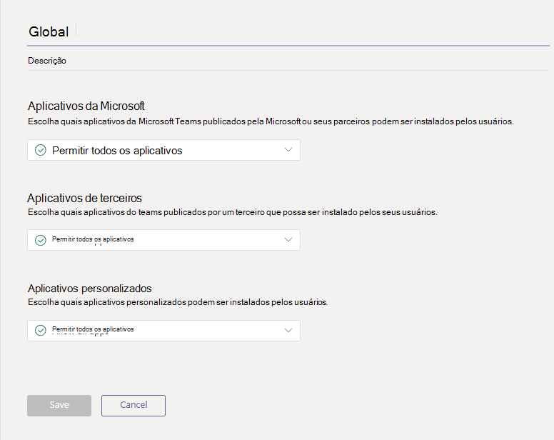
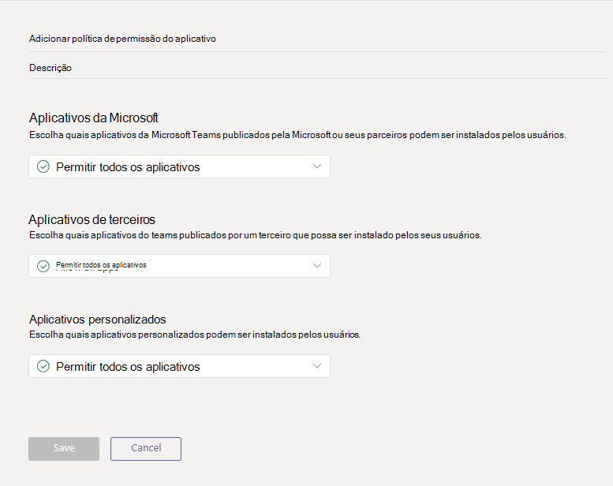
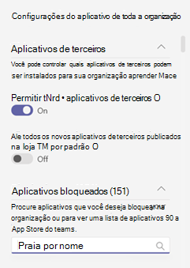

# Gerenciar políticas de permissão de aplicativos no Microsoft Teams

Como administrador, você pode usar políticas de permissão de aplicativo para controlar quais aplicativos estão disponíveis para usuários do Microsoft Teams em sua organização. Você pode permitir ou bloquear todos os aplicativos ou aplicativos específicos publicados pela Microsoft, terceiros e sua organização. Ao bloquear um aplicativo, os usuários que têm a política não conseguem instalá-lo da loja de aplicativos do Teams. Você deve ser um administrador global ou administrador de serviços do Teams para gerenciar essas políticas.

Você gerencia políticas de permissão de aplicativo no centro de administração do Microsoft Teams. Você pode usar a política global (padrão para toda a organização) ou criar e atribuir políticas personalizadas. Os usuários em sua organização obterão automaticamente a política global, a menos que você crie e atribua uma política personalizada. Depois de editar ou atribuir uma política, pode levar algumas horas para que as alterações entrem em vigor.

> [!NOTE]
> As configurações do aplicativo em toda a organização substituem a política global e quaisquer políticas personalizadas que você cria e atribui aos usuários.

Se sua organização já estiver no Teams, as configurações do aplicativo definidas em **Configurações para todo o locatário** no Centro de administração do Microsoft 365 são refletidas nas configurações do aplicativo para toda a organização na página [Gerenciar aplicativos](manage-apps.md). Se você é novo no Teams e está apenas começando, por padrão, todos os aplicativos são permitidos na política global. Isso inclui aplicativos publicados pela Microsoft, terceiros e sua organização.

Digamos, por exemplo, que você deseja bloquear todos os aplicativos de terceiros e permitir aplicativos específicos da Microsoft para a equipe de RH em sua organização. Primeiro, você deve ir para a página [Gerenciar aplicativos](manage-apps.md) e certificar-se de que os aplicativos que deseja permitir para a equipe de RH são permitidos no nível da organização. Em seguida, crie uma política personalizada chamada Política de Permissão de Aplicativos de RH, defina-a para bloquear e permitir os aplicativos que você deseja e atribua-a aos usuários da equipe de RH.

> [!NOTE]
> Se você implantou o Teams em um ambiente do Microsoft 365 Nuvem da Comunidade Governamental High (GCCH) e do DoD (Departamento de Defesa), consulte Gerenciar configurações de aplicativo em toda a organização do Microsoft 365 Government para saber mais sobre as configurações de aplicativo de terceiros que são [exclusivas](#manage-org-wide-app-settings-for-microsoft-365-government) do GCCH e do DoD.

## Criar uma política de permissão de aplicativo personalizada

Se você deseja controlar os aplicativos que estão disponíveis para diferentes grupos de usuários em sua organização, crie e atribua uma ou mais políticas de permissão de aplicativo personalizadas. Você pode criar e atribuir políticas personalizadas separadas com base no fato de os aplicativos serem publicados pela Microsoft, por terceiros ou pela sua organização. É importante saber que, depois de criar uma política personalizada, você não pode alterá-la se os aplicativos de terceiros estiverem desabilitados nas configurações de aplicativos de toda a organização.

1. Faça logon [no Teams de administração](https://admin.teams.microsoft.com/dashboard)
1. No painel esquerdo, acesse Teams **appsPermission** > .
1. Selecione **Adicionar**.
    
1. Insira um nome e uma descrição para a política.
1. Em **Aplicativos da Microsoft**, **Aplicativos de terceiros** e **Aplicativos personalizados**, selecione um dos seguintes:

    - **Permitir todos os aplicativos**
    - **Permita aplicativos específicos e bloqueie todos os outros**
    - **Bloquear aplicativos específicos e permita todos os outros**
    - **Bloquear todos os aplicativos**

1. Se você selecionou **Permitir aplicativos específicos e bloquear outros**, adicione os aplicativos que deseja permitir:

    1. Selecione **Permitir aplicativos**.
    1. Procure os aplicativos que deseja permitir e clique em **Adicionar**. Os resultados da pesquisa são filtrados para o editor do aplicativo (**aplicativos da Microsoft**, **aplicativos de terceiros** ou **aplicativos personalizados**).
    1. Depois de escolher a lista de aplicativos, clique em **Permitir**.

1. Da mesma forma, se você selecionou Bloquear aplicativos específicos e permitir todos os **outros,** pesquise e adicione os aplicativos que deseja bloquear e selecione **Bloquear**.
1. Selecione **Salvar**.

## Editar uma política de permissão de aplicativo

Você pode usar o Teams de administração para editar uma política, incluindo a política global e as políticas personalizadas que você cria.

1. No painel esquerdo do centro de administração Microsoft Teams, acesse **Teams** **appsPermission** > .
1. Escolha a política clicando à esquerda do nome da política e selecionando **Editar**.
1. A partir daqui, faça as alterações desejadas. Você pode gerenciar as configurações com base no editor do aplicativo e adicionar e remover aplicativos com base na configuração de permissão/bloqueio.
1. Selecione **Salvar**.

## Atribuir uma política de permissão de aplicativo personalizada aos usuários

[!INCLUDE [assign-policy](includes/assign-policy.md)]

## Gerenciar configurações de aplicativos em toda a organização para o Microsoft 365 Government  

Em uma implantação do Microsoft 365 Government – GCCH e DoD do Teams, é importante saber o seguinte sobre as configurações de aplicativo de terceiros, que são exclusivas do GCCH e do DoD.

Em GCC, GCCH e DoD, todos os aplicativos de terceiros são bloqueados por padrão. Além disso, no GCC, você verá a observação a seguir sobre como gerenciar aplicativos de terceiros na página de políticas de permissão do aplicativo no Microsoft Teams de administração.

:::image type="content" source="media/app-permission-policies-gcc-trimmed.png" alt-text="Captura de tela da política de permissão do aplicativo no GCCH e no DoD." lightbox="media/app-permission-policies-gcc.png":::

> [!NOTE]
> Em nuvens GCCH e DOD, os aplicativos de terceiros não estão disponíveis.

Use as configurações de aplicativos de toda a organização para controlar se os usuários podem instalar aplicativos de terceiros. As configurações de aplicativo em toda a organização controlam o comportamento de todos os usuários e substituem quaisquer outras políticas de permissão de aplicativo atribuídas aos usuários. Você pode usá-los para controlar aplicativos maliciosos ou problemáticos.

1. Na página **Políticas de permissão**, selecione **Configurações de aplicativos para toda a organização**. Você pode então definir as configurações desejadas no painel.

    

1. Em **Aplicativos de terceiros**, desabilite ou ative essas configurações para controlar o acesso a aplicativos de terceiros:

    - **Permitir aplicativos de terceiros**: controla se os usuários podem usar aplicativos de terceiros. Se você desabilitar esta configuração, seus usuários não poderão instalar ou usar aplicativos de terceiros. Em um Microsoft 365 Government – implantação de GCCH e DoD do Teams, essa configuração está desativada por padrão.
    - **Permitir novos aplicativos de terceiros publicados na loja por padrão**: isso controla se os novos aplicativos de terceiros publicados na loja de aplicativos Teams se tornam automaticamente disponíveis no Teams. Você só pode definir essa opção se permitir aplicativos de terceiros.

1. Em **Aplicativos bloqueados**, adicione os aplicativos que deseja bloquear em sua organização. Em um Microsoft 365 Government – implantação de GCCH e DoD do Teams, todos os aplicativos de terceiros são adicionados a essa lista por padrão. Para qualquer aplicativo de terceiros que você deseja permitir em sua organização, remova o aplicativo desta lista de aplicativos bloqueados. Quando você bloqueia um aplicativo em toda a organização, o aplicativo é automaticamente bloqueado para todos os seus usuários, independentemente de ser permitido em qualquer política de permissão de aplicativo
1. Selecione **Salvar** para que as configurações de aplicativo em toda a organização entre em vigor.

Conforme mencionado anteriormente, para permitir aplicativos de terceiros, você pode editar e usar a política global (padrão para toda a organização) ou criar e atribuir políticas personalizadas.

## Perguntas frequentes

### Trabalhar com políticas de permissão de aplicativos

#### Quais interações de aplicativos as políticas de permissão afetam?

As políticas de permissão regem o uso do aplicativo, controlando a instalação, descoberta e interação para usuários finais. Os administradores ainda podem gerenciar aplicativos no centro de administração do Microsoft Teams, independentemente das políticas de permissão atribuídas a eles.

#### Posso controlar aplicativos de linha de negócios (LOB)?

Sim, você pode usar políticas de permissão de aplicativo para controlar a implementação e distribuição de aplicativos personalizados (LOB). Você pode criar uma política personalizada ou editar a política global para permitir ou bloquear aplicativos personalizados com base nas necessidades de sua organização.

#### Como as políticas de permissão de aplicativo se relacionam a aplicativos fixados e políticas de configuração de aplicativo?

Você pode usar políticas de configuração de aplicativo junto com políticas de permissão de aplicativo. Os aplicativos pré-fixados são selecionados do conjunto de aplicativos habilitados para um usuário. Além disso, se um usuário tiver uma política de permissão de aplicativo que bloqueia um aplicativo em sua política de configuração de aplicativo, esse aplicativo não aparecerá no Teams.

#### Posso usar políticas de permissão de aplicativo para restringir o upload de aplicativos personalizados?

Você pode usar as configurações de toda a organização na página **Gerenciar aplicativos** ou políticas de configuração de aplicativos para restringir o upload de aplicativos personalizados para sua organização.  

Para impedir que usuários específicos carreguem aplicativos personalizados, use políticas de aplicativos personalizados. Para saber mais, confira [Gerenciar políticas e configurações de aplicativos personalizados no Teams](teams-custom-app-policies-and-settings.md).

#### O bloqueio de um aplicativo se aplica a clientes móveis do Teams?

Sim, quando você bloqueia um aplicativo, ele é bloqueado em todos os clientes do Teams.  

### Experiência de usuário

#### O que o usuário sente quando um aplicativo é bloqueado?

Os usuários não podem interagir com um aplicativo bloqueado ou seus recursos, como bots, guias e extensões de mensagens. Em um contexto compartilhado, como uma equipe ou chat em grupo, os bots ainda podem enviar mensagens a todos os participantes desse contexto. O Teams indica ao usuário quando um aplicativo é bloqueado.

Por exemplo, quando um aplicativo é bloqueado, os usuários não podem fazer o seguinte:

- Adicionar o aplicativo pessoalmente ou em um chat ou equipe
- Enviar mensagens para o bot do aplicativo
- Execute ações de botão que enviam informações de volta ao aplicativo, como mensagens acionáveis  
- Exibir a guia do aplicativo
- Configurar conectores para receber notificações
- Usar a extensão de mensagens do aplicativo

O portal legado permitia controlar aplicativos no nível da organização, o que significa que quando um aplicativo é bloqueado, ele é bloqueado para todos os usuários da organização. O bloqueio de um aplicativo na página [Gerenciar aplicativos](manage-apps.md) funciona exatamente da mesma maneira.

Para políticas de permissão de aplicativo atribuídas a usuários específicos, se um aplicativo com recurso de bot ou conector foi permitido e depois bloqueado, e se o aplicativo foi permitido apenas para alguns usuários em um contexto compartilhado, membros de um chat em grupo ou canal que não tem permissão para que o aplicativo possa ver o histórico de mensagens e as mensagens postadas pelo bot ou conector, mas não pode interagir com ele.

## Tópicos relacionados

[Configurações de administrador para aplicativos no Teams](admin-settings.md)

[Atribua políticas a seus usuários no Teams](policy-assignment-overview.md)
