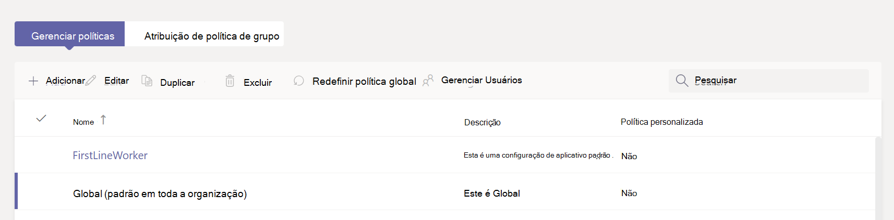

# Gerenciar políticas de configuração de aplicativo no Microsoft Teams

Como administrador, você usa políticas de configuração de aplicativo para instalar e fixar aplicativos e permite que os usuários carreguem aplicativos personalizados. A fixação ajuda a promover a adoção de aplicativos relevantes em sua organização.

* **Fixar aplicativos:** As políticas de configuração de aplicativo permitem que você escolha aplicativos para fixar, defina a ordem em que os aplicativos aparecem para seus usuários na barra de aplicativos do Teams ou na área de mensagem de composição. Os administradores também podem controlar se os usuários finais podem fixar seus próprios aplicativos ou não. Consulte [Fixar aplicativos](#pin-apps).
* **Instalar aplicativos:** As políticas de configuração de aplicativo permitem que você instale os aplicativos permitidos em nome dos usuários quando eles iniciam o Teams e durante as reuniões. Para obter mais informações, consulte [Instalar aplicativos](#install-apps).
* **Carregar aplicativos personalizados:** As políticas de configuração de aplicativo permitem que os usuários carreguem aplicativos personalizados no Teams. Para obter mais informações, consulte [Carregar aplicativos personalizados](#upload-custom-apps).

## Fixar aplicativos

Fixar aplicativos permite realçar os aplicativos que os usuários em sua organização mais precisam. A fixação funciona para aplicativos fornecidos pela Microsoft, por empresas ISV e por desenvolvedores em sua organização. Fixar um aplicativo por meio de uma política de configuração de aplicativo também o instala, se o aplicativo for permitido para o usuário. Usando uma política de configuração de aplicativo, você pode realizar as seguintes tarefas:

* Personalize o Microsoft Teams para os usuários finais para realçar os aplicativos mais importantes para eles. Você escolhe os aplicativos a serem fixados e a ordem em que os aplicativos são exibidos.
* Controle se os usuários podem fixar aplicativos ou não.

Os aplicativos são fixados na barra de aplicativos no lado esquerdo do cliente da área de trabalho do Teams e na parte inferior dos clientes móveis do Teams.

|Cliente de área de trabalho do Teams  |Cliente de dispositivo móvel do Teams |
|---------|---------|
|.  |         |

As extensões de mensagens estão disponíveis na parte inferior da área de mensagem de composição.

Para criar uma política de configuração de aplicativo para fixar aplicativos, siga estas etapas:

1. Entre no Centro [de administração do Microsoft Teams](https://admin.teams.microsoft.com).

1. No painel esquerdo, acesse políticas de Instalação de **aplicativos** > **do** Teams.

1. Selecione **Adicionar**.

1. Insira um nome e uma descrição para a política.

1. Ativar a **fixação do usuário**.

   > [!NOTE]
   > A  configuração de fixação do usuário está disponível no Centro de administração do Teams nos ambientes GCC (Nuvem da Comunidade Governamental) do Microsoft 365 (GCC, GCC High e DoD), mas atualmente não tem efeito.

1. Em **Aplicativos Fixados**, selecione **Adicionar aplicativos**.

1. No painel **Adicionar aplicativos** fixados, pesquise os aplicativos que você deseja adicionar e selecione **Adicionar**. Você também pode filtrar aplicativos por política de permissão de aplicativo.

1. Selecione **Adicionar**.

1. Na barra **de aplicativos** ou **extensões de** Mensagens, organize os aplicativos na ordem em que você deseja que eles apareçam no Teams.

   :::image type="content" source="media/pin-messaging-extensions.png" alt-text="a seção de aplicativos fixados"border="true":::

1. Selecione **Salvar**.

> [!NOTE]
> No Teams para Educação, o aplicativo Atribuições é fixado por padrão na política global, embora você não o veja listado na política global.

> [!NOTE]
> Para os trabalhadores da linha de frente em sua organização, recomendamos usar a experiência de aplicativo de linha de frente personalizada. Esse recurso fixa os aplicativos mais relevantes no Teams para usuários que têm uma [licença F](https://www.microsoft.com/en-us/microsoft-365/enterprise/frontline?rtc=1#office-SKUChooser-0dbn8nt). Para saber mais, confira [Personalizar aplicativos do Teams para seus funcionários da linha de frente](/microsoft-365/frontline/pin-teams-apps-based-on-license?bc=%2fmicrosoftteams%2fbreadcrumb%2ftoc.json&toc=%2fmicrosoftteams%2ftoc.json).

## Instalar aplicativos

Usando uma política de configuração de aplicativo, um administrador pode realizar as seguintes tarefas:

* Instale aplicativos para usuários finais em seu ambiente pessoal do Teams, por padrão.
* Instale aplicativos para usuários finais como [extensões de mensagens](/microsoftteams/platform/messaging-extensions/what-are-messaging-extensions).

Os usuários finais poderão instalar aplicativos por conta própria se a política [de permissão do](teams-app-permission-policies.md) aplicativo permitir.

Para criar uma política de configuração de aplicativo para instalar aplicativos, siga estas etapas:

1. Entre no centro de administração do Teams e acesse as políticas **de Instalação de aplicativos** > **do** Teams.

2. Selecione **Adicionar**.

3. Forneça um nome e uma descrição para a política.

4. Em **Aplicativos Instalados**, selecione **Adicionar aplicativos**.

5. No painel **Adicionar aplicativos instalados** , pesquise os aplicativos que você deseja instalar para os usuários. Você também pode filtrar aplicativos por política de permissão de aplicativo.

6. Selecione **Adicionar**.

> [!IMPORTANT]
> Os usuários não podem desinstalar aplicativos instalados por administradores.

>[!NOTE]
> Usando este procedimento, você não pode instalar aplicativos personalizados com guias configuráveis.

## Carregar aplicativos personalizados

Para criar uma política personalizada para permitir que os usuários carreguem aplicativos personalizados, siga estas etapas:

1. Entre no centro de administração do Teams e acesse as políticas **de Instalação de aplicativos** > **do** Teams.

2. Selecione **Adicionar**.

3. Forneça um nome e uma descrição para a política.

4. Ativar ou desativar o **carregamento de aplicativos personalizados**.

> [!NOTE]
> Para alterar essa configuração, as configurações de aplicativo em toda a organização do locatário devem permitir **aplicativos de terceiros**.

## Gerenciar políticas de configuração de aplicativo

Você gerencia políticas de configuração de aplicativo no centro de administração do Microsoft Teams. Use a política global (padrão de toda a organização) ou crie e atribua políticas personalizadas. Os usuários finais obtêm a política global. Se você criar uma política personalizada, ela substituirá a política global. O administrador global ou administrador de serviços do Teams pode gerenciar essas políticas.

Edite as configurações na política global para incluir os aplicativos desejados. Para personalizar o Teams para diferentes grupos de usuários em sua organização, crie e atribua uma ou mais políticas personalizadas.

### Editar uma política de configuração de aplicativo

Você pode usar o Centro de administração do Microsoft Teams para editar uma política, incluindo a política global (padrão em toda a organização) e as políticas personalizadas que você cria.

1. Na navegação esquerda do centro de administração do Microsoft Teams, acesse **Políticas de configuração** >  de **aplicativos do Teams**.

2. Escolha a política que você deseja editar e selecione **Editar**.

3. Faça as alterações desejadas.

4. Selecione **Salvar**.

### Atribuir uma política de configuração de aplicativo personalizada a usuários e grupos

Para obter mais informações sobre como atribuir políticas a usuários e grupos, consulte [Atribuir políticas a usuários e grupos](assign-policies-users-and-groups.md).

## Faqs

<!--- TBD: Incorporate these pointers in the content itself.
--->

### Trabalhando com políticas de configuração de aplicativo

#### Quais políticas internas de configuração de aplicativo estão incluídas no centro de administração do Microsoft Teams

* **Global (padrão em toda a organização)**: essa política padrão se aplica a todos os usuários em sua organização, a menos que você atribua outra política. Edite a política global para fixar aplicativos que são mais importantes para seus usuários.

* **FrontlineWorker**: essa política é para Trabalhadores de Linha de Frente. Você pode atribuí-lo aos Trabalhadores da Linha de Frente em sua organização. É importante saber que, assim como as políticas personalizadas que você cria, você precisa atribuir a política aos usuários para que as configurações sejam ativas. Para obter mais informações, acesse a seção Atribuir [uma política de configuração de aplicativo personalizado aos](#assign-a-custom-app-setup-policy-to-users-and-groups) usuários deste artigo.

#### Por que não consigo encontrar um aplicativo no painel Adicionar aplicativos fixados

Nem todos os aplicativos podem ser fixados no Teams por meio de uma política de configuração de aplicativo. Alguns aplicativos podem não dar suporte a essa funcionalidade. Para localizar aplicativos que podem ser fixados, pesquise o aplicativo no **painel Adicionar aplicativos fixados** . As guias que têm um escopo pessoal (guias estáticas) e bots podem ser fixadas ao cliente da área de trabalho do Teams e esses aplicativos estão disponíveis no painel Adicionar aplicativos **fixados** .

Tenha em mente que a loja de aplicativos do Teams lista todos os aplicativos do Teams. O **painel Adicionar aplicativos** fixados inclui apenas aplicativos que podem ser fixados no Teams por meio de uma política.

#### Eu sou um Teams para Educação administrador. O que preciso saber sobre as políticas de configuração de aplicativo no Teams para Educação

O aplicativo De chamada não está disponível no Teams para Educação. Quando você cria uma nova política de configuração de aplicativo personalizada, o aplicativo De chamada é exibido na lista de aplicativos. No entanto, o aplicativo não é fixado aos clientes do Teams e Teams para Educação os usuários não verão o aplicativo Chamadas no Teams.

#### Quantos aplicativos fixados podem ser adicionados a uma política

Um mínimo de dois aplicativos deve ser fixado nos clientes móveis do Teams (iOS e Android). Se uma política tiver menos de dois aplicativos, os clientes móveis não refletirão as configurações de política e, em vez disso, continuarão a usar a configuração existente.

Não há limite para o número de aplicativos fixados que você pode adicionar a uma política.

#### Quanto tempo leva para que as alterações de política entre em vigor

Depois de editar ou atribuir uma política, pode levar algumas horas para que as alterações entrem em vigor.

### Experiência de usuário

#### Como os usuários podem ver todos os seus aplicativos fixados no Teams

Para exibir todos os aplicativos fixados para um usuário, os usuários podem ter que fazer o seguinte, dependendo do número de aplicativos instalados e do tamanho da janela de cliente do Teams.

|Cliente de área de trabalho do Teams |Cliente de dispositivo móvel do Teams |
|---------|---------|
|Na barra de aplicativos do lado do Teams, selecione **... Mais aplicativos**.| Na barra de aplicativos próxima à parte inferior do Teams, deslize o dedo para cima.|
|   |  

#### O que preciso saber sobre a experiência móvel do Teams

Os clientes móveis do Teams (iOS e Android) dão suporte a aplicativos pessoais com guias estáticas. Os aplicativos fixados no cliente da área de trabalho do Teams aparecerão nos clientes móveis do Teams. Os bots pessoais aparecerão no Chat em clientes móveis.

Aplicativos de terceiros (que podem ser baixados da Loja do Teams) precisam ser aprovados antes de serem mostrados no celular. Se um administrador fixar um aplicativo, que não foi aprovado pela Microsoft para Dispositivos Móveis, ele aparecerá na Área de Trabalho do Teams, mas não aparecerá no celular. Para obter mais informações, consulte [Clientes móveis](/microsoftteams/platform/tabs/what-are-tabs#mobile-clients).

Com os clientes móveis do Teams, os usuários verão os principais aplicativos do Teams, como Atividade, Chat e Teams, e você poderá fixar alguns aplicativos internos da Microsoft, como Turnos.

#### Os usuários podem alterar a ordem dos aplicativos fixados por meio de uma política

Os usuários podem alterar a ordem de seus aplicativos fixados na área de trabalho do Teams e em clientes móveis se a **opção de fixação do** usuário estiver ativada. Os usuários não podem alterar a ordem de seus aplicativos fixados em clientes Web do Teams.

#### A fixação do usuário tem precedência

Administração pinos sempre têm precedência. Se a **opção de fixação do** usuário estiver ativada, os usuários manterão seus aplicativos fixados abaixo dos aplicativos fixados pelo administrador. Se a **opção de fixação** do usuário estiver desativada, os usuários perderão seus pinos pré-existentes e somente os aplicativos fixados pelo administrador estarão presentes na barra de aplicativos.

### Aplicativos personalizados do Teams

#### Minha organização criou um aplicativo personalizado do Teams e o publicou no AppSource ou no catálogo de aplicativos de locatários, mas o ícone do aplicativo não é exibido conforme o esperado quando o aplicativo é fixado na barra de aplicativos no Teams. Como fazer consertar?

Siga as diretrizes de logotipo antes de enviar o aplicativo. Para saber mais, confira Lista [de verificação do envio do Painel do Vendedor](/microsoftteams/platform/concepts/deploy-and-publish/appsource/prepare/overview).

## Confira também

* [Configurações de administrador para aplicativos no Teams](admin-settings.md)
* [Atribuir políticas a usuários finais no Teams](assign-policies-users-and-groups.md)
