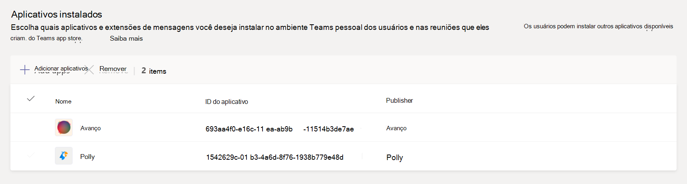

# Gerenciar políticas de configuração de aplicativo no Microsoft Teams

Como administrador, você pode usar políticas de configuração de aplicativos para instalar e fixar aplicativos para promover os aplicativos mais usados em sua organização e decidir se deseja que os usuários carreguem aplicativos personalizados para Teams.

- **Aplicativos de pino:** as políticas de configuração de aplicativo permitem que você escolha aplicativos para fixar, definir a ordem em que eles aparecem para seus usuários e controlar se os usuários podem ou não fixar seus próprios aplicativos na barra Teams aplicativos. Para obter mais informações, consulte [Pin apps](#pin-apps).
- **Instalar aplicativos: as** políticas de configuração de aplicativo permitem instalar aplicativos em nome dos usuários quando eles começam Teams e durante as reuniões. Para obter mais informações, consulte [Install apps](#install-apps).
- **Upload aplicativos personalizados: as políticas** de configuração de aplicativo permitem que os usuários carreguem aplicativos personalizados para Teams. Para obter mais informações, [consulte Upload aplicativos personalizados.](#upload-custom-apps)

## Pin apps

Fixar aplicativos permite que você mostre aplicativos que os usuários em sua organização precisam, incluindo aplicativos construídos por terceiros ou por desenvolvedores em sua organização.

Usando uma política de configuração de aplicativo, você pode realizar as seguintes tarefas:

- Personalize o Teams para destacar os aplicativos mais importantes para os usuários. Escolha os aplicativos para fixar e definir a ordem que eles aparecem.
- Controle se os usuários podem fixar aplicativos no Teams.

Os aplicativos são fixados na barra de aplicativos, que é a barra no lado do cliente da área de trabalho Teams e na parte inferior dos clientes móveis do Teams (iOS e Android).

|Cliente de área de trabalho do Teams  |Cliente de dispositivo móvel do Teams |
|---------|---------|
|   |         |

> [!NOTE]
> Se você Teams para Educação, é importante saber que o aplicativo Assignments está fixado por padrão na política global, mesmo que no momento, você não o veja listado na política global. Ele será o quarto aplicativo na lista de aplicativos fixados Teams clientes.

Para criar uma política de configuração de aplicativo para fixar aplicativos, faça as seguintes etapas:

1. Na navegação à esquerda do centro de administração Microsoft Teams, vá **para** Teams políticas  >  **de Instalação de aplicativos.**

2. Selecione **Adicionar**.

3. Insira um nome e uma descrição para a política.

4. Ativar ou desativar **Permitir** fixação do usuário, dependendo se você deseja permitir que os usuários personalizem sua barra de aplicativos fixando aplicativos a ela.

   > [!NOTE]
   > A **configuração** Permitir fixação do usuário está disponível no centro de administração do Teams em ambientes Microsoft 365 Nuvem da Comunidade Governamental (GCC) (GCC, GCC Alto e DoD), mas atualmente não tem efeito.

5. Em **Aplicativos Fixados,** selecione **Adicionar aplicativos**.

6. No painel **Adicionar aplicativos fixados,** pesquise os aplicativos que você deseja adicionar e selecione **Adicionar**. Você também pode filtrar aplicativos por política de permissão do aplicativo.

7. Selecione **Adicionar**.

8. Organize os aplicativos na ordem em que você deseja que eles apareçam Teams.

   

9. Selecione **Salvar**.

## Instalar aplicativos

Você pode escolher quais aplicativos são instalados por padrão para usuários em seu ambiente pessoal Teams, instalar aplicativos como extensões de mensagens e designar aplicativos a serem [instalados](/microsoftteams/platform/messaging-extensions/what-are-messaging-extensions)em reuniões.

Usando uma política de configuração de aplicativo, você pode realizar as seguintes tarefas:

- Instalar aplicativos para usuários em seu ambiente Teams pessoal
- Instalar aplicativos para usuários como extensões de mensagens
- Instalar aplicativos em reuniões para organizadores de reuniões

> [!NOTE]
> Os usuários ainda poderão  instalar aplicativos por conta própria se a política de permissão do aplicativo atribuída a eles permitir isso.

Para criar uma política de instalação de aplicativos para instalar aplicativos, faça as seguintes etapas:

1. Na navegação à esquerda do centro de administração Microsoft Teams, vá **para** Teams políticas  >  **de Instalação de aplicativos.**

2. Selecione **Adicionar**.

3. Insira um nome e uma descrição para a política.

4. Em **Aplicativos Instalados,** selecione **Adicionar aplicativos**.

5. No painel **Adicionar aplicativos instalados,** pesquise os aplicativos que você deseja instalar automaticamente para os usuários. Você também pode filtrar aplicativos por política de permissão do aplicativo.

6. Selecione **Adicionar**.

> [!IMPORTANT]
> Os usuários não podem desinstalar aplicativos instalados pelos administradores.

## Upload aplicativos personalizados

Você pode usar o Microsoft Teams de administração para criar uma política personalizada que permita que os usuários carreguem aplicativos personalizados para Teams.

Para criar uma política de configuração de aplicativo para permitir que os usuários carreguem aplicativos personalizados para Teams, faça as seguintes etapas:

1. Na navegação à esquerda do centro de administração Microsoft Teams, vá **para** Teams políticas  >  **de Instalação de aplicativos.**

2. Selecione **Adicionar**.

3. Insira um nome e uma descrição para a política.

4. Ativar ou desativar Upload **aplicativos** personalizados, dependendo se você deseja permitir que os usuários carreguem aplicativos personalizados para Teams.

> [!NOTE]
> Você não poderá alterar essa configuração se **Permitir** que aplicativos de terceiros estão desligados em [configurações de aplicativos](manage-apps.md#manage-org-wide-app-settings)em toda a organização.

## Gerenciar políticas de configuração de aplicativos

Você gerencia políticas de configuração de aplicativos no Microsoft Teams de administração. Use a política global (padrão em toda a organização) ou crie e atribua políticas personalizadas.  Os usuários da sua organização terão automaticamente a política global, a menos que você crie e atribua uma política personalizada. Você deve ser um administrador global ou administrador de serviços do Teams para gerenciar essas políticas.

Edite as configurações na política global para incluir os aplicativos que deseja. Para personalizar Teams diferentes grupos de usuários em sua organização, crie e atribua uma ou mais políticas personalizadas.

### Editar uma política de configuração de aplicativo

Você pode usar o Microsoft Teams de administração para editar uma política, incluindo a política global (padrão em toda a organização) e as políticas personalizadas que você criar.

1. Na navegação à esquerda do centro de administração Microsoft Teams, vá **para** Teams políticas  >  **de Instalação de aplicativos.**

2. Escolha a política que você deseja editar e selecione **Editar**.

3. Faça as alterações que você deseja.

4. Selecione **Salvar**.

### Atribuir uma política de configuração de aplicativo personalizada aos usuários

Para obter mais informações sobre como atribuir políticas aos usuários, consulte [Atribuir políticas a usuários e grupos.](assign-policies-users-and-groups.md)

## Perguntas frequentes

### Trabalhar com políticas de configuração de aplicativos

#### Posso atribuir uma política de configuração de aplicativo a um grupo

As políticas de configuração de aplicativos podem ser atribuídas a grupos usando o PowerShell. Para obter mais informações sobre como atribuir políticas a grupos usando o PowerShell, consulte [Assign policies to users and groups](assign-policies-users-and-groups.md#use-the-powershell-option).

#### Quais políticas internas de configuração de aplicativos estão incluídas no centro de Microsoft Teams de administração

- **Global (padrão em toda a organização)**: Essa política padrão se aplica a todos os usuários em sua organização, a menos que você atribua outra política. Edite a política global para fixar aplicativos que são mais importantes para seus usuários.

- **FrontlineWorker**: Esta política é para Trabalhadores de Linha de Frente. Você pode atribuí-lo aos Trabalhadores de Linha de Frente em sua organização. É importante saber que, como políticas personalizadas que você cria, você precisa atribuir a política aos usuários para que as configurações sejam ativas. Para obter mais informações, acesse a seção Atribuir uma política de configuração [de aplicativo personalizada aos](#assign-a-custom-app-setup-policy-to-users) usuários deste artigo.

#### Por que não consigo encontrar um aplicativo no painel Adicionar aplicativos fixados

Nem todos os aplicativos podem ser fixados Teams por meio de uma política de configuração de aplicativo. Alguns aplicativos podem não dar suporte a essa funcionalidade. Para encontrar aplicativos que podem ser fixados, pesquise o aplicativo no painel **Adicionar aplicativos** fixados. Guias com escopo pessoal (guias estáticas) e bots podem ser fixados no cliente da área de trabalho Teams e esses aplicativos estão disponíveis no painel **Adicionar** aplicativos fixados.

Lembre-se de que o Teams de aplicativos lista todos os Teams aplicativos. O **painel Adicionar aplicativos** fixados inclui apenas aplicativos que podem ser fixados Teams por meio de uma política.

#### Sou um administrador Teams para Educação. O que preciso saber sobre políticas de configuração de aplicativos Teams para Educação

O aplicativo Calling não está disponível no Teams para Educação. Quando você cria uma nova política de configuração de aplicativo personalizada, o aplicativo De chamada é exibido na lista de aplicativos. No entanto, o aplicativo não é fixado Teams clientes e os usuários Teams para Educação não verão o aplicativo Chamadas no Teams.

#### Quantos aplicativos fixados podem ser adicionados a uma política

Um mínimo de dois aplicativos deve ser fixado nos clientes Teams móveis (iOS e Android). Se uma política tiver menos de dois aplicativos, os clientes móveis não refletirão as configurações de política e, em vez disso, continuarão a usar a configuração existente.

Não há limite para o número de aplicativos fixados que você pode adicionar a uma política.

#### Quanto tempo leva para que as alterações de política entre em vigor

Depois de editar ou atribuir uma política, pode levar algumas horas para que as alterações entrem em vigor.

### Experiência de usuário

#### Como os usuários podem ver todos os aplicativos fixados no Teams

Para exibir todos os aplicativos fixados para um usuário, os usuários podem ter que fazer o seguinte, dependendo do número de aplicativos instalados e do tamanho da janela do cliente Teams.

|Cliente de área de trabalho do Teams |Cliente de dispositivo móvel do Teams |
|---------|---------|
|Na barra de aplicativos ao lado do Teams, selecione **... Mais aplicativos**.| Na barra de aplicativos próxima à parte inferior Teams, passe o dedo para cima.|
|    |  

#### O que preciso saber sobre a experiência Teams celular

Os Teams móveis (iOS e Android) suportam aplicativos pessoais com guias estáticas. Os aplicativos fixados no Teams da área de trabalho serão exibidos no Teams móveis. Bots pessoais aparecerão em Chat em clientes móveis.

Aplicativos de terceiros (que podem ser baixados da Teams Store) precisam ser aprovados antes de aparecerem no celular. Se um administrador fixar um aplicativo, que não é aprovado pela Microsoft para Dispositivos Móveis, ele será aparecer na área de trabalho Teams, mas não aparecer no celular. Consulte [Clientes móveis para](/microsoftteams/platform/tabs/what-are-tabs#mobile-clients) obter mais informações.

Com os Teams móveis, os usuários verão os principais Teams aplicativos, como Atividade, Chat e Teams, e você poderá fixar alguns aplicativos de primeira parte da Microsoft, como Shifts.

#### Os usuários podem alterar a ordem dos aplicativos fixados por meio de uma política

Os usuários podem alterar a ordem de seus aplicativos fixados Teams clientes móveis e desktop se a opção Permitir que o **pinning** do usuário seja ligado. Os usuários não podem alterar a ordem de seus aplicativos fixados em Teams web.

#### O pinamento do usuário tem precedência

Os pinos de administrador sempre têm precedência. Se a **opção Permitir que o pinamento do** usuário estiver ligado, os usuários manterão seus aplicativos fixados abaixo dos aplicativos fixados pelo administrador. Se a **opção Permitir fixação** do usuário estiver desabilitada, os usuários perderão seus pinos pré-existentes e somente aplicativos fixados por administrador estarão presentes na barra de aplicativos.

### Aplicativos Teams personalizados

#### Minha organização criou um aplicativo Teams personalizado e o publicou, no AppSource ou no catálogo de aplicativos de locatários, mas o ícone do aplicativo não é exibido como esperado quando o aplicativo é fixado na barra de aplicativos em Teams. Como posso corrigi-lo

Certifique-se de seguir as diretrizes de logotipo antes de enviar o aplicativo. Para saber mais, consulte [Checklist for Seller Dashboard submission](/microsoftteams/platform/concepts/deploy-and-publish/appsource/prepare/overview).

## Tópicos relacionados

[Configurações de administrador para aplicativos no Teams](admin-settings.md)

[Atribua políticas a seus usuários no Teams](assign-policies-users-and-groups.md)
