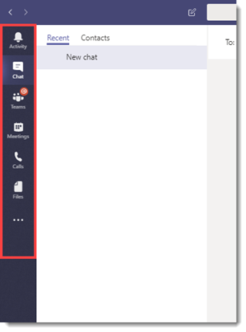

# Gerenciar políticas de configuração de aplicativo no Microsoft Teams

Como administrador, você pode usar políticas de configuração de aplicativo para instalar e fixar aplicativos para promover os aplicativos mais usados em sua organização e decidir se deseja que os usuários carreguem aplicativos personalizados no Teams.

- **Fixar aplicativos:** As políticas de configuração de aplicativo permitem que você escolha aplicativos para fixar, defina a ordem em que eles aparecem para seus usuários na barra de aplicativos do Teams ou na área de mensagem de composição e controle se os usuários podem ou não fixar seus próprios aplicativos. Para obter mais informações, consulte [Fixar aplicativos](#pin-apps).
- **Instalar aplicativos:** As políticas de configuração de aplicativo permitem que você instale aplicativos em nome dos usuários quando eles começam Teams e durante as reuniões. Para obter mais informações, consulte [Instalar aplicativos](#install-apps).
- **Upload aplicativos personalizados: as** políticas de configuração de aplicativo permitem que os usuários carreguem aplicativos personalizados para Teams. Para obter mais informações, [consulte Upload aplicativos personalizados](#upload-custom-apps).

## Fixar aplicativos

> [!NOTE]
> Para os trabalhadores da linha de frente em sua organização, recomendamos usar a experiência de aplicativo de linha de frente personalizada. Esse recurso fixa os aplicativos mais relevantes no Teams para usuários que têm uma [licença F](https://www.microsoft.com/en-us/microsoft-365/enterprise/frontline?rtc=1#office-SKUChooser-0dbn8nt). Para saber mais, confira [Personalizar Teams aplicativos para seus trabalhadores de linha de frente](pin-teams-apps-based-on-license.md).

Fixar aplicativos permite demonstrar os aplicativos de que os usuários em sua organização precisam, incluindo aplicativos criados por terceiros ou por desenvolvedores em sua organização.

Usando uma política de configuração de aplicativo, você pode realizar as seguintes tarefas:

- Personalize o Teams para destacar os aplicativos mais importantes para os usuários. Escolha os aplicativos a serem fixados e defina a ordem em que eles aparecem.
- Controle se os usuários podem fixar aplicativos no Teams.

Os aplicativos são fixados na barra de aplicativos, que é a barra no lado esquerdo do cliente da área de trabalho do Teams e na parte inferior dos clientes móveis do Teams (iOS e Android).

|Cliente de área de trabalho do Teams  |Cliente de dispositivo móvel do Teams |
|---------|---------|
|.  |         |

As extensões de mensagens estão disponíveis na parte inferior da área de mensagem de composição.

> [!NOTE]
> Se você tiver Teams para Educação, é importante saber que o aplicativo Assignments está fixado por padrão na política global, embora, no momento, você não o veja listado na política global.

Para criar uma política de configuração de aplicativo para fixar aplicativos, execute as seguintes etapas:

1. Faça logon [no Microsoft Teams de administração](https://admin.teams.microsoft.com).

1. No painel esquerdo, acesse Teams **appsSetup** > .

1. Selecione **Adicionar**.

1. Insira um nome e uma descrição para a política.

1. Ativar a **fixação do usuário**.

   > [!NOTE]
   > A  configuração de fixação do usuário está disponível no centro de administração do Teams em ambientes do Microsoft 365 Nuvem da Comunidade Governamental (GCC) (GCC, GCC Alta e DoD), mas atualmente não tem efeito.

1. Em **Aplicativos Fixados**, selecione **Adicionar aplicativos**.

1. No painel **Adicionar aplicativos** fixados, pesquise os aplicativos que você deseja adicionar e selecione **Adicionar**. Você também pode filtrar aplicativos por política de permissão de aplicativo.

1. Selecione **Adicionar**.

1. Na barra **de aplicativos** **ou extensões** de Mensagens, organize os aplicativos na ordem em que você deseja que eles apareçam Teams.

   

1. Selecione **Salvar**.

## Instalar aplicativos

Você pode escolher quais [aplicativos são instalados](/microsoftteams/platform/messaging-extensions/what-are-messaging-extensions) por padrão para usuários em seu ambiente de Teams pessoal, instalar aplicativos como extensões de mensagens e designar aplicativos a serem instalados em reuniões.

Usando uma política de configuração de aplicativo, você pode realizar as seguintes tarefas:

- Instalar aplicativos para usuários em seu ambiente Teams pessoal
- Instalar aplicativos para usuários como extensões de mensagens
- Instalar aplicativos em reuniões para organizadores de reuniões

> [!NOTE]
> Os usuários ainda poderão instalar aplicativos por  conta própria se a política de permissão do aplicativo atribuída a eles permitir.

Para criar uma política de configuração de aplicativo para instalar aplicativos, execute as seguintes etapas:

1. No painel de navegação à esquerda do Microsoft Teams de administração, acesse **Teams** **appsSetup** > .

2. Selecione **Adicionar**.

3. Insira um nome e uma descrição para a política.

4. Em **Aplicativos Instalados**, selecione **Adicionar aplicativos**.

5. No painel **Adicionar aplicativos instalados** , pesquise os aplicativos que você deseja instalar automaticamente para os usuários. Você também pode filtrar aplicativos por política de permissão de aplicativo.

6. Selecione **Adicionar**.

> [!IMPORTANT]
> Os usuários não podem desinstalar aplicativos instalados por administradores.

## Upload aplicativos personalizados

Você pode usar o Microsoft Teams de administração para criar uma política personalizada que permite que os usuários carreguem aplicativos personalizados para Teams.

Para criar uma política de configuração de aplicativo para permitir que os usuários carreguem aplicativos personalizados para Teams, execute as seguintes etapas:

1. No painel de navegação à esquerda do Microsoft Teams de administração, acesse **Teams** **appsSetup** > .

2. Selecione **Adicionar**.

3. Insira um nome e uma descrição para a política.

4. Ative ou **desative Upload aplicativos** personalizados, dependendo se você deseja permitir que os usuários carreguem aplicativos personalizados para Teams.

> [!NOTE]
> Você não poderá alterar essa configuração se **aplicativos** de terceiros estão desativados nas [configurações de aplicativo em toda a organização](manage-apps.md#manage-org-wide-app-settings).

## Gerenciar políticas de configuração de aplicativo

Você gerencia políticas de configuração de aplicativo no Microsoft Teams de administração. Use a política global (padrão de toda a organização) ou crie e atribua políticas personalizadas.  Os usuários da sua organização terão automaticamente a política global, a menos que você crie e atribua uma política personalizada. Você deve ser um administrador global ou administrador de serviços do Teams para gerenciar essas políticas.

Edite as configurações na política global para incluir os aplicativos desejados. Para personalizar Teams para diferentes grupos de usuários em sua organização, crie e atribua uma ou mais políticas personalizadas.

### Editar uma política de configuração de aplicativo

Você pode usar o Microsoft Teams de administração para editar uma política, incluindo a política global (padrão em toda a organização) e as políticas personalizadas que você cria.

1. No painel de navegação à esquerda do Microsoft Teams de administração, acesse **Teams** **appsSetup** > .

2. Escolha a política que você deseja editar e selecione **Editar**.

3. Faça as alterações desejadas.

4. Selecione **Salvar**.

### Atribuir uma política de configuração de aplicativo personalizada a usuários e grupos

Para obter mais informações sobre como atribuir políticas a usuários e grupos, consulte [Atribuir políticas a usuários e grupos](assign-policies-users-and-groups.md).

## Perguntas frequentes

### Trabalhando com políticas de configuração de aplicativo

#### Quais políticas internas de configuração de aplicativo estão incluídas no Microsoft Teams de administração

- **Global (padrão em toda a organização)**: essa política padrão se aplica a todos os usuários em sua organização, a menos que você atribua outra política. Edite a política global para fixar aplicativos que são mais importantes para seus usuários.

- **FrontlineWorker**: essa política é para Trabalhadores de Linha de Frente. Você pode atribuí-lo aos Trabalhadores da Linha de Frente em sua organização. É importante saber que, assim como as políticas personalizadas que você cria, você precisa atribuir a política aos usuários para que as configurações sejam ativas. Para obter mais informações, acesse a seção Atribuir [uma política de configuração de aplicativo personalizado aos](#assign-a-custom-app-setup-policy-to-users-and-groups) usuários deste artigo.

#### Por que não consigo encontrar um aplicativo no painel Adicionar aplicativos fixados

Nem todos os aplicativos podem ser fixados Teams por meio de uma política de configuração de aplicativo. Alguns aplicativos podem não dar suporte a essa funcionalidade. Para localizar aplicativos que podem ser fixados, pesquise o aplicativo no **painel Adicionar aplicativos fixados** . Guias que têm um escopo pessoal (guias estáticas) e bots podem ser fixados no cliente da área de trabalho do Teams e esses aplicativos estão disponíveis no  painel Adicionar aplicativos fixados.

Lembre-se de que a Teams app store lista todos os Teams aplicativos. O **painel Adicionar aplicativos** fixados inclui apenas aplicativos que podem ser fixados Teams por meio de uma política.

#### Eu sou um Teams para Educação administrador. O que preciso saber sobre as políticas de configuração de aplicativo no Teams para Educação

O aplicativo De chamada não está disponível no Teams para Educação. Quando você cria uma nova política de configuração de aplicativo personalizada, o aplicativo De chamada é exibido na lista de aplicativos. No entanto, o aplicativo não é fixado Teams clientes e Teams para Educação usuários não verão o aplicativo Chamadas no Teams.

#### Quantos aplicativos fixados podem ser adicionados a uma política

Um mínimo de dois aplicativos deve ser fixado nos clientes Teams móveis (iOS e Android). Se uma política tiver menos de dois aplicativos, os clientes móveis não refletirão as configurações de política e, em vez disso, continuarão a usar a configuração existente.

Não há limite para o número de aplicativos fixados que você pode adicionar a uma política.

#### Quanto tempo leva para que as alterações de política entre em vigor

Depois de editar ou atribuir uma política, pode levar algumas horas para que as alterações entrem em vigor.

### Experiência de usuário

#### Como os usuários podem ver todos os seus aplicativos fixados no Teams

Para exibir todos os aplicativos fixados para um usuário, os usuários podem ter que fazer o seguinte, dependendo do número de aplicativos instalados e do tamanho da janela do Teams cliente.

|Cliente de área de trabalho do Teams |Cliente de dispositivo móvel do Teams |
|---------|---------|
|Na barra de aplicativos no lado Teams, selecione **... Mais aplicativos**.| Na barra de aplicativos próxima à parte inferior Teams, deslize o dedo para cima.|
|   |  

#### O que preciso saber sobre a experiência Teams dispositivo móvel

Os Teams móveis (iOS e Android) dão suporte a aplicativos pessoais com guias estáticas. Os aplicativos fixados Teams cliente da área de trabalho serão exibidos Teams clientes móveis. Os bots pessoais aparecerão no Chat em clientes móveis.

Aplicativos de terceiros (que podem ser baixados da Teams Store) precisam ser aprovados antes de serem mostrados no celular. Se um administrador fixar um aplicativo, que não foi aprovado pela Microsoft para Dispositivos Móveis, ele aparecerá na área de trabalho do Teams, mas não aparecerá no celular. Consulte [Clientes móveis para](/microsoftteams/platform/tabs/what-are-tabs#mobile-clients) obter mais informações.

Com os Teams móveis do Teams, os usuários verão os principais aplicativos do Teams, como Atividade, Chat e Teams, e você poderá fixar alguns aplicativos internos da Microsoft, como Shifts.

#### Os usuários podem alterar a ordem dos aplicativos fixados por meio de uma política

Os usuários podem alterar a ordem de seus aplicativos fixados Teams desktop e clientes móveis se a **opção de fixação** do usuário estiver ativada. Os usuários não podem alterar a ordem de seus aplicativos fixados Teams clientes Web.

#### A fixação do usuário tem precedência

Os pinos de administrador sempre têm precedência. Se a **opção de fixação do** usuário estiver ativada, os usuários manterão seus aplicativos fixados abaixo dos aplicativos fixados pelo administrador. Se a **opção de fixação** do usuário estiver desativada, os usuários perderão seus pinos pré-existentes e somente os aplicativos fixados pelo administrador estarão presentes na barra de aplicativos.

### Aplicativos Teams personalizados

#### Minha organização criou um aplicativo Teams personalizado e o publicou no AppSource ou no catálogo de aplicativos de locatários, mas o ícone do aplicativo não é exibido conforme o esperado quando o aplicativo é fixado na barra de aplicativos no Teams. Como fazer consertar?

Siga as diretrizes de logotipo antes de enviar o aplicativo. Para saber mais, confira Lista [de verificação do envio do Painel do Vendedor](/microsoftteams/platform/concepts/deploy-and-publish/appsource/prepare/overview).

## Artigos relacionados

[Configurações de administrador para aplicativos no Teams](admin-settings.md)

[Atribua políticas a seus usuários no Teams](assign-policies-users-and-groups.md)
