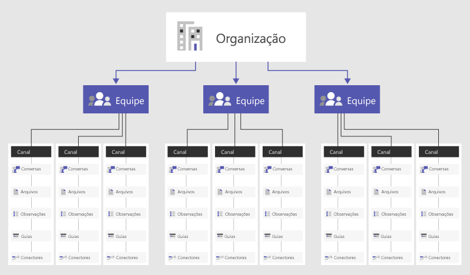

# Visão geral de equipes e canais no Microsoft Teams

Vamos começar pensando em como o Microsoft Teams permite que equipes individuais se auto-organizem e colaborem em vários cenários de negócios:

- As **equipes** são uma coleção de pessoas, conteúdo e ferramentas que envolvem diferentes projetos e resultados dentro de uma organização.

    - As equipes podem ser criadas para serem particulares e apenas para usuários convidados.
    - As equipes também podem ser criadas para serem públicas e abertas, permitindo que qualquer pessoa dentro da organização participe (até 10.000 membros).
    
    As equipes são projetadas para reunir um grupo de pessoas que trabalham unidas para realizar tarefas. O Teams pode ser dinâmico para o trabalho baseado em projetos (por exemplo, lançamento de um produto, criação de uma sala de envio digital), bem como contínuas, para refletir a estrutura interna da sua organização (por exemplo, departamentos e escritórios). Conversas, arquivos e notas nos canais de equipe são visíveis apenas para os membros da equipe.

- **Canais** são seções exclusivas dentro de uma equipe para manter as conversas organizadas por tópicos, projetos e disciplinas específicas — o que funcionar melhor para a sua equipe! Os arquivos que você compartilha em um canal (na guia Arquivos) são armazenados no SharePoint. Para saber mais, leia [Como o SharePoint Online e o OneDrive for Business interagem com o Teams](SharePoint-OneDrive-interact.md).

    - Os canais são locais onde as conversas acontecem e onde o trabalho realmente é feito. Os canais podem ser abertos para todos os membros da equipe ou privados, caso preciso de um público-alvo. Os canais padrão são para conversas em que todos de uma equipe podem participar, e os [canais privados](private-channels.md) limitam a comunicação a um subconjunto de pessoas de uma equipe.
    - Os canais são mais valiosos quando estendidos com aplicativos que incluem guias, conectores e bots que aumentam seu valor para os membros da equipe. Para saber mais, consulte [Aplicativos, bots e conectores no Teams](deploy-apps-microsoft-teams-landing-page.md).
    
Para obter ajuda sobre como usar equipes e canais, confira [Equipes e canais](https://support.office.com/article/teams-and-channels-df38ae23-8f85-46d3-b071-cb11b9de5499).

Assista a este breve vídeo para saber mais sobre as práticas recomendadas para a criação de equipes e canais:

- [TechTip: Orientação para a criação de Equipes e Canais, incluindo Canais Privados no Microsoft Teams](https://youtu.be/WkAVgNKn0hs) (21:08 min)

## Associação, funções e configurações

**Associação da equipe**

Quando o Teams é ativado para toda a organização, os proprietários de equipe podem convidar qualquer pessoa da organização com quem trabalhem para ingressar na equipe. O Teams torna mais fácil para os proprietários da equipe adicionar pessoas na organização com base em seus nomes. Dependendo das configurações da sua organização, pessoas de fora da sua organização podem ser adicionadas a suas equipes como convidados. Veja [Acesso de Convidado no Microsoft Teams](guest-access.md) para obter mais detalhes. 

Os proprietários da equipe também podem criar uma equipe baseado em um grupo existente do Microsoft 365. Todas as alterações feitas na associação a um grupo serão sincronizadas com o Teams automaticamente.

**Funções da equipe**

Existem duas funções principais no Teams: 

- **Proprietário da equipe** - a pessoa que cria a equipe. Os proprietários de equipe podem tornar qualquer membro da sua equipe um coproprietário quando é feito o convite para a equipe ou a qualquer momento após ele ter entrado na equipe. Ter vários proprietários de equipes permite compartilhar as responsabilidades de gerenciamento configurações e associação de membros, incluindo convites.
- **Membros da equipe** - as pessoas que os proprietários convidam para ingressar na equipe.

Além disso, se a moderação estiver configurada, os proprietários e membros da equipe poderão ter recursos de moderador para um canal. Os moderadores podem iniciar novas postagens no canal e controlar se os membros da equipe podem responder às mensagens existentes do canal. Os proprietários da equipe podem atribuir moderadores em um canal. (Os proprietários da equipe têm recursos de moderador por padrão.) Os moderadores em um canal podem adicionar ou remover outros moderadores nesse canal. Para mais informações, consulte [Configurar e gerenciar a moderação de canal no Microsoft Teams](manage-channel-moderation-in-teams.md).

> [!NOTE]
> Quando você adiciona um proprietário de equipe, eles também são adicionados como um membro, exceto quando a equipe é criada no Centro de administração do Teams ou quando uma equipe é adicionada a um grupo novo ou existente do Microsoft 365.

**Configurações da equipe** 

Os proprietários das equipes podem gerenciar as configurações de toda a equipe diretamente no Teams. As configurações incluem a capacidade de adicionar uma imagem da equipe, definir permissões entre os membros da equipe para criar canais padrão e [privados](private-channels.md), adicionar guias e conectores, @menção de toda a equipe ou canal, e o uso de GIFs, adesivos e memes.

Se você for um administrador do Teams no Microsoft 365, terá acesso às configurações de todo o sistema no Centro de administração do Teams. Essas configurações podem impactar as opções e padrões que os proprietários de equipe veem nas configurações de equipe. Por exemplo, você pode ativar um canal padrão, "Geral", para anúncios, discussões e recursos em toda a equipe, que será exibido em todas as equipes.

Por padrão, todos os usuários têm permissões para criar uma equipe. Para modificar isto, veja [Atribuir funções e permissões no Teams](assign-roles-permissions.md).

Uma atividade importante de planejamento inicial para envolver os usuários com o Teams é ajudar as pessoas a pensarem e compreenderem como o Teams pode aprimorar a colaboração no seu dia a dia. Converse com as pessoas e ajude-as a selecionar cenários de negócios em que elas estejam colaborando atualmente de maneira fragmentada. Reúna-os em um canal com as guias relevantes que os ajudarão a realizar seu trabalho. Um dos casos de uso mais eficientes do Microsoft Teams é em qualquer processo multiorganizacional.

> [!NOTE]
> Quando você cria uma nova equipe ou canal privado no Microsoft Teams, um site de equipe no SharePoint é criado automaticamente. Para editar a descrição ou classificação do site para este site de equipe, acesse as configurações do canal correspondente no [Microsoft Teams](https://support.microsoft.com/office/change-a-team-s-data-security-classification-in-teams-bf39798f-90d2-44fb-a750-55fa05a56f1d).
>
> Saiba mais sobre como gerenciar [Sites de equipes conectadas do Microsoft Teams](/SharePoint/teams-connected-sites).

## Exemplo do Teams

Abaixo estão alguns exemplos funcionais de como os diferentes tipos de usuários podem abordar a criação de equipes, canais e aplicativos (guias/conectores/bots). Isso pode ser útil para ajudar a iniciar uma conversa sobre o Teams com sua comunidade de usuários. Ao pensar sobre como implementar o Teams em sua organização, lembre-se de que você pode fornecer orientações sobre como estruturar suas equipes; entretanto, os usuários têm o controle de como eles podem se organizar. São apenas exemplos para ajudar as equipes a começar a pensar nas possibilidades.

O Teams é ótimo para quebrar silos organizacionais e promover equipes multifuncionais, então incentive seus usuários a pensarem em equipes funcionais em vez de limites organizacionais.

|Tipos de equipe  |Canais potenciais  |Aplicativos (Guias /Conectores /Bots )  |
|---------|---------|---------|
|Vendas     |Reunião anual de vendas   Avaliação trimestral de negócios   Avaliação mensal do pipeline de vendas   Conjunto de estratégias de vendas |Power BI  Trello  CRM  Resumir bot         |
|Relações Públicas     |Notas de imprensa  Novidades e atualizações  Verificação de fatos         |RSS Feed  Twitter         |
|Planejamento de eventos     |Marketing  Logística e cronograma  Local  Orçamento         |Twitter  Facebook  Planner  PDF         |
|Marketing/Go to Market   |Pesquisa de Mercado  Pilares de mensagem  Plano de comunicação  Lista de materiais de marketing        |YouTube  Microsoft Stream  Twitter  MailChimp         |
|Operações técnicas    |Gerenciamento de incidentes  Planejamento de sprint  Itens de Trabalho  Infraestrutura e operações         |Serviços de equipe  Jira  AzureBot         |
|Equipe de produto      |Estratégia  Marketing  Vendas  Operações  Informações  Serviços e suporte         |Power BI  Serviços de equipe         |
|Finanças    |Ano fiscal atual  Planejamento do ano fiscal  Previsão  Contas a receber  Contas a pagar         |Power BI  Google Analytics         |
|Logística     |Operações de armazém  Manutenção de veículos  Escala de serviços dos motoristas         |Serviço de clima e tempo  Viagens/problemas de trânsito rodoviário  Planner  UPS Bot         |
|RH     |Gerenciamento de talentos  Recrutamento  Planejamento de avaliações de desempenho  Moral         |Ferramentas de RH  Sites de publicação de trabalhos externos  Growbot         |
|Multiorganizacional   Equipe virtual |Estratégia  Desenvolvimento da força de trabalho  Competir e pesquisar         |Power BI  Microsoft Stream         |

É possível criar o Equipes alinhadas com a estrutura organizacional. Isso é melhor usado para líderes que desejam elevar a moral, fazer análises específicas da equipe, esclarecer os processos de integração dos funcionários, discutir os planos de força de trabalho e aumentar a visibilidade em uma força de trabalho diversificada.  

## Equipes de toda a organização

Se sua organização não tiver mais de 10.000 usuários, você pode criar uma equipe em toda a organização. Equipes que abrangem toda a organização fornecem uma maneira automática para que todos em uma organização façam parte de uma única equipe para colaboração. Para obter mais informações, incluindo práticas recomendadas para criar e gerenciar uma equipe de toda a organização, consulte [Criar uma equipe de toda a organização no Microsoft Teams](create-an-org-wide-team.md).

## Próximas etapas

Leia [Chat, equipes, canais e aplicativos no Teams](deploy-chat-teams-channels-microsoft-teams-landing-page.md) para ver uma lista de decisões importantes para a distribuição do seu Teams.
