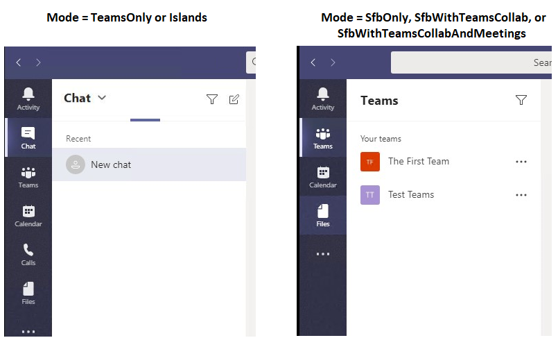

# Experiência e conformidade do cliente do Teams a modos de coexistência

O objetivo dos modos de coexistência do Skype for Business (SfBOnly, SfBWithTeamsCollab, SfBWithTeamsCollabAndMeetings) é fornecer uma experiência simples e previsível para os usuários finais à medida que as organizações migram de Skype for Business para Teams.  Para uma organização mudar para Teams, o modo somente **Teams** é o destino final para cada usuário, embora nem todos os usuários precisem ser atribuídos somente Teams **(ou** qualquer outro modo) ao mesmo tempo.  Antes de os usuários chegarem ao modo TeamsOnly, as organizações podem usar qualquer um dos modos de coexistência do Skype for Business para garantir uma comunicação previsível entre os usuários que estão Teams **somente** e aqueles que ainda não estão. 

Quando um usuário está em qualquer um dos modos Skype for Business, todos os chats de entrada e chamadas são roteados para o cliente Skype for Business usuário. Para evitar confusão do usuário final e garantir o roteamento adequado, a funcionalidade de chamada e de chat no cliente Teams é desabilitada quando um usuário está em qualquer um dos modos Skype for Business de usuário. Da mesma forma, o agendamento de reunião no Teams é explicitamente desabilitado quando os usuários estão nos modos SfBOnly ou SfBWithTeamsCollab e explicitamente habilitados quando um usuário está no modo SfBWithTeamsCollabAndMeetings.

Como a presença é uma indicação de alcance por meio de chat e chamada, quando o chat e a chamada são desabilitados, a auto-presença no Teams (ou seja, a exibição da própria presença no cliente Teams na imagem do usuário) também fica oculta. 

## Como a funcionalidade disponível no Teams cliente muda com base no modo

A funcionalidade disponível no Teams depende do modo de coexistência do usuário, conforme definido por TeamsUpgradePolicy. A tabela a seguir resume o comportamento:

|Modo efetivo do usuário|Experiência no Teams cliente|
|---|---|
|Qualquer Skype for Business modo|A chamada, o Chat e a auto-presença estão desabilitados.|
|SfBWithTeamsCollabAndMeetings|Agendamento de reuniões está disponível|
|SfBWithTeamsCollab ou SfBOnly1|O agendamento de reuniões não está disponível|
|||

As capturas de tela a seguir ilustram a diferença entre Teams **modo Somente** ou **Ilhas** e todos os outros modos. Observe que os ícones de chat e  chamada estão disponíveis por padrão com o modo Somente Teams ou **Ilhas** (captura de tela à esquerda), mas não com os outros modos (captura de tela à direita):

Além disso, a auto-presença não está disponível nos outros modos, conforme mostrado aqui.

 
**Observação:** 
 1 Neste momento, SfBwithTeamsCollab e SfBOnly se comportam da mesma forma, mas a intenção é que o modo SfBOnly também desabilite a funcionalidade Canais e Arquivos no Teams. Nesse ínterim, os canais podem ser ocultos usando a política permissões do aplicativo.

## Impacto do modo em outras configurações de política
Conforme descrito acima, o impacto do modo de coexistência de um usuário é a funcionalidade disponível no cliente Teams usuário. Isso significa que o valor do modo pode ter precedência sobre o valor de outras configurações de política, dependendo do modo. Especificamente, o modo de coexistência afeta se as seguintes configurações de política são atendida:

|**Modalidade (App)**|**Policy.Setting**|
|---|---|
|Chat|TeamsMessagingPolicy.AllowUserChat|
|Chamadas|TeamsCallingPolicy.AllowPrivateCalling|
|Agendamento de reuniões|TeamsMeetingPolicy.AllowPrivateMeetingScheduling TeamsMeetingPolicy.AllowChannelMeetingScheduling|
|||

Os *administradores* não precisam definir explicitamente essas configurações de política ao usar o modo de co-existência, mas é importante entender que essas configurações se comportam efetivamente da seguinte maneira para um determinado modo. 

|Modo|AllowUserChat|AllowPrivateCalling|AllowPrivateMeetingScheduling|AllowChannelMeetingScheduling|
|---|---|---|---|---|
|TeamsOnly ou Islands|Habilitado|Habilitado|Habilitado|Habilitado|
|SfBWithTeamsCollabAndMeetings|Desabilitado|Desabilitado|Habilitado|Habilitado|
|SfBWithTeamsCollab ou SfBOnly|Desabilitado|Desabilitado|Desabilitado|Desabilitado|
||||||

Ao usar o PowerShell, o cmdlet verifica a configuração das configurações correspondentes em `Grant-CsTeamsUpgradePolicy` TeamsMessagingPolicy, TeamsCallingPolicy e TeamsMeetingPolicy para determinar se essas configurações seriam substituídos pelo TeamsUpgradePolicy e, em caso afirmativo, uma mensagem informativa é fornecida no PowerShell.  Conforme mencionado acima, não é mais necessário definir essas outras configurações de política. Veja a seguir um exemplo da aparência do aviso do PowerShell:

`Grant-CsTeamsUpgradePolicy -Identity user1@contoso.com -PolicyName SfBWithTeamsCollab`

`WARNING: The user 'user1@contoso.com' currently has enabled values for: AllowUserChat, AllowPrivateCalling, AllowPrivateMeetingScheduling, AllowChannelMeetingScheduling, however these values will be ignored. This is because you are granting this user TeamsUpgradePolicy with mode=SfBWithTeamsCollab, which causes the Teams client to behave as if they are disabled.`

## Tópicos relacionados

[Orientações de migração e interoperabilidade para organizações que usam o Teams em conjunto com o Skype for Business](./migration-interop-guidance-for-teams-with-skype.md)