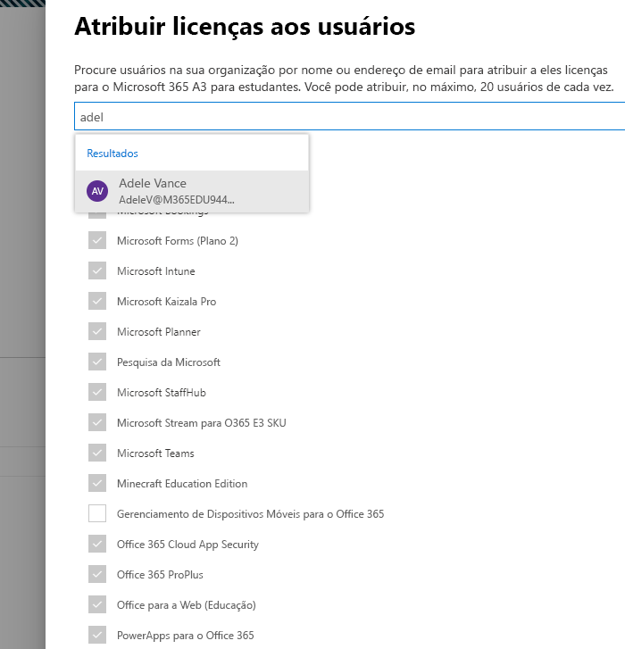

# Atribuir licenças do Microsoft Teams para EDU

O Microsoft Teams é um hub digital que reúne conversas, conteúdo e os aplicativos em um só lugar. Como ele foi criado no Office 365, as escolas se beneficiam da integração com seus aplicativos e serviços do Office conhecidos. Sua instituição pode usar o Microsoft Teams para criar salas de aula colaborativas, conectar-se a comunidades de aprendizagem profissional e comunicar-se com a equipe da escola, tudo em uma única experiência no Office 365 para educação.

Para começar, os administradores de TI precisam usar o Centro de Administração do Microsoft 365 para [habilitar o Microsoft Teams para a sua escola](/microsoft-365/education/intune-edu-trial/enable-microsoft-teams).
Quando concluído, você deve atribuir licenças às contas dos usuários para que seus professores, funcionários e alunos possam acessar os serviços do Office 365, como o Microsoft Teams.

Você pode atribuir licenças a contas de usuários individualmente ou automaticamente por meio da associação de grupo. Este artigo o orientará sobre como atribuir licenças do Office 365 a uma pessoa ou um pequeno conjunto de contas de usuários por meio do centro de administração do Microsoft 365. Para atribuir licenças automaticamente por meio da associação de grupo, confira um dos nossos artigos de suporte:

- [Office 365 Powershell](/office365/enterprise/powershell/assign-licenses-to-user-accounts-with-office-365-powershell)
- [Licenciamento baseado em grupo no Active Directory](/azure/active-directory/users-groups-roles/licensing-groups-assign)

Você pode atribuir licenças a usuários na página de **Licenças** ou na página de **Usuários Ativos**. O método a ser usado dependerá de você desejar atribuir licenças de produto a usuários específicos ou atribuir licenças de usuários a produtos específicos.

> [!NOTE]
> Se não estiver usando o novo centro de administração do Microsoft 365, você poderá ativá-lo selecionando a alternância **Experimentar o novo centro de administração** localizado na parte superior da Home Page.

## Atribuir licenças a usuários na página de Licenças

> [!NOTE]
> Você precisa ser um Administrador global, um Administrador de Cobrança ou um Administrador de Gerenciamento de Usuários. Saiba mais em [Sobre as funções de administrador do Office 365](/microsoft-365/admin/add-users/about-admin-roles).

Ao usar a página de **Licenças** para atribuir licenças, você atribui licenças de um produto específico para até 20 usuários. Na página de **Licenças**, há uma lista de todos os produtos para os quais você tem assinaturas, juntamente com o número total de licenças para cada produto, quantas licenças estão atribuídas e quantas estão disponíveis.

1. No centro de administração, vá para a página **Cobrança** > [Licenças](https://go.microsoft.com/fwlink/p/?linkid=842264).

   
2. Selecione um produto para o qual você deseja atribuir licenças. O Microsoft Teams é parte do SKU gratuito do Office 365 a1 para estudantes.

   
3. Selecione **Atribuir licenças**.

   
4. No painel **Atribuir licenças a usuários**, comece a digitar um nome, o que deve gerar uma lista de nomes. Escolha o nome que está procurando nos resultados para adicioná-lo à lista. É possível selecionar até 20 usuários de cada vez.

   
5. Selecione **Ativar ou desativar os aplicativos e serviços** para atribuir ou remover o acesso a itens específicos, como o Microsoft Teams. Certifique-se de que o **Microsoft Teams** e o **Office para a Web (Educação)** estejam selecionados.
6. Quando tiver terminado, selecione **Atribuir**, e então selecione **Fechar**.

Para alterar os aplicativos e serviços aos quais o usuário tem acesso:

1. Selecione a linha que contém o usuário.
1. No painel direito, marque ou desmarque os aplicativos e serviços aos quais você deseja conceder acesso ou remover o acesso.
1. Quando tiver terminado, selecione **Salvar**, e então selecione **Fechar**.

## Atribuir licenças a um usuário ou vários usuários na página Usuários Ativos

1. No centro de administração, vá para a página **Usuários**  > [Usuários ativos](https://go.microsoft.com/fwlink/p/?linkid=834822).

   
2. Selecione os círculos ao lado do(s) nome(s) do(s) usuário(s) aos quais você deseja atribuir a(s) licença(s).

   
3. Na parte superior, selecione **Gerenciar licenças de produtos**.

   
4. No painel **Gerenciar licenças de produtos**, selecione **Adicionar a atribuições de licença de produto existentes** > **Avançar**.

   
5. No painel **Adicionar a produtos existentes**, alterne o botão para a posição **Ativado** nas licenças que você deseja que os usuários selecionados tenham. Certifique-se de que o **Microsoft Teams** e o **Office para a Web (Educação)** estejam selecionados.

   

   Por padrão, todos os serviços associados a essa licença são atribuídos automaticamente ao(s) usuário(s). Você pode limitar quais serviços estão disponíveis para os usuários. Alterne o botão para a posição **Desativado** para os serviços que você não deseja que os usuários tenham.
6. Na parte inferior do painel, selecione Adicionar > Fechar.