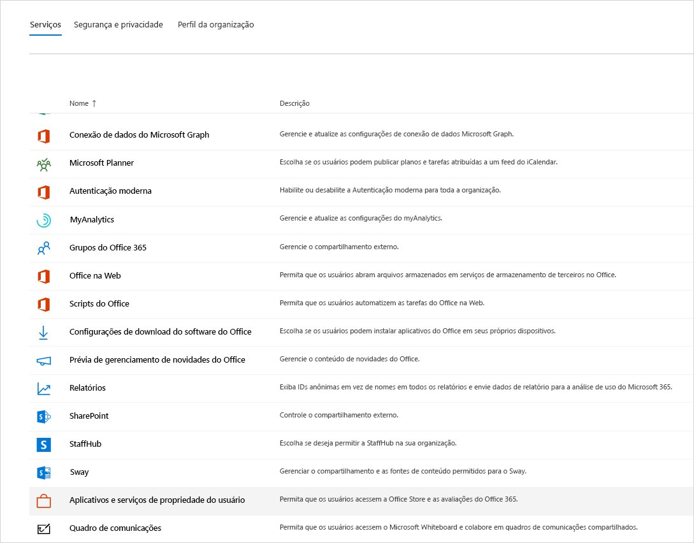
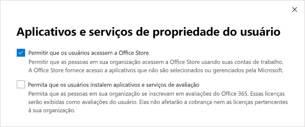
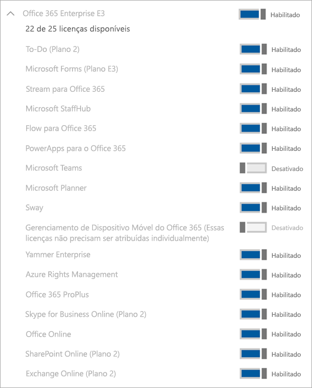

# Gerenciar a licença do Microsoft Teams Exploratory

A experiência do Microsoft Teams Exploratory permite que os usuários em sua organização que têm o Azure Active Directory (Azure AD) e não estão licenciados para o Teams iniciem uma experiência exploratória do Teams. Os administradores podem ativar ou desativar esse recurso para usuários em sua organização.

## O que há na experiência do Teams Exploratory?

Os planos de serviço que um administrador exibirá como parte da experiência de exploratório da equipe são:

- Exchange Online (Plano 1)
- Flow para o Microsoft 365 ou para o Office 365
- Insight por MyAnalytics
- Microsoft Forms (Plano E1)
- Microsoft Planner
- Pesquisa da Microsoft
- Microsoft StaffHub
- Microsoft Stream para Microsoft 365 e Office 365 E1 SKUs1</1>
- Microsoft Teams
- Gerenciamento de Dispositivo Móvel para o Microsoft 365 ou Office 365
- Aplicativos do Office Mobile para Office 365
- Office Online
- Power Apps para o Microsoft 365 ou para o Office 365
- SharePoint Online (Plano 1)
- Sway
- To-Do (Plano 1)
- Quadro de Comunicações (Plano 1)
- Yammer Enterprise

  1 A mudança do Microsoft Stream para o [OneDrive for Business e o Microsoft Office SharePoint Online para gravações de reunião](tmr-meeting-recording-change.md) será uma abordagem em fases. No lançamento, você poderá optar por essa experiência. Em novembro, você terá que cancelar se quiser continuar usando o Stream. Em algum momento no início de 2021, exigiremos que todos os clientes usem o OneDrive for Business e o Microsoft Office SharePoint Online para novas gravações de reuniões.

## Quem é elegível

Os usuários atendem aos critérios para uma experiência Exploratória de Teams se:

- Tem um endereço de email de domínio gerenciado do Azure Active Directory.
- Pertence a um locatário com uma assinatura paga.
- Não tenha uma licença do Teams ativa.
- Não estão em um locatário onde uma política de atribuição de licença foi criada.

Habilite os usuários para se inscreverem em aplicativos e versões de avaliação (no centro de administração do Office 365). Para obter mais informações, confira [Gerenciar a experiência do Teams Exploratory](#manage-the-teams-exploratory-experience), mais adiante neste artigo.

## Quem não está qualificado

Os usuários não se enquadram nos critérios se:

- Atualmente tem uma licença paga ou de avaliação do Teams tem ou anteriormente tinha uma licença de avaliação
- Estão em um locatário que usou/recebeu pelo menos uma oferta especial de COVID.

Sua organização não está qualificada para esta oferta se você for um Cliente Parceiro de Agregação ou se for um cliente do GCC, GCC High, DoD ou EDU.

## Como os usuários se inscrevem na experiência do Teams Exploratory

Os usuários qualificados podem se inscrever para a Experiência do Teams Exploratory entrando no Teams a partir da área de trabalho ou da web ([teams.microsoft.com](https://teams.microsoft.com)). No momento, a ativação do Exploratory por meio do dispositivo móvel não é compatível. Ao se inscreverem, essa licença será atribuída automaticamente a eles e o administrador do locatário receberá uma notificação por email na primeira vez que alguém em sua organização iniciar a experiência do Teams Exploratory.

## Gerenciar a experiência do Teams Exploratory

A experiência Exploratória do Teams deve ser iniciada por usuários finais individuais e você não pode iniciar esta oferta em nome de funcionários usuários finais.

A experiência Exploratória do Teams vem com uma licença do Exchange Online, mas não será atribuída ao usuário até que o administrador a atribua. Se o usuário ainda não tiver uma licença do Exchange e o administrador ainda não tiver atribuído a licença do Exchange Online, o usuário não poderá agendar reuniões no Teams e pode estar perdendo outras funcionalidades do Teams.

Os administradores podem desabilitar a capacidade para que os usuários finais executem a experiência do Teams Exploratory em sua organização, usando a opção **Aplicativos e serviços de avaliação**.

### Impedir que os usuários instalem serviços e aplicativos de avaliação

Você pode desativar a capacidade de um usuário de instalar aplicativos e serviços de avaliação, o que impediria o usuário de executar a experiência Exploratória do Teams.

1. Do Centro de administração do Microsoft 365, vá até **Configurações** > **Configurações da Organização**, selecione **Serviços** e, em seguida, selecione **Aplicativos e serviços de propriedade do usuário**.

    

2. Desmarque a caixa de seleção **Permitir que os usuários instalem aplicativos e serviços de avaliação**.

    

    > [!NOTE]
    > Se a sua organização não estiver qualificada para a experiência do Teams Exploratory, você não verá a opção **Permitir que os usuários instalem aplicativos e serviços de avaliação**.

### Gerenciar a disponibilidade de um usuário com uma licença que inclua o Teams

Um usuário que recebe uma licença que inclui o Teams não está qualificado para a experiência do Teams Exploratory. Quando o plano de serviço do Teams está ativado, o usuário pode entrar e usar o Teams. Se o plano do serviço estiver desabilitado, o usuário não poderá entrar e a experiência do Teams Exploratory não estará disponível. Você deve ter privilégios de administrador.

Para desativar o acesso ao Teams:

1. No Centro de administração do Microsoft 365, selecione **Usuários** > **Usuários ativos**.

2. Marque a caixa ao lado do nome do usuário.

3. Na linha **Licenças de produto**, escolha **Editar**.

4. No painel **​​Licenças do produto**, alterne a chave para **Desligado**.

    

### Gerenciar a disponibilidade do Teams para os usuários que já estão usando a experiência do Teams Exploratory

Se um usuário estiver executando a experiência do Teams Exploratory, você poderá desativá-la removendo a licença ou o plano de serviço. Você deve ter privilégios de administrador.

Para desativar a licença de experiência do Teams Exploratory:

1. No Centro de administração do Microsoft 365, selecione **Usuários** > **Usuários ativos**.

2. Marque a caixa ao lado do nome do usuário.

3. Na linha **Licenças de produto**, escolha **Editar**.

4. No painel **Licenças de produto**, alterne a opção desta licença exploratória para **Desativar**.

    > [!NOTE]
    > A opção de alternância do Teams Exploratory será exibida após o primeiro usuário da organização iniciar a experiência do Teams Exploratory.

### Gerenciar o Teams para usuários que possuem a licença do Teams Exploratory

Você pode gerenciar usuários que possuem a licença do Teams Exploratory, assim como gerencia usuários que possuem uma licença paga regular. Para mais informações, confira [Gerenciar as configurações do Teams da sua organização](enable-features-office-365.md).

### Atualizar usuários do Teams Exploratory

Você deve ter privilégios de administrador para atualizar usuários do Teams Exploratory. Para obter mais informações, confira [Atualizar usuários da versão de avaliação do Teams Exploratory](upgrade-from-teams-exploratory.md).

> [!NOTE]
> Se a licença do Teams Exploratory terminar e um usuário não for atualizado imediatamente para uma assinatura que inclui o Teams, ele perderá o acesso ao Teams após um período de carência de 30 dias. Após mais 30 dias depois da carência, os dados serão excluídos. O usuário ainda existe no Azure Active Directory. Assim que uma nova licença for atribuída ao usuário para habilitar a funcionalidade do Teams novamente, todo o conteúdo ainda existirá se o usuário for adicionado dentro do período de tempo de tolerância.

### Remover uma licença do Teams Exploratory

- Se você deseja remover essa licença por meio do PowerShell, confira: [Remover licenças de contas de usuário com o Office 365 PowerShell](/office365/enterprise/powershell/remove-licenses-from-user-accounts-with-office-365-powershell)

- Se você quiser remover essa licença por meio do portal de administração do, confira: [Excluir um usuário da sua organização](/microsoft-365/admin/add-users/delete-a-user)

## Qual é a política de retenção de dados

Confira as [Informações de assinatura do Microsoft 365](/microsoft-365/commerce/subscriptions/what-if-my-subscription-expires?view=o365-worldwide).

## Quanto tempo dura a experiência do Teams Exploratory?

O Teams Exploratory está disponível com uma assinatura de 12 meses (a partir da inscrição inicial do usuário) para todos os novos clientes. A nova assinatura do Teams Exploratory inicia quando o primeiro usuário de uma organização se inscreve no Teams Exploratory e expira após 12 meses. A data de expiração se aplicará a todos os usuários no mesmo locatário, pois o prazo de 12 meses começa na data de inscrição do primeiro usuário.

> [!NOTE]
> A data de término da experiência é configurada no nível da organização, o que significa que se aplicará a todos os usuários da mesma organização. Por exemplo, o usuário 1 se inscreveu para a assinatura em 1º de janeiro de 2021. Isso inicia a data de término da assinatura em 31 de dezembro de 2021. Outro usuário, o Usuário 2, se inscreveu para a assinatura em 1º de outubro de 2021. O usuário 2 pode usar o Teams Exploratory por dois meses, já que a data de término será 31 de dezembro de 2021 porque eles estão sob a mesma assinatura da organização do Usuário 1.

### O que os administradores devem fazer ao final dos 12 meses do Teams Exploratory

No final da assinatura de 12 meses, os administradores devem converter todos os usuários do Teams Exploratory para uma licença paga que inclui o Teams. É vital garantir que isso seja concluído antes que a assinatura do Teams Exploratory expire para evitar qualquer interrupção na experiência do usuário.

> [!NOTE]
> Os clientes serão desabilitados e impedidos de iniciar uma nova licença de avaliação do Exploratory por 3 meses após a expiração de sua licença de avaliação do Exploratory anterior.

Para obter mais informações, confira [Atualizar usuários do Teams Exploratory](#upgrade-users-from-teams-exploratory), acima nesse artigo.
