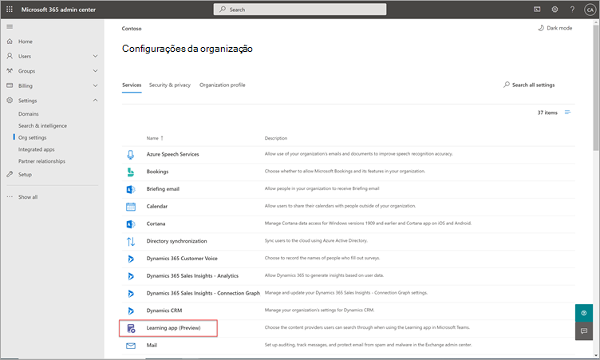
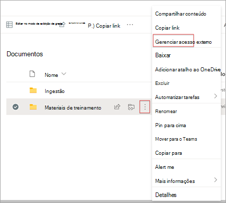
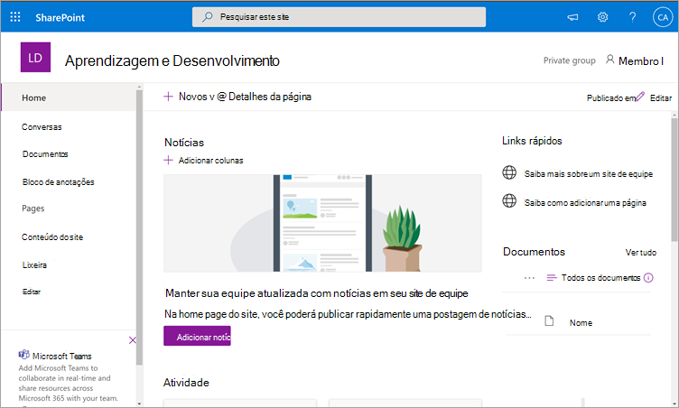
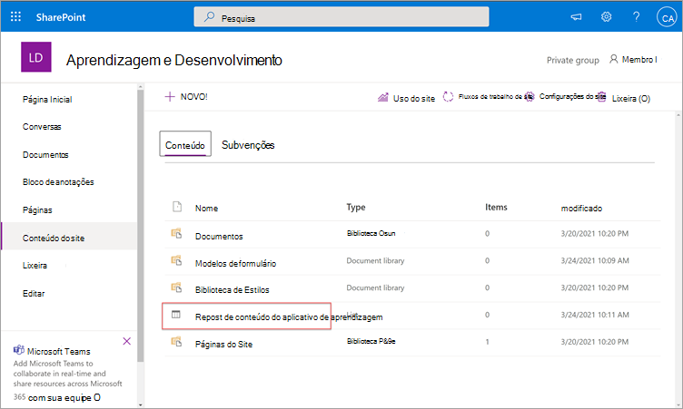
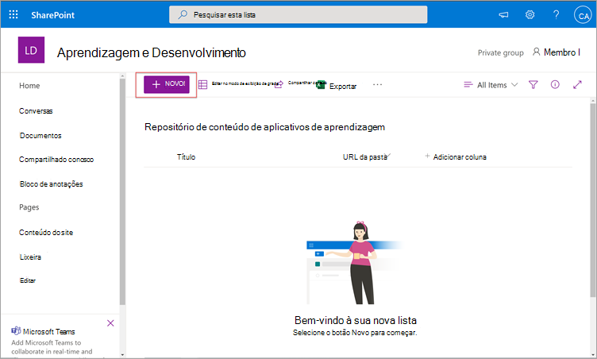
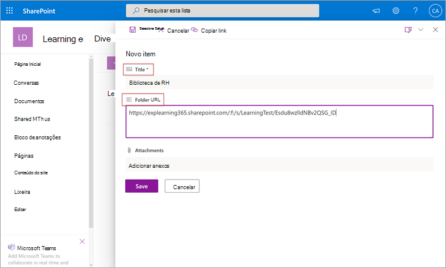
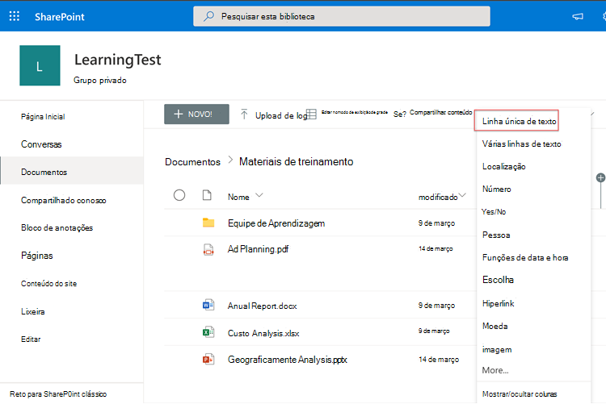
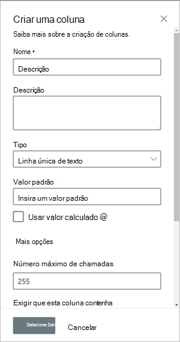
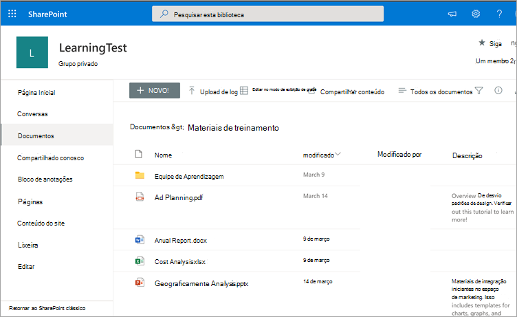

# Instalar, gerenciar e atribuir permissões para o Microsoft Viva Learning (visualização privada)

*Este artigo contém conteúdo preliminar para o Microsoft Viva Learning, que está em visualização privada.*

O Microsoft Viva Learning (visualização privada) capacita equipes e indivíduos em sua organização a tornar o aprendizado uma parte natural do seu dia. O aplicativo cria um hub central no Teams onde os funcionários podem compartilhar, atribuir e aprender com bibliotecas de conteúdo em toda a sua organização.

Os administradores configuram permissões e permitem fontes de conteúdo de aprendizagem para o Viva Learning (visualização privada). O conteúdo de aprendizagem pode incluir o LinkedIn Learning, o Microsoft Learn, o treinamento do Microsoft 365, o próprio conteúdo da sua organização armazenado no SharePoint online e provedores de terceiros que são suportados pelo Viva Learning (visualização privada).

## Funções de administrador

Para configurar o Viva Learning (visualização privada), você precisará de permissões como:

- Administrador do Microsoft Teams
- Administrador global do Microsoft 365 ou administrador do SharePoint
- Administrador de conhecimento — essa é uma nova função no Centro de administração do Microsoft 365 que pode ser atribuída a qualquer pessoa na organização. Essa função gerencia as fontes de conteúdo de aprendizado da organização por meio do Centro de administração do Microsoft 365. 

> [!TIP]
> O administrador de conhecimento deve ser moderadamente técnico e ter credenciais de administrador do SharePoint existentes, de preferência alguém que seja bem versado na parte de educação, aprendizado, treinamento ou experiência de funcionários da organização.
 
## Gerenciar o Viva Learning (visualização privada) no centro de administração do Teams

O administrador do Teams instala o Viva Learning (visualização privada) na loja de aplicativos e aplica políticas de configuração, gerenciamento e permissão por meio do Centro de administração do Teams.

### Gerenciar configurações para o Viva Learning (visualização privada)

Você deve ser um administrador no Centro de administração do Teams para executar essas tarefas.

Para gerenciar configurações para o Viva Learning, siga estas etapas:

1. Na navegação à esquerda do Centro de administração do Teams, vá para **Aplicativos do Teams**  >  **Gerenciar aplicativos**.

   

2. Na página **Gerenciar aplicativos,** na caixa de pesquisa, digite aprendizagem *para* pesquisar o aplicativo Teams Learning (visualização privada).

   

3. Na página **Aprendizagem:**
   1. Em **Status**, selecione **Permitido** ativar o aplicativo.
   2. Na guia **Configurações,** na **seção** Configurações do aplicativo, vá para o Centro de administração do Microsoft 365 para configurar fontes de conteúdo de aprendizado.

   

4. Depois **de Gerenciar** configurações de aplicativo, acesse Permissões e Políticas de Configuração para conceder permissão aos **funcionários** que devem ter acesso ao aplicativo como parte da participação da sua organização na visualização privada.

> [!NOTE]
>  Se sua organização estiver no Ring 4.0 como parte do programa Do Teams TAP100, talvez seja necessário fazer o seguinte para habilitar usuários aprovados no Anel 3.0 para acessar o Viva Learning (visualização privada).

Como parte da visualização privada, o Viva Learning (visualização privada) é lançado no Ring 3.0. Se sua organização estiver no Ring 4.0, você não verá o aplicativo na loja de aplicativos. Para testar o aplicativo, você precisa criar uma política de permissão de aplicativos personalizados, defini-la como **Permitir** todos os aplicativos e atribuí-lo aos usuários aprovados do Anel 3.0.

   

## Configurar fontes de conteúdo de aprendizagem no centro de administração do Microsoft 365

Os administradores do Centro de administração do Microsoft 365 , por conta própria ou atribuindo a função de administrador de conhecimento a indivíduos selecionados em sua organização, podem gerenciar configurações relacionadas ao Viva Learning (visualização privada) e podem configurar as fontes de conteúdo de aprendizagem.

O administrador seleciona quais fontes de conteúdo de aprendizado adicionais (por exemplo, o SharePoint ou fontes de provedores de conteúdo de terceiros) estarão disponíveis para os usuários do Viva Learning (visualização privada). Em seguida, o administrador configura essas fontes para garantir que o conteúdo está disponível para pesquisa e descoberta e pode ser navegado pelos funcionários que usam o Viva Learning (visualização privada).

> [!NOTE]
>  Os usuários entrarão em aprendizados que não são da Microsoft e do LinkedIn Learning Pro em um navegador ou visualizador incorporado. Esse aprendizado configurado está sujeito aos termos separados de licença, privacidade e serviço entre sua organização e terceiros e não os termos do Viva Learning (visualização privada). Antes de selecionar esse tipo de aprendizado, verifique se você tem um contrato para sua organização e usuários.

### Atribuir a função de administrador de conhecimento [Opcional]

Você deve ser um administrador global do Microsoft 365 para executar essas tarefas.

Para atribuir um administrador de conhecimento para o Viva Learning, siga estas etapas:

1.  Na navegação à esquerda do Centro de administração do Microsoft 365, vá para **Funções**.

2.  Na página **Funções,** na guia **Azure AD,** selecione **Administrador de conhecimento**.
 
3.  Na página **Administrador de** Conhecimento, na seção Administradores **Atribuídos,** selecione **Adicionar** e adicione a pessoa escolhida para a função.

### Configurar configurações para as fontes de conteúdo de aprendizagem para o Viva Learning (visualização privada)

Você deve ser um administrador global do Microsoft 365 ou administrador de conhecimento para executar essas tarefas.

Para definir configurações para aprender fontes de conteúdo no Viva Learning, siga estas etapas:

1.  Na navegação à esquerda do Centro de administração do Microsoft 365, acesse **Configurações**  >  **da Organização configurações**.

2.  Na página **Configurações da** Organização, na guia **Serviços,** selecione **Aplicativo de aprendizagem (Visualização)**.

     

3.  No painel **Aplicativo de Aprendizagem (Visualização),** selecione as fontes de conteúdo de aprendizagem que você deseja configurar para a organização e selecione **Salvar**.

     

Entre todas as fontes de aprendizado existentes, algumas serão habilitadas por padrão. Elas incluem:

- LinkedIn Learning (conteúdo gratuito)
- Microsoft Learn
- Treinamento do Microsoft 365

> [!NOTE]
> Se sua organização tiver uma assinatura do LinkedIn Learning Standard ou Pro, o repositório de conteúdo será desbloqueado para os funcionários da sua organização. Somente os funcionários que têm permissão poderão usar todo o repositório de conteúdo.  Outras fontes podem precisar ser habilitadas ou configuradas manualmente. As fontes de aprendizado que não são da Microsoft são licenciadas separadamente entre sua organização e terceiros. Você precisará verificar se se inscreveu para o aprendizado deles para você e seus usuários.

Para habilitar ou desabilitar uma fonte de conteúdo de aprendizagem, selecione a caixa de seleção ao lado da fonte. Se uma fonte estiver habilitada, uma marca de seleção ficará visível.

## Configurar o SharePoint como uma fonte de conteúdo de aprendizagem

Você pode configurar o SharePoint como uma fonte de conteúdo de aprendizagem para disponibilizar o próprio conteúdo da sua organização no Viva Learning (visualização privada).

### Visão Geral

O administrador de conhecimento (ou administrador global) fornece uma URL de site para a qual o Serviço de Aprendizagem pode criar um local centralizado vazio, o Repositório de Conteúdo do Aplicativo de Aprendizagem, na forma de uma lista estruturada do SharePoint. Essa lista pode ser usada pela sua organização para abrigar links para pastas do SharePoint entre empresas que contêm conteúdo de aprendizagem. Os administradores são responsáveis por coletar e fazer a curadoria de uma lista de URLs para pastas. Essas pastas só devem incluir conteúdo que pode ser disponibilizado no Viva Learning (visualização privada).

O Viva Learning (visualização privada) dá suporte aos seguintes tipos de documento:

- Word, PowerPoint, Excel, PDF
- Áudio (.m4a)
- Vídeo (.mov, .mp4, .avi)

Para obter mais informações, consulte a [documentação do SharePoint Online.](https://docs.microsoft.com/sharepoint/introductionlink) 

### Permissões

As URLs da pasta da biblioteca de documentos podem ser coletadas de qualquer site do SharePoint na organização. O Viva Learning (visualização privada) segue todas as permissões de conteúdo existentes. Portanto, somente o conteúdo para o qual um usuário tem permissão para acessar é pesquisável e visável no Viva Learning (visualização privada). Qualquer conteúdo dentro dessas pastas será pesquisável, mas somente o conteúdo para o qual o funcionário individual tem permissões pode ser usado.

A exclusão de conteúdo do repositório da sua organização não é suportada no momento.

Para remover conteúdo não intencionalmente à superfície, siga estas etapas:

1.  Para restringir o acesso à biblioteca de documentos, selecione a opção **Mostrar ações** e selecione **Gerenciar acesso**.
     
     

2.  Exclua o documento original na biblioteca de documentos.

Para obter mais informações, consulte [Compartilhamento e permissões na experiência moderna do SharePoint.](https://docs.microsoft.com/sharepoint/modern-experience-sharing-permissions) 

### Serviço de Aprendizagem

O Serviço de Aprendizagem usa as URLs de pasta fornecidas para obter metadados de todo o conteúdo armazenado nessas pastas. Dentro de 24 horas após fornecer a URL da pasta no repositório centralizado, os funcionários podem pesquisar e usar o conteúdo da sua organização no Viva Learning (visualização privada). Todas as alterações no conteúdo, incluindo metadados e permissões atualizadas, também serão aplicadas no Serviço de Aprendizagem dentro de 24 horas.

### Configurar o SharePoint como fonte

Você deve ser um administrador global do Microsoft 365, administrador do SharePoint ou administrador de conhecimento para executar essas tarefas.

Para configurar o SharePoint como fontes de conteúdo de aprendizagem no Viva Learning (visualização privada), siga estas etapas:

1.  Na navegação à esquerda do Centro de administração do Microsoft 365, acesse **Configurações**  >  **da Organização configurações**.
 
2.  Na página **Configurações da** Organização, na guia **Serviços,** selecione **Aplicativo de aprendizagem (Visualização)**.

     

3.  No painel Aplicativo de Aprendizagem **(Visualização),** em **SharePoint**, forneça a URL do site para o site do SharePoint onde você deseja que o Viva Learning crie um repositório centralizado.

     

4.  Uma lista do SharePoint é criada automaticamente no site do SharePoint fornecido.

     

     Na navegação à esquerda do site do SharePoint, selecione Conteúdo do **site**  >  **Aprendendo Repositório de Conteúdo do Aplicativo.** 

      

5. Na página **Repositório de Conteúdo do Aplicativo** de Aprendizagem, preencha a lista do SharePoint com URLs para as pastas de conteúdo de aprendizagem.

   1. Selecione **Novo** para exibir o **painel Novo item.** 

       
 
   2. No painel **Novo item,** no campo **Título,** adicione um nome de diretório de sua escolha. No campo **URL da pasta,** adicione a URL à pasta de conteúdo de aprendizagem. Selecione **Salvar**.

       

   3. A **página Repositório de Conteúdo do Aplicativo** de Aprendizagem é atualizada com o novo conteúdo de aprendizado.

       

> [!NOTE]
> Para permitir acesso mais amplo ao Repositório de Conteúdo do Aplicativo de Aprendizagem, um link para a lista em breve estará disponível na interface do Viva Learning (visualização privada), onde os usuários podem solicitar acesso e, em última análise, ajudar a preencher a lista. Os proprietários de sites e administradores globais serão necessários para conceder acesso à lista. O Access é específico apenas para a lista e não se aplica ao site onde a lista está armazenada.

### Curação da biblioteca de documentos da URL da pasta

Os metadados padrão (como data modificada, criada por, nome do documento, tipo de conteúdo e nome da organização) são automaticamente retirados para o Viva Learning (visualização privada) pela API do Microsoft Graph.
 
Para melhorar a relevância geral da descoberta e da pesquisa do conteúdo, recomendamos adicionar uma coluna **Descrição.**

Para adicionar uma **coluna Descrição** à página da biblioteca de documentos, siga estas etapas:

1.  Na página **Documentos,** selecione **Adicionar coluna**.

2. Selecione a **opção Mostrar ações** e selecione Linha única de **texto**.

     

3. No painel **Criar uma coluna,** no campo **Nome,** adicione um nome descritivo para a coluna. Selecione **Salvar**.

     
 
4. Na página **Documentos,** na coluna **Descrição,** adicione descrições personalizadas para cada item. Se nenhuma descrição for fornecida, o Viva Learning (visualização privada) fornecerá uma mensagem padrão que realça o conteúdo como sendo de sua própria biblioteca do SharePoint. 

     
 
