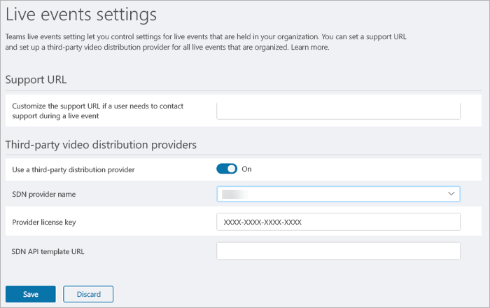

# <a name="configure-live-event-settings-in-microsoft-teams"></a>Configurar eventos ao vivo no Microsoft Teams

Use as configurações de eventos ao vivo do Teams para definir configurações para eventos ao vivo que são realizados em sua organização. Você pode configurar uma URL de suporte e configurar um provedor de distribuição de vídeo de terceiros. Essas configurações se aplicam a todos os eventos ao vivo criados em sua organização.

Você pode gerenciar facilmente essas configurações no centro de administração do Microsoft Teams. Na navegação à esquerda, vá para **Reuniões**  >  **Ao vivo configurações de eventos**.



## <a name="set-up-event-support-url"></a>Configurar a URL de suporte a eventos

Essa URL é mostrada para participantes do evento ao vivo. Adicione a URL de suporte para sua organização para dar aos participantes uma maneira de contatar o suporte durante um evento ao vivo.

### <a name="an-icon-showing-the-microsoft-teams-logo-using-the-microsoft-teams-admin-center"></a> Usando o centro de administração do Microsoft Teams

1. Na navegação à esquerda, vá para **Configurações do** evento Meetings  >  **Live**.
2. Em **URL de Suporte,** insira a URL de suporte da sua organização.

    

### <a name="using-windows-powershell"></a>Usar o Windows PowerShell

Execute o seguinte:

```PowerShell
Set-CsTeamsMeetingBroadcastConfiguration -SupportURL “{your URL}”
```
Para obter mais informações, [consulte Set-CsTeamsMeetingBroadcastConfiguration](/powershell/module/skype/set-csteamsmeetingbroadcastconfiguration?view=skype-ps).
## <a name="configure-a-third-party-video-distribution-provider"></a>Configurar um provedor de distribuição de vídeo de terceiros 

Se você comprou e configurou uma solução de rede definida por software (SDN) ou uma solução de rede de entrega de conteúdo empresarial (eCDN) por meio de um parceiro de entrega de vídeo da Microsoft, configure o provedor para eventos ao vivo no Teams. 

### <a name="an-icon-showing-the-microsoft-teams-logo-using-the-microsoft-teams-admin-center"></a> Usando o centro de administração do Microsoft Teams

1. Na navegação à esquerda, vá para **Configurações do** evento Meetings  >  **Live**.
2. Em **Provedores de distribuição de vídeo de terceiros,** conclua o seguinte: 

    

    - **Usar um provedor de distribuição de terceiros** Ative isso para habilitar o provedor de distribuição de vídeo de terceiros.
    - **Nome do provedor SDN** Escolha o provedor que você está usando.
    - **Chave de licença do provedor** Insira a ID de licença que você recebeu do contato do provedor.
    - **URL do modelo de API do SDN** Insira a URL do modelo de API que você recebeu do contato do provedor.

### <a name="using-windows-powershell"></a>Usar o Windows PowerShell
Obter a ID de licença ou token de API e modelo de API do contato do provedor e execute um dos seguintes, dependendo do provedor que você está usando:

**Hive** 
```PowerShell
Set-CsTeamsMeetingBroadcastConfiguration -AllowSdnProviderForBroadcastMeeting $True -SdnProviderName hive -SdnLicenseId {license ID GUID provided by Hive} -SdnApiTemplateUrl “{API template URL provided by Hive}”
```
**Kollective** 
```PowerShell
Set-CsTeamsMeetingBroadcastConfiguration -AllowSdnProviderForBroadcastMeeting $True -SdnProviderName kollective -SdnApiTemplateUrl "{API template URL provided by Kollective}" -SdnApiToken {API token GUID provided by Kollective}
```
**Riverbed** 
```PowerShell
Set-CsTeamsMeetingBroadcastConfiguration -AllowSdnProviderForBroadcastMeeting $True -SdnProviderName riverbed -SdnApiTemplateUrl "{API template URL provided by Riverbed}" -SdnApiToken {API token GUID provided by Riverbed}
```

Para obter mais informações, [consulte Set-CsTeamsMeetingBroadcastConfiguration](/powershell/module/skype/set-csteamsmeetingbroadcastconfiguration?view=skype-ps).

> [!NOTE]
> Se você planeja criar eventos ao vivo usando um aplicativo ou dispositivo externo, também precisará configurar seu provedor [de eCDN com o Microsoft Stream.](/stream/network-caching) 

>[!Note]
> A mudança do Microsoft Stream para o [OneDrive for Business e o Microsoft Office SharePoint Online para gravações de reunião](../tmr-meeting-recording-change.md) será uma abordagem em fases. No lançamento você poderá optar por aceitar essa experiência, em novembro você terá que recusar se quiser continuar usando o Stream e, no início de 2021, exigiremos que todos os clientes usem o OneDrive for Business e o Microsoft Office SharePoint Online para novas gravações de reunião.

### <a name="related-topics"></a>Tópicos relacionados
- [O que são os eventos ao vivo do Teams?](what-are-teams-live-events.md)
- [Planejar eventos ao vivo do Teams](plan-for-teams-live-events.md)
- [Configurar eventos ao vivo do Teams](set-up-for-teams-live-events.md)