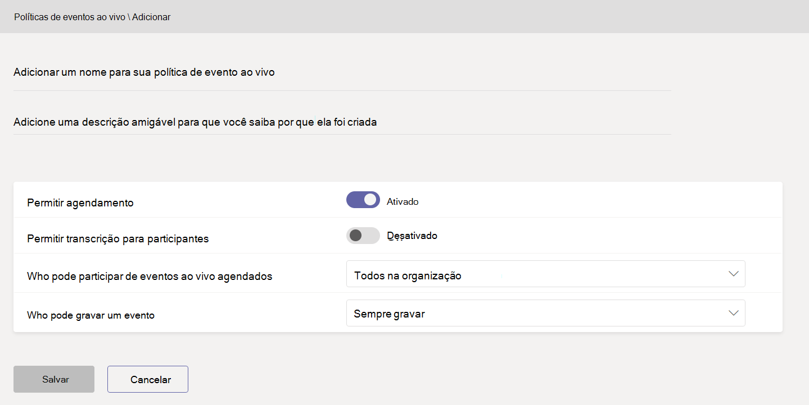

# Configurar eventos ao vivo no Microsoft Teams

Ao configurar para eventos ao vivo, há várias etapas que você deve seguir.

## Etapa 1: configurar sua rede para eventos vivos no Teams

Os eventos ao vivo produzidos pelo Teams exigem que você [Prepare a rede da sua organização para o Teams](../prepare-network.md).  

## Etapa 2: Comprar e atribuir licenças

Verifique se você tem atribuições de licença corretas para [quem pode criar e agendar eventos ao vivo](plan-for-teams-live-events.md#who-can-attend-create-and-schedule-live-events) e [quem pode assistir a eventos ao vivo](plan-for-teams-live-events.md#who-can-watch-live-events).

## Etapa 3: configurar políticas de eventos ao vivo

As políticas de eventos ao vivo são usadas para controlar quem em sua organização pode manter os eventos ao vivo e os recursos que estão disponíveis nos eventos criados por eles. Você pode usar a política padrão ou criar uma ou mais políticas personalizadas de eventos dinâmicos. Depois de criar uma política personalizada, você pode atribuí-la a um usuário ou grupo de usuários da organização.

> [!NOTE]
> Os usuários em sua organização receberão a política global (padrão em toda a organização), a menos que você crie e atribua uma política personalizada. Por padrão, na política global, o agendamento do evento ao vivo está habilitado para os usuários do Teams, as legendas em tempo real (transcrição) estão desabilitadas, todas as pessoas da organização podem participar de eventos ao vivo e a configuração de gravação está definida como sempre gravar.

### Criar ou editar uma política de eventos ao vivo

1. Na navegação à esquerda do centro de administração Microsoft Teams, vá para a guia **Reuniões** Ao vivo  >  **políticas de gerenciamento**  >  **de** políticas.
2. Faça uma das seguintes opções:

    - Se você quiser editar a política padrão existente, escolha **Global (padrão para toda a organização)**.
    - Se você quiser criar uma nova política personalizada, escolha **+Adicionar**.
    - Se você quiser editar uma política personalizada, selecione-a e, em seguida, escolha **Editar**.

    Estas são as configurações que podem ser alteradas de acordo com as necessidades da sua organização.

    

|Configuração  |Descrição  |
|---------|---------|
|**Título**     |Esse é o título da política exibida na página políticas de eventos ao vivo. Não pode ter mais de 64 caracteres ou caracteres especiais.          |
|**Descrição**    |Use isso para adicionar uma descrição amigável à política.         |
|**Permitir agendamento**     |Habilitar essa operação permite que os usuários da organização criem e agendem eventos ao vivo no Teams. É importante saber que, se você quiser que os usuários agendem um evento ao vivo produzido por um aplicativo ou dispositivo externo, há outras etapas que você deve seguir. Para saber mais, confira [Permitir aos usuários agendar eventos que foram produzidos com um aplicativo ou dispositivo externo](#enable-users-to-schedule-events-that-were-produced-with-an-external-app-or-device).     |
|**Permitir transcrição para participantes** |Essa configuração só pode ser aplicada a eventos produzidos no Teams. Ativar esse recurso permite que os participantes de eventos ao vivo vejam legendas em tempo real durante o evento.         |
|**Quem pode ingressar eventos ao vivo agendados**    |Escolha uma destas opções.  **Todos** os usuários podem criar eventos ao vivo em que todos, incluindo as pessoas de fora da sua organização, podem participar. Essa configuração permite o tipo de permissão **pública** no Teams quando um usuário agenda um evento ao vivo.  **Todos na organização** os usuários podem criar eventos ao vivo nos quais as pessoas de sua organização, incluindo [usuários convidados](../add-guests.md) adicionados à sua organização, podem participar. Os usuários não podem criar eventos ao vivo com participação de usuários anônimos. Essa configuração permite o tipo de permissão **toda a organização** no Teams quando um usuário agenda um evento ao vivo.  **Usuários ou grupos específicos** podem criar eventos ao vivo em que somente usuários ou grupos específicos da sua organização podem participar. Os usuários não podem criar eventos ao vivo com a participação de todos em sua organização ou de usuários anônimos. Essa configuração permite o tipo de permissão **Pessoas e grupos** no Teams quando um usuário agenda um evento ao vivo.       |
|**Configuração de gravação**        | Essa configuração só pode ser aplicada a eventos produzidos no Teams. Escolha uma destas opções.    **Sempre Gravar** Eventos ao vivo criados por usuários sempre são gravados. Após o evento ser encerrado, os membros da equipe do eventos podem baixar a gravação, e os participantes podem assistir ao evento.   **Nunca gravar** eventos ao vivo criados pelos usuários nunca são gravados.  **O organizador pode gravar ou não** Usuários podem decidir se desejam gravar o evento ao vivo. Se ele for gravado, após o evento ser encerrado, os membros da equipe do eventos podem baixar a gravação, e os participantes podem assistir ao evento.

Você também pode fazer isso usando o Windows PowerShell. Para saber mais, confira [usar o PowerShell para definir políticas de eventos ao vivo no Teams](set-teams-live-events-policies-using-powershell.md).

### Atribuir uma política de eventos dinâmicos aos usuários

Se você criou uma política personalizada de eventos ao vivo, atribua-a aos usuários para que a política fique ativa.   [!INCLUDE [assign-policy](../includes/assign-policy.md)]

### Permitir que os usuários agendem eventos que foram produzidos com um aplicativo ou dispositivo externo

Para que os usuários agendem eventos produzidos com um aplicativo ou dispositivo externo, você também deve fazer as seguintes etapas:

1. Habilitar o Microsoft Stream para usuários na organização. O stream está disponível como parte de assinaturas Microsoft 365 ou Office 365 ou como um serviço autônomo. O Stream não está incluído nos planos Business Essentials ou Business Premium. Confira [Visão geral de licenciamento Stream](/stream/license-overview) para obter mais detalhes.

   >[!Note]
   > A mudança do Microsoft Stream para o [OneDrive for Business e o Microsoft Office SharePoint Online para gravações de reunião](../tmr-meeting-recording-change.md) será uma abordagem em fases. No lançamento você poderá optar por aceitar essa experiência, em novembro você terá que recusar se quiser continuar usando o Stream e, no início de 2021, exigiremos que todos os clientes usem o OneDrive for Business e o Microsoft Office SharePoint Online para novas gravações de reunião. Saiba mais sobre como você pode [**atribuir licenças aos usuários**](https://support.office.com/article/Assign-licenses-to-users-in-Office-365-for-business-997596B5-4173-4627-B915-36ABAC6786DC) para que os usuários possam acessar o Stream. Verifique se Stream não está bloqueado para os usuários, conforme definido [**neste artigo**](/stream/disable-user-organization).

2. Garanta que os usuários tenham permissão para a criação de evento ao vivo no Stream. Por padrão, os administradores podem criar eventos com um aplicativo ou dispositivo externo. O administrador do Stream pode [habilitar usuários adicionais para a criação de eventos ao vivo](/stream/live-event-administration#restrict-who-can-create-events) no Stream.

3. Garanta que os organizadores de eventos ao vivo sejam configurados pela política da empresa definida pelo administrador do Stream. Se um administrador do Stream tiver [configurado uma política de diretrizes da empresa](/stream/company-policy-and-consent) e exigir que os funcionários aceitem essa política antes de salvar o conteúdo, eles devem fazê-lo antes de criar um evento ao vivo (com um aplicativo ou dispositivo externo) no Teams. Antes de distribuir o recurso de eventos ao vivo na organização, certifique-se de que os usuários que criarão esses eventos ao vivo tenham consentido com a política.

## Etapa 4: Configurar uma solução de distribuição de vídeo para eventos ao vivo no Teams.

A reprodução de vídeos ao vivo usa o protocolo de taxa de bits adaptável (ABR), mas é um fluxo de unicast, o que significa que todos os visualizadores estão obtendo seu próprio fluxo de vídeo da Internet. Para eventos ao vivo ou vídeos enviados para grande parte da sua organização, pode haver uma quantidade significativa de largura de banda de Internet consumida pelos visualizadores. Para as organizações que desejam reduzir esse tráfego de Internet para eventos ao vivo, as soluções de eventos ao vivo são integradas aos parceiros de entrega de vídeo confiáveis da Microsoft, como SDNs (redes definidas por software) ou redes de distribuição de conteúdo (eCDNs). Essas plataformas SDN/eCDN permitem que as organizações otimizem a largura de banda de rede sem sacrificar as experiências de exibição do usuário final. Nossos parceiros podem ajudar a habilitar uma distribuição de vídeo mais dimensionável e eficiente em sua rede corporativa.

**Compre e configure sua solução fora do Teams** Obtenha ajuda especializada com a capacidade de redimensionamento de vídeo aproveitando os parceiros de entrega de vídeo confiáveis da Microsoft. Antes de permitir que um provedor de entrega de vídeo seja usado com Teams, você deve comprar e configurar a solução SDN/eCDN fora e separada do Teams.

As seguintes soluções SDN/eCDN são pré-configuradas e podem ser configuradas para serem usadas com o Stream.

- **O Hive Streaming** fornece uma solução simples e poderosa para a distribuição de vídeo empresarial ao vivo e sob demanda. Hive é uma solução baseada em software que não requer hardware ou largura de banda adicional e oferece uma maneira segura de permitir milhares de visualizadores de vídeo simultâneos, sem afetar a sua rede. Para os clientes que desejam compreender o impacto que o vídeo tem em suas redes antes de adquirir uma solução SDN/eCDN, o streaming do Hive também fornece uma solução de análise baseada em navegador para clientes da Microsoft. [Saiba mais](https://www.hivestreaming.com/partners/integration-partners/microsoft/).

- **Kollective** é uma plataforma de distribuição de emparelhamento inteligente baseada na nuvem que aproveita a infraestrutura de rede existente para oferecer conteúdo de muitas maneiras (vídeo em tempo real, vídeo por demanda, atualizações de software, patches de segurança, etc.) mais rápido, confiável e com menos largura de banda. Nossa plataforma segura é confiável pelas maiores instituições financeiras do mundo, sem nenhum hardware adicional, com configuração e a manutenção fáceis. [Saiba mais](https://kollective.com/microsoft-pilot/).

- **Ramp OmniCache** fornece a distribuição de rede de última geração e garante a entrega tranquila de conteúdo de vídeo em WANs globais, ajudando os produtores de eventos a otimizar a largura de banda da rede e dando suporte a difusões de eventos ao vivo e transmissões sob demanda. O suporte para o Ramp OmniCache de eventos ao vivo produzidos no Teams será lançado em breve. [Saiba mais](https://rampecdn.com).

- **Riverbed**, o padrão do setor na otimização de rede, está estendendo suas soluções de aceleração para Microsoft Teams Stream.  Agora Microsoft 365 clientes podem acelerar com confiança o tráfego 365, incluindo o Teams e o Stream, juntamente com uma grande quantidade de outros serviços SaaS corporativos líderes para aumentar a produtividade da força de trabalho de qualquer lugar. Teams e aceleração stream podem ser habilitadas por meio de uma configuração sem esforço que vem com toda a garantia do suporte de classe mundial de Riverbed e do investimento contínuo.

> [!NOTE]
> A solução SDN ou eCDN escolhida está sujeita aos **Termos de serviço e política de privacidade de terceiros**, que governam o uso da solução do provedor. O uso da solução do provedor não estará sujeito aos termos de licenciamento por volume da Microsoft ou a termos de serviços online. Caso não concorde com os **termos do provedor de terceiros**, não habilite a solução no Teams.

Depois de configurar a solução SDN ou eCDN, você estará pronto para configurar o provedor para eventos ao vivo no Teams.

## Próximas etapas

Vá para [Definir configurações de eventos ao vivo do Teams](configure-teams-live-events.md).

### Tópicos relacionados

- [O que são eventos ao vivo de Teams?](what-are-teams-live-events.md)
- [Planejar eventos ao vivo do Teams](plan-for-teams-live-events.md)
- [Definir configurações de eventos ao vivo do Teams](configure-teams-live-events.md)