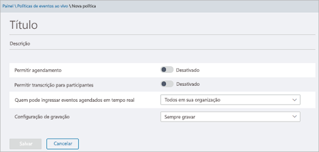

# Configurar eventos ao vivo no Microsoft TeamsSet up for live events in Microsoft Teams

Quando você está configurando para eventos ao vivo, há várias etapas que devem ser tomadas.When you're setting up for live events, there are several steps that you must take.

## Etapa 1: configurar sua rede para eventos dinâmicos no Microsoft TeamsStep 1: Set up your network for live events in Teams
Eventos dinâmicos produzidos em equipes exigem que você [Prepare a rede da sua organização para o Teams](https://docs.microsoft.com/microsoftteams/prepare-network).Live events produced in Teams require you to [prepare your organization's network for Teams](https://docs.microsoft.com/microsoftteams/prepare-network).  

## Etapa 2: Comprar e atribuir licençasStep 2: Get and assign licenses
Verifique se você tem atribuições de licença corretas para [quem pode criar e agendar eventos dinâmicos](plan-for-teams-live-events.md#who-can-create-and-schedule-live-events) e [quem pode assistir a eventos ao vivo](plan-for-teams-live-events.md#who-can-watch-live-events).Ensure you have correct license assignments for [who can create and schedule live events](plan-for-teams-live-events.md#who-can-create-and-schedule-live-events) and [who can watch live events](plan-for-teams-live-events.md#who-can-watch-live-events).

## Etapa 3: configurar políticas de eventos dinâmicosStep 3: Set up live events policies
Políticas de eventos dinâmicos são usadas para controlar quem em sua organização pode manter eventos dinâmicos e os recursos que estão disponíveis nos eventos que eles criam.Live events policies are used to control who in your organization can hold live events and the features that are available in the events they create. Você pode usar a política padrão ou criar uma ou mais políticas personalizadas de eventos dinâmicos.You can use the default policy or create one or more custom live events policies. Depois de criar uma política personalizada, atribua-a a um usuário ou grupos de usuários em sua organização.After you create a custom policy, assign it to a user or groups of users in your organization.

> [!NOTE]
> Os usuários em sua organização receberão a política global, a menos que você crie e atribua uma política personalizada.Users in your organization will get the global policy unless you create and assign a custom policy. Por padrão, na política global, o agendamento de eventos dinâmicos está habilitado para usuários do Teams, legendas ao vivo e legendas (transcrição) desativada, todos na organização podem participar de eventos dinâmicos e a configuração de gravação é definida como sempre gravar.By default in the global policy, live event scheduling is enabled for Teams users, live captions and subtitles (transcription) is turned off, everyone in the organization can join live events, and the recording setting is set to always record. 

### Criar ou editar uma política de eventos dinâmicosCreate or edit a live events policy

** do Microsoft Teams usando o centro de administração do Microsoft Teams**** Using the Microsoft Teams admin center**

1. No painel de navegação esquerdo, vá para**políticas de eventos dinâmicos**de **reuniões** > .In the left navigation, go to **Meetings** > **Live events policies**. 
2. Siga um destes procedimentos:Do one of the following:
- Se você quiser editar a política padrão existente, escolha **global (padrão para toda a organização)**.If you want to edit the existing default policy, choose **Global (Org-wide default)**. 
- Se você quiser criar uma nova política personalizada, escolha **nova política**.If you want to create a new custom policy, choose **New policy**. 
- Se você quiser editar uma política personalizada, selecione a política e, em seguida, escolha **Editar**.If you want to edit a custom policy, select the policy, and then choose **Edit**. 

    Aqui estão as configurações que você pode alterar de acordo com as necessidades da sua organização.Here are the settings you can change to fit the needs of your organization.

     

|ConfiguraçãoSetting  |DescriçãoDescription  |
|---------|---------|
|**Título****Title**     |Esse é o título da política exibida na página políticas de eventos dinâmicos.This is the title of the policy that appears on the live events policies page. Não pode ter mais de 64 caracteres ou ter caracteres especiais.It can't be longer than 64 characters or have any special characters.          |
|**Descrição****Description**    |Use isso para adicionar uma descrição amigável à política.Use this to add a friendly description for the policy.         |
|**Permitir agendamento****Allow scheduling**     |Ativar isso permite que os usuários em sua organização criem e agendem eventos dinâmicos no Teams.Turning this on lets users in your organization create and schedule live events in Teams. É importante saber que, se você quiser que os usuários agendem um evento ao vivo produzido com um aplicativo ou dispositivo externo, há etapas adicionais que você deve fazer.It's important to know that if you want users to schedule a live event produced with an external app or device, there are additional steps you must do. Para saber mais, confira [habilitar usuários para agendar eventos que foram produzidos com um aplicativo ou dispositivo externo](#enable-users-to-schedule-events-that-were-produced-with-an-external-app-or-device).To learn more, see  [Enable users to schedule events that were produced with an external app or device](#enable-users-to-schedule-events-that-were-produced-with-an-external-app-or-device).     |
|**Permitir transcrição para participantes****Allow transcription for attendees** |Essa configuração só pode ser aplicada a eventos produzidos no Teams.This setting can only be applied to events produced in Teams. Ativar isso permite que os participantes de eventos dinâmicos vejam legendas e legendas ao vivo durante o evento.Turning this on enables live event attendees to see live captions and subtitles during the event.         |
|**Quem pode participar de eventos dinâmicos programados****Who can join scheduled live events**    |Escolha uma das opções a seguir.Choose one of the following.  **Todas as pessoas** Os usuários podem criar eventos dinâmicos que todos, incluindo pessoas de fora da sua organização, podem participar.**Everyone** Users can create live events that everyone, including people outside your organization, can attend. Essa configuração habilita o tipo de permissão **pública** no Teams quando um usuário agenda um evento ao vivo.This setting enables the **Public** permission type in Teams when a user schedules a live event.  **Todos na organização** Os usuários podem criar eventos dinâmicos que as pessoas em sua organização, incluindo [os usuários convidados](../add-guests.md) adicionados à sua organização, podem participar.**Everyone in the organization** Users can create live events that people in your organization, including [guest users](../add-guests.md) added to your organization, can attend. Os usuários não podem criar eventos dinâmicos que participem de usuários anônimos.Users can't create live events that are attended by anonymous users. Essa configuração habilita o tipo de permissão de **toda a organização** no Teams quando um usuário agenda um evento ao vivo.This setting enables the **Org-wide** permission type in Teams when a user schedules a live event.  **Usuários ou grupos específicos** Os usuários podem criar eventos dinâmicos que apenas usuários ou grupos específicos em sua organização podem participar.**Specific users or groups** Users can create live events that only specific users or groups in your organization can attend. Os usuários não podem criar eventos dinâmicos que participem de todos em sua organização ou de usuários anônimos.Users can't create live events that are attended by everyone in your organization or by anonymous users. Essa configuração habilita o tipo de permissão **pessoas e grupos** no Teams quando um usuário agenda um evento ao vivo.This setting enables the **People and groups** permission type in Teams when a user schedules a live event.       |
|**Configuração de gravação****Recording setting**        | Essa configuração só pode ser aplicada a eventos produzidos no Teams.This setting can only be applied to events produced in Teams. Escolha uma das opções a seguir.Choose one of the following.    **Sempre gravar** Os eventos dinâmicos criados por usuários são sempre gravados.**Always record** Live events created by users are always recorded. Após o evento terminar, os membros da equipe de eventos podem baixar a gravação e os participantes podem assistir ao evento.After the event is over, event team members can download the recording and attendees can watch the event.   **Nunca gravar** Os eventos dinâmicos criados pelos usuários nunca são gravados.**Never record** Live events created by users are never recorded.  **Organizador pode gravar ou não** Os usuários podem decidir se desejam registrar o evento ao vivo.**Organizer can record or not** Users can decide whether to record the live event. Se for gravada, depois que o evento terminar, os membros da equipe de eventos poderão baixar a gravação e os participantes poderão assistir ao evento.If it's recorded, after the event is over, event team members can download the recording and attendees can watch the event.      

Você também pode fazer isso usando o Windows PowerShell.You can also do this by using Windows PowerShell. Para obter mais informações, consulte [usar o PowerShell para definir políticas de eventos dinâmicos no Microsoft Teams](set-teams-live-events-policies-using-powershell.md).For more information, see [Use PowerShell to set live events policies in Teams](set-teams-live-events-policies-using-powershell.md). 

### Atribuir uma política de eventos ao vivo aos usuáriosAssign a live events policy to users 

Se você criou uma política personalizada de eventos dinâmicos, atribua-a a usuários para que a política seja ativada.If you created a custom live events policy, assign it to users for the policy to be active. 

 Usar o centro de administração do Microsoft TeamsUsing the Microsoft Teams admin center

1. No painel de navegação esquerdo, vá para **usuários**e selecione o usuário.In the left navigation, go to **Users**, and then select the user.
2. Ao lado de **políticas atribuídas**, escolha **Editar**.Next to **Assigned policies**, choose **Edit**. 
3. Selecione a política de eventos dinâmicos que você deseja atribuir e, em seguida, escolha **salvar**.Select the live events policy you want to assign, and then choose **Save**. 

Você também pode atribuir uma política de eventos ao vivo a um ou mais usuários da seguinte maneira:You can also assign a live events policy to one or more users as follows:

 Usar o centro de administração do Microsoft TeamsUsing the Microsoft Teams admin center

1. Vá para \*\*\*\* > **políticas de eventos ao vivo**de reuniões.Go to **Meetings** > **Live events policies**.
2. Escolha a política clicando à esquerda do nome da política.Select the policy by clicking to the left of the policy name.
3. Escolha **Gerenciar usuários**.Select **Manage users**.
4. No painel **Gerenciar usuários**, procure o usuário pelo nome de exibição ou pelo nome de usuário, escolha o nome e marque **Adicionar**.In the **Manage users** pane, search for the user by display name or by user name, select the name, and then select **Add**. Repita esta etapa para cada usuário que você deseja adicionar.Repeat this step for each user that you want to add.
5. Quando terminar de adicionar os usuários, escolha **Salvar**.When you are finished adding users, select **Save**.
 

### Permitir que os usuários agendem eventos que foram produzidos com um aplicativo ou dispositivo externoEnable users to schedule events that were produced with an external app or device

Para que os usuários agendem eventos produzidos com um aplicativo ou dispositivo externo, você também deve fazer o seguinte:For users to schedule events produced with an external app or device, you must also do the following:

1. Habilite o Microsoft Stream para os usuários em sua organização.Enable Microsoft Stream for users in your organization. Stream está disponível como parte de assinaturas elegíveis do Office 365 ou como um serviço autônomo.Stream is available as part of eligible Office 365 subscriptions or as a standalone service. O Stream não está incluído nos planos do Business Essentials ou Business Premium.Stream isn't included in Business Essentials or Business Premium plans. Consulte [visão geral de licenciamento de fluxo](https://docs.microsoft.com/stream/license-overview) para obter mais detalhes.See [Stream licensing overview](https://docs.microsoft.com/stream/license-overview) for more details.

      Saiba mais sobre como você pode [atribuir licenças a usuários no Office 365](https://support.office.com/article/Assign-licenses-to-users-in-Office-365-for-business-997596B5-4173-4627-B915-36ABAC6786DC) para que os usuários possam acessar o Stream.Learn more about how you can [assign licenses to users in Office 365](https://support.office.com/article/Assign-licenses-to-users-in-Office-365-for-business-997596B5-4173-4627-B915-36ABAC6786DC) so that users can access Stream. Certifique-se de que o fluxo não está bloqueado para os usuários, conforme definido neste [artigo](https://docs.microsoft.com/stream/disable-user-organization).Ensure Stream isn't blocked for the users as defined in [this article](https://docs.microsoft.com/stream/disable-user-organization).

2. Garanta que os usuários tenham permissão de criação de eventos ao vivo no Stream.Ensure users have live event creation permission in Stream. Por padrão, os administradores podem criar eventos com um aplicativo ou dispositivo externo.By default, administrators can create events with an external app or device. O administrador de fluxo pode [habilitar usuários adicionais para a criação de eventos dinâmicos](https://docs.microsoft.com/stream/live-event-administration#enabling-and-restricting-users-to-creating) em Stream.Stream administrator can [enable additional users for live event creation](https://docs.microsoft.com/stream/live-event-administration#enabling-and-restricting-users-to-creating) in Stream.  

3. Garanta que os organizadores de eventos dinâmicos contenham a política da empresa definida pelo administrador de fluxo. Se um administrador de fluxo [configurou uma política de diretrizes da empresa](https://docs.microsoft.com/stream/company-policy-and-consent) e requer que os funcionários aceitem essa política antes de salvar o conteúdo, os usuários devem fazer isso antes de criar um evento ao vivo (com um aplicativo ou dispositivo externo) no Teams.Ensure live event organizers have consented to the company policy set by Stream admin. If a Stream administrator has [set up a company guidelines policy](https://docs.microsoft.com/stream/company-policy-and-consent) and requires employees to accept this policy before saving content, then users must do so before creating a live event (with an external app or device) in Teams. Antes de distribuir o recurso eventos dinâmicos na organização, certifique-se de que os usuários que vão criar esses eventos ao vivo tenham sido consentos na política.Before you roll out the live events feature in the organization, make sure users who will be creating these live events have consented to the policy. 

## Etapa 4: configurar uma solução de distribuição de vídeo para eventos dinâmicos no Microsoft TeamsStep 4: Set up a video distribution solution for live events in Teams
A reprodução de vídeos de eventos dinâmicos usa o ABR (streaming de taxa de bits adaptável), mas é um fluxo de difusão ponto a ponto, o que significa que cada visualizador está obtendo o próprio fluxo de vídeo da Internet.Playback of live event videos uses adaptive bitrate streaming (ABR) but it's a unicast stream, meaning every viewer is getting their own video stream from the internet. Para eventos dinâmicos ou vídeos enviados para grandes partes da sua organização, pode haver uma quantidade significativa de largura de banda de Internet consumida pelos visualizadores.For live events or videos sent out to large portions of your organization, there could be a significant amount of internet bandwidth consumed by viewers. Para as organizações que desejam reduzir esse tráfego de Internet para eventos dinâmicos, as soluções de eventos dinâmicos são integradas aos parceiros de entrega de vídeo confiáveis da Microsoft (SDNs) ou a redes de fornecimento de conteúdo corporativo (eCDNs).For organizations that want to reduce this internet traffic for live events, live events solutions are integrated with Microsoft's trusted video delivery partners offering software defined networks (SDNs) or enterprise content delivery networks (eCDNs). Essas plataformas SDN/eCDN permitem que as organizações otimizem a largura de banda da rede sem sacrificar as experiências de exibição do usuário final.These SDN/eCDN platforms enable organizations to optimize network bandwidth without sacrificing end user viewing experiences. Nossos parceiros podem ajudar a permitir uma distribuição de vídeo mais dimensionável e eficiente em toda a sua rede corporativa.Our partners can help enable a more scalable and efficient video distribution across your enterprise network.

**Comprar e configurar sua solução fora do teams** Obtenha ajuda especializada com o dimensionamento da entrega de vídeo aproveitando os parceiros de entrega de vídeo confiáveis da Microsoft.**Purchase and set up your solution outside of Teams** Get expert help with scaling video delivery by leveraging Microsoft’s trusted video delivery partners. Antes de permitir que um provedor de distribuição de vídeo seja usado com o Microsoft Teams, você deve comprar e configurar a solução SDN/eCDN fora e separadamente do teams.Before you can enable a video delivery provider to be used with Teams you must purchase and set up the SDN/eCDN solution outside and separate from Teams.

As seguintes soluções do SDN/eCDN são pré-testadas e podem ser configuradas para serem usadas com o Stream.The following SDN/eCDN solutions are pre-integrated and can be set up to be used with Stream.

- O **streaming de Hive** oferece uma solução simples e potente para distribuição de vídeo empresarial ao vivo e sob demanda.**Hive Streaming** provides a simple and powerful solution for live and on-demand enterprise video distribution. Hive é uma solução baseada em software que não requer hardware ou largura de banda adicional e fornece uma maneira segura de permitir milhares de visualizadores de vídeo simultâneos, sem afetar a sua rede.Hive is a software-based solution that requires no additional hardware or bandwidth and provides a secure way to enable thousands of simultaneous video viewers without impact to your network. Para os clientes que desejam entender o vídeo de impacto está em sua rede antes de comprar uma solução SDN/eCDN, o streaming de Hive também oferece uma solução de análise baseada em navegador para clientes da Microsoft.For customers looking to understand the impact video is having on their network prior to purchasing an SDN/eCDN solution, Hive Streaming also provides a browser-based analytics solution for Microsoft customers. [Saiba mais](https://www.hivestreaming.com/partners/integration-partners/microsoft/).[Learn more](https://www.hivestreaming.com/partners/integration-partners/microsoft/).
 
- O **Kollective** é uma plataforma de distribuição de emparelhamento inteligente baseada em nuvem que aproveita sua infraestrutura de rede existente para fornecer conteúdo, em muitos formatos (vídeo ao vivo, vídeo sob demanda, atualizações de software, correções de segurança etc.) com mais rapidez, confiança e menos largura de banda.**Kollective** is a cloud-based, smart peering distribution platform that leverages your existing network infrastructure to deliver content, in many forms, (live streaming video, on-demand video, software updates, security patches, etc.) faster, more reliably and with less bandwidth. Nossa plataforma segura é confiável para as maiores instituições financeiras do mundo, sem necessidade de hardware, configuração e manutenção adicionais.Our secure platform is trusted by the world’s largest financial institutions and with no additional hardware, setup and maintenance are easy. [Saiba mais](https://kollective.com/microsoft-pilot/).[Learn more](https://kollective.com/microsoft-pilot/).
 
- A **rampa OmniCache** oferece distribuição de rede de próxima geração e garante a entrega perfeita do conteúdo de vídeo em WANs globais, ajudando os produtores de eventos a otimizar a largura de banda da rede e dar suporte a difusões de eventos ao vivo e a transmissão por demanda bem-sucedidas.**Ramp OmniCache** provides next-generation network distribution and ensures seamless delivery of video content across global WANs, helping event producers optimize network bandwidth and support successful live event broadcasts and on-demand streaming. O suporte para a Ramp OmniCache para eventos dinâmicos produzidos em Teams será disponibilizado em breve.The support for Ramp OmniCache for live events produced in Teams is coming soon. [Saiba mais](http://www.ramp.com).[Learn more](http://www.ramp.com). 
 
> [!NOTE] 
> Sua solução SDN ou eCDN está sujeita aos **termos de serviço e à política de privacidade do provedor de terceiros**selecionado, que governam o uso da solução do provedor.Your chosen SDN or eCDN solution is subject to the selected **3rd party provider’s terms of service and privacy policy**, which will governs your use of the provider’s solution. Seu uso da solução do provedor não estará sujeito aos termos de licenciamento por volume da Microsoft ou a termos de serviços online.Your use of the provider’s solution will not be subject to the Microsoft volume licensing terms or Online Services Terms. Se você não concordar com os **termos do provedor de terceiros**, não habilite a solução no Microsoft Teams.If you do not agree to the **3rd party provider’s terms**, then don't enable the solution in Teams. 

Depois de configurar a solução SDN ou eCDN, você estará pronto para configurar o provedor para eventos dinâmicos no Teams.After you set up the SDN or eCDN solution, you're ready to configure the provider for live events in Teams. 

## Próximas etapasNext steps
Vá para [definir configurações de eventos ao vivo no Teams](configure-teams-live-events.md).Go to [Configure live events settings in Teams](configure-teams-live-events.md).

### Tópicos relacionadosRelated topics
- [O que são os eventos ao vivo do Teams?What are Teams live events?](what-are-teams-live-events.md)
- [Planejar eventos ao vivo do TeamsPlan for Teams live events](plan-for-teams-live-events.md)
- [Definir configurações de eventos ao vivo no TeamsConfigure live events settings in Teams](configure-teams-live-events.md)

