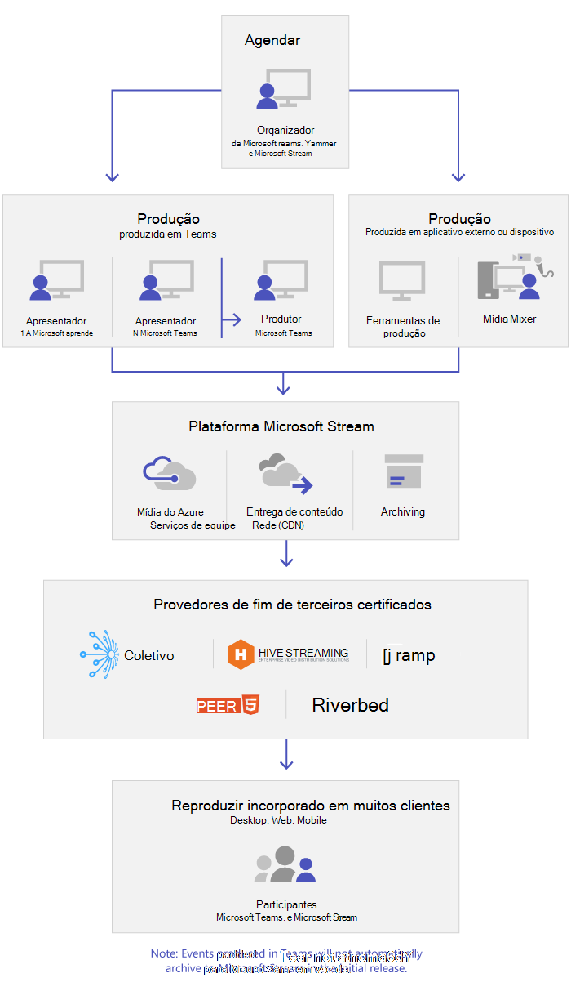
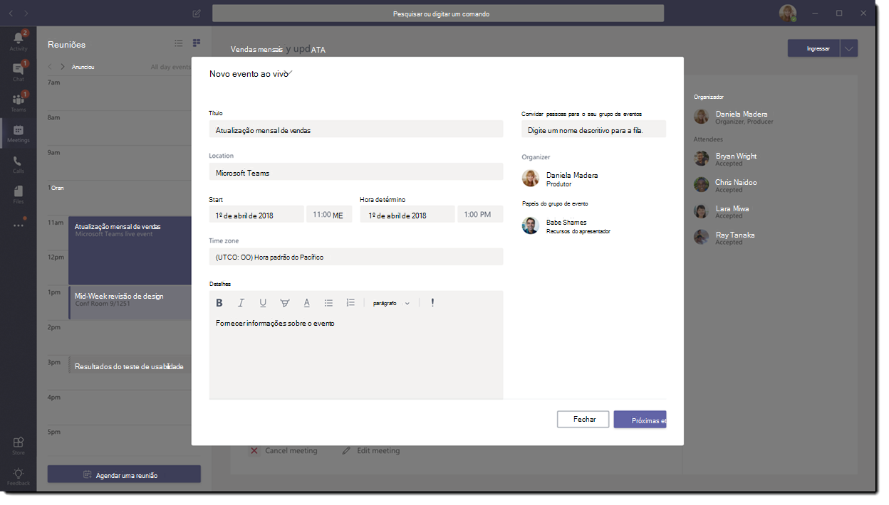

# O que são os eventos ao vivo do Microsoft Teams?

## Visão Geral

Com os eventos ao vido do Teams, os usuários em sua organização podem transmitir vídeo e conteúdo de reuniões para grandes públicos online.

Os eventos ao vivo do Microsoft 365 levam a transmissão de vídeo a um novo patamar. Os eventos ao vivo encorajam a conexão ao longo de todo o ciclo de vida do engajamento com os participantes antes, durante e depois dos eventos ao vivo. Você pode criar eventos ao vivo no local da sua audiência, da equipe ou da comunidade, usando o Microsoft Stream, o Microsoft Teams ou o Yammer.  

O Microsoft Teams entrega a colaboração baseada em chat, as chamadas, as reuniões e os eventos ao vivo, para que você possa expandir a audiência de suas reuniões. Os eventos ao vivo do Microsoft Teams são uma extensão das reuniões do Microsoft Teams, permitindo aos usuários transmitir vídeo e o conteúdo da reunião para uma grande audiência online. Os eventos ao vivo são destinados a comunicações de um-para-muitos nos quais o apresentador do evento lidera as interações e a participação da audiência é basicamente visualizar o conteúdo compartilhado pelo apresentador. Os participantes podem assistir ao evento ao vivo ou gravado no Yammer, Teams ou Stream e podem interagir com os apresentadores usando perguntas e respostas moderadas ou uma conversa do Yammer.

Os eventos ao vivo do Microsoft Teams são considerados a próxima versão da Transmissão de Reunião do Skype e substituirão os recursos fornecidos na Transmissão de Reunião do Skype. Nesse momento, a Microsoft continuará a dar suporte à Transmissão de Reunião do Skype para os usuários que estiverem usando o Skype for Business em suas organizações, sem interrupções no serviço para eventos novos ou futuros. No entanto, encorajamos você a experimentar os eventos ao vivo do Teams para usar todos os recursos novos e empolgantes, incluindo compartilhamento de tela e suporte para codificadores externos de hardware/software.

So, let's get started. First, take a look at the following diagram that shows high level components involved in Microsoft 365 live events and how they're connected.

> [!Note]
> Gostaríamos de enfatizar que os eventos ao vivo das equipes, devido à natureza da tecnologia de difusão, muitas vezes excedem as populações de reuniões normais (internas).
>
> Como é o caso de outros serviços de transmissão de mídia de maior alcance, contamos com Redes de Distribuição de Conteúdo para entregar o conteúdo do seu evento ao vivo aos destinatários. Este conteúdo é protegido por métodos de criptografia e sujeito a autorização por tokens de acesso que são emitidos apenas para destinatários com base em sua configuração de reunião de evento ao vivo.
>
> Deve-se tomar cuidado extra para garantir que o conteúdo da reunião seja apropriado para um público tão grande ou que o público seja adequadamente reduzido para conteúdo confidencial.  
>
> Como é comum na indústria, comprometer outros elementos de sua segurança, como pessoal ou infraestrutura, pode impactar a segurança de seus eventos ao vivo. As organizações devem considerar a inclusão de eventos ao vivo e outros serviços de transmissão em seus planejamentos e exercícios de segurança.

### Papeis do grupo de evento

Os eventos ao vivo no Teams capacitam várias funções (organizador, produtor, apresentador e participante) para transmitir e participar com êxito de um evento. Para saber mais, confira [Papeis de grupo de evento](https://support.office.com/article/get-started-with-microsoft-teams-live-events-d077fec2-a058-483e-9ab5-1494afda578a?ui=en-US&rs=en-US&ad=US#bkmk_roles).

## Componentes principais

Você pode ver da figura acima que existem cinco componentes principais usados com os eventos ao vivo no Microsoft Teams.

> [!NOTE]
> Para uma visão geral de como configurar eventos ao vivo e a experiência do participante, confira esses [vídeos](https://support.office.com/article/video-plan-and-schedule-a-live-event-f92363a0-6d98-46d2-bdd9-f2248075e502) curtos.

### Agendar

O Microsoft Teams permite que os organizadores criem um evento com as permissões apropriadas dos participantes, designem os membros da equipe de eventos, selecionem um método de produção e convidem participantes. Se o evento ao vivo tiver sido criado de um grupo do Yammer, os participantes do evento ao vivo poderão usar a conversa do Yammer para interagir com as pessoas no evento.

> [!IMPORTANT]
> O Teams não permite que os usuários agendem reuniões ou eventos ao vivo quando estiverem offline ou executando com largura de banda limitada.

### Produção

A entrada de vídeo é a base do evento ao vivo e pode variar de uma simples webcam a uma produção de vídeo profissional com câmera múltipla. Os eventos ao vivo no Microsoft 365 suportam um espectro de cenários de produção, incluem um evento produzido no Microsoft Teams usando uma webcam ou um evento produzido em um aplicativo ou dispositivo externo. Você pode escolher essas opções dependendo das exigências e orçamento do projeto. Há duas maneiras de produzir eventos:

- **Microsoft Teams**: esse método de produção permite aos usuários produzir seus eventos ao vivo no Microsoft Teams usando webcam ou uma entrada A/V dos sistemas de salas do Microsoft Teams. Essa opção é a melhor e mais rápida se quiser usar os dispositivos de áudio e vídeo conectados ao PC ou se estiver convidando apresentadores remotos para participar no evento. Essa opção permite aos usuários usarem suas webcams e compartilhar suas telas com facilidade como entrada no evento.

- **Aplicativo ou dispositivo externo**: codificadores externos permitem aos usuários produzirem seus eventos ao vivo diretamente de um hardware externo ou codificador baseado no software com o [Microsoft Stream](https://stream.microsoft.com). Essa é a melhor opção se você já tiver equipamento com qualidade de estúdio (por exemplo, mixers de mídia) com suporte de streaming para um serviço de Protocolo de Mensagens em Tempo Real (RMTP). Esse tipo de produção geralmente é usado em eventos em grande escala como um evento corporativo - em que um único stream de um mixer de mídia é transmitido para a audiência. 

    

>[!Note]
> The change from using Microsoft Stream to [OneDrive for Business and SharePoint for meeting recordings](../tmr-meeting-recording-change.md) will be a phased approach. At launch you'll be able to opt-in to this experience, in November you'll have to opt-out if you want to continue using Stream, and some time in early 2021 we'll require all customers to use OneDrive for Business and SharePoint for new meeting recordings.

### Plataforma de streaming

A plataforma de streaming de evento ao vivo é composta das partes a seguir:

- **Serviços de Mídia do Azure**: os [Serviços de Mídia do Azure](/azure/media-services/previous/) dão a você serviços de streaming de vídeo com qualidade de transmissão para alcançar grandes audiências nos dispositivos móveis mais populares da atualidade. Os Serviços de Mídia aprimoram a acessibilidade, distribuição e escalabilidade e tornam fácil e econômico transmitir conteúdo para suas audiências locais ou no mundo todo - ao mesmo tempo em que protege seu conteúdo.
- **Rede de Distribuição de Conteúdo do Azure (CDN)**: quando sua transmissão ao vivo começar, será distribuída através da [Rede de Distribuição de Conteúdo do Azure](/azure/cdn/). Os Serviços de Mídia do Azure fornecem CDN integrada para pontos de extremidade de streaming. Isso permite que as transmissões sejam vistas no mundo todo sem buffering.

### Rede de Distribuição de Conteúdo Corporativo (eCDN)

O objetivo do eCDN é tirar o conteúdo do vídeo da internet e distribuir o conteúdo em toda sua empresa sem impactar o desempenho da rede. Você pode usar um dos parceiros certificados eCDN a seguir para otimizar sua rede para eventos ao vivo dentro de sua organização:

- [Hive](https://www.hivestreaming.com/partners/integration-partners/microsoft/)
- [Kollective](https://kollective.com/ecdn-solutions/microsoft-live-events/)
- [Ramp](https://rampecdn.com)
- [Riverbed](https://www.riverbed.com/solutions/office-365.html)
- [Peer5](https://www.peer5.com/)

### Experiência do participante

A experiência do participante é o aspecto mais importante dos eventos ao vivo e é fundamental que os participantes possam participar no evento ao vivo sem quaisquer problemas. A experiência do participante usa o Player do Microsoft Stream (para eventos produzidos no Microsoft Teams) e o Player de Mídia do Azure (para eventos produzidos em aplicativo ou dispositivo externo) e funciona em desktop, navegador e celular (iOS e Android). O Microsoft 365 e o Office 365 fornecem o Yammer e o Microsoft Teams como dois hubs de colaboração e a experiência ao vivo do participante é integrada a essas ferramentas de colaboração.

### Relatório de uso de evento ao vivo

Os administrados do locatário podem ver a análise de uso em tempo real para os eventos ao vivo no centro de Administração do Microsoft Teams.  O [relatório de uso de evento ao vivo](../teams-analytics-and-reports/teams-live-event-usage-report.md) mostra a visão geral da atividade dos eventos ao vivo na organização.  Os administradores podem visualizar as informações de uso de evento, incluindo o status do evento, horário de início, visualizações e tipo de produção.  

## Próximas etapas

Acesse [Planejar eventos ao vivo do Microsoft Teams](plan-for-teams-live-events.md).

### Tópicos relacionados

- [Eventos ao vivo através do Microsoft 365 no Yammer, Microsoft Teams e Microsoft Stream](/stream/live-event-m365)
- [Introdução a eventos ao vivo do Microsoft Teams](https://support.office.com/article/d077fec2-a058-483e-9ab5-1494afda578a)
- [Eventos ao vivo no Yammer](https://support.office.com/article/live-events-in-yammer-4ece0ee2-c268-4636-bf2a-16e454befe57)
- [Eventos ao vivo no Microsoft Stream](/stream/live-event-overview)
