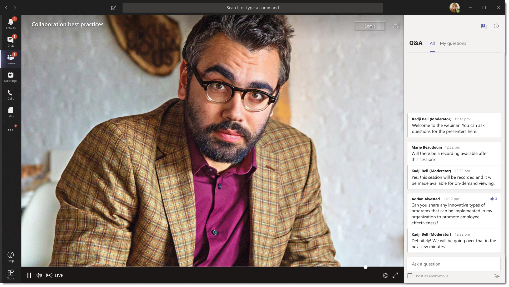

# O que são os eventos ao vivo do Microsoft Teams ?

## Visão geral

Com os eventos do teams Live, os usuários em sua organização podem transmitir conteúdo de vídeo e de reunião para grandes audiências online. 

Os eventos dinâmicos do Microsoft 365 dão transmissão de vídeo ao vivo para um novo nível, incentivando a conexão durante todo o ciclo de vida do compromisso com os participantes antes, durante e depois dos eventos ao vivo. Você pode criar um evento ao vivo em qualquer lugar em que seu público, equipe ou comunidade reside, usando o Microsoft Stream, o Teams ou o Yammer.  

O Microsoft Teams oferece colaboração, chamadas, reuniões e eventos dinâmicos baseados em chat para que você possa expandir a audiência de suas reuniões. Os eventos dinâmicos do teams são uma extensão das reuniões do Teams, permitindo que os usuários transmitam conteúdo de vídeo e de reunião para um grande público online. Elas se destinam a comunicações um-para-muitos em que o host do evento está liderando as interações e a participação da audiência é principalmente para exibir o conteúdo compartilhado por host. Os participantes podem assistir ao evento ao vivo ou ao vivo no Yammer, ao Teams e/ou ao Stream e podem interagir com os apresentadores usando uma conversa em p & ou uma conversa do Yammer moderada.

Os eventos ao vivo do teams são considerados a próxima versão da transmissão de reunião do Skype e, eventualmente, substituirão os recursos fornecidos na transmissão de reunião do Skype. A esta altura, a Microsoft continuará a oferecer suporte à transmissão de reunião do Skype para os usuários que usam o Skype for Business em suas organizações, sem interrupções em serviço para eventos novos ou futuros. No entanto, recomendamos que você experimente eventos ao vivo do teams para aproveitar todos os novos e incríveis recursos, incluindo o compartilhamento de tela e o suporte para codificadores de hardware/software externos.

Então, vamos começar. Primeiro, dê uma olhada no diagrama a seguir que mostra componentes de alto nível envolvidos em eventos dinâmicos do Microsoft 365 e como eles estão conectados. 

### Funções do grupo de eventos
Eventos dinâmicos no Microsoft Teams proporcionam várias funções (organizador, produtor, apresentador e participante) para transmitir e participar de um evento com êxito. Para saber mais, consulte [funções de grupo de eventos](https://support.office.com/article/get-started-with-microsoft-teams-live-events-d077fec2-a058-483e-9ab5-1494afda578a?ui=en-US&rs=en-US&ad=US#bkmk_roles).

## Componentes chave
Você pode ver na imagem acima que há quatro componentes principais que são usados com eventos dinâmicos no Teams.

> [!NOTE]
> Para obter uma visão geral de como configurar eventos dinâmicos e a experiência do participante, confira estes [vídeos](https://support.office.com/en-us/article/video-plan-and-schedule-a-live-event-f92363a0-6d98-46d2-bdd9-f2248075e502)curtos.

### Plano
O Microsoft Teams oferece a capacidade dos organizadores de criarem um evento com as permissões apropriadas do participante, designar os membros da equipe do evento, selecionar um método de produção e convidar participantes. Se o evento ao vivo foi criado dentro de um grupo do Yammer, os participantes do evento ao vivo poderão usar a conversa do Yammer para interagir com as pessoas no evento. 

### Preparo
A entrada de vídeo é a base do evento ao vivo e ele pode variar de uma única webcam para uma produção de vídeo profissional de várias câmeras. Os eventos dinâmicos do Microsoft 365 dão suporte a um espectro de cenários de produção, incluem um evento produzido em Teams usando uma webcam ou um evento produzido em um aplicativo ou dispositivo externo. Você pode escolher essas opções dependendo dos requisitos e do orçamento do projeto. Há duas maneiras de produzir eventos:

- **Teams**: esse método de produção permite que os usuários produzam seus eventos dinâmicos no Teams usando a webcam ou usando a entrada/V de sistemas de sala de equipe. Esta opção será a melhor e mais rápida se você quiser usar os dispositivos de áudio e de vídeo conectados ao computador ou estiver convidando os apresentadores remotos para participar do evento. Essa opção permite que os usuários usem facilmente suas webcams e compartilhem a respectiva tela como entrada no evento. 

    

- **Aplicativo ou aplicativo externo**: codificadores externos permitem que os usuários produzam seus eventos dinâmicos diretamente de um codificador de hardware externo ou baseado em software com [Stream](https://stream.microsoft.com). Essa opção é melhor se você já tiver equipamento de qualidade do estúdio (por exemplo, mixers de mídia) que dão suporte ao streaming para um serviço RTMP (protocolo de mensagens em tempo real). Esse tipo de produção geralmente é usado em grandes eventos de escala, como corredores da cidade executiva – onde um único fluxo de um mixer de mídia é transmitido para o público. 

    

### Plataforma de streaming
A plataforma de transmissão de eventos ao vivo é composta pelos seguintes itens:

- **Serviços de mídia do Azure**: os [serviços de mídia do Azure](https://docs.microsoft.com/azure/media-services/previous/) fornecem serviços de transmissão de vídeo com qualidade de transmissão para alcançar públicos maiores em dispositivos móveis mais populares do dia. O Media Services aprimora a acessibilidade, a distribuição e a escalabilidade, e torna mais fácil e econômico transmitir conteúdo para seus públicos locais ou mundiais, tudo isso enquanto protege o seu conteúdo.
- A **CDN (rede de distribuição de conteúdo) do Azure**: depois que o fluxo ficar ao vivo, ele será entregue pela [CDN (rede de distribuição de conteúdo) do Azure](https://docs.microsoft.com/azure/cdn/). Os serviços de mídia do Azure fornecem CDN integrada para pontos de extremidade de streaming. Isso permite que os fluxos sejam exibidos em todo o mundo sem buffer.

### Rede de distribuição de conteúdo corporativo (eCDN)
O objetivo do eCDN é pegar o conteúdo de vídeo da Internet e distribuir o conteúdo em toda a sua empresa sem afetar o desempenho da rede. Você pode usar um dos seguintes parceiros certificados eCDN para otimizar sua rede para eventos dinâmicos mantidos em sua organização:
- [Hive](https://www.hivestreaming.com/partners/integration-partners/microsoft/)
- [Kollective](https://kollective.com/microsoft-pilot/)
- [Gama](http://www.ramp.com)

### Experiência do participante 
A experiência do participante é o aspecto mais importante de eventos dinâmicos e é essencial que os participantes participem do evento ao vivo sem ter problemas. A experiência do participante usa o Stream Player (para eventos produzidos no Teams) e o Azure Media Player (para eventos produzidos em um aplicativo ou dispositivo externo) e funciona em toda a área de trabalho, navegador e dispositivos móveis (iOS, Android). O Office 365 fornece o Yammer e o Teams como dois hubs de colaboração, e a experiência do Live articipante está integrada a essas ferramentas de colaboração. 

### Relatório de uso de eventos ao vivo 
Administradores de locatários podem exibir a análise de uso em tempo real para eventos dinâmicos no centro de administração do Microsoft Teams.  O [relatório de uso de eventos ao vivo](../teams-analytics-and-reports/teams-live-event-usage-report.md) mostra a visão geral de atividades dos eventos dinâmicos mantidos na organização.  Os administradores podem exibir informações de uso de eventos, incluindo status do evento, hora de início, modos de exibição e tipo de produção.  

## Próximas etapas
Vá para [plano para eventos do teams Live](plan-for-teams-live-events.md).

### Tópicos relacionados
- [Eventos ao vivo na Microsoft 365 no Yammer, Microsoft Teams e Microsoft Stream](https://docs.microsoft.com/stream/live-event-m365)
- [Comece a usar o Microsoft Teams Live eventos](https://support.office.com/article/d077fec2-a058-483e-9ab5-1494afda578a)
- [Eventos ao vivo no Yammer](https://support.office.com/article/live-events-in-yammer-4ece0ee2-c268-4636-bf2a-16e454befe57)
- [Eventos dinâmicos no Microsoft Stream](https://docs.microsoft.com/stream/live-event-overview)

 
