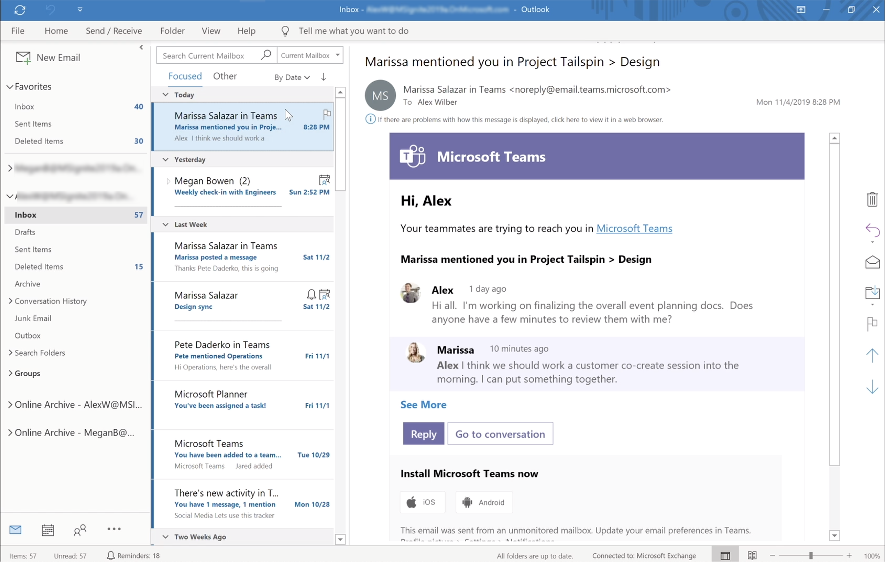
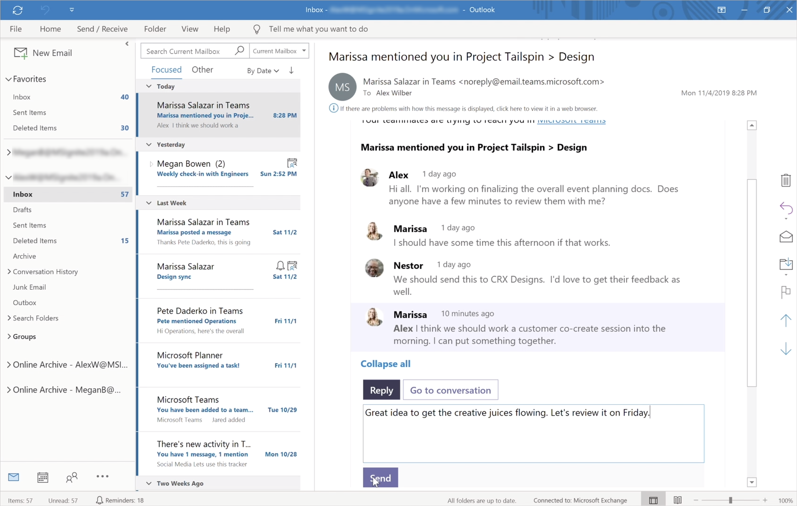

# Teams e Outlook de email

Microsoft Teams inclui recursos que facilitam que os usuários em sua organização compartilhem informações entre email no Outlook e conversas de chat ou canal no Teams e fiquem por dentro das conversas perdidas. Este artigo fornece uma visão geral desses recursos e os controles de administrador que se aplicam.

## Compartilhar com Outlook

**O compartilhamento Outlook** permite que os usuários compartilhem uma cópia de uma conversa Teams para um email no Outlook, sem precisar sair Teams. Esse recurso é útil se os usuários precisam compartilhar conversas ou atualizações de status com usuários fora de sua equipe imediata ou até mesmo sua organização. Vá para a parte superior da conversa em Teams, selecione **̇ ̇ ̇ Mais** opções e selecione **Compartilhar para Outlook**.  Para saber mais, confira [Compartilhar para Outlook de Teams](https://support.office.com/article/share-to-outlook-from-teams-f9dabbe9-9e9b-4e35-99dd-2eeeb67c4f6d).

Para usar esse recurso, Outlook na Web deve ser ligado para o usuário. Se Outlook na Web estiver desligada, **a opção Compartilhar** para Outlook não será exibida no Teams para o usuário. Para ver as etapas sobre como ativar e desativar Outlook na Web, consulte Habilitar ou [desabilitar Outlook na Web para uma caixa de correio](/exchange/recipients-in-exchange-online/manage-user-mailboxes/enable-or-disable-outlook-web-app).

## Emails de atividade a ação

Os usuários receberão automaticamente emails de atividade perdida ativos que os ajudam a acompanhar as conversas perdidas Teams. Os emails de atividade perdida mostram as respostas mais recentes de uma conversa, incluindo mensagens enviadas após a mensagem perdida, e os usuários podem clicar em **Responder** para responder diretamente de dentro Outlook. Para saber mais, confira [Responder aos emails de atividade perdidas Outlook](https://support.office.com/article/reply-to-missed-activity-emails-from-outlook-bc0cf587-db26-4946-aac7-8eebd84f1381). 

> [!NOTE]
> Esse recurso não é suportado em Outlook para Mac ou em algumas versões mais antigas do Outlook para Windows. Para obter mais informações, consulte [Mensagens ativas em Outlook e Office 365 Grupos](/outlook/actionable-messages/).

Você pode usar o cmdlet [Set-OrganizationConfig](/powershell/module/exchange/organization/set-organizationconfig) juntamente com o parâmetro **SmtpActionableMessagesEnabled** para desativar emails ativas. Por padrão, o parâmetro **SmtpActionableMessagesEnabled** é definido como **true**. A configuração do parâmetro como **false** desliga mensagens de email ativas em Office 365. Para Teams usuários, isso significa que a opção **Responder** para responder diretamente Outlook não está disponível em emails de atividade perdida. Em vez disso, os emails de atividade perdida incluem uma **opção Responder Teams** para os usuários responderem Teams.

Consulte também [Mensagens ativas em Outlook e Office 365 Grupos](/outlook/actionable-messages/).
