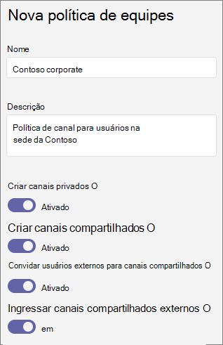

# Gerenciar políticas de canal no Microsoft Teams

Como administrador, você pode usar políticas no Microsoft Teams para controlar o que os usuários da sua organização podem fazer em equipes e canais. Por exemplo, você pode definir se os usuários podem criar canais privados ou compartilhados.

Você gerencia as políticas de equipe acessando as **políticas** do **Teams** >  Teams no centro de administração do Microsoft Teams. Você pode usar a política global (padrão para toda a organização) ou criar e atribuir políticas personalizadas. Os usuários em sua organização obterão automaticamente a política global, a menos que você crie e atribua uma política personalizada.

Você pode editar a política global ou criar e atribuir uma política personalizada. Depois de editar a política global ou atribuir uma política, pode levar 24 horas para que as alterações entrem em vigor.

## Políticas de canal

As seguintes políticas estão disponíveis para canais de equipe:

|Política|Descrição|
|:-----|:----------|
|**Criar canais privados**|Quando **Ativado**, proprietários e membros da equipe podem criar canais privados. (Os proprietários da equipe podem controlar se os membros puderem criar canais privados em cada equipe.)|
|**Criar canais compartilhados**|Quando **Ativado**, os proprietários da equipe podem criar canais compartilhados. Os aplicativos do Teams disponíveis para sua organização também estão disponíveis em canais compartilhados.|
|**Convidar usuários externos para canais compartilhados**|Quando **Ativado**, proprietários e membros de canais compartilhados podem convidar participantes externos de organizações em que uma confiança entre organizações foi configurada. As políticas do Teams para sua organização se aplicam a esses canais.|
|**Ingressar em canais compartilhados externos**|Quando **Ativado**, os usuários podem participar de canais compartilhados criados por outras organizações em que uma confiança entre organizações foi configurada. As políticas do Teams para a outra organização se aplicam a esses canais.|

## Criar uma política de equipe personalizada

1. Na navegação à esquerda do centro de administração do Microsoft Teams, acesse **políticas** do **Teams** >  Teams.
2. Clique em **Adicionar**.
3. Insira um nome e uma descrição para a política.

    
4. Ative ou desative as configurações desejadas e clique em **Salvar**.

5. Clique em **Salvar**.

## Editar uma política de equipe

Você pode editar a política global ou quaisquer políticas personalizadas que você criar.

1. Na navegação à esquerda do centro de administração do Microsoft Teams, acesse **políticas** do **Teams** >  Teams.
2. Selecione a política clicando à esquerda do nome da política e, a seguir, clique em **Editar**.
3. Ative ou desative as configurações desejadas e clique em **Salvar**.

## Atribuir uma política de equipe personalizada aos usuários

[!INCLUDE [assign-policy](includes/assign-policy.md)]

## Tópicos relacionados

[Gerenciar sites conectados do Teams e sites de canal](/SharePoint/teams-connected-sites)

[Canais privados no Teams](private-channels.md)

[Atribua políticas a seus usuários no Teams](policy-assignment-overview.md)

[New-CsTeamsChannelsPolicy](/powershell/module/skype/new-csteamschannelspolicy)
