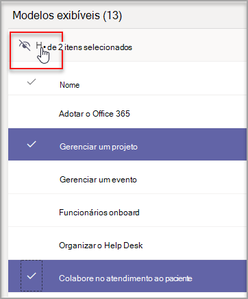
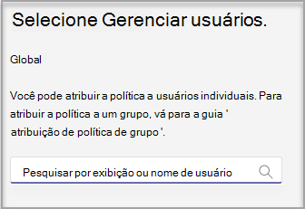

# Gerenciar modelos de equipe no centro de administração

Gerencie os modelos de equipe que os usuários finais veem criando políticas de modelos no centro de administração. Em cada política de modelo, você pode designar quais modelos são mostrados ou ocultos.
Atribua usuários diferentes a políticas de modelo diferentes para que seus usuários visualizam apenas o subconjunto de modelos de equipe especificados.

Assista a este breve vídeo para saber como gerenciar políticas de modelo.

> [!VIDEO https://www.microsoft.com/videoplayer/embed/RWyXL9]

## Criar políticas de modelo e atribuir modelos disponíveis

1. Entre no Centro de administração do Teams.

2. **Expanda Teams** >  **políticasTemplates**.

3. Selecione **Adicionar**.

    

1. Na seção **Políticas de Modelos Configurações**, preencha os seguintes campos:

    - Nome da Política de Modelos

    - Descrição curta da Política de Modelos

2. Na tabela **Modelos Exibiveis** , selecione os modelos que você deseja ocultar e selecione **Ocultar**.

    

    Você pode ver os modelos selecionados para ocultar na tabela **Modelos Ocultos** .

1. Para desaconsule determinados modelos, role até **a tabela Modelos ocultos** .

2. Selecione os modelos a ser desaconsudidados e selecione **Mostrar**.

   

   Os modelos selecionados serão exibidos na tabela **Modelos Exibiveis** .
3. Selecione **Salvar**.

   Sua nova política de modelo é exibida na lista **Políticas de** Modelos.

## Atribuir usuários às políticas de modelo

Os usuários atribuídos a uma política só poderão exibir os modelos que podem ser visualizados nessa política.

1. Em **Políticas de Modelos**, selecione uma política e selecione **Gerenciar usuários**.

2. Digite os usuários a atribuir a essa política.

   

3. Selecione **Aplicar**.

> [!Note]
> Pode levar até 24 horas para que sua nova política entre em vigor para os usuários finais.

## Limites de tamanho para políticas de modelo

Você pode ocultar um máximo de 100 modelos por política. O **botão Ocultar** será desabilitado se a política determinada já tiver 100 modelos ocultos.

## Perguntas frequentes

**P: Posso atribuir usuários em lote a políticas de modelos de equipe?**
  
R: Sim, suportamos a atribuição em lote para a política de modelo no PowerShell. O tipo de política dessa ação é TeamsTemplatePermissionPolicy. [Saber mais](/powershell/module/teams/new-csbatchpolicyassignmentoperation)

**P: Os grupos podem ser atribuídos às políticas de modelos de equipe?**

R: Atualmente não. Essa funcionalidade estará disponível no futuro.

**P: Se um novo modelo for criado, o modelo será incluído em minhas políticas?**

R: Todos os novos modelos estarão visíveis por padrão. Você pode optar por ocultar o modelo no centro de administração na seção Políticas de Modelos.

**P: O que acontece se um modelo for excluído?**

R: Quaisquer modelos excluídos não estarão mais presentes em nenhuma política de modelos.

**P: Posso atribuir vários usuários a uma política de modelo no Teams Admin Center?**

R: Sim.

1. No Centro de administração, vá para **Usuários**.
1. Na tabela de lista Usuários, selecione os usuários que você deseja atribuir a uma determinada política de modelos.
1. Selecione Editar configurações e altere o campo Políticas de modelos.
1. Selecione aplicar. [Saiba mais](./assign-policies-users-and-groups.md#assign-a-policy-to-a-batch-of-users).

**P: Como vejo todos os usuários atribuídos a uma política específica?**

R: No Centro de administração:

1. Vá para a **seção Usuários** .
2. Selecione o filtro na tabela de lista Usuários e filtre a política de modelo de equipe.
3. Selecione **Aplicar**.

**P: Posso gerenciar políticas de modelos por meio do PowerShell?**

R: Não há suporte para gerenciar modelos no PowerShell.

**P: As políticas de modelos são aplicáveis ao EDU?**

R: Não, não há suporte para políticas de modelo para EDU.

## Tópicos relacionados

- [Começar a usar modelos de equipe no centro de administração](./get-started-with-teams-templates-in-the-admin-console.md)

- [Criar um modelo de equipe personalizado](./create-a-team-template.md)

- [Criar um modelo de uma equipe existente](./create-template-from-existing-team.md)

- [Criar um modelo de equipe a partir de um modelo de equipe existente](./create-template-from-existing-template.md)

- [Atribuir políticas aos usuários em Microsoft Teams - Microsoft Teams \| Microsoft Docs](./policy-assignment-overview.md)

- [Atribuir em lotes usuários a uma política](/powershell/module/teams/new-csbatchpolicyassignmentoperation)
