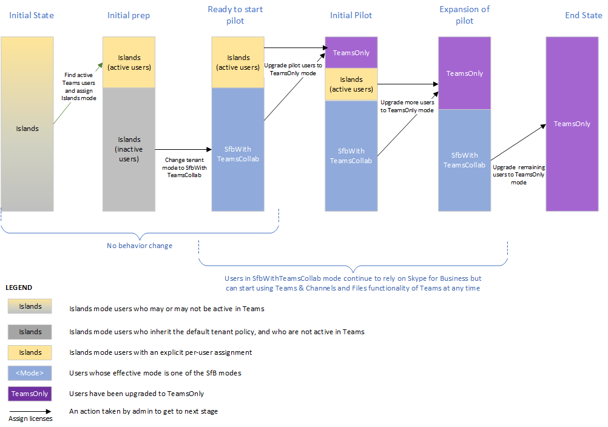

# <a name="upgrade-strategies-for-it-administrators"></a>Estratégias de atualização para administradores de IT


Este artigo é para administradores de IT que querem implementar sua atualização para Teams de Skype for Business.

Antes de implementar sua atualização, recomendamos os seguintes artigos que descrevem conceitos de atualização importantes e comportamentos de coexistência:

- [Compreender Microsoft Teams e Skype for Business coexistência e interoperabilidade](teams-and-skypeforbusiness-coexistence-and-interoperability.md)
- [Modos de coexistência - Referência](migration-interop-guidance-for-teams-with-skype.md)
- [Experiência e conformidade do cliente do Teams a modos de coexistência](teams-client-experience-and-conformance-to-coexistence-modes.md)

## <a name="upgrade-options"></a>Opções de atualização

Esta seção descreve como implementar sua atualização usando uma das seguintes opções de atualização:

- [Atualização de recursos sobrepostos (usando o modo Ilhas)](#overlapping-capabilities-upgrade-using-islands-mode)
- [Uma atualização de recursos selecionados para uma organização que ainda não começou a usar Teams](#a-select-capabilities-upgrade-for-an-organization-that-has-not-yet-started-using-teams)
- [Uma atualização de recursos selecionados para uma organização que já está usando Teams no modo Ilhas](#a-select-capabilities-upgrade-for-an-organization-that-is-already-using-teams-in-islands-mode)

Se você precisar de mais informações sobre as opções, certifique-se de já ter lido Escolher sua jornada de atualização de Skype for Business [para Teams](upgrade-and-coexistence-of-skypeforbusiness-and-teams.md).

## <a name="overlapping-capabilities-upgrade-using-islands-mode"></a>Atualização de recursos sobrepostos (usando o modo Ilhas)

Para a opção de atualização de recursos sobrepostos:

- Considere essa opção se você puder fazer uma atualização rápida para sua organização geral.  Como há um risco potencial de confusão para os usuários finais com a execução de ambos os clientes, é melhor minimizar o período durante o qual os usuários devem executar ambos os clientes. Você deve garantir que seus usuários saibam executar ambos os clientes.

- Essa opção é o modelo fora da caixa e não exige que a ação do administrador seja iniciada com Teams exceto para atribuir a licença Microsoft 365 ou Office 365. Se os usuários já Skype for Business online, você já pode estar nesse modelo.

- Pode ser um desafio sair do modo de recursos sobrepostos e mudar para o TeamsOnly. Como os usuários atualizados só se comunicam Teams, qualquer outro usuário na organização que se comunica com esse usuário deve estar usando Teams.  Se você tiver usuários que não começaram a usar Teams, eles serão expostos a mensagens ausentes. Além disso, eles não verão os usuários do TeamsOnly online no Skype for Business. Algumas organizações optam por fazer uma atualização em todo o locatário usando a política global tenant para evitar isso, no entanto, isso requer planejamento antecipado, bem como aguardar até que todos os usuários estão prontos para serem atualizados.


## <a name="a-select-capabilities-upgrade-for-an-organization-that-has-not-yet-started-using-teams"></a>Uma atualização de recursos selecionados para uma organização que ainda não começou a usar Teams

Se a sua organização ainda não tiver usuários ativos no Teams, a primeira etapa é definir a política de locatário padrão para TeamsUpgradePolicy como um dos modos Skype for Business, por exemplo, SfbWithTeamsCollab.  Os usuários que ainda não começaram a usar Teams não notam nenhuma diferença no comportamento. No entanto, a configuração dessa política no nível do locatário possibilita iniciar a atualização de usuários para o modo TeamsOnly e garante que os usuários atualizados ainda possam se comunicar com usuários não atualizados.  Depois de identificar seus usuários piloto, você pode atualiza-los para o TeamsOnly.  Se eles estão no local, use Move-CsUser. Se eles estão online, basta atribuir o modo TeamsOnly usando Grant-CsTeamsUpgradePolicy. Por padrão, todas as Skype for Business agendadas por esses usuários serão migradas para Teams.

A seguir estão os comandos principais:

1. De definir o padrão de todo o locatário para o modo SfbWithTeamsCollab da seguinte forma:

   ```PowerShell
   Grant-CsTeamsUpgradePolicy -PolicyName SfbWithTeamsCollab -Global
   ```

2. Atualize os usuários piloto para o TeamsOnly da seguinte maneira:

   - Para um usuário que está online:

     ```PowerShell
     Grant-CsTeamsUpgradePolicy -PolicyName UpgradeToTeams -Identity $username 
     ```

   - Para um usuário que está no local:

     ```PowerShell
     Move-CsUser -identity $user -Target sipfed.online.lync.com -MoveToTeams -credential $cred 
     ```

Observações
 
- Em vez de definir a política de todo o locatário como SfbWithTeamsCollab, você pode defini-la como SfbWithTeamsCollabAndMeetings. Isso faz com que todos os usuários agendem todas as novas reuniões Teams.
- Por padrão, Skype for Business reuniões são migradas para Teams ao atualizar para o modo TeamsOnly ou ao atribuir o modo SfbWithTeamsCollabAndMeetings.  

> [!NOTE]
> Em preparação para a próxima reforma do Skype for Business Online, a Microsoft simplificou a forma como as organizações se movem para Teams. Não é mais necessário especificar a opção para mover os usuários diretamente do local diretamente `-MoveToTeams` `Move-CsUser` para o TeamsOnly. Anteriormente, se essa opção não fosse especificada, os usuários tinham feito a transição da sua residência no Skype for Business Server local para o Skype for Business Online, e o modo permaneceu inalterado. Agora, ao mover um usuário do local para a nuvem com , os usuários são atribuídos automaticamente ao modo TeamsOnly e suas reuniões do local são automaticamente convertidas em reuniões Teams, como se o , independentemente de a opção ser `Move-CsUser` `-MoveToTeams switch had been specified` realmente especificada. Esse comportamento está disponível em todas as versões do Skype For Business Server e do Lync Server 2013 (que nunca tiveram suporte para `-MoveToTeams` ).

O diagrama a seguir mostra as fases conceituais da atualização de recursos selecionados para uma organização sem uso anterior de Teams. A altura das barras representa o número de usuários. Durante qualquer fase da atualização, todos os usuários podem se comunicar uns com os outros.  Skype for Business se comunicam com usuários do TeamsOnly usando o Interop e vice-versa. Os usuários no modo Ilhas devem ter certeza de executar ambos os clientes.


## <a name="a-select-capabilities-upgrade-for-an-organization-that-is-already-using-teams-in-islands-mode"></a>Uma atualização de recursos selecionados para uma organização que já está usando Teams no modo Ilhas

Se alguns usuários em sua organização estão usando ativamente Teams no modo Ilhas, você provavelmente não deseja remover a funcionalidade dos usuários existentes. Portanto, uma etapa extra é necessária antes de alterar a política de todo o locatário. A solução é "avô" desses usuários Teams existentes no modo Ilhas, antes de definir a política de todo o locatário como SfbWithTeamsCollab.  Depois de fazer isso, você pode prosseguir com a implantação como acima, no entanto, você terá dois grupos de usuários que estão mudando para o TeamsOnly: os usuários que estavam ativos no Teams estarão no modo Ilhas e os usuários restantes estarão no modo SfbWithTeamsCollab. Você pode mover progressivamente esses usuários para o modo TeamsOnly.

1. Encontre usuários que estão ativos Teams a seguir:

   1. No Centro de administração do Microsoft 365, na navegação à esquerda, vá para Relatórios e, em seguida, Uso. 
   2. No menu suspenso "Selecionar um relatório", escolha Microsoft Teams e, em seguida, Atividade do Usuário. Isso fornecerá uma tabela exportável de usuários que tenham sido ativos Teams. 
   3. Clique em Exportar, abra Excel e filtre para mostrar somente os usuários que estão ativos Teams.

2. Para cada usuário Teams ativo encontrado na etapa 1, atribua-lhes o modo Ilhas no PowerShell remoto. Isso permite que você vá para a próxima etapa e garante que você não altere a experiência do usuário.  

   ```PowerShell
   $users=get-content “C:\MyPath\users.txt” 
    foreach ($user in $users){ 
    Grant-CsTeamsUpgradePolicy -identity $user -PolicyName Islands} 
   ```

3. De definir a política de todo o locatário como SfbWithTeamsCollab:

   ```PowerShell
   Grant-CsTeamsUpgradePolicy -Global -PolicyName SfbWithTeamsCollab 
   ```

4. Atualize os usuários selecionados para o modo TeamsOnly. Você pode optar por atualizar usuários no modo Ilhas ou no modo SfbWithTeamsCollab, embora você queira priorizar a atualização dos usuários no modo Ilhas primeiro para minimizar o potencial de confusão que pode surgir quando os usuários estão no modo Ilhas.   

   Para usuários que estão no Skype for Business Online:  

   ```PowerShell
   Grant-CsTeamsUpgradePolicy -Identity $user -PolicyName UpgradeToTeams 
   ```

   Para usuários que estão Skype for Business Server local:  

   ```PowerShell
   Move-CsUser -Identity $user -Target sipfed.online.lync.com -MoveToTeams -credential $cred 
   ```

O diagrama a seguir mostra as fases conceituais de uma transição de recursos selecionados na qual há usuários ativos das Ilhas no início. A altura das barras representa o número de usuários. Durante qualquer fase da atualização, todos os usuários podem se comunicar uns com os outros.  Skype for Business os usuários se comunicam com usuários do TeamsOnly usando a interop e vice-versa. 




   


## <a name="related-links"></a>Links relacionados

[Orientações de migração e interoperabilidade para organizações que usam o Teams em conjunto com o Skype for Business](migration-interop-guidance-for-teams-with-skype.md) 

[Configurar conectividade híbrida entre Skype for Business Server e Microsoft 365 ou Office 365](/SkypeForBusiness/hybrid/configure-hybrid-connectivity)

[Mover os usuários entre um ambiente local e a nuvem](/SkypeForBusiness/hybrid/move-users-between-on-premises-and-cloud)

[Definir suas configurações de coexistência e atualização](setting-your-coexistence-and-upgrade-settings.md)

[Grant-CsTeamsUpgradePolicy](/powershell/module/skype/grant-csteamsupgradepolicy?view=skype-ps)

[Usando o Meeting Migration Service (MMS)](/skypeforbusiness/audio-conferencing-in-office-365/setting-up-the-meeting-migration-service-mms)
