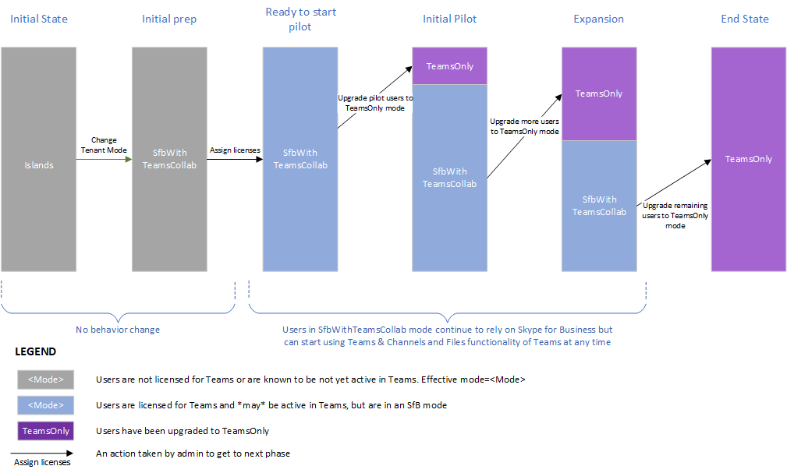

# <a name="upgrade-strategies-for-it-administrators"></a><span data-ttu-id="2fe36-103">Estratégias de atualização para administradores de IT</span><span class="sxs-lookup"><span data-stu-id="2fe36-103">Upgrade strategies for IT administrators</span></span>

<span data-ttu-id="2fe36-104"></span><span class="sxs-lookup"><span data-stu-id="2fe36-104"></span></span>

<span data-ttu-id="2fe36-105">Este artigo é para administradores de IT que querem implementar sua atualização para Teams de Skype for Business.</span><span class="sxs-lookup"><span data-stu-id="2fe36-105">This article is for IT administrators who want to implement their upgrade to Teams from Skype for Business.</span></span>

<span data-ttu-id="2fe36-106">Antes de implementar sua atualização, recomendamos os seguintes artigos que descrevem conceitos de atualização importantes e comportamentos de coexistência:</span><span class="sxs-lookup"><span data-stu-id="2fe36-106">Before implementing your upgrade, we recommend the following articles which describe important upgrade concepts and coexistence behaviors:</span></span>

- [<span data-ttu-id="2fe36-107">Compreender Microsoft Teams e Skype for Business coexistência e interoperabilidade</span><span class="sxs-lookup"><span data-stu-id="2fe36-107">Understand Microsoft Teams and Skype for Business coexistence and interoperability</span></span>](teams-and-skypeforbusiness-coexistence-and-interoperability.md)
- [<span data-ttu-id="2fe36-108">Modos de coexistência - Referência</span><span class="sxs-lookup"><span data-stu-id="2fe36-108">Coexistence modes - Reference</span></span>](migration-interop-guidance-for-teams-with-skype.md)
- [<span data-ttu-id="2fe36-109">Experiência e conformidade do cliente do Teams a modos de coexistência</span><span class="sxs-lookup"><span data-stu-id="2fe36-109">Teams client experience and conformance to coexistence modes</span></span>](teams-client-experience-and-conformance-to-coexistence-modes.md)

## <a name="upgrade-options"></a><span data-ttu-id="2fe36-110">Opções de atualização</span><span class="sxs-lookup"><span data-stu-id="2fe36-110">Upgrade options</span></span>

<span data-ttu-id="2fe36-111">Esta seção descreve como implementar sua atualização usando uma das seguintes opções de atualização:</span><span class="sxs-lookup"><span data-stu-id="2fe36-111">This section describes how to implement your upgrade by using one of the following upgrade options:</span></span>

- [<span data-ttu-id="2fe36-112">Atualização de recursos sobrepostos (usando o modo Ilhas)</span><span class="sxs-lookup"><span data-stu-id="2fe36-112">Overlapping capabilities upgrade (using Islands mode)</span></span>](#overlapping-capabilities-upgrade-using-islands-mode)
- [<span data-ttu-id="2fe36-113">Uma atualização de recursos selecionados para uma organização que ainda não começou a usar Teams</span><span class="sxs-lookup"><span data-stu-id="2fe36-113">A select capabilities upgrade for an organization that has not yet started using Teams</span></span>](#a-select-capabilities-upgrade-for-an-organization-that-has-not-yet-started-using-teams)
- [<span data-ttu-id="2fe36-114">Uma atualização de recursos selecionados para uma organização que já está usando Teams no modo Ilhas</span><span class="sxs-lookup"><span data-stu-id="2fe36-114">A select capabilities upgrade for an organization that is already using Teams in Islands mode</span></span>](#a-select-capabilities-upgrade-for-an-organization-that-is-already-using-teams-in-islands-mode)

<span data-ttu-id="2fe36-115">Se você precisar de mais informações sobre as opções, certifique-se de já ter lido Escolher sua jornada de atualização de Skype for Business [para Teams](upgrade-and-coexistence-of-skypeforbusiness-and-teams.md).</span><span class="sxs-lookup"><span data-stu-id="2fe36-115">If you need more information about the options, make sure you have already read [Choose your upgrade journey from Skype for Business to Teams](upgrade-and-coexistence-of-skypeforbusiness-and-teams.md).</span></span>

## <a name="overlapping-capabilities-upgrade-using-islands-mode"></a><span data-ttu-id="2fe36-116">Atualização de recursos sobrepostos (usando o modo Ilhas)</span><span class="sxs-lookup"><span data-stu-id="2fe36-116">Overlapping capabilities upgrade (using Islands mode)</span></span>

<span data-ttu-id="2fe36-117">Para a opção de atualização de recursos sobrepostos:</span><span class="sxs-lookup"><span data-stu-id="2fe36-117">For the overlapping capabilities upgrade option:</span></span>

- <span data-ttu-id="2fe36-118">Considere essa opção se você puder fazer uma atualização rápida para sua organização geral.</span><span class="sxs-lookup"><span data-stu-id="2fe36-118">Consider this option if you can do a fast upgrade for your overall organization.</span></span>  <span data-ttu-id="2fe36-119">Como há um risco potencial de confusão para os usuários finais com a execução de ambos os clientes, é melhor minimizar o período durante o qual os usuários devem executar ambos os clientes.</span><span class="sxs-lookup"><span data-stu-id="2fe36-119">Since there is potential risk of confusion for end users with running both clients, it’s best if you can minimize the time period during which users must run both clients.</span></span> <span data-ttu-id="2fe36-120">Você deve garantir que seus usuários saibam executar ambos os clientes.</span><span class="sxs-lookup"><span data-stu-id="2fe36-120">You should ensure your users know to run both clients.</span></span>

- <span data-ttu-id="2fe36-121">Essa opção é o modelo fora da caixa e não exige que a ação do administrador seja iniciada com Teams exceto para atribuir a licença Microsoft 365 ou Office 365.</span><span class="sxs-lookup"><span data-stu-id="2fe36-121">This option is the out-of-the box model, and doesn’t require administrator action to get started with Teams except to assign the Microsoft 365 or Office 365 license.</span></span> <span data-ttu-id="2fe36-122">Se os usuários já Skype for Business online, você já pode estar nesse modelo.</span><span class="sxs-lookup"><span data-stu-id="2fe36-122">If your users already have Skype for Business Online, you may already be in this model.</span></span>

- <span data-ttu-id="2fe36-123">Pode ser um desafio sair do modo de recursos sobrepostos e mudar para o TeamsOnly.</span><span class="sxs-lookup"><span data-stu-id="2fe36-123">It can be challenging getting out of overlapping capabilities mode and moving to TeamsOnly.</span></span> <span data-ttu-id="2fe36-124">Como os usuários atualizados só se comunicam Teams, qualquer outro usuário na organização que se comunica com esse usuário deve estar usando Teams.</span><span class="sxs-lookup"><span data-stu-id="2fe36-124">Because upgraded users only communicate via Teams, any other user in the organization communicating with that user must be using Teams.</span></span>  <span data-ttu-id="2fe36-125">Se você tiver usuários que não começaram a usar Teams, eles serão expostos a mensagens ausentes.</span><span class="sxs-lookup"><span data-stu-id="2fe36-125">If you have users that have not started using Teams, they will be exposed to missing messages.</span></span> <span data-ttu-id="2fe36-126">Além disso, eles não verão os usuários do TeamsOnly online no Skype for Business.</span><span class="sxs-lookup"><span data-stu-id="2fe36-126">Furthermore, they won’t see the TeamsOnly users online in Skype for Business.</span></span> <span data-ttu-id="2fe36-127">Algumas organizações optam por fazer uma atualização em todo o locatário usando a política global tenant para evitar isso, no entanto, isso requer planejamento antecipado, bem como aguardar até que todos os usuários estão prontos para serem atualizados.</span><span class="sxs-lookup"><span data-stu-id="2fe36-127">Some organizations choose to do a tenant-wide upgrade using the Tenant global policy to avoid this, however that requires upfront planning as well as waiting until all users are ready to be upgraded.</span></span>


## <a name="a-select-capabilities-upgrade-for-an-organization-that-has-not-yet-started-using-teams"></a><span data-ttu-id="2fe36-128">Uma atualização de recursos selecionados para uma organização que ainda não começou a usar Teams</span><span class="sxs-lookup"><span data-stu-id="2fe36-128">A select capabilities upgrade for an organization that has not yet started using Teams</span></span>

<span data-ttu-id="2fe36-129">Se a sua organização ainda não tiver usuários ativos no Teams, a primeira etapa é definir a política de locatário padrão para TeamsUpgradePolicy como um dos modos Skype for Business, por exemplo, SfbWithTeamsCollab.</span><span class="sxs-lookup"><span data-stu-id="2fe36-129">If your organization does not yet have any active users in Teams, the first step is to set the default tenant-wide policy for TeamsUpgradePolicy to one of the Skype for Business modes, for example, SfbWithTeamsCollab.</span></span>  <span data-ttu-id="2fe36-130">Os usuários que ainda não começaram a usar Teams não notam nenhuma diferença no comportamento.</span><span class="sxs-lookup"><span data-stu-id="2fe36-130">Users who have not yet started using Teams won’t notice any difference in behavior.</span></span> <span data-ttu-id="2fe36-131">No entanto, a configuração dessa política no nível do locatário possibilita iniciar a atualização de usuários para o modo TeamsOnly e garante que os usuários atualizados ainda possam se comunicar com usuários não atualizados.</span><span class="sxs-lookup"><span data-stu-id="2fe36-131">However, setting this policy at the tenant level makes it possible to start upgrading users to TeamsOnly mode, and ensures that the upgraded users can still communicate with non-upgraded users.</span></span>  <span data-ttu-id="2fe36-132">Depois de identificar seus usuários piloto, você pode atualiza-los para o TeamsOnly.</span><span class="sxs-lookup"><span data-stu-id="2fe36-132">Once you have identified your pilot users you can upgrade them to TeamsOnly.</span></span>  <span data-ttu-id="2fe36-133">Se eles estão no local, use Move-CsUser.</span><span class="sxs-lookup"><span data-stu-id="2fe36-133">If they are on-premises, use Move-CsUser.</span></span> <span data-ttu-id="2fe36-134">Se eles estão online, basta atribuir o modo TeamsOnly usando Grant-CsTeamsUpgradePolicy.</span><span class="sxs-lookup"><span data-stu-id="2fe36-134">If they are online, simply assign them TeamsOnly mode by using Grant-CsTeamsUpgradePolicy.</span></span> <span data-ttu-id="2fe36-135">Por padrão, todas as Skype for Business agendadas por esses usuários serão migradas para Teams.</span><span class="sxs-lookup"><span data-stu-id="2fe36-135">By default, any Skype for Business meetings scheduled by these users will be migrated to Teams.</span></span>

<span data-ttu-id="2fe36-136">A seguir estão os comandos principais:</span><span class="sxs-lookup"><span data-stu-id="2fe36-136">Following are the key commands:</span></span>

1. <span data-ttu-id="2fe36-137">De definir o padrão de todo o locatário para o modo SfbWithTeamsCollab da seguinte forma:</span><span class="sxs-lookup"><span data-stu-id="2fe36-137">Set the tenant-wide default to mode SfbWithTeamsCollab as follows:</span></span>

   ```PowerShell
   Grant-CsTeamsUpgradePolicy -PolicyName SfbWithTeamsCollab -Global
   ```

2. <span data-ttu-id="2fe36-138">Atualize os usuários piloto para o TeamsOnly da seguinte maneira:</span><span class="sxs-lookup"><span data-stu-id="2fe36-138">Upgrade the pilot users to TeamsOnly as follows:</span></span>

   - <span data-ttu-id="2fe36-139">Para um usuário que está online:</span><span class="sxs-lookup"><span data-stu-id="2fe36-139">For a user who is online:</span></span>

     ```PowerShell
     Grant-CsTeamsUpgradePolicy -PolicyName UpgradeToTeams -Identity $username 
     ```

   - <span data-ttu-id="2fe36-140">Para um usuário que está no local:</span><span class="sxs-lookup"><span data-stu-id="2fe36-140">For a user who is on-premises:</span></span>

     ```PowerShell
     Move-CsUser -identity $user -Target sipfed.online.lync.com -MoveToTeams -credential $cred 
     ```

<span data-ttu-id="2fe36-141">Observações</span><span class="sxs-lookup"><span data-stu-id="2fe36-141">Notes</span></span>
 
- <span data-ttu-id="2fe36-142">Em vez de definir a política de todo o locatário como SfbWithTeamsCollab, você pode defini-la como SfbWithTeamsCollabAndMeetings.</span><span class="sxs-lookup"><span data-stu-id="2fe36-142">Instead of setting the tenant-wide policy to SfbWithTeamsCollab, you could set it to SfbWithTeamsCollabAndMeetings.</span></span> <span data-ttu-id="2fe36-143">Isso faz com que todos os usuários agendem todas as novas reuniões Teams.</span><span class="sxs-lookup"><span data-stu-id="2fe36-143">This causes all users to schedule all new meetings in Teams.</span></span>
- <span data-ttu-id="2fe36-144">`Move-CsUser` é um cmdlet nas ferramentas locais.</span><span class="sxs-lookup"><span data-stu-id="2fe36-144">`Move-CsUser` is a cmdlet in the on-premises tools.</span></span> <span data-ttu-id="2fe36-145">A `MoveToTeams` opção requer Skype for Business Server 2019 ou Skype for Business Server 2015 com CU8 ou posterior.</span><span class="sxs-lookup"><span data-stu-id="2fe36-145">The `MoveToTeams` switch requires Skype for Business Server 2019 or Skype for Business Server 2015 with CU8 or later.</span></span> <span data-ttu-id="2fe36-146">Se você estiver usando uma versão anterior, primeiro poderá mover o usuário para o Skype for Business Online e conceder o modo TeamsOnly para esse usuário.</span><span class="sxs-lookup"><span data-stu-id="2fe36-146">If you are using a prior version, you can first move the user to Skype for Business Online, and then grant TeamsOnly mode to that user.</span></span>
- <span data-ttu-id="2fe36-147">Por padrão, Skype for Business reuniões são migradas para Teams ao atualizar para o modo TeamsOnly ou ao atribuir o modo SfbWithTeamsCollabAndMeetings.</span><span class="sxs-lookup"><span data-stu-id="2fe36-147">By default, Skype for Business meetings are migrated to Teams when upgrading to TeamsOnly mode or when assigning SfbWithTeamsCollabAndMeetings mode.</span></span>  

<span data-ttu-id="2fe36-148">O diagrama a seguir mostra as fases conceituais da atualização de recursos selecionados para uma organização sem uso anterior de Teams.</span><span class="sxs-lookup"><span data-stu-id="2fe36-148">The diagram below shows the conceptual phases of select capabilities upgrade for an organization with no prior usage of Teams.</span></span> <span data-ttu-id="2fe36-149">A altura das barras representa o número de usuários.</span><span class="sxs-lookup"><span data-stu-id="2fe36-149">The height of the bars represents number of users.</span></span> <span data-ttu-id="2fe36-150">Durante qualquer fase da atualização, todos os usuários podem se comunicar uns com os outros.</span><span class="sxs-lookup"><span data-stu-id="2fe36-150">During any phase of the upgrade, all users can communicate with each other.</span></span>  <span data-ttu-id="2fe36-151">Skype for Business se comunicam com usuários do TeamsOnly usando o Interop e vice-versa.</span><span class="sxs-lookup"><span data-stu-id="2fe36-151">Skype for Business users communicate with TeamsOnly users using Interop, and vice versa.</span></span> <span data-ttu-id="2fe36-152">Os usuários no modo Ilhas devem ter certeza de executar ambos os clientes.</span><span class="sxs-lookup"><span data-stu-id="2fe36-152">Users in Islands mode must be sure to run both clients.</span></span>




## <a name="a-select-capabilities-upgrade-for-an-organization-that-is-already-using-teams-in-islands-mode"></a><span data-ttu-id="2fe36-154">Uma atualização de recursos selecionados para uma organização que já está usando Teams no modo Ilhas</span><span class="sxs-lookup"><span data-stu-id="2fe36-154">A select capabilities upgrade for an organization that is already using Teams in Islands mode</span></span>

<span data-ttu-id="2fe36-155">Se alguns usuários em sua organização estão usando ativamente Teams no modo Ilhas, você provavelmente não deseja remover a funcionalidade dos usuários existentes.</span><span class="sxs-lookup"><span data-stu-id="2fe36-155">If some users in your organization are actively using Teams in Islands mode, you probably do not want to remove functionality from existing users.</span></span> <span data-ttu-id="2fe36-156">Portanto, uma etapa extra é necessária antes de alterar a política de todo o locatário.</span><span class="sxs-lookup"><span data-stu-id="2fe36-156">Therefore, an extra step is required before changing the tenant-wide policy.</span></span> <span data-ttu-id="2fe36-157">A solução é "avô" desses usuários Teams existentes no modo Ilhas, antes de definir a política de todo o locatário como SfbWithTeamsCollab.</span><span class="sxs-lookup"><span data-stu-id="2fe36-157">The solution is to “grandfather” these existing active Teams users into Islands mode, before setting the tenant-wide policy to SfbWithTeamsCollab.</span></span>  <span data-ttu-id="2fe36-158">Depois de fazer isso, você pode prosseguir com a implantação como acima, no entanto, você terá dois grupos de usuários que estão mudando para o TeamsOnly: os usuários que estavam ativos no Teams estarão no modo Ilhas e os usuários restantes estarão no modo SfbWithTeamsCollab.</span><span class="sxs-lookup"><span data-stu-id="2fe36-158">Once you’ve done that, you can proceed with deployment as above, however, you’ll have two groups of users who are moving to TeamsOnly:  the users who were active in Teams will be in Islands mode, and the remaining users will be in SfbWithTeamsCollab mode.</span></span> <span data-ttu-id="2fe36-159">Você pode mover progressivamente esses usuários para o modo TeamsOnly.</span><span class="sxs-lookup"><span data-stu-id="2fe36-159">You can progressively move these users to TeamsOnly mode.</span></span>

1. <span data-ttu-id="2fe36-160">Encontre usuários que estão ativos Teams a seguir:</span><span class="sxs-lookup"><span data-stu-id="2fe36-160">Find users who are active in Teams as follows:</span></span>

   1. <span data-ttu-id="2fe36-161">No centro Microsoft 365 de administração, na navegação à esquerda, vá para Relatórios e, em seguida, Uso.</span><span class="sxs-lookup"><span data-stu-id="2fe36-161">From the Microsoft 365 admin center, in the left-hand navigation, go to Reports, and then Usage.</span></span> 
   2. <span data-ttu-id="2fe36-162">No menu suspenso "Selecionar um relatório", escolha Microsoft Teams e, em seguida, Atividade do Usuário.</span><span class="sxs-lookup"><span data-stu-id="2fe36-162">In the “Select a report” dropdown, choose Microsoft Teams, and then User Activity.</span></span> <span data-ttu-id="2fe36-163">Isso fornecerá uma tabela exportável de usuários que tenham sido ativos Teams.</span><span class="sxs-lookup"><span data-stu-id="2fe36-163">This will provide an exportable table of users who have been active in Teams.</span></span> 
   3. <span data-ttu-id="2fe36-164">Clique em Exportar, abra Excel e filtre para mostrar somente os usuários que estão ativos Teams.</span><span class="sxs-lookup"><span data-stu-id="2fe36-164">Click Export, open Excel, and filter to show only the users who are active in Teams.</span></span>

2. <span data-ttu-id="2fe36-165">Para cada usuário Teams ativo encontrado na etapa 1, atribua-lhes o modo Ilhas no PowerShell remoto.</span><span class="sxs-lookup"><span data-stu-id="2fe36-165">For each active Teams user found in step 1, assign them Islands mode in remote PowerShell.</span></span> <span data-ttu-id="2fe36-166">Isso permite que você vá para a próxima etapa e garante que você não altere a experiência do usuário.</span><span class="sxs-lookup"><span data-stu-id="2fe36-166">This allows you to go to the next step, and ensures you don’t change the user experience.</span></span>  

   ```PowerShell
   $users=get-content “C:\MyPath\users.txt” 
    foreach ($user in $users){ 
    Grant-CsTeamsUpgradePolicy -identity $user -PolicyName Islands} 
   ```

3. <span data-ttu-id="2fe36-167">De definir a política de todo o locatário como SfbWithTeamsCollab:</span><span class="sxs-lookup"><span data-stu-id="2fe36-167">Set the tenant-wide policy to SfbWithTeamsCollab:</span></span>

   ```PowerShell
   Grant-CsTeamsUpgradePolicy -Global -PolicyName SfbWithTeamsCollab 
   ```

4. <span data-ttu-id="2fe36-168">Atualize os usuários selecionados para o modo TeamsOnly.</span><span class="sxs-lookup"><span data-stu-id="2fe36-168">Upgrade selected users to TeamsOnly mode.</span></span> <span data-ttu-id="2fe36-169">Você pode optar por atualizar usuários no modo Ilhas ou no modo SfbWithTeamsCollab, embora você queira priorizar a atualização dos usuários no modo Ilhas primeiro para minimizar o potencial de confusão que pode surgir quando os usuários estão no modo Ilhas.</span><span class="sxs-lookup"><span data-stu-id="2fe36-169">You can choose to upgrade either users in Islands mode or SfbWithTeamsCollab mode, although you might want to prioritize upgrading the users in Islands mode first to minimize the potential for confusion that can arise when users are in Islands mode.</span></span>   

   <span data-ttu-id="2fe36-170">Para usuários que estão no Skype for Business Online:</span><span class="sxs-lookup"><span data-stu-id="2fe36-170">For users homed in Skype for Business Online:</span></span>  

   ```PowerShell
   Grant-CsTeamsUpgradePolicy -Identity $user -PolicyName UpgradeToTeams 
   ```

   <span data-ttu-id="2fe36-171">Para usuários que estão Skype for Business Server local:</span><span class="sxs-lookup"><span data-stu-id="2fe36-171">For users homed in Skype for Business Server on-premises:</span></span>  

   ```PowerShell
   Move-CsUser -Identity $user -Target sipfed.online.lync.com -MoveToTeams -credential $cred 
   ```

<span data-ttu-id="2fe36-172">O diagrama a seguir mostra as fases conceituais de uma transição de recursos selecionados na qual há usuários ativos das Ilhas no início.</span><span class="sxs-lookup"><span data-stu-id="2fe36-172">The diagram below shows the conceptual phases of a select capabilities transition in which there are active Islands users at the start.</span></span> <span data-ttu-id="2fe36-173">A altura das barras representa o número de usuários.</span><span class="sxs-lookup"><span data-stu-id="2fe36-173">The height of the bars represents the number of users.</span></span> <span data-ttu-id="2fe36-174">Durante qualquer fase da atualização, todos os usuários podem se comunicar uns com os outros.</span><span class="sxs-lookup"><span data-stu-id="2fe36-174">During any phase of the upgrade, all users can communicate with each other.</span></span>  <span data-ttu-id="2fe36-175">Skype for Business os usuários se comunicam com usuários do TeamsOnly usando a interop e vice-versa.</span><span class="sxs-lookup"><span data-stu-id="2fe36-175">Skype for Business users communicate with TeamsOnly users using interop, and vice versa.</span></span> 


   


## <a name="related-links"></a><span data-ttu-id="2fe36-177">Links relacionados</span><span class="sxs-lookup"><span data-stu-id="2fe36-177">Related links</span></span>

[<span data-ttu-id="2fe36-178">Orientações de migração e interoperabilidade para organizações que usam o Teams em conjunto com o Skype for Business</span><span class="sxs-lookup"><span data-stu-id="2fe36-178">Migration and interoperability guidance for organizations using Teams together with Skype for Business</span></span>](migration-interop-guidance-for-teams-with-skype.md) 

[<span data-ttu-id="2fe36-179">Configurar conectividade híbrida entre Skype for Business Server e Microsoft 365 ou Office 365</span><span class="sxs-lookup"><span data-stu-id="2fe36-179">Configure hybrid connectivity between Skype for Business Server and Microsoft 365 or Office 365</span></span>](/SkypeForBusiness/hybrid/configure-hybrid-connectivity)

[<span data-ttu-id="2fe36-180">Mover os usuários entre um ambiente local e a nuvem</span><span class="sxs-lookup"><span data-stu-id="2fe36-180">Move users between on-premises and cloud</span></span>](/SkypeForBusiness/hybrid/move-users-between-on-premises-and-cloud)

[<span data-ttu-id="2fe36-181">Definir suas configurações de coexistência e atualização</span><span class="sxs-lookup"><span data-stu-id="2fe36-181">Setting your coexistence and upgrade settings</span></span>](setting-your-coexistence-and-upgrade-settings.md)

[<span data-ttu-id="2fe36-182">Grant-CsTeamsUpgradePolicy</span><span class="sxs-lookup"><span data-stu-id="2fe36-182">Grant-CsTeamsUpgradePolicy</span></span>](/powershell/module/skype/grant-csteamsupgradepolicy?view=skype-ps)

[<span data-ttu-id="2fe36-183">Usando o Meeting Migration Service (MMS)</span><span class="sxs-lookup"><span data-stu-id="2fe36-183">Using the Meeting Migration Service (MMS)</span></span>](/skypeforbusiness/audio-conferencing-in-office-365/setting-up-the-meeting-migration-service-mms)