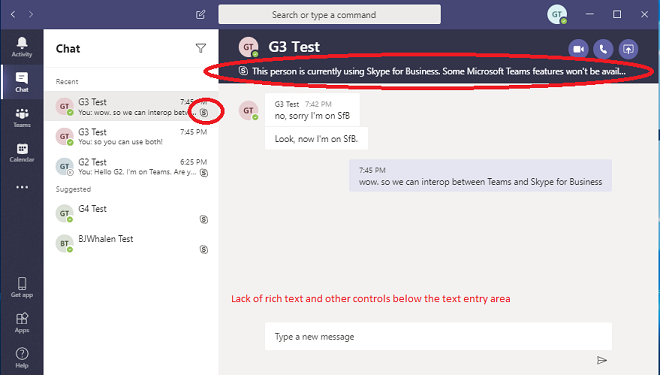

# <a name="upgrade-from-skype-for-business-to-teams-mdash-for-it-administrators"></a><span data-ttu-id="5973d-103">Atualize o Skype for Business para o &mdash; Teams para administradores de ti</span><span class="sxs-lookup"><span data-stu-id="5973d-103">Upgrade from Skype for Business to Teams &mdash; for IT administrators</span></span>

## <a name="overview"></a><span data-ttu-id="5973d-104">Visão geral</span><span class="sxs-lookup"><span data-stu-id="5973d-104">Overview</span></span>

<span data-ttu-id="5973d-105">Ao fazer a atualização do Skype for Business para o Teams, algumas organizações exigem uma distribuição progressiva planejada e gerenciada pelos departamentos de ti.</span><span class="sxs-lookup"><span data-stu-id="5973d-105">When upgrading from Skype for Business to Teams, some organizations require a progressive rollout that is planned and managed by their IT departments.</span></span> <span data-ttu-id="5973d-106">Este artigo destina-se principalmente a administradores de ti em organizações grandes locais, mas também pode se aplicar a algumas organizações do Skype for Business online.</span><span class="sxs-lookup"><span data-stu-id="5973d-106">This article is primarily targeted to IT administrators in large, on-premises organizations, but it might also apply to some Skype for Business Online organizations.</span></span>  <span data-ttu-id="5973d-107">Antes de ler este artigo, lembre-se de ler introdução à [atualização do seu Teams](upgrade-start-here.md) e [sobre a estrutura de atualização](upgrade-framework.md).</span><span class="sxs-lookup"><span data-stu-id="5973d-107">Before reading this article,  be sure to read [Getting started with your Teams Upgrade](upgrade-start-here.md) and [About the Upgrade framework](upgrade-framework.md).</span></span>

>[!NOTE]
><span data-ttu-id="5973d-108">Este artigo usa os termos Skype for Business Online, Skype for Business local e Skype for Business.</span><span class="sxs-lookup"><span data-stu-id="5973d-108">This article uses the terms Skype for Business Online, Skype for Business on-premises, and Skype for Business.</span></span>  <span data-ttu-id="5973d-109">O último termo refere-se às versões online e local.</span><span class="sxs-lookup"><span data-stu-id="5973d-109">The latter term refers to both online and on-premises versions.</span></span>

<span data-ttu-id="5973d-110">Um usuário que migrou para o Teams não usa mais um cliente do Skype for Business, exceto para ingressar em uma reunião hospedada no Skype for Business.</span><span class="sxs-lookup"><span data-stu-id="5973d-110">A user that has been migrated to Teams no longer uses a Skype for Business client except to join a meeting hosted in Skype for Business.</span></span>  <span data-ttu-id="5973d-111">Todos os chats e chamadas recebidos chegam ao cliente do Teams do usuário, independentemente do remetente usar o Teams ou o Skype for Business.</span><span class="sxs-lookup"><span data-stu-id="5973d-111">All incoming chats and calls land in the user’s Teams client, regardless of whether the sender uses Teams or Skype for Business.</span></span> <span data-ttu-id="5973d-112">Qualquer reunião nova organizada pelo usuário migrado será agendada como reuniões do teams.</span><span class="sxs-lookup"><span data-stu-id="5973d-112">Any new meetings organized by the migrated user will be scheduled as Teams meetings.</span></span> <span data-ttu-id="5973d-113">Se o usuário tentar usar o cliente Skype for Business, a iniciação de chats e chamadas será bloqueada.</span><span class="sxs-lookup"><span data-stu-id="5973d-113">If the user attempts to use the Skype for Business client, initiation of chats and calls is blocked.</span></span>  <span data-ttu-id="5973d-114">No entanto, o usuário ainda pode (e deve) usar o cliente do Skype for Business para ingressar nas reuniões que tenha sido convidado.</span><span class="sxs-lookup"><span data-stu-id="5973d-114">However, the user can (and must) still use the Skype for Business client to join meetings they are invited to.</span></span> <span data-ttu-id="5973d-115">(Os clientes Skype for Business mais antigos que foram enviados antes do 2017 não obedecem ao TeamsUpgradePolicy.</span><span class="sxs-lookup"><span data-stu-id="5973d-115">(Older Skype for Business clients that shipped before 2017 do not honor TeamsUpgradePolicy.</span></span> <span data-ttu-id="5973d-116">Verifique se você está usando o mais recente cliente Skype for Business.</span><span class="sxs-lookup"><span data-stu-id="5973d-116">Make sure you are using the latest Skype for Business client.)</span></span>
 
<span data-ttu-id="5973d-117">Os administradores gerenciam a transição para o Teams usando o conceito de [modo](migration-interop-guidance-for-teams-with-skype.md#coexistence-modes), que é uma propriedade do [TeamsUpgradePolicy](https://docs.microsoft.com/powershell/module/skype/grant-csteamsupgradepolicy?view=skype-ps).</span><span class="sxs-lookup"><span data-stu-id="5973d-117">Administrators manage their transition to Teams using the concept of [mode](migration-interop-guidance-for-teams-with-skype.md#coexistence-modes), which is a property of [TeamsUpgradePolicy](https://docs.microsoft.com/powershell/module/skype/grant-csteamsupgradepolicy?view=skype-ps).</span></span> <span data-ttu-id="5973d-118">Um usuário que foi migrado para o Teams conforme descrito acima estará no modo "TeamsOnly".</span><span class="sxs-lookup"><span data-stu-id="5973d-118">A user that has been migrated to Teams as described above is in “TeamsOnly” mode.</span></span>  <span data-ttu-id="5973d-119">Para uma organização que esteja migrando para o Teams, o objetivo final é mover todos os usuários para o modo TeamsOnly.</span><span class="sxs-lookup"><span data-stu-id="5973d-119">For an organization that is migrating to Teams, the ultimate goal is to move all users to TeamsOnly mode.</span></span>

<span data-ttu-id="5973d-120">Há dois métodos para migrar uma organização existente com o Skype for Business (online ou local) para o Teams:</span><span class="sxs-lookup"><span data-stu-id="5973d-120">There are two methods for migrating an existing organization with Skype for Business (whether online or on-premises) to Teams:</span></span>

- <span data-ttu-id="5973d-121">**Método** lado a lado (usando o modo de ilhas): os usuários em uma organização existente do Skype for Business são introduzidos para o Teams, para que eles possam usar os dois clientes lado a lado durante uma fase de transição.</span><span class="sxs-lookup"><span data-stu-id="5973d-121">**Side-by-side method** (using Islands mode):  Users in an existing Skype for Business organization are introduced to Teams so that they can use both clients side by side during a transitional phase.</span></span> <span data-ttu-id="5973d-122">Durante esse período, quase todas as funcionalidades do Teams estarão disponíveis para eles.</span><span class="sxs-lookup"><span data-stu-id="5973d-122">During this period, most--but not all--functionality of Teams is available to them.</span></span> <span data-ttu-id="5973d-123">O modo para essa configuração é referenciado como Uso Paralelo, e esse é o modo padrão para qualquer organização existente com o Skype for Business.</span><span class="sxs-lookup"><span data-stu-id="5973d-123">The mode for this configuration is referred to as Islands, and this is the default mode for any existing organization with Skype for Business.</span></span> <span data-ttu-id="5973d-124">Assim que a organização estiver pronta, o administrador moverá os usuários para o modo TeamsOnly.</span><span class="sxs-lookup"><span data-stu-id="5973d-124">Once the organization is ready, the administrator moves the users to TeamsOnly mode.</span></span>

- <span data-ttu-id="5973d-125">**Um método gerenciado** (usando um ou mais dos modos do Skype for Business): o administrador gerencia a transição (do Skype for Business para o Teams) de recursos de chat, chamadas e agendamento de reunião para os usuários de sua organização.</span><span class="sxs-lookup"><span data-stu-id="5973d-125">**A managed method** (using one or more of the Skype for Business modes): The administrator manages the transition (from Skype for Business to Teams) of chat, calling, and meeting scheduling functionality for users in their organization.</span></span>  <span data-ttu-id="5973d-126">Cada uma dessas funções está disponível no Skype for Business ou no Teams, mas não em ambas.</span><span class="sxs-lookup"><span data-stu-id="5973d-126">Each of these functions is available either in Skype for Business or Teams, but not both.</span></span> <span data-ttu-id="5973d-127">Os administradores usam o TeamsUpgradePolicy para controlar quando mudar essa funcionalidade para o Teams dos seus usuários.</span><span class="sxs-lookup"><span data-stu-id="5973d-127">Administrators use TeamsUpgradePolicy to control when to shift this functionality to Teams for their users.</span></span> <span data-ttu-id="5973d-128">Os usuários que ainda não estão no modo TeamsOnly continuarão a usar o Skype for Business para chats e chamadas, e os dois conjuntos de usuários poderão se comunicar por meio da funcionalidade de interoperabilidade.</span><span class="sxs-lookup"><span data-stu-id="5973d-128">Users who are not yet in TeamsOnly mode continue to use Skype for Business for chat and calling, and the two sets of users can communicate via interop functionality.</span></span> <span data-ttu-id="5973d-129">Os administradores gerenciam a transição migrando progressivamente mais usuários para o modo TeamsOnly.</span><span class="sxs-lookup"><span data-stu-id="5973d-129">Administrators manage the transition by progressively migrating more users into TeamsOnly mode.</span></span>  

<span data-ttu-id="5973d-130">Este artigo ajuda você a escolher o método certo para sua organização, descrevendo os dois métodos e apresentando os prós e os contras de cada um deles.</span><span class="sxs-lookup"><span data-stu-id="5973d-130">This article helps you choose the right method for your organization by describing both methods and presenting the pros and cons of each.</span></span> 

## <a name="side-by-side-method-using-islands-mode"></a><span data-ttu-id="5973d-131">Método lado a lado (usando o modo de ilhas)</span><span class="sxs-lookup"><span data-stu-id="5973d-131">Side-by-side method (using Islands mode)</span></span>

<span data-ttu-id="5973d-132">Com o método lado a lado, os usuários podem usar o Microsoft Teams e clientes do Skype for Business para chats, chamadas de VoIP e reuniões.</span><span class="sxs-lookup"><span data-stu-id="5973d-132">With the side-by-side method, users can use both Teams and Skype for Business clients for chat, VoIP calling, and meetings.</span></span> <span data-ttu-id="5973d-133">Esse estado é conhecido como o modo "ilhas" porque o tráfego de comunicação do Skype for Business e do teams permanece separado (mesmo para o mesmo usuário) e os dois clientes diferentes nunca se comunicam uns com os outros (para os usuários da mesma organização).</span><span class="sxs-lookup"><span data-stu-id="5973d-133">This state is referred to as “Islands” mode because the communication traffic for Skype for Business and Teams remains separate (even for the same user) and the two different clients never communicate with each other (for users within the same organization).</span></span> <span data-ttu-id="5973d-134">Por exemplo, suponha que o usuário do destinatário A esteja no modo de ilhas:</span><span class="sxs-lookup"><span data-stu-id="5973d-134">For example, assume recipient User A is in Islands mode:</span></span>

- <span data-ttu-id="5973d-135">A comunicação iniciada pelo cliente do Skype for Business de outro usuário sempre chegará ao cliente do Skype for Business do Usuário A.</span><span class="sxs-lookup"><span data-stu-id="5973d-135">Communication initiated from another user’s Skype for Business client will always land in User A’s Skype for Business client.</span></span>
- <span data-ttu-id="5973d-136">A comunicação iniciada do cliente das equipes de outro usuário sempre chegará ao cliente do teams do usuário, *se o outro usuário estiver na mesma organização*.</span><span class="sxs-lookup"><span data-stu-id="5973d-136">Communication initiated from another user’s Teams client will always land in User A’s Teams client, *if the other user is in the same organization*.</span></span> 
- <span data-ttu-id="5973d-137">A comunicação iniciada do cliente das equipes de outro usuário sempre chegará ao cliente Skype for Business do usuário A, *se o outro usuário estiver em uma organização federada*.</span><span class="sxs-lookup"><span data-stu-id="5973d-137">Communication initiated from another user’s Teams client will always land in User A’s Skype for Business client, *if the other user is in a federated organization*.</span></span>

<span data-ttu-id="5973d-138">O modo de ilhas é o modo padrão de TeamsUpgradePolicy para qualquer organização existente que ainda não esteja TeamsOnly.</span><span class="sxs-lookup"><span data-stu-id="5973d-138">Islands mode is the default mode of TeamsUpgradePolicy for any existing organization that is not yet TeamsOnly.</span></span> <span data-ttu-id="5973d-139">Quando você atribui uma licença do Office 365, as duas equipes e licenças do Skype for Business online são atribuídas por padrão.</span><span class="sxs-lookup"><span data-stu-id="5973d-139">When you assign an Office 365 license, both Teams and Skype for Business Online licenses are assigned by default.</span></span> <span data-ttu-id="5973d-140">(Isso é verdadeiro mesmo se o usuário estiver em um local no Skype for Business Server.</span><span class="sxs-lookup"><span data-stu-id="5973d-140">(This is true even if the user is homed on-premises in Skype for Business Server.</span></span> <span data-ttu-id="5973d-141">Não importa se o usuário está hospedado no local ou online, deixe a licença do Skype for Business online habilitada, pois ela é necessária no momento para a funcionalidade completa do teams. Na verdade, se você não tiver feito nenhuma etapa para alterar a configuração padrão, talvez já tenha um uso significativo do teams em sua organização.</span><span class="sxs-lookup"><span data-stu-id="5973d-141">Whether the user is homed on-premises or online, leave the Skype for Business Online license enabled, because it is currently needed for full Teams functionality.) In fact, if you have not taken any steps to change the default configuration, you may already have significant usage of Teams in your organization.</span></span>  <span data-ttu-id="5973d-142">Esse é um dos benefícios de uma abordagem lado a lado.</span><span class="sxs-lookup"><span data-stu-id="5973d-142">This is one of the benefits of the side-by-side approach.</span></span> <span data-ttu-id="5973d-143">Ele permite uma adoção rápida e orientada pelo usuário final em uma organização.</span><span class="sxs-lookup"><span data-stu-id="5973d-143">It allows for rapid, end-user driven adoption within an organization.</span></span>

<span data-ttu-id="5973d-144">Para esse método funcionar de forma eficaz, é preciso que todos os usuários executem os dois clientes simultaneamente.</span><span class="sxs-lookup"><span data-stu-id="5973d-144">For this method to work effectively, it requires all users to run both clients simultaneously.</span></span> <span data-ttu-id="5973d-145">Os chats e chamadas recebidos de dentro da organização para um usuário no modo de Uso Paralelo podem chegar ao cliente do Skype for Business ou do Teams, mas isso não está sob o controle do destinatário.</span><span class="sxs-lookup"><span data-stu-id="5973d-145">Incoming chats and calls from within the organization to a user in Islands mode can land in either the Skype for Business or Teams client--and this is not under the control of the recipient.</span></span> <span data-ttu-id="5973d-146">Depende de qual cliente o remetente usa para iniciar a comunicação.</span><span class="sxs-lookup"><span data-stu-id="5973d-146">It depends on what client the sender uses to initiate the communication.</span></span> <span data-ttu-id="5973d-147">Se o remetente e o destinatário estiverem em organizações diferentes, chamadas e chats recebidos para um usuário no modo de Uso Paralelo sempre chegam ao cliente do Skype for Business.</span><span class="sxs-lookup"><span data-stu-id="5973d-147">If the sender and recipient are in different organizations, incoming calls and chats to a user in Islands mode always land in the Skype for Business client.</span></span>  

<span data-ttu-id="5973d-148">Por exemplo, se um destinatário do modo de ilhas estiver executando o Skype for Business, mas não as equipes e alguém, e alguém do Teams, o destinatário do modo de ilhas não verá a mensagem (mas eventualmente receberá um email informando que perdeu uma mensagem no Teams).</span><span class="sxs-lookup"><span data-stu-id="5973d-148">For example, if an Islands mode recipient is running Skype for Business but not Teams, and someone messages them from Teams, the Islands mode recipient will not see the message (but they will eventually get an email saying they missed a message in Teams).</span></span> <span data-ttu-id="5973d-149">Da mesma forma, se um usuário estiver executando o Teams, mas não o Skype for Business, e alguém enviar mensagens a esse usuário pelo Skype for Business, o usuário não verá esse chat.</span><span class="sxs-lookup"><span data-stu-id="5973d-149">Likewise, if a user is running Teams but not Skype for Business, and someone messages that user from Skype for Business, the user will not see that chat.</span></span>  <span data-ttu-id="5973d-150">Eles receberão um e-mail dizendo que houve uma mensagem perdida.</span><span class="sxs-lookup"><span data-stu-id="5973d-150">They will get an email saying there was a missed message.</span></span> <span data-ttu-id="5973d-151">O comportamento em cada um desses casos é semelhante para chamadas.</span><span class="sxs-lookup"><span data-stu-id="5973d-151">The behavior in each of these cases is similar for calling.</span></span> <span data-ttu-id="5973d-152">Se os usuários não executarem ambos clientes, isso poderá terminar facilmente em frustração.</span><span class="sxs-lookup"><span data-stu-id="5973d-152">If users do not run both clients, it can easily lead to frustration.</span></span>

<span data-ttu-id="5973d-153">Quando o usuário A está no modo de ilhas, A presença do usuário A ser vista por outros usuários do Teams e no Skype for Business é independente:</span><span class="sxs-lookup"><span data-stu-id="5973d-153">When User A is in Islands mode, User A’s presence as seen by other users in Teams and in Skype for Business is independent:</span></span>

- <span data-ttu-id="5973d-154">Ao usar o Teams, os outros usuários verão a presença com base na atividade do Usuário A no Teams.</span><span class="sxs-lookup"><span data-stu-id="5973d-154">Other users, when using Teams, will see presence based on User A’s activity in Teams.</span></span> 
- <span data-ttu-id="5973d-155">Ao usar o Skype for Business, os outros usuários verão a presença com base na atividade do Usuário A no Skype for Business.</span><span class="sxs-lookup"><span data-stu-id="5973d-155">Other users, when using Skype for Business, will see presence based on User A’s activity in Skype for Business.</span></span> 

<span data-ttu-id="5973d-156">Isso significa que outros usuários podem ver estados diferentes de presença para o Usuário A, dependendo do cliente usado.</span><span class="sxs-lookup"><span data-stu-id="5973d-156">This means other users may see different presence states for User A, depending on which client they use.</span></span> <span data-ttu-id="5973d-157">Para saber mais, confira [Presença](#presence).</span><span class="sxs-lookup"><span data-stu-id="5973d-157">For more details, see [Presence](#presence).</span></span>

<span data-ttu-id="5973d-158">Quando estiver pronto para atualizar os usuários para o modo TeamsOnly, você pode atualizar os usuários individualmente ou pode atualizar o locatário inteiro de uma só vez usando a política de todo o locatário.</span><span class="sxs-lookup"><span data-stu-id="5973d-158">Once you are ready to upgrade users to TeamsOnly mode, you can upgrade users individually or you can upgrade the entire tenant at once using the tenant-wide policy.</span></span> <span data-ttu-id="5973d-159">Assim que um usuário é atualizado para o modo TeamsOnly, ele recebe todos os chats e chamadas recebidos no Teams.</span><span class="sxs-lookup"><span data-stu-id="5973d-159">Once a user is upgraded to TeamsOnly mode, they receive all incoming chats and calls in Teams.</span></span> <span data-ttu-id="5973d-160">(Observe que a migração de reuniões do Skype for Business para reuniões de equipe é disparada somente ao aplicar TeamsUpgradePolicy a usuários individuais, e não a cada locatário.</span><span class="sxs-lookup"><span data-stu-id="5973d-160">(Note that migration of Skype for Business meetings to Teams meetings is only triggered when applying TeamsUpgradePolicy to individual users, not on a per tenant basis.</span></span> <span data-ttu-id="5973d-161">Consulte [migração de reunião](#meeting-migration) para obter detalhes.)</span><span class="sxs-lookup"><span data-stu-id="5973d-161">See [Meeting Migration](#meeting-migration) for details.)</span></span>

<span data-ttu-id="5973d-162">No entanto, os destinatários não atualizados para o modo de Uso Paralelo poderão continuar recebendo chats e chamadas de um usuário do TeamsOnly nos clientes do Skype for Business ou do Teams.</span><span class="sxs-lookup"><span data-stu-id="5973d-162">However, non-upgraded recipients in Islands mode may continue to receive chats and calls from a TeamsOnly user in either their Skype for Business or Teams clients.</span></span>  <span data-ttu-id="5973d-163">Isso ocorre porque o cliente do Teams mantém threads de conversas separadas para comunicações de Teams para Teams e de Teams para Skype for Business, mesmo que seja para o mesmo usuário.</span><span class="sxs-lookup"><span data-stu-id="5973d-163">This is because the Teams client maintains separate conversation threads for Teams-to-Teams and Teams-to-Skype for Business communication, even for the same user.</span></span>  <span data-ttu-id="5973d-164">(Consulte [conversas de equipes – interoperabilidade versus threads nativos](#teams-conversations---interop-versus-native-threads).)  Por exemplo, assuma ilhas o usuário A usa equipes para a mensagem TeamsOnly o usuário B. Quando o usuário B responder a esse chat, a comunicação será esterrada no cliente do teams do usuário A.</span><span class="sxs-lookup"><span data-stu-id="5973d-164">(See [Teams Conversations - Interop versus native threads](#teams-conversations---interop-versus-native-threads).)  For example, assume Islands User A uses Teams to message TeamsOnly User B. When User B replies to that chat, the communication will land in User A’s Teams client.</span></span> <span data-ttu-id="5973d-165">Agora, suponha que o usuário A Use o cliente Skype for Business para enviar mensagens de TeamsOnly para o usuário B. o usuário B receberá o chat no Microsoft Teams, mas isso será uma conversa separada no cliente do teams do usuário B em comparação com a outra conversa.</span><span class="sxs-lookup"><span data-stu-id="5973d-165">Now assume User A uses his Skype for Business client to message TeamsOnly User B. User B will receive the chat in Teams, but this will be a separate conversation in User B's Teams client compared to the other conversation.</span></span> <span data-ttu-id="5973d-166">Se o usuário B responder a essa conversa com o usuário A, ele chegará ao cliente Skype for Business do usuário A.</span><span class="sxs-lookup"><span data-stu-id="5973d-166">If User B replies to this conversation with User A, it will land in User A’s Skype for Business client.</span></span> 

<span data-ttu-id="5973d-167">A tabela a seguir resume a experiência do Teams no modo de Uso Paralelo e no modo TeamsOnly:</span><span class="sxs-lookup"><span data-stu-id="5973d-167">The following table summarizes the Teams experience for both Islands mode and TeamsOnly mode:</span></span>  

| <span data-ttu-id="5973d-168">Experiência do Teams</span><span class="sxs-lookup"><span data-stu-id="5973d-168">Teams experience</span></span> | <span data-ttu-id="5973d-169">No modo de Uso Paralelo</span><span class="sxs-lookup"><span data-stu-id="5973d-169">In Islands mode</span></span> | <span data-ttu-id="5973d-170">No modo TeamsOnly</span><span class="sxs-lookup"><span data-stu-id="5973d-170">In TeamsOnly mode</span></span> |
|:------------------ | :------------------- | :------------------ |
| <span data-ttu-id="5973d-171">Chats e chamadas recebidos no:</span><span class="sxs-lookup"><span data-stu-id="5973d-171">Incoming chats and calls received in:</span></span>|  <span data-ttu-id="5973d-172">Teams ou Skype for Business</span><span class="sxs-lookup"><span data-stu-id="5973d-172">Teams or Skype for Business</span></span> | <span data-ttu-id="5973d-173">Teams</span><span class="sxs-lookup"><span data-stu-id="5973d-173">Teams</span></span> |
| <span data-ttu-id="5973d-174">Chamadas PSTN recebidas em:</span><span class="sxs-lookup"><span data-stu-id="5973d-174">PSTN calls received in:</span></span> | <span data-ttu-id="5973d-175">Skype for Business</span><span class="sxs-lookup"><span data-stu-id="5973d-175">Skype for Business</span></span> <br><span data-ttu-id="5973d-176">(Não há suporte para o uso da funcionalidade PSTN no Teams no modo de Uso Paralelo.)</span><span class="sxs-lookup"><span data-stu-id="5973d-176">(Using PSTN functionality in Teams is not supported in Islands mode.)</span></span>    | <span data-ttu-id="5973d-177">Teams</span><span class="sxs-lookup"><span data-stu-id="5973d-177">Teams</span></span> |   
 |<span data-ttu-id="5973d-178">Presença</span><span class="sxs-lookup"><span data-stu-id="5973d-178">Presence</span></span>  | <span data-ttu-id="5973d-179">A presença no Skype for Business e no Teams é independente.</span><span class="sxs-lookup"><span data-stu-id="5973d-179">Presence in Skype for Business and Teams is independent.</span></span> <span data-ttu-id="5973d-180">Os usuários podem ver estados diferentes para o mesmo usuário de Uso Paralelo, dependendo do cliente usado.</span><span class="sxs-lookup"><span data-stu-id="5973d-180">Users may see different states for the same Islands user, depending on which client they use.</span></span> | <span data-ttu-id="5973d-181">A presença se baseia unicamente nas atividades do usuário no Teams.</span><span class="sxs-lookup"><span data-stu-id="5973d-181">Presence is based solely on the user’s activity in Teams.</span></span> <span data-ttu-id="5973d-182">Todos os outros usuários, independentemente de qual cliente usam, veem essa presença.</span><span class="sxs-lookup"><span data-stu-id="5973d-182">All other users, regardless of which client they use, see that presence.</span></span> | 
 | <span data-ttu-id="5973d-183">Agendamento de Reunião</span><span class="sxs-lookup"><span data-stu-id="5973d-183">Meeting Scheduling</span></span>   | <span data-ttu-id="5973d-184">Os usuários podem agendar reuniões no Teams ou no Skype for Business.</span><span class="sxs-lookup"><span data-stu-id="5973d-184">Users can schedule meetings in either Teams or Skype for Business.</span></span> <span data-ttu-id="5973d-185">Eles verão ambos os suplementos no Outlook.</span><span class="sxs-lookup"><span data-stu-id="5973d-185">They will see both add-ins in Outlook.</span></span> |   <span data-ttu-id="5973d-186">Os usuários só agendam reuniões no Teams.</span><span class="sxs-lookup"><span data-stu-id="5973d-186">Users only schedule meetings in Teams.</span></span> <span data-ttu-id="5973d-187">Somente o suplemento do Teams está disponível no Outlook.</span><span class="sxs-lookup"><span data-stu-id="5973d-187">Only the Teams add-in is available in Outlook.</span></span> | 

<span data-ttu-id="5973d-188">A tabela a seguir resume os prós e os contras de usar o método lado a lado para migrar sua organização para o Teams.</span><span class="sxs-lookup"><span data-stu-id="5973d-188">The following table summarizes the pros and cons of using the side-by-side method to migrate your organization to Teams.</span></span>

| <span data-ttu-id="5973d-189">Prós</span><span class="sxs-lookup"><span data-stu-id="5973d-189">Pros</span></span>     |       <span data-ttu-id="5973d-190">Contras</span><span class="sxs-lookup"><span data-stu-id="5973d-190">Cons</span></span> |
| :------------------ | :---------------- |
| <span data-ttu-id="5973d-191">Permite a adoção rápida dentro de uma organização.</span><span class="sxs-lookup"><span data-stu-id="5973d-191">Allows for rapid adoption within an organization.</span></span>| <span data-ttu-id="5973d-192">Potencial para confundir o usuário final, porque há dois clientes com funcionalidade semelhante, mas interfaces de usuário diferentes.</span><span class="sxs-lookup"><span data-stu-id="5973d-192">Potential for end user confusion because there are two clients with similar functionality, but different user interfaces.</span></span> <span data-ttu-id="5973d-193">Além disso, eles não têm controle sobre em qual cliente chegarão os chats/chamadas recebidos.</span><span class="sxs-lookup"><span data-stu-id="5973d-193">Also, they have no control over which client the incoming chats/calls land in.</span></span> |
| <span data-ttu-id="5973d-194">Permite que os usuários aprendam e se familiarizem com o Teams enquanto ainda têm acesso total ao Skype for Business.</span><span class="sxs-lookup"><span data-stu-id="5973d-194">Allows users to learn and get familiar with Teams while still having full access to Skype for Business.</span></span> | <span data-ttu-id="5973d-195">Potencial de insatisfação do usuário final devido a mensagens perdidas, caso o usuário não esteja executando ambos os clientes.</span><span class="sxs-lookup"><span data-stu-id="5973d-195">Potential for end user dissatisfaction due to missed messages if the user is not running both clients.</span></span> <span data-ttu-id="5973d-196">Os usuários podem reclamar que não estão recebendo mensagens.</span><span class="sxs-lookup"><span data-stu-id="5973d-196">Users may complain that they are not receiving messages.</span></span>|
| <span data-ttu-id="5973d-197">Esforço administrativo mínimo para começar a usar o Teams.</span><span class="sxs-lookup"><span data-stu-id="5973d-197">Minimal administration effort to get started in Teams.</span></span> | <span data-ttu-id="5973d-198">Pode ser um desafio para "sair do modo de ilhas" e mudar para o modo TeamsOnly, se nem todos na organização estiverem usando o Microsoft Teams, especialmente se nem todos os usuários estiverem ativos no Teams.</span><span class="sxs-lookup"><span data-stu-id="5973d-198">Can be challenging to “get out of Islands” mode and move to TeamsOnly mode if not everyone in the organization is using Teams, especially if not all users are active in Teams.</span></span> <span data-ttu-id="5973d-199">Por exemplo, quando um subconjunto de usuários for atualizado para o modo TeamsOnly, esses usuários só serão enviados para o Microsoft Teams.</span><span class="sxs-lookup"><span data-stu-id="5973d-199">For example, once a subset of users is upgraded to TeamsOnly mode, those users will only send in Teams.</span></span> <span data-ttu-id="5973d-200">Para o restante da população no modo ilhas, essas mensagens sempre serão exibidas no Microsoft Teams.</span><span class="sxs-lookup"><span data-stu-id="5973d-200">For the rest of the population in Islands mode, those messages will always land in Teams.</span></span> <span data-ttu-id="5973d-201">Mas se parte dessa população não estiver em execução no Microsoft Teams, ele perceberá essas mensagens como perdida.</span><span class="sxs-lookup"><span data-stu-id="5973d-201">But if some of that population is not running Teams, they will perceive these messages as missed.</span></span> |
|  | <span data-ttu-id="5973d-202">Ao usar o Microsoft Teams, os usuários que têm uma conta local no Skype for Business Server não têm suporte à interoperabilidade ou Federação.</span><span class="sxs-lookup"><span data-stu-id="5973d-202">When using Teams, users who have an on-premises account in Skype for Business Server do not have interop or federation support.</span></span>  <span data-ttu-id="5973d-203">Isso pode potencialmente criar confusão se você tiver uma combinação de usuários de ilhas, alguns que são hospedados no Skype for Business Online e alguns no Skype for Business local.</span><span class="sxs-lookup"><span data-stu-id="5973d-203">This can potentially create confusion if you have a mix of Islands users--some who are homed in Skype for Business Online and some in Skype for Business on-premises.</span></span>   |

## <a name="managed-transition-method-using-skype-for-business-modes"></a><span data-ttu-id="5973d-204">Método de transição gerenciado (usando os modos Skype for Business)</span><span class="sxs-lookup"><span data-stu-id="5973d-204">Managed transition method (using Skype for Business modes)</span></span>

<span data-ttu-id="5973d-205">Algumas organizações podem optar por oferecer aos usuários finais uma experiência mais simples e mais previsível à medida que sua organização faz a transição do Skype for Business para o Teams.</span><span class="sxs-lookup"><span data-stu-id="5973d-205">Some organizations may prefer to provide their end users a simpler, more predictable experience as their organization transitions from Skype for Business to Teams.</span></span> <span data-ttu-id="5973d-206">Nesse modelo, os administradores de ti usam um dos modos do Skype for Business no TeamsUpgradePolicy para designar explicitamente quais usuários permanecem no Skype for Business antes de migrar para o modo TeamsOnly.</span><span class="sxs-lookup"><span data-stu-id="5973d-206">In this model, IT administrators use one of the Skype for Business modes in TeamsUpgradePolicy to explicitly designate which users remain in Skype for Business prior to migrating to TeamsOnly mode.</span></span> <span data-ttu-id="5973d-207">Como estão prontos para alternar os usuários selecionados para o modo TeamsOnly, o administrador atualiza o modo para os usuários TeamsOnly.</span><span class="sxs-lookup"><span data-stu-id="5973d-207">As they are ready to shift selected users to TeamsOnly mode, the administrator updates the mode for those users to TeamsOnly.</span></span>  <span data-ttu-id="5973d-208">À medida que a implantação progride, mais e mais usuários são movidos do Skype for Business para o modo TeamsOnly.</span><span class="sxs-lookup"><span data-stu-id="5973d-208">As the deployment progresses, more and more users are transitioned from Skype for Business to TeamsOnly mode.</span></span>  <span data-ttu-id="5973d-209">Durante a transição:</span><span class="sxs-lookup"><span data-stu-id="5973d-209">During this transition:</span></span>

- <span data-ttu-id="5973d-210">Os usuários que ainda estão no Skype for Business recebem todos os chats e chamadas recebidos no cliente do Skype for Business, independentemente da comunicação ter sido originada de outro cliente do Teams do usuário ou do Skype for Business.</span><span class="sxs-lookup"><span data-stu-id="5973d-210">Users still on Skype for Business receive all incoming chats and calls in their Skype for Business client, regardless of whether the communication originated from the other user’s Teams or Skype for Business client.</span></span> <span data-ttu-id="5973d-211">Além disso, para esses usuários do Skype for Business, a funcionalidade de chamadas e de chat no cliente do teams é desativada para evitar a confusão do usuário final e garantir o roteamento adequado.</span><span class="sxs-lookup"><span data-stu-id="5973d-211">In addition, for these Skype for Business users, calling and chat functionality in the Teams client are disabled to help prevent end user confusion and to ensure proper routing.</span></span> 

- <span data-ttu-id="5973d-212">Os usuários no modo TeamsOnly recebem todos os chats e chamadas de entrada no cliente das equipes, independentemente de onde a comunicação se originou de: Teams, Skype for Business ou qualquer tipo de usuário federado.</span><span class="sxs-lookup"><span data-stu-id="5973d-212">Users in TeamsOnly mode receive all incoming chats and calls in their Teams client, regardless of where the communication originated from:  Teams, Skype for Business, or any kind of federated user.</span></span> 

<span data-ttu-id="5973d-213">Ao contrário do método ilhas, no método de transição gerenciado, os usuários do Skype for Business e os usuários do TeamsOnly podem se comunicar uns com os outros.</span><span class="sxs-lookup"><span data-stu-id="5973d-213">Unlike the Islands method, in the managed transition method, Skype for Business users and TeamsOnly users can communicate with each other.</span></span> <span data-ttu-id="5973d-214">A comunicação entre um usuário do Skype for Business e um usuário do Teams é conhecida como interoperabilidade ou "interop”.</span><span class="sxs-lookup"><span data-stu-id="5973d-214">Communication between a Skype for Business user and Teams user is known as interoperability or “interop”.</span></span> <span data-ttu-id="5973d-215">(Consulte [interoperabilidade](#interoperability).) A comunicação de interoperabilidade é possível em uma base de um-para-um para chats e chamadas entre um usuário no Skype for Business e outro usuário no Teams.</span><span class="sxs-lookup"><span data-stu-id="5973d-215">(See [Interoperability](#interoperability).) Interop communication is possible on a one-to-one basis for chats and calls between a user in Skype for Business and another user in Teams.</span></span> <span data-ttu-id="5973d-216">Além disso, os usuários convidados sempre podem participar de uma reunião do Skype for Business ou do Teams; embora, devam usar um cliente que corresponda ao tipo de reunião.</span><span class="sxs-lookup"><span data-stu-id="5973d-216">In addition, invited users can always join either a Skype for Business or Teams meeting, however, they must use a client that corresponds to the type of meeting.</span></span> <span data-ttu-id="5973d-217">Para mais informações, confira [Reuniões](#meetings).</span><span class="sxs-lookup"><span data-stu-id="5973d-217">For more information, see [Meetings](#meetings).</span></span>

<span data-ttu-id="5973d-218">Como os usuários em uma transição gerenciada geralmente não estão no modo de ilhas, a presença de um usuário é consistente independentemente do cliente usado pelo outro usuário.</span><span class="sxs-lookup"><span data-stu-id="5973d-218">Because users in a managed transition are typically not in Islands mode, presence for a user is consistent regardless of which client is used by the other user.</span></span> <span data-ttu-id="5973d-219">Se o usuário estiver em um dos modos do Skype for Business, todos os outros usuários verão a presença com base na atividade desse usuário no Skype for Business.</span><span class="sxs-lookup"><span data-stu-id="5973d-219">If the user is in one of the Skype for Business modes, all other users see presence based on that user’s activity in Skype for Business.</span></span> <span data-ttu-id="5973d-220">Da mesma forma, se um usuário estiver no modo TeamsOnly, todos os outros usuários verão a presença com base na atividade desse usuário no Teams.</span><span class="sxs-lookup"><span data-stu-id="5973d-220">Similarly, if a user is in TeamsOnly mode, all other users see presence based on that user’s activity in Teams.</span></span> <span data-ttu-id="5973d-221">Para obter detalhes, confira [Presença](#presence).</span><span class="sxs-lookup"><span data-stu-id="5973d-221">For details, see [Presence](#presence).</span></span>

<span data-ttu-id="5973d-222">Para uma organização que ainda não começou a usar o Teams, o administrador deve alterar o modo de todos os locatários de ilhas para SfbWithTeamsCollab.</span><span class="sxs-lookup"><span data-stu-id="5973d-222">For an organization that has not yet started using Teams, the administrator should change the tenant-wide mode from Islands to SfbWithTeamsCollab.</span></span> <span data-ttu-id="5973d-223">(Para organizações que já têm alguns usos de equipes, o administrador deve "avô" os usuários já ativos no Teams para garantir que essa alteração não se aplique a ele.</span><span class="sxs-lookup"><span data-stu-id="5973d-223">(For organizations that already have some Teams usage, the administrator should “grandfather” users already active in Teams to ensure this change does not apply to them.</span></span> <span data-ttu-id="5973d-224">Para obter detalhes, consulte [uma atualização gerenciada para uma organização que já está usando equipes no modo ilhas](#a-managed-upgrade-for-an-organization-that-is-already-using-teams-in-islands-mode).)</span><span class="sxs-lookup"><span data-stu-id="5973d-224">For details, see [A managed upgrade for an organization that is already using Teams in Islands mode](#a-managed-upgrade-for-an-organization-that-is-already-using-teams-in-islands-mode).)</span></span>

<span data-ttu-id="5973d-225">Quando o modo muda de ilhas para SfbWithTeamsCollab, um usuário que nunca usou o Teams não verá nenhuma diferença em como usar o Skype for Business.</span><span class="sxs-lookup"><span data-stu-id="5973d-225">When mode changes from Islands to SfbWithTeamsCollab, a user that has never used Teams will see no difference in how they use Skype for Business.</span></span> <span data-ttu-id="5973d-226">No entanto, se esse usuário começasse a usar o Teams, ele estaria exposto apenas a funcionalidades como Arquivos, Teams e Canal.</span><span class="sxs-lookup"><span data-stu-id="5973d-226">However, should that user start to use Teams, they would only be exposed to functionality such as Teams & Channel and Files.</span></span> <span data-ttu-id="5973d-227">O agendamento de chats, chamadas e reuniões não estaria disponível no Teams, pois o administrador (por enquanto) designou o Skype for Business como o cliente desejado para essas funções.</span><span class="sxs-lookup"><span data-stu-id="5973d-227">Chat, calling and meeting scheduling would not be available in Teams, since the administrator has (for now) designated Skype for Business as the desired client for those functions.</span></span>  

<span data-ttu-id="5973d-228">Observação: quando o usuário altera de ilhas para um dos modos do Skype for Business, o cliente de equipes de qualquer outro usuário que se comunica com o usuário A precisa saber que o modo de um usuário foi alterado para que ele possa encaminhar a comunicação ao cliente apropriado para o usuário A.  Para qualquer usuário que já tenha estabelecido chats nativos entre equipes e chats com o usuário A, pode levar até 36 horas para que os clientes de equipes de outros usuários estejam cientes da mudança de modo das ilhas para qualquer modo do Skype for Business.</span><span class="sxs-lookup"><span data-stu-id="5973d-228">Note: When User A changes from Islands to one of the Skype for Business modes, the Teams client of any other user that communicates with User A needs to know that User A’s mode changed so it can route the communication to the appropriate client for User A.  For any users who have already established native Teams-to-Teams chats with User A, it can take up to 36 hours for these other users' Teams clients to be aware of the mode change from Islands to any Skype for Business mode.</span></span>   <span data-ttu-id="5973d-229">Por outro lado, as alterações de um usuário existente no modo TeamsOnly são descobertas por outros clientes dentro de 2 horas.</span><span class="sxs-lookup"><span data-stu-id="5973d-229">In contrast, changes for an existing user to TeamsOnly mode are discovered by other clients within 2 hours.</span></span>

<span data-ttu-id="5973d-230">Quando os administradores estiverem prontos, eles poderão mudar o agendamento de chats, chamadas e reuniões de um determinado usuário para o Teams de uma só vez, atualizando o modo do usuário para TeamsOnly.</span><span class="sxs-lookup"><span data-stu-id="5973d-230">When administrators are ready, they can shift chat, calling, and meeting scheduling for a given user to Teams all at once by updating the user’s mode to TeamsOnly.</span></span>  

<span data-ttu-id="5973d-231">Como alternativa, o administrador poderá primeiro mudar apenas o agendamento de reuniões para o Teams, deixando as funções de chats e chamadas no Skype for Business usando o modo SfBWithTeamsCollabAndMeetings.</span><span class="sxs-lookup"><span data-stu-id="5973d-231">Alternatively, the administrator can first shift only meeting scheduling to Teams, while leaving chat and calling functions in Skype for Business using the SfBWithTeamsCollabAndMeetings mode.</span></span> <span data-ttu-id="5973d-232">Esse modo permite que as organizações façam a transição para o Microsoft Teams para reuniões--se os usuários ainda não estiverem prontos para serem movidos para o modo TeamsOnly (geralmente porque mais tempo pode ser necessário para migrar a funcionalidade PSTN existente).</span><span class="sxs-lookup"><span data-stu-id="5973d-232">This mode allows organizations to transition to Teams for meetings--if users are not yet ready to move to TeamsOnly mode (typically because more time may be needed to migrate existing PSTN functionality).</span></span> <span data-ttu-id="5973d-233">Esse cenário de transição é conhecido como [Primeiro Reuniões](meetings-first.md).</span><span class="sxs-lookup"><span data-stu-id="5973d-233">This transitional scenario is referred to as [Meetings First](meetings-first.md).</span></span>


<span data-ttu-id="5973d-234">A tabela a seguir resume os prós e os contras do uso dos modos do Skype for Business como uma etapa de transição para o modo TeamsOnly.</span><span class="sxs-lookup"><span data-stu-id="5973d-234">The following table summarizes the pros and cons of using Skype for Business modes as a transitional step toward TeamsOnly mode.</span></span>


| <span data-ttu-id="5973d-235">Prós</span><span class="sxs-lookup"><span data-stu-id="5973d-235">Pros</span></span>     |       <span data-ttu-id="5973d-236">Contras</span><span class="sxs-lookup"><span data-stu-id="5973d-236">Cons</span></span> |
| :------------------ | :---------------- |
| <span data-ttu-id="5973d-237">Roteamento previsível para o usuário final.</span><span class="sxs-lookup"><span data-stu-id="5973d-237">Predictable routing for the end user.</span></span>  <span data-ttu-id="5973d-238">Todas as chamadas e chats chegam ao Skype for Business ou Teams (mas não a ambos), com base na seleção do administrador.</span><span class="sxs-lookup"><span data-stu-id="5973d-238">All calls and chats either land in Skype for Business or Teams (but not both), based on administrator selection.</span></span>  | <span data-ttu-id="5973d-239">As conversas de interoperabilidade não têm suporte para o compartilhamento de tela, compartilhamento de arquivos e rich text.</span><span class="sxs-lookup"><span data-stu-id="5973d-239">Interop conversations lack support for rich text, file sharing, and screen sharing.</span></span>  <span data-ttu-id="5973d-240">Isso pode ser trabalhado com reuniões sob demanda, mas isso não é tão fácil.</span><span class="sxs-lookup"><span data-stu-id="5973d-240">This can be worked around with on-demand meetings but this is not as seamless.</span></span>  |
| <span data-ttu-id="5973d-241">Eliminar a confusão do usuário final porque uma determinada funcionalidade está disponível apenas em um cliente.</span><span class="sxs-lookup"><span data-stu-id="5973d-241">Eliminate end user confusion because a given functionality is only available in one client.</span></span>  | <span data-ttu-id="5973d-242">Os usuários não podem experimentar os dois clientes lado a lado para o mesmo conjunto de funcionalidades.</span><span class="sxs-lookup"><span data-stu-id="5973d-242">Users can’t try both clients side-by-side for the same set of functionality.</span></span> <span data-ttu-id="5973d-243">Isso pode ser especialmente um fator se os usuários percebem a mudança do Skype for Business para o Teams como uma mudança de paradigma importante.</span><span class="sxs-lookup"><span data-stu-id="5973d-243">This may especially be a factor if the users perceive the shift from Skype for Business to Teams as a major paradigm shift.</span></span> |
| <span data-ttu-id="5973d-244">Permite a introdução incremental do teams.</span><span class="sxs-lookup"><span data-stu-id="5973d-244">Allows for incremental introduction of Teams.</span></span>  |  | |
| <span data-ttu-id="5973d-245">O administrador tem controle total sobre a transição do Skype for Business para o Teams.</span><span class="sxs-lookup"><span data-stu-id="5973d-245">Administrator is in full control of the transition from Skype for Business to Teams.</span></span> |  | | 
| <span data-ttu-id="5973d-246">Permite que uma organização use o Teams para reuniões, mesmo que ainda não esteja pronta para mudar inteiramente para o modo TeamsOnly.</span><span class="sxs-lookup"><span data-stu-id="5973d-246">Allows an organization to use Teams for meetings, even if it is not yet ready to move entirely to TeamsOnly mode.</span></span> |  | |
| <span data-ttu-id="5973d-247">A presença de um determinado usuário é a mesma, conforme visualizada por outros, independentemente do cliente usado.</span><span class="sxs-lookup"><span data-stu-id="5973d-247">Presence of a given user as viewed by others is the same, regardless of which client they use.</span></span>  |  | |

## <a name="summary-of-upgrade-methods"></a><span data-ttu-id="5973d-248">Resumo dos métodos de atualização</span><span class="sxs-lookup"><span data-stu-id="5973d-248">Summary of upgrade methods</span></span>

<span data-ttu-id="5973d-249">A tabela a seguir resume os métodos de atualização:</span><span class="sxs-lookup"><span data-stu-id="5973d-249">The following table summarizes the upgrade methods:</span></span>

| <span data-ttu-id="5973d-250">Lado a lado (usando o modo de ilhas)</span><span class="sxs-lookup"><span data-stu-id="5973d-250">Side-by-side (using Islands mode)</span></span>     |      <span data-ttu-id="5973d-251">Gerenciado (usando os modos Skype for Business)</span><span class="sxs-lookup"><span data-stu-id="5973d-251">Managed (using Skype for Business modes)</span></span> |
| :------------------ | :---------------- |
| <span data-ttu-id="5973d-252">Antes de serem atualizados para o TeamsOnly, os usuários devem executar ambos os clientes simultaneamente, pois os chats e chamadas recebidos podem chegar a qualquer cliente.</span><span class="sxs-lookup"><span data-stu-id="5973d-252">Prior to being upgraded to TeamsOnly, users must run both clients simultaneously since incoming chats and calls may land in either client.</span></span>   | <span data-ttu-id="5973d-253">Chats e chamadas só se chegarão a um cliente, com base no modo do destinatário.</span><span class="sxs-lookup"><span data-stu-id="5973d-253">Chats and calls only land in one client, based on the recipient’s mode.</span></span> <span data-ttu-id="5973d-254">Usuários não atualizados podem executar ambos os clientes, mas não há sobreposição funcional (chamadas e chats não estão disponíveis no Teams).</span><span class="sxs-lookup"><span data-stu-id="5973d-254">Non-upgraded users may run both clients, but there is no functional overlap (calling and chat are not available in Teams).</span></span>  <span data-ttu-id="5973d-255">Os administradores também podem controlar se os usuários agendam reuniões no Microsoft Teams ou no Skype for Business.</span><span class="sxs-lookup"><span data-stu-id="5973d-255">Administrators can also control whether users schedule meetings in Teams or Skype for Business.</span></span>   |
| <span data-ttu-id="5973d-256">Os usuários podem usar o Skype for Business e o Teams lado a lado para a mesma funcionalidade.</span><span class="sxs-lookup"><span data-stu-id="5973d-256">Users can use Skype for Business and Teams side by side for same functionality.</span></span>   | <span data-ttu-id="5973d-257">Permite que os administradores introduzam novas funcionalidades líquidas do teams para usuários finais (equipes e canais), sem fornecer a mesma funcionalidade que também existe no Skype for Business.</span><span class="sxs-lookup"><span data-stu-id="5973d-257">Allows administrators to introduce net new functionality of Teams to end users (Teams and Channels), without providing same functionality that also exists in Skype for Business.</span></span>   |
|<span data-ttu-id="5973d-258">A interoperabilidade entre o Skype for Business e o Teams não existe enquanto os dois usuários estão no modo de Uso Paralelo.</span><span class="sxs-lookup"><span data-stu-id="5973d-258">Interop between Skype for Business and Teams does not exist while both users are in Islands mode.</span></span> <span data-ttu-id="5973d-259">Depois que alguns usuários forem atualizados para o TeamsOnly, a conversa de interoperabilidade poderá ocorrer entre esses usuários e outros usuários no modo de ilhas.</span><span class="sxs-lookup"><span data-stu-id="5973d-259">Once some users are upgraded to TeamsOnly, interop conversation may occur between those users and other users still in Islands mode.</span></span> <span data-ttu-id="5973d-260">No entanto, o usuário ilhas pode optar por usar o Microsoft Teams e evitar a conversa Interop.</span><span class="sxs-lookup"><span data-stu-id="5973d-260">However, the Islands user could choose to use Teams and avoid the interop conversation.</span></span> | <span data-ttu-id="5973d-261">A interoperabilidade é necessária para a comunicação entre usuários do Skype for Business e do Teams.</span><span class="sxs-lookup"><span data-stu-id="5973d-261">Interop is required for communication between Skype for Business and Teams users.</span></span>   |

## <a name="tools-for-managing-the-upgrade"></a><span data-ttu-id="5973d-262">Ferramentas para gerenciar a atualização</span><span class="sxs-lookup"><span data-stu-id="5973d-262">Tools for managing the upgrade</span></span>

<span data-ttu-id="5973d-263">Para qualquer um dos métodos descritos acima, os administradores gerenciam a transição para TeamsOnly usando [TeamsUpgradePolicy](https://docs.microsoft.com/powershell/module/skype/grant-csteamsupgradepolicy?view=skype-ps), que controla o modo de coexistência de um usuário.</span><span class="sxs-lookup"><span data-stu-id="5973d-263">For either of the methods described above, administrators manage the transition to TeamsOnly using [TeamsUpgradePolicy](https://docs.microsoft.com/powershell/module/skype/grant-csteamsupgradepolicy?view=skype-ps), which controls a user’s coexistence mode.</span></span> <span data-ttu-id="5973d-264">Para obter mais informações sobre cada um dos modos, consulte [modos de coexistência](migration-interop-guidance-for-teams-with-skype.md#coexistence-modes).</span><span class="sxs-lookup"><span data-stu-id="5973d-264">For more information on each of the modes, see [Coexistence modes](migration-interop-guidance-for-teams-with-skype.md#coexistence-modes).</span></span>

<span data-ttu-id="5973d-265">Se o administrador executar uma transição gerenciada usando os modos Skype for Business ou apenas as atualizações para o modo TeamsOnly da configuração de ilhas padrão, TeamsUpgradePolicy é a principal ferramenta.</span><span class="sxs-lookup"><span data-stu-id="5973d-265">Whether the administrator performs a managed transition using Skype for Business modes or simply upgrades to TeamsOnly mode from the default Islands configuration, TeamsUpgradePolicy is the primary tool.</span></span>  <span data-ttu-id="5973d-266">Como qualquer outra política do Microsoft Teams, o TeamsUpgradePolicy pode ser atribuído diretamente a um usuário, e também pode ser definido como o padrão de todo o locatário.</span><span class="sxs-lookup"><span data-stu-id="5973d-266">Like any other policy in Teams, TeamsUpgradePolicy can be assigned directly to a user, and it can also be set as the tenant-wide default.</span></span> <span data-ttu-id="5973d-267">Qualquer atribuição para um usuário tem precedência sobre a configuração padrão do locatário.</span><span class="sxs-lookup"><span data-stu-id="5973d-267">Any assignment to a user takes precedence over the tenant default setting.</span></span>  <span data-ttu-id="5973d-268">Ele pode ser gerenciado no console de administração do Teams e no PowerShell.</span><span class="sxs-lookup"><span data-stu-id="5973d-268">It can be managed both in the Teams Admin Console and in PowerShell.</span></span>

<span data-ttu-id="5973d-269">Os administradores podem atribuir qualquer modo de TeamsUpgradePolicy aos usuários se o usuário estiver hospedado no Skype for Business online ou no local, exceto se o modo TeamsOnly só puder ser atribuído a um usuário que já esteja hospedado no Skype for Business online.</span><span class="sxs-lookup"><span data-stu-id="5973d-269">Administrators can assign any mode of TeamsUpgradePolicy to users whether the user is homed in Skype for Business Online or on-premises, except that TeamsOnly mode can only be assigned to a user who is already homed in Skype for Business Online.</span></span> <span data-ttu-id="5973d-270">Isso ocorre porque a interoperabilidade com usuários e Federação do Skype for Business só é possível se o usuário estiver hospedado no Skype for Business online.</span><span class="sxs-lookup"><span data-stu-id="5973d-270">This is because interop with Skype for Business users and federation are only possible if the user is homed in Skype for Business Online.</span></span>

<span data-ttu-id="5973d-271">Os usuários com contas do Skype for Business hospedadas no local [devem ser movidos online](https://docs.microsoft.com/SkypeForBusiness/hybrid/move-users-from-on-premises-to-teams) (para o Skype for Business online ou direto para o Microsoft Teams) usando o conjunto de ferramentas de CsUser no Skype for Business local.</span><span class="sxs-lookup"><span data-stu-id="5973d-271">Users with Skype for Business accounts homed on-premises [must be moved online](https://docs.microsoft.com/SkypeForBusiness/hybrid/move-users-from-on-premises-to-teams) (either to Skype for Business Online or direct to Teams) using Move-CsUser in the Skype for Business on-premises toolset.</span></span> <span data-ttu-id="5973d-272">Esses usuários podem ser movidos para o TeamsOnly nas etapas 1 ou 2:</span><span class="sxs-lookup"><span data-stu-id="5973d-272">These users can be moved to TeamsOnly in either 1 or 2 steps:</span></span>

-   <span data-ttu-id="5973d-273">1 etapa: Especifique a opção-MoveToTeams em move-CsUser.</span><span class="sxs-lookup"><span data-stu-id="5973d-273">1 step:  Specify the -MoveToTeams switch in Move-CsUser.</span></span> <span data-ttu-id="5973d-274">Isso requer o Skype for Business Server 2019 ou o Skype for Business Server 2015 com o CU8.</span><span class="sxs-lookup"><span data-stu-id="5973d-274">This requires Skype for Business Server 2019 or Skype for Business Server 2015 with CU8.</span></span>

-   <span data-ttu-id="5973d-275">2 etapas: após executar move-CsUser, conceda o modo TeamsOnly ao usuário usando TeamsUpgradePolicy.</span><span class="sxs-lookup"><span data-stu-id="5973d-275">2 steps: After running Move-CsUser, grant TeamsOnly mode to the user using TeamsUpgradePolicy.</span></span>

<span data-ttu-id="5973d-276">Ao contrário de outras políticas, não é possível criar novas instâncias de TeamsUpgradePolicy no Office 365.</span><span class="sxs-lookup"><span data-stu-id="5973d-276">Unlike other policies, it is not possible to create new instances of TeamsUpgradePolicy in Office 365.</span></span> <span data-ttu-id="5973d-277">Todas as instâncias existentes são incorporadas ao serviço.</span><span class="sxs-lookup"><span data-stu-id="5973d-277">All the existing instances are built into the service.</span></span>  <span data-ttu-id="5973d-278">(Observe que Mode é uma propriedade dentro de TeamsUpgradePolicy, em vez do nome de uma instância de política.) Em alguns--mas não em todos os casos, o nome da instância da política é o mesmo que o modo.</span><span class="sxs-lookup"><span data-stu-id="5973d-278">(Note that mode is a property within TeamsUpgradePolicy, rather than the name of a policy instance.) In some--but not all--cases, the name of the policy instance is the same as mode.</span></span> <span data-ttu-id="5973d-279">Em particular, para atribuir o modo TeamsOnly a um usuário, você concederá a instância "UpgradeToTeams" de TeamsUpgradePolicy a esse usuário.</span><span class="sxs-lookup"><span data-stu-id="5973d-279">In particular, to assign TeamsOnly mode to a user, you will grant the “UpgradeToTeams” instance of TeamsUpgradePolicy to that user.</span></span> <span data-ttu-id="5973d-280">Para ver uma lista de todos os casos, você pode executar o seguinte comando:</span><span class="sxs-lookup"><span data-stu-id="5973d-280">To see a list of all instances, you can run the following command:</span></span>

```PowerShell
Get-CsTeamsUpgradePolicy|ft Identity, Mode, NotifySfbUsers
```

<span data-ttu-id="5973d-281">Para atualizar um usuário online para o modo TeamsOnly, atribua a instância "UpgradeToTeams":</span><span class="sxs-lookup"><span data-stu-id="5973d-281">To upgrade an online user to TeamsOnly mode, assign the “UpgradeToTeams” instance:</span></span> 

```PowerShell
Grant-CsTeamsUpgradePolicy -PolicyName UpgradeToTeams -Identity $user 
```

<span data-ttu-id="5973d-282">Para atualizar um usuário local do Skype for Business para o modo TeamsOnly, use move-CsUser no conjunto de ferramentas local:</span><span class="sxs-lookup"><span data-stu-id="5973d-282">To upgrade an on-premise Skype for Business user to TeamsOnly mode, use Move-CsUser in the on-premises toolset:</span></span>

```PowerShell
Move-CsUser -identity $user -Target sipfed.online.lync.com -MoveToTeams -credential $cred
```

<span data-ttu-id="5973d-283">Para alterar o modo de todos os usuários no locatário, exceto aqueles que têm uma concessão explícita por usuário (que tem precedência), execute o seguinte comando:</span><span class="sxs-lookup"><span data-stu-id="5973d-283">To change the mode for all users in the tenant, except those who have an explicit per-user grant (which takes precedence), run the following command:</span></span>

```PowerShell
Grant-CsTeamsUpgradePolicy -PolicyName SfbWithTeamsCollab -Global
```


>[!NOTE]
><span data-ttu-id="5973d-284">Se você tiver usuários com contas do Skype for Business no local, não deverá atribuir o modo TeamsOnly no nível do locatário, a menos que você explicitamente atribua outro modo para todos os usuários com contas do Skype for Business local.</span><span class="sxs-lookup"><span data-stu-id="5973d-284">If you have any users with Skype for Business accounts on-premises, you should not assign TeamsOnly mode at the tenant level, unless you explicitly assign some other mode to all users with on-premises Skype for Business accounts.</span></span>


### <a name="using-notifications-in-skype-for-business-clients"></a><span data-ttu-id="5973d-285">Usar notificações nos clientes Skype for Business</span><span class="sxs-lookup"><span data-stu-id="5973d-285">Using notifications in Skype for Business clients</span></span>

<span data-ttu-id="5973d-286">Os administradores têm a opção de fornecer notificações de usuário final no cliente Skype for Business para informar aos usuários que eles logo serão atualizados para o Microsoft Teams, conforme mostrado no diagrama a seguir.</span><span class="sxs-lookup"><span data-stu-id="5973d-286">Administrators have the option to provide end user notifications in the Skype for Business client to inform users that they will soon be upgraded to Teams, as shown in the following diagram.</span></span> <span data-ttu-id="5973d-287">Por exemplo, uma semana antes de o administrador planejar a atualização de um grupo de usuários para o modo TeamsOnly, o administrador pode querer ativar essas notificações para esse grupo de usuários.</span><span class="sxs-lookup"><span data-stu-id="5973d-287">For example, a week before the administrator plans to upgrade a group of users to TeamsOnly mode, the administrator might want to turn on these notifications for that group of users.</span></span> <span data-ttu-id="5973d-288">Essas notificações são habilitadas usando uma instância de TeamsUpgradePolicy com NotifySfbUsers = true.</span><span class="sxs-lookup"><span data-stu-id="5973d-288">These notifications are enabled using an instance of TeamsUpgradePolicy with NotifySfbUsers=true.</span></span>  <span data-ttu-id="5973d-289">Para todos os modos diferentes de TeamsOnly, há, na verdade, duas instâncias por modo, correspondentes aos dois valores de NotifySfbUsers.</span><span class="sxs-lookup"><span data-stu-id="5973d-289">For all modes other than TeamsOnly, there are actually two instances per mode, corresponding to the two values of NotifySfbUsers.</span></span>  <span data-ttu-id="5973d-290">Para todos os modos diferentes de TeamsOnly, há, na verdade, duas instâncias por modo, correspondentes aos dois valores de NotifySfbUsers.</span><span class="sxs-lookup"><span data-stu-id="5973d-290">For all modes other than TeamsOnly, there are actually two instances per mode, corresponding to the two values of NotifySfbUsers.</span></span> 


<span data-ttu-id="5973d-292">Se seus usuários estiverem hospedados no Skype for Business Online, basta atribuir a instância de política que tenha o mesmo modo que o usuário, mas com NotifySfbUsers = verdadeiro.</span><span class="sxs-lookup"><span data-stu-id="5973d-292">If your users are homed in Skype for Business Online, simply assign the policy instance that has the same mode as the user, but with NotifySfbUsers=true.</span></span> 

<span data-ttu-id="5973d-293">Se seus usuários estiverem hospedados no Skype for Business Server no local, você precisará usar o conjunto de ferramentas local e será necessário o Skype for Business Server 2019 ou o CU8 para o Skype for Business Server 2015.</span><span class="sxs-lookup"><span data-stu-id="5973d-293">If your users are homed in Skype for Business Server on-premises, you’ll need to use the on-premises toolset and you’ll need Skype for Business Server 2019 or CU8 for Skype for Business Server 2015.</span></span> <span data-ttu-id="5973d-294">Na janela do PowerShell local, crie uma nova instância de TeamsUpgradePolicy com NotifySfbUsers = verdadeiro:</span><span class="sxs-lookup"><span data-stu-id="5973d-294">In the on-premises PowerShell window, create a new instance of TeamsUpgradePolicy with NotifySfbUsers=true:</span></span>

```PowerShell
New-CsTeamsUpgradePolicy -Identity EnableNotification -NotifySfbUsers $true
```

<span data-ttu-id="5973d-295">Em seguida, usando a mesma janela do PowerShell local, atribua essa nova política aos usuários desejados:</span><span class="sxs-lookup"><span data-stu-id="5973d-295">Then, using the same on-premises PowerShell window, assign that new policy to the desired users:</span></span>

```PowerShell
Grant-CsTeamsUpgradePolicy -Identity $user -PolicyName EnableNotification
```

### <a name="meeting-migration"></a><span data-ttu-id="5973d-296">Migração de reunião</span><span class="sxs-lookup"><span data-stu-id="5973d-296">Meeting migration</span></span>

<span data-ttu-id="5973d-297">Quando um usuário é migrado para o modo TeamsOnly, por padrão, suas reuniões do Skype for Business existentes que eles organizadas serão convertidas para o Microsoft Teams.</span><span class="sxs-lookup"><span data-stu-id="5973d-297">When a user is migrated to TeamsOnly mode, by default their existing Skype for Business meetings that they organized will be converted to Teams.</span></span> <span data-ttu-id="5973d-298">Opcionalmente, você pode desativar o comportamento padrão ao atribuir o modo TeamsOnly a um usuário.</span><span class="sxs-lookup"><span data-stu-id="5973d-298">You can optionally disable the default behavior when assigning TeamsOnly mode to a user.</span></span> <span data-ttu-id="5973d-299">Ao mover usuários do local, as reuniões devem ser migradas para a nuvem para que funcionem com a conta de usuário online, mas se você não especificar-MoveToTeams, as reuniões serão migradas como reuniões do Skype for Business, em vez de serem convertidas para o Microsoft Teams.</span><span class="sxs-lookup"><span data-stu-id="5973d-299">When moving users from on-premises, meetings must be migrated to the cloud to function with the online user account, but if you do not specify -MoveToTeams, the meetings will be migrated as Skype for Business meetings, rather than converted to Teams.</span></span> 

<span data-ttu-id="5973d-300">Ao atribuir o modo TeamsOnly no nível do locatário, a migração da reunião não é disparada para nenhum usuário.</span><span class="sxs-lookup"><span data-stu-id="5973d-300">When assigning TeamsOnly mode at the tenant level, meeting migration is not triggered for any users.</span></span> <span data-ttu-id="5973d-301">Se quiser atribuir o modo TeamsOnly no nível do locatário e migrar reuniões, você pode usar o PowerShell para obter uma lista de usuários no locatário (por exemplo, usar Get-CsOnlineUser com os filtros necessários) e fazer um loop por cada um desses usuários para disparar a reunião migração usando Start-CsExMeetingMigration.</span><span class="sxs-lookup"><span data-stu-id="5973d-301">If you wish to assign TeamsOnly mode at the tenant level and migrate meetings, you can use PowerShell to get a list of users in the tenant (for example, using Get-CsOnlineUser with whatever filters are needed) and then loop through each of these users to trigger meeting migration using Start-CsExMeetingMigration.</span></span> <span data-ttu-id="5973d-302">Para obter detalhes, consulte [usando o serviço de migração de reunião (MMS)](https://docs.microsoft.com/skypeforbusiness/audio-conferencing-in-office-365/setting-up-the-meeting-migration-service-mms).</span><span class="sxs-lookup"><span data-stu-id="5973d-302">For details, see [Using the Meeting Migration Service (MMS)](https://docs.microsoft.com/skypeforbusiness/audio-conferencing-in-office-365/setting-up-the-meeting-migration-service-mms).</span></span>


### <a name="additional-considerations-for-organizations-with-skype-for-business-server-on-premises"></a><span data-ttu-id="5973d-303">Considerações adicionais sobre organizações com o Skype for Business Server no local</span><span class="sxs-lookup"><span data-stu-id="5973d-303">Additional considerations for organizations with Skype for Business Server on-premises</span></span>

- <span data-ttu-id="5973d-304">Configurar o Skype for Business híbrido é um pré-requisito para migrar para o modo TeamsOnly.</span><span class="sxs-lookup"><span data-stu-id="5973d-304">Setting up Skype for Business hybrid is a prerequisite to migrate to TeamsOnly mode.</span></span> <span data-ttu-id="5973d-305">Embora seja possível usar o Teams no modo de ilhas sem híbrido, a transição para o modo TeamsOnly não pode ser feita até que o usuário seja movido do Skype for Business local para o Skype for Business online (usando [move-CsUser](https://docs.microsoft.com/SkypeForBusiness/hybrid/move-users-between-on-premises-and-cloud)).</span><span class="sxs-lookup"><span data-stu-id="5973d-305">While it is possible to use Teams in Islands mode without hybrid, the transition to TeamsOnly mode cannot be made until the user is moved from Skype for Business on-premises to Skype for Business Online (using [Move-CsUser](https://docs.microsoft.com/SkypeForBusiness/hybrid/move-users-between-on-premises-and-cloud)).</span></span> <span data-ttu-id="5973d-306">Para obter mais informações, consulte [configurar conectividade híbrida](https://docs.microsoft.com/skypeforbusiness/hybrid/configure-hybrid-connectivity).</span><span class="sxs-lookup"><span data-stu-id="5973d-306">For more information, see [Configure hybrid connectivity](https://docs.microsoft.com/skypeforbusiness/hybrid/configure-hybrid-connectivity).</span></span>

- <span data-ttu-id="5973d-307">Os usuários do teams que têm uma conta local do Skype for Business (ou seja, eles ainda não foram movidos para a nuvem usando move-CsUser) não podem interoperar com nenhum usuário do Skype for Business, nem podem federar usuários externos.</span><span class="sxs-lookup"><span data-stu-id="5973d-307">Teams users who have a Skype for Business account on-premises (that is, they have not yet been moved to the cloud by using Move-CsUser) cannot interoperate with any Skype for Business users, nor can they federate with external users.</span></span> <span data-ttu-id="5973d-308">Essa funcionalidade só estará disponível quando os usuários forem movidos para a nuvem (no modo de ilhas ou como usuários do TeamsOnly).</span><span class="sxs-lookup"><span data-stu-id="5973d-308">This functionality is only available once the users are moved to the cloud (either in Islands mode, or as TeamsOnly users).</span></span> 

- <span data-ttu-id="5973d-309">Se você tiver usuários com contas do Skype for Business no local, não deverá atribuir o modo TeamsOnly no nível do locatário, a menos que você explicitamente atribua outro modo para todos os usuários com contas do Skype for Business local.</span><span class="sxs-lookup"><span data-stu-id="5973d-309">If you have any users with Skype for Business accounts on-premises, you should not assign TeamsOnly mode at the tenant level, unless you explicitly assign some other mode to all users with on-premises Skype for Business accounts.</span></span> 

- <span data-ttu-id="5973d-310">Você deve garantir que seus usuários sejam sincronizados corretamente com o Azure AD com os atributos corretos do Skype for Business.</span><span class="sxs-lookup"><span data-stu-id="5973d-310">You must ensure your users are properly synchronized into Azure AD with the correct Skype for Business attributes.</span></span> <span data-ttu-id="5973d-311">Esses atributos são todos os prefixos com "msRTCSIP-".</span><span class="sxs-lookup"><span data-stu-id="5973d-311">These attributes are all prefixes with “msRTCSIP-”.</span></span> <span data-ttu-id="5973d-312">Se os usuários não forem sincronizados corretamente para o Azure AD, as ferramentas de gerenciamento do Teams não poderão gerenciar esses usuários.</span><span class="sxs-lookup"><span data-stu-id="5973d-312">If users are not synchronized properly to Azure AD, the management tools in Teams will not be able to manage these users.</span></span> <span data-ttu-id="5973d-313">Para obter mais informações, consulte [Configurar o Azure ad Connect para Teams e o Skype for Business](https://docs.microsoft.com/SkypeForBusiness/hybrid/configure-azure-ad-connect).</span><span class="sxs-lookup"><span data-stu-id="5973d-313">For more information, see [Configure Azure AD Connect for Teams and Skype for Business](https://docs.microsoft.com/SkypeForBusiness/hybrid/configure-azure-ad-connect).</span></span>

- <span data-ttu-id="5973d-314">Para criar um novo usuário do TeamsOnly ou do Skype for Business online em uma organização híbrida, *primeiro você deve habilitar o usuário no Skype for Business Server no local*e, em seguida, mover o usuário do local para a nuvem usando mover-CsUser.</span><span class="sxs-lookup"><span data-stu-id="5973d-314">To create a new TeamsOnly or Skype for Business Online user in a hybrid organization, *you must first enable the user in Skype for Business Server on-premises*, and then move the user from on-premises to the cloud using Move-CsUser.</span></span>  <span data-ttu-id="5973d-315">A criação do usuário no local primeiro garante que qualquer outro usuário do Skype for Business restante seja direcionado para o usuário recém criado.</span><span class="sxs-lookup"><span data-stu-id="5973d-315">Creating the user in on-premises first ensures that any other remaining on-premises Skype for Business users will be able route to the newly created user.</span></span> <span data-ttu-id="5973d-316">Depois que todos os usuários tiverem sido movidos online, não será mais necessário primeiro habilitar os usuários no local.</span><span class="sxs-lookup"><span data-stu-id="5973d-316">Once all users have been moved online, it is no longer necessary to first enable users in on-premises.</span></span>

- <span data-ttu-id="5973d-317">Quando um usuário é movido do local para a nuvem, as reuniões organizadas por esse usuário são migradas para o Skype for Business online ou para o Teams, dependendo se a opção-MoveToTeams está ou não especificada.</span><span class="sxs-lookup"><span data-stu-id="5973d-317">When a user is moved from on-premises to the cloud, meetings organized by that user are migrated to either Skype for Business Online or Teams--depending on whether or not the -MoveToTeams switch is specified.</span></span>

- <span data-ttu-id="5973d-318">Se quiser exibir notificações no cliente Skype for Business para usuários locais, você deve usar o TeamsUpgradePolicy no conjunto de ferramentas local.</span><span class="sxs-lookup"><span data-stu-id="5973d-318">If you would like display notifications in the Skype for Business client for on-premises users, you must use TeamsUpgradePolicy in the on-premises toolset.</span></span> <span data-ttu-id="5973d-319">Somente o parâmetro NotifySfbUsers é relevante para usuários locais.</span><span class="sxs-lookup"><span data-stu-id="5973d-319">Only the NotifySfbUsers parameter is relevant for on-premises users.</span></span>  <span data-ttu-id="5973d-320">Os usuários locais recebem o modo das instâncias online do TeamsUpgradePolicy.</span><span class="sxs-lookup"><span data-stu-id="5973d-320">On-premises users receive their mode from the online instances of TeamsUpgradePolicy.</span></span> <span data-ttu-id="5973d-321">Consulte as anotações em [Grant-CsTeamsUpgradePolicy](https://docs.microsoft.com/powershell/module/skype/grant-csteamsupgradepolicy?view=skype-ps).</span><span class="sxs-lookup"><span data-stu-id="5973d-321">See the notes in [Grant-CsTeamsUpgradePolicy](https://docs.microsoft.com/powershell/module/skype/grant-csteamsupgradepolicy?view=skype-ps).</span></span> 

>[!NOTE]
> <span data-ttu-id="5973d-322">Todos os novos locatários criados após 3 de setembro de 2019 são criados como locatários do TeamsOnly sem a capacidade de downgrade dos administradores.</span><span class="sxs-lookup"><span data-stu-id="5973d-322">Any new tenants created after Sept 3, 2019 are created as TeamsOnly tenants without the ability for admins to downgrade.</span></span> <span data-ttu-id="5973d-323">Organizações com o Skype for Business Server no local que nunca tinha uma assinatura do Office 365 antes de 3 de setembro de 2019, o precisará entrar em contato com o suporte da Microsoft para fazer o downgrade do locatário, assim que ele adquirir uma assinatura com o Office 365.</span><span class="sxs-lookup"><span data-stu-id="5973d-323">Organizations with Skype for Business Server on-premises that previously never had an Office 365 subscription prior to Sept 3, 2019 will need to contact Microsoft Support to have their tenant downgraded, once they acquire a subscription with Office 365.</span></span> 


## <a name="perform-the-upgrade-for-your-organization"></a><span data-ttu-id="5973d-324">Executar a atualização para a sua organização</span><span class="sxs-lookup"><span data-stu-id="5973d-324">Perform the upgrade for your organization</span></span>

<span data-ttu-id="5973d-325">Esta seção descreve as seguintes opções de atualização:</span><span class="sxs-lookup"><span data-stu-id="5973d-325">This section describes the following upgrade options:</span></span>

- <span data-ttu-id="5973d-326">Atualização lado a lado (usando o modo de ilhas)</span><span class="sxs-lookup"><span data-stu-id="5973d-326">Side-by-side upgrade (using Islands mode)</span></span>
- <span data-ttu-id="5973d-327">Uma atualização gerenciada para uma organização que ainda não começou a usar o Teams</span><span class="sxs-lookup"><span data-stu-id="5973d-327">A managed upgrade for an organization that has not yet started using Teams</span></span>
- <span data-ttu-id="5973d-328">Uma atualização gerenciada para uma organização que já está usando equipes no modo de ilhas</span><span class="sxs-lookup"><span data-stu-id="5973d-328">A managed upgrade for an organization that is already using Teams in Islands mode</span></span>

### <a name="side-by-side-upgrade-using-islands-mode"></a><span data-ttu-id="5973d-329">Atualização lado a lado (usando o modo de ilhas)</span><span class="sxs-lookup"><span data-stu-id="5973d-329">Side-by-side upgrade (using Islands mode)</span></span>

<span data-ttu-id="5973d-330">Para a opção de atualização lado a lado:</span><span class="sxs-lookup"><span data-stu-id="5973d-330">For the side-by-side upgrade option:</span></span>

- <span data-ttu-id="5973d-331">Considere esta opção se você pode fazer uma atualização rápida para a sua organização geral.</span><span class="sxs-lookup"><span data-stu-id="5973d-331">Consider this option if you can do a fast upgrade for your overall organization.</span></span>  <span data-ttu-id="5973d-332">Como há um risco potencial de confusão com a execução de ambos os clientes, é melhor se você pode minimizar esse período de tempo.</span><span class="sxs-lookup"><span data-stu-id="5973d-332">Since there is potential risk of confusion with running both clients, it’s best if you can minimize this time period.</span></span> <span data-ttu-id="5973d-333">Você deve garantir que os usuários saibam que executar os dois clientes.</span><span class="sxs-lookup"><span data-stu-id="5973d-333">You should ensure your users know to run both clients.</span></span>

- <span data-ttu-id="5973d-334">Essa opção é o modelo de caixa de saída e não requer ação do administrador para começar a usar o Microsoft Teams, exceto para atribuir a licença do Office 365.</span><span class="sxs-lookup"><span data-stu-id="5973d-334">This option is the out-of-the box model, and doesn’t require administrator action to get started with Teams except to assign the Office 365 license.</span></span> <span data-ttu-id="5973d-335">Se seus usuários já têm o Skype for Business Online, você pode já estar nesse modelo.</span><span class="sxs-lookup"><span data-stu-id="5973d-335">If your users already have Skype for Business Online, you may already be in this model.</span></span>

- <span data-ttu-id="5973d-336">Pode ser um desafio ficar por fora do modo lado a lado e de passar para TeamsOnly.</span><span class="sxs-lookup"><span data-stu-id="5973d-336">It can be challenging getting out of side-by-side mode and moving to TeamsOnly.</span></span> <span data-ttu-id="5973d-337">Como os usuários atualizados só se comunicam via Teams, qualquer outro usuário na organização que se comunique com esse usuário deve estar usando o Microsoft Teams.</span><span class="sxs-lookup"><span data-stu-id="5973d-337">Because upgraded users only communicate via Teams, any other user in the organization communicating with that user must be using Teams.</span></span>  <span data-ttu-id="5973d-338">Se você tiver usuários que não começaram a usar o Teams, eles serão expostos a mensagens ausentes.</span><span class="sxs-lookup"><span data-stu-id="5973d-338">If you have users that have not started using Teams, they will be exposed to missing messages.</span></span> <span data-ttu-id="5973d-339">Além disso, eles não verão os usuários do TeamsOnly online no Skype for Business.</span><span class="sxs-lookup"><span data-stu-id="5973d-339">Furthermore, they won’t see the TeamsOnly users online in Skype for Business.</span></span> <span data-ttu-id="5973d-340">Algumas organizações optam por fazer uma atualização em todo o locatário usando a política global do locatário para evitar isso, no entanto, isso exige espera até que todos os usuários estejam prontos para serem atualizados.</span><span class="sxs-lookup"><span data-stu-id="5973d-340">Some organizations choose to do a tenant-wide upgrade using the Tenant global policy to avoid this, however that requires waiting until all users are ready to be upgraded.</span></span>


### <a name="a-managed-upgrade-for-an-organization-that-has-not-yet-started-using-teams"></a><span data-ttu-id="5973d-341">Uma atualização gerenciada para uma organização que ainda não começou a usar o Teams</span><span class="sxs-lookup"><span data-stu-id="5973d-341">A managed upgrade for an organization that has not yet started using Teams</span></span>

<span data-ttu-id="5973d-342">Se a sua organização ainda não tem usuários ativos no Teams, a primeira etapa é definir a política padrão de todo o locatário do TeamsUpgradePolicy para um dos modos do Skype for Business, por exemplo, SfbWithTeamsCollab.</span><span class="sxs-lookup"><span data-stu-id="5973d-342">If your organization does not yet have any active users in Teams, the first step is to set the default tenant-wide policy for TeamsUpgradePolicy to one of the Skype for Business modes, for example, SfbWithTeamsCollab.</span></span>  <span data-ttu-id="5973d-343">Os usuários que ainda não começaram a usar o Teams não notarão diferença no comportamento.</span><span class="sxs-lookup"><span data-stu-id="5973d-343">Users who have not yet started using Teams won’t notice any difference in behavior.</span></span> <span data-ttu-id="5973d-344">No entanto, definir essa política no nível do locatário torna possível iniciar a atualização dos usuários para o modo TeamsOnly e garante que os usuários atualizados ainda possam se comunicar com usuários não atualizados.</span><span class="sxs-lookup"><span data-stu-id="5973d-344">However, setting this policy at the tenant level makes it possible to start upgrading users to TeamsOnly mode, and ensures that the upgraded users can still communicate with non-upgraded users.</span></span>  <span data-ttu-id="5973d-345">Depois de identificar os usuários piloto, você pode atualizá-los para o TeamsOnly.</span><span class="sxs-lookup"><span data-stu-id="5973d-345">Once you have identified your pilot users you can upgrade them to TeamsOnly.</span></span>  <span data-ttu-id="5973d-346">Se eles estiverem locais, use move-CsUser.</span><span class="sxs-lookup"><span data-stu-id="5973d-346">If they are on-premises, use Move-CsUser.</span></span> <span data-ttu-id="5973d-347">Se estiverem online, basta atribuí-los ao modo TeamsOnly usando TeamsUpgradePolicy.</span><span class="sxs-lookup"><span data-stu-id="5973d-347">If they are online, simply assign them TeamsOnly mode by using TeamsUpgradePolicy.</span></span>  <span data-ttu-id="5973d-348">Por padrão, todas as reuniões do Skype for Business agendadas por esses usuários serão migradas para o Microsoft Teams.</span><span class="sxs-lookup"><span data-stu-id="5973d-348">By default, any Skype for Business meetings scheduled by these users will be migrated to Teams.</span></span>

<span data-ttu-id="5973d-349">Veja a seguir os comandos principais:</span><span class="sxs-lookup"><span data-stu-id="5973d-349">Following are the key commands:</span></span>

1. <span data-ttu-id="5973d-350">Defina o padrão do locatário-Wide para mode SfbWithTeamsCollab da seguinte maneira:</span><span class="sxs-lookup"><span data-stu-id="5973d-350">Set the tenant-wide default to mode SfbWithTeamsCollab as follows:</span></span>

   ```PowerShell
   Grant-CsTeamsUpgradePolicy -PolicyName SfbWithTeamsCollab -Global
   ```

2. <span data-ttu-id="5973d-351">Atualize o usuário para TeamsOnly da seguinte maneira:</span><span class="sxs-lookup"><span data-stu-id="5973d-351">Upgrade the user to TeamsOnly as follows:</span></span>

   - <span data-ttu-id="5973d-352">Se o usuário já estiver online:</span><span class="sxs-lookup"><span data-stu-id="5973d-352">If the user is already online:</span></span>

     ```PowerShell
     Grant-CsTeamsUpgradePolicy -PolicyName UpgradeToTeams -Identity $username 
     ```

   - <span data-ttu-id="5973d-353">Se o usuário estiver no local:</span><span class="sxs-lookup"><span data-stu-id="5973d-353">If the user is on-premises:</span></span>

     ```PowerShell
     Move-CsUser -identity $user -Target sipfed.online.lync.com -MoveToTeams -credential $cred 
     ```

<span data-ttu-id="5973d-354">Observações</span><span class="sxs-lookup"><span data-stu-id="5973d-354">Notes</span></span>
 
- <span data-ttu-id="5973d-355">Em vez de definir a política de todo o locatário como SfbWithTeamsCollab, você pode defini-la como SfbWithTeamsCollabAndMeetings.</span><span class="sxs-lookup"><span data-stu-id="5973d-355">Instead of setting the tenant-wide policy to SfbWithTeamsCollab, you could set it to SfbWithTeamsCollabAndMeetings.</span></span> <span data-ttu-id="5973d-356">Isso faz com que todos os usuários agendem todas as novas reuniões no Teams.</span><span class="sxs-lookup"><span data-stu-id="5973d-356">This causes all users to schedule all new meetings in Teams.</span></span>
- <span data-ttu-id="5973d-357">Move-CsUser é um cmdlet nas ferramentas locais.</span><span class="sxs-lookup"><span data-stu-id="5973d-357">Move-CsUser is a cmdlet in the on-premises tools.</span></span> <span data-ttu-id="5973d-358">A opção MoveToTeams requer o Skype for Business Server 2019 ou o Skype for Business Server 2015 com o CU8.</span><span class="sxs-lookup"><span data-stu-id="5973d-358">The MoveToTeams switch requires Skype for Business Server 2019 or Skype for Business Server 2015 with CU8.</span></span> <span data-ttu-id="5973d-359">Se estiver usando uma versão anterior, você pode primeiro mover o usuário para o Skype for Business Online e, em seguida, conceder o modo TeamsOnly a esse usuário.</span><span class="sxs-lookup"><span data-stu-id="5973d-359">If you are using a prior version, you can first move the user to Skype for Business Online, and then grant TeamsOnly mode to that user.</span></span>
- <span data-ttu-id="5973d-360">Por padrão, as reuniões do Skype for Business são migradas para o Microsoft Teams durante a atualização para o modo TeamsOnly ou ao atribuir o modo de SfbWithTeamsCollabAndMeetings.</span><span class="sxs-lookup"><span data-stu-id="5973d-360">By default, Skype for Business meetings are migrated to Teams when upgrading to TeamsOnly mode or when assigning SfbWithTeamsCollabAndMeetings mode.</span></span>  

<span data-ttu-id="5973d-361">O diagrama a seguir mostra as fases conceituais da atualização gerenciada para uma organização sem o uso anterior do teams.</span><span class="sxs-lookup"><span data-stu-id="5973d-361">The diagram below shows the conceptual phases of managed upgrade for an organization with no prior usage of Teams.</span></span> <span data-ttu-id="5973d-362">A altura das barras representa o número de usuários.</span><span class="sxs-lookup"><span data-stu-id="5973d-362">The height of the bars represents number of users.</span></span> <span data-ttu-id="5973d-363">Durante qualquer fase da atualização, todos os usuários podem se comunicar uns com os outros.</span><span class="sxs-lookup"><span data-stu-id="5973d-363">During any phase of the upgrade, all users can communicate with each other.</span></span>  <span data-ttu-id="5973d-364">Os usuários do Skype for Business se comunicam com usuários do TeamsOnly usando a interoperabilidade e vice-versa.</span><span class="sxs-lookup"><span data-stu-id="5973d-364">Skype for Business users communicate with TeamsOnly users using Interop, and vice versa.</span></span>


### <a name="a-managed-upgrade-for-an-organization-that-is-already-using-teams-in-islands-mode"></a><span data-ttu-id="5973d-366">Uma atualização gerenciada para uma organização que já está usando equipes no modo de ilhas</span><span class="sxs-lookup"><span data-stu-id="5973d-366">A managed upgrade for an organization that is already using Teams in Islands mode</span></span>

<span data-ttu-id="5973d-367">Se alguns usuários da sua organização estiverem usando ativamente o Microsoft Teams no modo de ilhas, provavelmente não deseja remover a funcionalidade de usuários existentes.</span><span class="sxs-lookup"><span data-stu-id="5973d-367">If some users in your organization are actively using Teams in Islands mode, you probably do not want to remove functionality from existing users.</span></span> <span data-ttu-id="5973d-368">Portanto, uma etapa adicional é necessária antes de alterar a política de todo o locatário.</span><span class="sxs-lookup"><span data-stu-id="5973d-368">Therefore, an extra step is required before changing the tenant-wide policy.</span></span> <span data-ttu-id="5973d-369">A solução é "avô" esses usuários existentes do Microsoft Teams no modo de ilhas, antes de definir a política de todo o locatário como SfbWithTeamsCollab.</span><span class="sxs-lookup"><span data-stu-id="5973d-369">The solution is to “grandfather” these existing active Teams users into Islands mode, before setting the tenant-wide policy to SfbWithTeamsCollab.</span></span>  <span data-ttu-id="5973d-370">Depois de fazer isso, você poderá prosseguir com a implantação da maneira acima, no entanto, terá dois grupos de usuários que estão indo para o TeamsOnly: os usuários que estavam ativos no Teams estarão no modo de ilhas e os usuários restantes estarão no modo SfbWithTeamsCollab.</span><span class="sxs-lookup"><span data-stu-id="5973d-370">Once you’ve done that, you can proceed with deployment as above, however, you’ll have two groups of users who are moving to TeamsOnly:  the users who were active in Teams will be in Islands mode, and the remaining users will be in SfbWithTeamsCollab mode.</span></span> <span data-ttu-id="5973d-371">Você pode mover progressivamente esses usuários para o modo TeamsOnly.</span><span class="sxs-lookup"><span data-stu-id="5973d-371">You can progressively move these users to TeamsOnly mode.</span></span>

1. <span data-ttu-id="5973d-372">Encontre os usuários ativos no Teams da seguinte maneira:</span><span class="sxs-lookup"><span data-stu-id="5973d-372">Find users who are active in Teams as follows:</span></span>

   1. <span data-ttu-id="5973d-373">No portal de administração do Office 365, na navegação à esquerda, vá para relatórios e use o uso.</span><span class="sxs-lookup"><span data-stu-id="5973d-373">From the Office 365 Admin Portal, in the left-hand navigation, go to Reports, and then Usage.</span></span> 
   2. <span data-ttu-id="5973d-374">Na lista suspensa "selecionar um relatório", escolha Microsoft Teams e, em seguida, atividade do usuário.</span><span class="sxs-lookup"><span data-stu-id="5973d-374">In the “Select a report” dropdown, choose Microsoft Teams, and then User Activity.</span></span> <span data-ttu-id="5973d-375">Isso fornecerá uma tabela exportável de usuários que já estão ativos no Teams.</span><span class="sxs-lookup"><span data-stu-id="5973d-375">This will provide an exportable table of users who have been active in Teams.</span></span> 
   3. <span data-ttu-id="5973d-376">Clique em exportar, abrir Excel e filtrar para mostrar somente os usuários que estão ativos no Teams.</span><span class="sxs-lookup"><span data-stu-id="5973d-376">Click Export, open Excel, and filter to show only the users who are active in Teams.</span></span>

2. <span data-ttu-id="5973d-377">Para cada usuário do Active Teams encontrado na etapa 1, atribua o modo de ilhas no PowerShell no PowerShell remoto.</span><span class="sxs-lookup"><span data-stu-id="5973d-377">For each active Teams user found in step 1, assign them Islands mode in remote PowerShell.</span></span> <span data-ttu-id="5973d-378">Isso permite que você vá para a próxima etapa e assegure-se de que não altere a experiência do usuário.</span><span class="sxs-lookup"><span data-stu-id="5973d-378">This allows you to go to the next step, and ensures you don’t change the user experience.</span></span>  

   ```PowerShell
   $users=get-content “C:\MyPath\users.txt” 
    foreach ($user in $users){ 
    Grant-CsTeamsUpgradePolicy -identity $user -PolicyName Islands} 
   ```

3. <span data-ttu-id="5973d-379">Defina a política de todo o locatário como SfbWithTeamsCollab:</span><span class="sxs-lookup"><span data-stu-id="5973d-379">Set the tenant-wide policy to SfbWithTeamsCollab:</span></span>

   ```PowerShell
   Grant-CsTeamsUpgradePolicy -Global -PolicyName SfbWithTeamsCollab 
   ```

4. <span data-ttu-id="5973d-380">Atualizar os usuários selecionados para o modo TeamsOnly.</span><span class="sxs-lookup"><span data-stu-id="5973d-380">Upgrade selected users to TeamsOnly mode.</span></span> <span data-ttu-id="5973d-381">Você pode optar por atualizar os usuários no modo de ilhas ou no modo SfbWithTeamsCollab, embora você queira priorizar a atualização dos usuários no modo ilhas primeiro para minimizar o potencial de confusão que podem surgir quando os usuários estiverem no modo de ilhas.</span><span class="sxs-lookup"><span data-stu-id="5973d-381">You can choose to upgrade either users in Islands mode or SfbWithTeamsCollab mode, although you might want to prioritize upgrading the users in Islands mode first to minimize the potential for confusion that can arise when users are in Islands mode.</span></span>   

   <span data-ttu-id="5973d-382">Para usuários hospedados no Skype for Business Online:</span><span class="sxs-lookup"><span data-stu-id="5973d-382">For users homed in Skype for Business Online:</span></span>  

   ```PowerShell
   Grant-CsTeamsUpgradePolicy -Identity $user -PolicyName UpgradeToTeams 
   ```

   <span data-ttu-id="5973d-383">Para os usuários hospedados no Skype for Business Server no local:</span><span class="sxs-lookup"><span data-stu-id="5973d-383">For users homed in Skype for Business Server on-premises:</span></span>  

   ```PowerShell
   Move-CsUser -Identity $user -Target sipfed.online.lync.com -MoveToTeams -credential $cred 
   ```

<span data-ttu-id="5973d-384">O diagrama abaixo mostra as fases conceituais de uma transição gerenciada na qual há usuários de ilhas ativas no início.</span><span class="sxs-lookup"><span data-stu-id="5973d-384">The diagram below shows the conceptual phases of a managed transition in which there are active Islands users at the start.</span></span> <span data-ttu-id="5973d-385">A altura das barras representa o número de usuários.</span><span class="sxs-lookup"><span data-stu-id="5973d-385">The height of the bars represents the number of users.</span></span> <span data-ttu-id="5973d-386">Durante qualquer fase da atualização, todos os usuários podem se comunicar uns com os outros.</span><span class="sxs-lookup"><span data-stu-id="5973d-386">During any phase of the upgrade, all users can communicate with each other.</span></span>  <span data-ttu-id="5973d-387">Os usuários do Skype for Business se comunicam com usuários do TeamsOnly usando a interoperabilidade e vice-versa.</span><span class="sxs-lookup"><span data-stu-id="5973d-387">Skype for Business users communicate with TeamsOnly users using interop, and vice versa.</span></span>


   

## <a name="considerations-for-pstn-calling"></a><span data-ttu-id="5973d-389">Considerações sobre chamadas PSTN</span><span class="sxs-lookup"><span data-stu-id="5973d-389">Considerations for PSTN calling</span></span>

<span data-ttu-id="5973d-390">Se a funcionalidade de chamada PSTN estiver envolvida, haverá quatro cenários possíveis ao se mover para o modo TeamsOnly:</span><span class="sxs-lookup"><span data-stu-id="5973d-390">If PSTN calling functionality is involved, there are four possible scenarios when moving to TeamsOnly mode:</span></span>

- <span data-ttu-id="5973d-391">*Um usuário no Skype for Business Online, com um plano de chamadas da Microsoft*.</span><span class="sxs-lookup"><span data-stu-id="5973d-391">*A user in Skype for Business Online, with a Microsoft Calling Plan*.</span></span> <span data-ttu-id="5973d-392">Após a atualização, este usuário continuará a ter um plano de chamadas da Microsoft.</span><span class="sxs-lookup"><span data-stu-id="5973d-392">Upon upgrade, this user will continue to have a Microsoft Calling plan.</span></span>

- <span data-ttu-id="5973d-393">*Um usuário do Skype for Business Online, com funcionalidade de voz local* via Skype for Business local ou Cloud Connector Edition.</span><span class="sxs-lookup"><span data-stu-id="5973d-393">*A user in Skype for Business Online, with on-premises voice functionality* via Skype for Business on-premises or Cloud Connector Edition.</span></span> <span data-ttu-id="5973d-394">A atualização do usuário para o Teams precisa ser coordenada com a migração do usuário para o roteamento direto para garantir que o usuário do TeamsOnly tenha funcionalidade PSTN.</span><span class="sxs-lookup"><span data-stu-id="5973d-394">The user’s upgrade to Teams needs to be coordinated with migration of the user to Direct Routing to ensure the TeamsOnly user has PSTN functionality.</span></span>

- <span data-ttu-id="5973d-395">*Um usuário do Skype for Business no local com o Enterprise Voice, que será movido para online e mantendo a conectividade PSTN local*.</span><span class="sxs-lookup"><span data-stu-id="5973d-395">*A user in Skype for Business on-premises with Enterprise Voice, who will be moving to online and keeping on-premises PSTN connectivity*.</span></span>  <span data-ttu-id="5973d-396">Migrar este usuário para o Teams requer mover a conta do Skype for Business no local para a nuvem e coordenar essa movimentação com a migração do usuário para o roteamento direto.</span><span class="sxs-lookup"><span data-stu-id="5973d-396">Migrating this user to Teams requires moving the user’s on-premises Skype for Business account to the cloud, and coordinating that move with migration of the user to Direct Routing.</span></span> 

- <span data-ttu-id="5973d-397">*Um usuário do Skype for Business no local com o Enterprise Voice*, que se moverá para online e usando um plano de chamadas da Microsoft.</span><span class="sxs-lookup"><span data-stu-id="5973d-397">*A user in Skype for Business on-premises with Enterprise Voice*, who will be moving to online and using a Microsoft Calling plan.</span></span>  <span data-ttu-id="5973d-398">Migrar este usuário para o Teams requer mover a conta do Skype for Business no local para a nuvem e coordenar essa movimentação com uma a porta do número de telefone do usuário para um plano de chamadas da Microsoft ou B) atribuir um novo número de assinante de regiões disponíveis.</span><span class="sxs-lookup"><span data-stu-id="5973d-398">Migrating this user to Teams requires moving the user’s on-premises Skype for Business account to the cloud, and coordinating that move with either A) the port of that user’s phone number to a Microsoft Calling Plan or B) assigning a new subscriber number from available regions.</span></span>

<span data-ttu-id="5973d-399">Este artigo fornece apenas uma visão geral de alto nível.</span><span class="sxs-lookup"><span data-stu-id="5973d-399">This article provides a high-level overview only.</span></span>  <span data-ttu-id="5973d-400">Para obter mais informações, consulte planos de roteamento e [chamada](calling-plan-landing-page.md)do [sistema de telefonia direto](direct-routing-landing-page.md) .</span><span class="sxs-lookup"><span data-stu-id="5973d-400">For more information, see [Phone System Direct Routing](direct-routing-landing-page.md) and [Calling Plans](calling-plan-landing-page.md).</span></span> <span data-ttu-id="5973d-401">Além disso, observe que o uso do sistema telefônico com Teams só tem suporte quando o usuário está no modo TeamsOnly.</span><span class="sxs-lookup"><span data-stu-id="5973d-401">In addition, note that using Phone System with Teams is only supported when the user is in TeamsOnly mode.</span></span>  <span data-ttu-id="5973d-402">Se o usuário estiver no modo de ilhas, o sistema telefônico só será compatível com o Skype for Business.</span><span class="sxs-lookup"><span data-stu-id="5973d-402">If the user is in Islands mode, Phone System is only supported with Skype for Business.</span></span> 

### <a name="from-skype-for-business-online-with-microsoft-calling-plans"></a><span data-ttu-id="5973d-403">Do Skype for Business online com planos de chamadas da Microsoft</span><span class="sxs-lookup"><span data-stu-id="5973d-403">From Skype for Business Online with Microsoft Calling Plans</span></span> 

<span data-ttu-id="5973d-404">Este é o cenário de atualização mais simples que envolve voz.</span><span class="sxs-lookup"><span data-stu-id="5973d-404">This is the simplest upgrade scenario involving voice.</span></span> 

1. <span data-ttu-id="5973d-405">Certifique-se de que os usuários receberam uma licença do teams.</span><span class="sxs-lookup"><span data-stu-id="5973d-405">Make sure users have been assigned a Teams license.</span></span> <span data-ttu-id="5973d-406">Por padrão, quando você atribui uma licença do Office 365, o Teams é habilitado, portanto, a menos que você tenha desabilitado anteriormente a licença do Teams, nenhuma ação deve ser necessária.</span><span class="sxs-lookup"><span data-stu-id="5973d-406">By default, when you assign an Office 365 license, Teams is enabled, so unless you previously disabled the Teams license, no action should be necessary.</span></span>

2.  <span data-ttu-id="5973d-407">Se os usuários já tiverem um plano de chamadas da Microsoft com um número de telefone, a única alteração necessária será atribuir o modo de TeamsOnly do usuário no TeamsUpgradePolicy.</span><span class="sxs-lookup"><span data-stu-id="5973d-407">If users already have a Microsoft Calling Plan with a phone number, the only required change is to assign the user TeamsOnly mode in TeamsUpgradePolicy.</span></span>  <span data-ttu-id="5973d-408">Antes de atribuir o modo de TeamsOnly, as chamadas PSTN de entrada serão feitas no cliente Skype for Business do usuário.</span><span class="sxs-lookup"><span data-stu-id="5973d-408">Prior to assigning TeamsOnly mode, incoming PSTN calls will land in the user’s Skype for Business client.</span></span> <span data-ttu-id="5973d-409">Após a atualização para o modo TeamsOnly, as chamadas PSTN de entrada serão enterradas no cliente do teams do usuário.</span><span class="sxs-lookup"><span data-stu-id="5973d-409">After the upgrade to TeamsOnly mode, incoming PSTN calls will land in the user’s Teams client.</span></span>  

### <a name="from-skype-for-business-online-with-on-premises-voice"></a><span data-ttu-id="5973d-410">Do Skype for Business online com voz local</span><span class="sxs-lookup"><span data-stu-id="5973d-410">From Skype for Business Online with on-premises voice</span></span>

<span data-ttu-id="5973d-411">Nesse cenário, o usuário já está no Skype for Business Online, mas a conectividade PSTN é local, usando o Skype for Business Server no modo híbrido ou na edição do conector do Cloud.</span><span class="sxs-lookup"><span data-stu-id="5973d-411">In this scenario, the user is already in Skype for Business Online, but their PSTN connectivity is on-premises, either using Skype for Business Server in hybrid mode or Cloud Connector Edition.</span></span> <span data-ttu-id="5973d-412">Migrar esses usuários para o modo TeamsOnly com funcionalidade PSTN significa habilitá-los para roteamento direto, no qual os troncos PSTN se conectam diretamente ao serviço de roteamento direto na nuvem, via SBC (controlador de borda de sessão local).</span><span class="sxs-lookup"><span data-stu-id="5973d-412">Migrating these users to TeamsOnly mode with PSTN functionality means enabling them for Direct Routing, in which PSTN trunks connect directly to the Direct Routing service in the cloud, via your on-premises Session Border Controller (SBC).</span></span>

<span data-ttu-id="5973d-413">As etapas básicas estão listadas abaixo.</span><span class="sxs-lookup"><span data-stu-id="5973d-413">The basic steps are listed below.</span></span>  <span data-ttu-id="5973d-414">As etapas 1-4 são listadas na sequência sugerida, mas elas podem ser feitas em qualquer ordem.</span><span class="sxs-lookup"><span data-stu-id="5973d-414">Steps 1-4 are listed in the suggested sequence, but they can be done in any order.</span></span> <span data-ttu-id="5973d-415">A chave é que todas elas devem ser concluídas antes da etapa 5.</span><span class="sxs-lookup"><span data-stu-id="5973d-415">The key is that all of these should be completed before Step 5.</span></span>

1. <span data-ttu-id="5973d-416">Se você estiver definindo a política de todos os locatários como um dos modos do Skype for Business, não se esqueça de descrever todos os usuários de ilhas existentes, atribuindo explicitamente o modo de ilhas de ilhas, conforme descrito anteriormente.</span><span class="sxs-lookup"><span data-stu-id="5973d-416">If you are setting the tenant-wide policy to one of the Skype for Business modes, be sure to grandfather any existing Islands users by explicitly assigning them Islands mode, as previously described.</span></span>

2. <span data-ttu-id="5973d-417">Configure seu locatário para roteamento direto.</span><span class="sxs-lookup"><span data-stu-id="5973d-417">Configure your tenant for Direct Routing.</span></span> <span data-ttu-id="5973d-418">Consulte o [Resumo da configuração por locatário do roteamento direto](#summary-of-per-tenant-configuration-of-direct-routing).</span><span class="sxs-lookup"><span data-stu-id="5973d-418">See [Summary of per-tenant configuration of Direct Routing](#summary-of-per-tenant-configuration-of-direct-routing).</span></span>

3. <span data-ttu-id="5973d-419">Se desejar, configure várias políticas de equipe para esses usuários (por exemplo, TeamsMessagingPolicy, TeamsMeetingPolicy, etc.).</span><span class="sxs-lookup"><span data-stu-id="5973d-419">If desired, configure various Teams policies for these users (for example, TeamsMessagingPolicy, TeamsMeetingPolicy, etc.).</span></span> <span data-ttu-id="5973d-420">Isso pode ser feito a qualquer momento, mas se você quiser garantir que os usuários tenham a configuração correta quando forem atualizados, é melhor fazer isso antes de o usuário ser atualizado para o modo TeamsOnly.</span><span class="sxs-lookup"><span data-stu-id="5973d-420">This can be done at any time, but if you want to ensure that users have the correct configuration when they are upgraded, it’s best to do this before the user is upgraded to TeamsOnly mode.</span></span>

4. <span data-ttu-id="5973d-421">Preparar os usuários selecionados para a migração de voz:</span><span class="sxs-lookup"><span data-stu-id="5973d-421">Prepare select users for voice migration:</span></span> 
   - <span data-ttu-id="5973d-422">Se necessário, atribua a licença do teams.</span><span class="sxs-lookup"><span data-stu-id="5973d-422">If necessary, assign the Teams license.</span></span>  <span data-ttu-id="5973d-423">Pressupondo que o usuário já esteja funcional na voz local do Skype for Business Online, o usuário já tem o plano 2 do Skype for Business e também o Microsoft Phone System.</span><span class="sxs-lookup"><span data-stu-id="5973d-423">Assuming the user is already functional in Skype for Business Online on-premises voice, the user already has Skype for Business Plan 2 as well as Microsoft Phone System.</span></span> <span data-ttu-id="5973d-424">Deixe ambos os planos habilitados, incluindo a licença do Skype for Business online plano 2.</span><span class="sxs-lookup"><span data-stu-id="5973d-424">Leave both those plans enabled, including the Skype for Business Online Plan 2 license.</span></span>  
   - <span data-ttu-id="5973d-425">Atribua o OnlineVoiceRoutingPolicy desejado.</span><span class="sxs-lookup"><span data-stu-id="5973d-425">Assign the desired OnlineVoiceRoutingPolicy.</span></span> 

5. <span data-ttu-id="5973d-426">Atualize o usuário: essas etapas devem ser coordenadas.</span><span class="sxs-lookup"><span data-stu-id="5973d-426">Upgrade the user: These steps should be coordinated.</span></span> 

   - <span data-ttu-id="5973d-427">No Office 365, atualize o usuário para o modo TeamsOnly (Grant-CsTeamsUpgradePolicy).</span><span class="sxs-lookup"><span data-stu-id="5973d-427">In Office 365, upgrade the user to TeamsOnly mode (Grant-CsTeamsUpgradePolicy).</span></span>
   - <span data-ttu-id="5973d-428">No SBC, configure o roteamento de voz para permitir chamadas recebidas enviando chamadas para roteamento direto em vez de para o servidor de mediação local.</span><span class="sxs-lookup"><span data-stu-id="5973d-428">On the SBC, configure voice routing to enable incoming calls by sending calls to Direct Routing instead of to the on-premises Mediation Server.</span></span>


### <a name="from-skype-for-business-server-on-premises-with-enterprise-voice-to-direct-routing"></a><span data-ttu-id="5973d-429">No Skype for Business Server local, com o Enterprise Voice, para roteamento direto</span><span class="sxs-lookup"><span data-stu-id="5973d-429">From Skype for Business Server on-premises, with Enterprise Voice, to Direct Routing</span></span>

<span data-ttu-id="5973d-430">Nesse cenário, o usuário ainda é hospedado no Skype for Business local, e a conectividade PSTN também é local.</span><span class="sxs-lookup"><span data-stu-id="5973d-430">In this scenario, the user is still homed in Skype for Business on-premises, and their PSTN connectivity is also on-premises.</span></span> <span data-ttu-id="5973d-431">Migrar esses usuários para o modo TeamsOnly com funcionalidade PSTN significa habilitá-los para roteamento direto e, em seguida, mover o usuário para a nuvem.</span><span class="sxs-lookup"><span data-stu-id="5973d-431">Migrating these users to TeamsOnly mode with PSTN functionality means enabling them for Direct Routing and then moving the user to the cloud.</span></span> 
 
<span data-ttu-id="5973d-432">As etapas básicas estão listadas abaixo.</span><span class="sxs-lookup"><span data-stu-id="5973d-432">The basic steps are listed below.</span></span>  <span data-ttu-id="5973d-433">As etapas 1-5 são listadas na sequência sugerida, mas elas podem ser feitas em qualquer ordem.</span><span class="sxs-lookup"><span data-stu-id="5973d-433">Steps 1-5 are listed in the suggested sequence, but they can be done in any order.</span></span> <span data-ttu-id="5973d-434">A chave é que todas elas devem ser concluídas antes da etapa 6.</span><span class="sxs-lookup"><span data-stu-id="5973d-434">The key is that all of these should be completed before Step 6.</span></span>

1. <span data-ttu-id="5973d-435">Se você estiver definindo a política de todos os locatários como um dos modos do Skype for Business, não deixe de apresentar os usuários de ilhas existentes atribuindo explicitamente o modo de ilhas de ilhas, conforme descrito anteriormente.</span><span class="sxs-lookup"><span data-stu-id="5973d-435">If you will be setting the tenant-wide policy to one of the Skype for Business modes, be sure to grandfather existing Islands users by explicitly assigning them Islands mode, as previously described.</span></span>

2. <span data-ttu-id="5973d-436">Se você ainda não fez isso, [Configure a organização para o Skype for Business híbrido](https://docs.microsoft.com/SkypeForBusiness/hybrid/configure-hybrid-connectivity).</span><span class="sxs-lookup"><span data-stu-id="5973d-436">If you haven’t already done so, [configure the organization for Skype for Business hybrid](https://docs.microsoft.com/SkypeForBusiness/hybrid/configure-hybrid-connectivity).</span></span>

3. <span data-ttu-id="5973d-437">Configure seu locatário para roteamento direto.</span><span class="sxs-lookup"><span data-stu-id="5973d-437">Configure your tenant for Direct Routing.</span></span> <span data-ttu-id="5973d-438">Consulte o [Resumo da configuração por locatário do roteamento direto](#summary-of-per-tenant-configuration-of-direct-routing).</span><span class="sxs-lookup"><span data-stu-id="5973d-438">See [Summary of per-tenant configuration of Direct Routing](#summary-of-per-tenant-configuration-of-direct-routing).</span></span>

4. <span data-ttu-id="5973d-439">Se desejar, configure várias políticas de equipe para esses usuários (por exemplo, TeamsMessagingPolicy, TeamsMeetingPolicy, etc.).</span><span class="sxs-lookup"><span data-stu-id="5973d-439">If desired, configure various Teams policies for these users (e.g. TeamsMessagingPolicy, TeamsMeetingPolicy, etc.).</span></span> <span data-ttu-id="5973d-440">Isso pode ser feito a qualquer momento, mas se você quiser garantir que os usuários tenham a configuração correta quando forem atualizados, é melhor fazer isso antes de o usuário ser atualizado para o TeamsOnly.</span><span class="sxs-lookup"><span data-stu-id="5973d-440">This can be done at any time, but if you want to ensure that users have the correct configuration when they are upgraded, it’s best to do this before the user is upgraded to TeamsOnly.</span></span>

5. <span data-ttu-id="5973d-441">Atribua as licenças do Office 365, se necessário.</span><span class="sxs-lookup"><span data-stu-id="5973d-441">Assign the Office 365 licenses if necessary.</span></span>  <span data-ttu-id="5973d-442">O usuário deve ter o plano 2 do teams online e do Skype for Business Online, bem como o sistema telefônico.</span><span class="sxs-lookup"><span data-stu-id="5973d-442">The user should have both Teams and Skype for Business Online Plan 2, as well as Phone System.</span></span> <span data-ttu-id="5973d-443">Se o Skype for Business online plano 2 estiver desabilitado, habilite-o novamente.</span><span class="sxs-lookup"><span data-stu-id="5973d-443">If the Skype for Business Online Plan 2 is disabled, re-enable it.</span></span>  

6. <span data-ttu-id="5973d-444">Atualize o usuário: essas etapas devem ser coordenadas.</span><span class="sxs-lookup"><span data-stu-id="5973d-444">Upgrade the user: These steps should be coordinated.</span></span> 

   - <span data-ttu-id="5973d-445">Usando as ferramentas locais do Skype for Business, execute move-CsUser com a opção-MoveToTeams.</span><span class="sxs-lookup"><span data-stu-id="5973d-445">Using the on-premises Skype for Business tools, run Move-CsUser with -MoveToTeams switch.</span></span> <span data-ttu-id="5973d-446">Se você estiver usando uma versão do Skype for Business Server que não seja compatível com a opção MoveToTeams, primeiro execute move-CsUser e, em seguida, atribua o modo TeamsOnly no PowerShell remoto do locatário ou no console de administração do teams.</span><span class="sxs-lookup"><span data-stu-id="5973d-446">If you are using a version of Skype for Business Server that does not support the -MoveToTeams switch, first run Move-CsUser and then assign TeamsOnly mode in tenant remote PowerShell or Teams Admin Console.</span></span>

   - <span data-ttu-id="5973d-447">No SBC, configure o roteamento de voz para permitir chamadas recebidas enviando chamadas para roteamento direto em vez de para o servidor de mediação local.</span><span class="sxs-lookup"><span data-stu-id="5973d-447">On the SBC, configure voice routing to enable incoming calls by sending calls to Direct Routing instead of to the on-premises Mediation Server.</span></span> 

   - <span data-ttu-id="5973d-448">No Office 365: atribua o OnlineVoiceRoutingPolicy relevante para habilitar as chamadas feitas.</span><span class="sxs-lookup"><span data-stu-id="5973d-448">In Office 365: Assign the relevant OnlineVoiceRoutingPolicy to enable outgoing calls.</span></span> 


### <a name="from-skype-for-business-server-on-premises-with-enterprise-voice-to-microsoft-calling-plan"></a><span data-ttu-id="5973d-449">No Skype for Business Server local, com o Enterprise Voice, para o plano de chamadas da Microsoft</span><span class="sxs-lookup"><span data-stu-id="5973d-449">From Skype for Business Server on-premises, with Enterprise Voice, to Microsoft Calling Plan</span></span>

<span data-ttu-id="5973d-450">Nesse cenário, o usuário ainda é hospedado no Skype for Business local, e a conectividade PSTN também é local.</span><span class="sxs-lookup"><span data-stu-id="5973d-450">In this scenario, the user is still homed in Skype for Business on-premises, and their PSTN connectivity is also on-premises.</span></span> <span data-ttu-id="5973d-451">Migrar esses usuários para o modo TeamsOnly com funcionalidade PSTN significa mover o usuário para a nuvem e fazer a portabilidade do número da transportadora antiga para um plano de chamadas da Microsoft ou atribuir um novo número ao usuário.</span><span class="sxs-lookup"><span data-stu-id="5973d-451">Migrating these users to TeamsOnly mode with PSTN functionality means moving the user to the cloud and either porting their number from the old carrier to a Microsoft Calling plan or assigning the user a new number.</span></span> 

<span data-ttu-id="5973d-452">As etapas básicas estão listadas abaixo.</span><span class="sxs-lookup"><span data-stu-id="5973d-452">The basic steps are listed below.</span></span><span data-ttu-id="5973d-453">As etapas 1-5 são listadas na sequência sugerida, mas elas podem ser feitas em qualquer ordem.</span><span class="sxs-lookup"><span data-stu-id="5973d-453">  Steps 1-5 are listed in the suggested sequence, but they can be done in any order.</span></span> <span data-ttu-id="5973d-454">A chave é que todas elas devem ser concluídas antes da etapa 6.</span><span class="sxs-lookup"><span data-stu-id="5973d-454">The key is that all of these should be completed before Step 6.</span></span> 

1. <span data-ttu-id="5973d-455">Se você estiver definindo a política de todos os locatários como um dos modos do Skype for Business, não deixe de apresentar os usuários de ilhas existentes atribuindo explicitamente o modo de ilhas de ilhas, conforme descrito anteriormente.</span><span class="sxs-lookup"><span data-stu-id="5973d-455">If you will be setting the tenant-wide policy to one of the Skype for Business modes, be sure to grandfather existing Islands users by explicitly assigning them Islands mode, as previously described.</span></span> 

2. <span data-ttu-id="5973d-456">Se você ainda não fez isso, [Configure a organização para o Skype for Business híbrido](https://docs.microsoft.com/SkypeForBusiness/hybrid/configure-hybrid-connectivity).</span><span class="sxs-lookup"><span data-stu-id="5973d-456">If you haven’t already done so, [configure the organization for Skype for Business hybrid](https://docs.microsoft.com/SkypeForBusiness/hybrid/configure-hybrid-connectivity).</span></span> 

3. <span data-ttu-id="5973d-457">Se desejar, configure várias políticas de equipe para esses usuários (por exemplo, TeamsMessagingPolicy, TeamsMeetingPolicy, etc.).</span><span class="sxs-lookup"><span data-stu-id="5973d-457">If desired, configure various Teams policies for these users (for example, TeamsMessagingPolicy, TeamsMeetingPolicy, etc.).</span></span> <span data-ttu-id="5973d-458">Isso pode ser feito a qualquer momento, mas se você quiser garantir que os usuários tenham a configuração correta quando forem atualizados, é melhor fazer isso antes de o usuário ser atualizado para o TeamsOnly.</span><span class="sxs-lookup"><span data-stu-id="5973d-458">This can be done at any time, but if you want to ensure that users have the correct configuration when they are upgraded, it’s best to do this before the user is upgraded to TeamsOnly.</span></span> 

4. <span data-ttu-id="5973d-459">Atribua as licenças do Office 365, se necessário.</span><span class="sxs-lookup"><span data-stu-id="5973d-459">Assign the Office 365 licenses if necessary.</span></span><span data-ttu-id="5973d-460">O usuário deve ter o plano 2 do teams online e do Skype for Business Online, bem como o sistema telefônico.</span><span class="sxs-lookup"><span data-stu-id="5973d-460">  The user should have both Teams and Skype for Business Online Plan 2, as well as Phone System.</span></span> <span data-ttu-id="5973d-461">Se o Skype for Business online plano 2 estiver desabilitado, habilite-o novamente.</span><span class="sxs-lookup"><span data-stu-id="5973d-461">If the Skype for Business Online Plan 2 is disabled, re-enable it.</span></span>  

5. <span data-ttu-id="5973d-462">Obter números de telefone para seus usuários.</span><span class="sxs-lookup"><span data-stu-id="5973d-462">Get phone numbers for your users.</span></span> <span data-ttu-id="5973d-463">(Para obter detalhes, consulte [gerenciar números de telefone para sua organização](https://docs.microsoft.com/MicrosoftTeams/manage-phone-numbers-for-your-organization/manage-phone-numbers-for-your-organization).)</span><span class="sxs-lookup"><span data-stu-id="5973d-463">(For details see [Manage phone numbers for your organization](https://docs.microsoft.com/MicrosoftTeams/manage-phone-numbers-for-your-organization/manage-phone-numbers-for-your-organization).)</span></span>

   - <span data-ttu-id="5973d-464">Se você for reutilizar os números, envie uma solicitação de portabilidade para a sua operadora.</span><span class="sxs-lookup"><span data-stu-id="5973d-464">If you will be re-using the numbers, submit a porting request to your carrier.</span></span>  
   - <span data-ttu-id="5973d-465">Você também pode adquirir novos números diretamente da Microsoft.</span><span class="sxs-lookup"><span data-stu-id="5973d-465">Alternatively, you can acquire new numbers directly from Microsoft.</span></span> 

6. <span data-ttu-id="5973d-466">Atualize o usuário.</span><span class="sxs-lookup"><span data-stu-id="5973d-466">Upgrade the user.</span></span> <span data-ttu-id="5973d-467">Usando as ferramentas locais do Skype for Business, execute move-CsUser com a opção-MoveToTeams.</span><span class="sxs-lookup"><span data-stu-id="5973d-467">Using the on-premises Skype for Business tools, run Move-CsUser with the -MoveToTeams switch.</span></span>  

    - <span data-ttu-id="5973d-468">Se estiver transportando números para a Microsoft, você deve coordenar o intervalo dessa operação para ocorrer quando a porta ocorrer.</span><span class="sxs-lookup"><span data-stu-id="5973d-468">If you are porting numbers to Microsoft, you should coordinate the timing of this operation to occur when the port occurs.</span></span> 

    - <span data-ttu-id="5973d-469">Se você estiver usando novos números da Microsoft, será necessário alterar o LineUri para o usuário.</span><span class="sxs-lookup"><span data-stu-id="5973d-469">If you are using new numbers from Microsoft, you’ll need to change the LineUri for the user.</span></span><span data-ttu-id="5973d-470">Isso deve ser feito nas ferramentas locais e depois sincronizado com a nuvem por meio do Azure AD Connect.</span><span class="sxs-lookup"><span data-stu-id="5973d-470">  This should be done in the on-prem tools and then synchronized to the cloud via Azure AD Connect.</span></span> <span data-ttu-id="5973d-471">Você deve cronometrar a operação move-CsUser para ser simultânea quando o Azure AD Connect sincroniza a alteração.</span><span class="sxs-lookup"><span data-stu-id="5973d-471">You should time the Move-CsUser operation to be concurrent with when Azure AD Connect synchronizes the change.</span></span> 

### <a name="summary-of-per-tenant-configuration-of-direct-routing"></a><span data-ttu-id="5973d-472">Resumo da configuração por locatário do roteamento direto</span><span class="sxs-lookup"><span data-stu-id="5973d-472">Summary of per-tenant configuration of Direct Routing</span></span> 

1. <span data-ttu-id="5973d-473">Verifique se o seu controlador de borda de sessão (SBC) é compatível com o roteamento direto analisando [esta lista](direct-routing-border-controllers.md).</span><span class="sxs-lookup"><span data-stu-id="5973d-473">Ensure that your Session Border Controller (SBC) is supported with Direct Routing by reviewing [this list](direct-routing-border-controllers.md).</span></span> <span data-ttu-id="5973d-474">Você também deve certificar-se de que tem a versão correta do firmware.</span><span class="sxs-lookup"><span data-stu-id="5973d-474">You must also ensure that you have correct version of firmware.</span></span>  

2. <span data-ttu-id="5973d-475">Emparelhar seu SBC local com o serviço de roteamento Direct Teams.</span><span class="sxs-lookup"><span data-stu-id="5973d-475">Pair your on-premises SBC with the Teams Direct Routing service.</span></span> <span data-ttu-id="5973d-476">Para obter detalhes, consulte [emparelhar o SBC com o serviço de roteamento direto do sistema telefônico](direct-routing-configure.md#pair-the-sbc-to-the-direct-routing-service-of-phone-system).</span><span class="sxs-lookup"><span data-stu-id="5973d-476">For details, see [Pair the SBC to the Direct Routing service of Phone System](direct-routing-configure.md#pair-the-sbc-to-the-direct-routing-service-of-phone-system).</span></span> 

3. <span data-ttu-id="5973d-477">Essa configuração é essencialmente um espelho da configuração local.</span><span class="sxs-lookup"><span data-stu-id="5973d-477">This configuration is essentially a mirror of the on-premises configuration.</span></span> <span data-ttu-id="5973d-478">A configuração online consiste em:</span><span class="sxs-lookup"><span data-stu-id="5973d-478">The online configuration consists of:</span></span> 
   - <span data-ttu-id="5973d-479">OnlineVoiceRoutingPolicy (com base no VoiceRoutingPolicy local, com a migração de usuários do Skype for Business Online e com base em VoicePolicy se migrar usuários do local com o Enterprise Voice).</span><span class="sxs-lookup"><span data-stu-id="5973d-479">OnlineVoiceRoutingPolicy (based on the on-premises VoiceRoutingPolicy if migrating users from Skype for Business   Online, and based on VoicePolicy if migrating users from on-premises with Enterprise Voice).</span></span>
   - <span data-ttu-id="5973d-480">Objetos OnlinePSTNUsage (com base no uso de PSTN local).</span><span class="sxs-lookup"><span data-stu-id="5973d-480">OnlinePSTNUsage objects (based on on-premises PSTN usage).</span></span> 
   - <span data-ttu-id="5973d-481">Objetos OnlineVoiceRoute (baseados em VoiceRoutes locais).</span><span class="sxs-lookup"><span data-stu-id="5973d-481">OnlineVoiceRoute objects (based on-premises VoiceRoute).</span></span> 

<span data-ttu-id="5973d-482">Para obter mais informações, consulte [Configurar o roteamento direto](direct-routing-configure.md).</span><span class="sxs-lookup"><span data-stu-id="5973d-482">For more information, see [Configure Direct Routing](direct-routing-configure.md).</span></span> 

### <a name="manage-enterprisevoiceenabled-property-during-migration"></a><span data-ttu-id="5973d-483">Gerenciar a propriedade EnterpriseVoiceEnabled durante a migração</span><span class="sxs-lookup"><span data-stu-id="5973d-483">Manage EnterpriseVoiceEnabled property during migration</span></span> 

<span data-ttu-id="5973d-484">Seja usando o roteamento direto ou um plano de chamadas da Microsoft, um usuário deve ter EnterpriseVoiceEnabled = true no Azure AD para que o usuário tenha a funcionalidade PSTN.</span><span class="sxs-lookup"><span data-stu-id="5973d-484">Whether using Direct Routing or a Microsoft Calling plan, a user must have EnterpriseVoiceEnabled=true in Azure AD for the user to have PSTN functionality.</span></span>  <span data-ttu-id="5973d-485">EnterpriseVoiceEnabled ("EV-Enabled") é uma propriedade (não uma política) que existe em um diretório local e na nuvem.</span><span class="sxs-lookup"><span data-stu-id="5973d-485">EnterpriseVoiceEnabled (“EV-enabled”) is a property (not a policy) that exists in both an on-premises directory and in the cloud.</span></span> <span data-ttu-id="5973d-486">O valor na nuvem é o que importa para o Teams.</span><span class="sxs-lookup"><span data-stu-id="5973d-486">The value in the cloud is what matters for Teams.</span></span>  <span data-ttu-id="5973d-487">A lógica exata para a maneira como o habilitado para EV é definida como true depende do seguinte cenário:</span><span class="sxs-lookup"><span data-stu-id="5973d-487">The exact logic for how EV-enabled gets set to true depends on the following scenario:</span></span> 

- <span data-ttu-id="5973d-488">Se o usuário for compatível com EV no local Skype for Business Server e uma licença do sistema de telefonia for atribuída ao usuário antes de passar o usuário para a nuvem com move-CsUser, o usuário online será provisionado com EV-Enabled = true.</span><span class="sxs-lookup"><span data-stu-id="5973d-488">If the user is EV-enabled in on-premises Skype for Business Server and a Phone System license is assigned to the user prior to moving the user to the cloud with Move-CsUser, the online user will be provisioned with EV-enabled=true.</span></span> 

- <span data-ttu-id="5973d-489">Se um usuário existente do TeamsOnly ou do Skype for Business Online for atribuído a uma licença do sistema de telefonia, o EV-Enabled não será definido como true por padrão.</span><span class="sxs-lookup"><span data-stu-id="5973d-489">If an existing TeamsOnly or Skype for Business Online user is assigned a Phone System license, EV-enabled is not set to true by default.</span></span>  <span data-ttu-id="5973d-490">Esse também será o caso se um usuário local for movido para a nuvem antes de atribuir a licença do sistema telefônico.</span><span class="sxs-lookup"><span data-stu-id="5973d-490">This also is the case if an on-premises user is moved to the cloud prior to assigning the Phone System license.</span></span> <span data-ttu-id="5973d-491">Em ambos os casos, o administrador deve especificar o seguinte cmdlet:</span><span class="sxs-lookup"><span data-stu-id="5973d-491">In either case, the admin must specify the following cmdlet:</span></span> 

  ```PowerShell
  Set-CsUser -EnterpriseVoiceEnabled $True 
  ```

## <a name="coexistence-of-teams-with-skype-for-business"></a><span data-ttu-id="5973d-492">Coexistência de equipes com o Skype for Business</span><span class="sxs-lookup"><span data-stu-id="5973d-492">Coexistence of Teams with Skype for Business</span></span>

<span data-ttu-id="5973d-493">Esta seção resume o comportamento que pode ser experiente ao executar o cliente do Microsoft Teams e do Skype for Business na mesma organização, independentemente do modo de exibição e do método de atualização usado:</span><span class="sxs-lookup"><span data-stu-id="5973d-493">This section summarizes behavior that may be experienced when running both Teams and Skype for Business clients in the same organization, regardless of what mode and what upgrade method is used:</span></span>

- [<span data-ttu-id="5973d-494">Reuniões</span><span class="sxs-lookup"><span data-stu-id="5973d-494">Meetings</span></span>](#meetings)
- [<span data-ttu-id="5973d-495">Interoperabilidade</span><span class="sxs-lookup"><span data-stu-id="5973d-495">Interoperability</span></span>](#interoperability)
- [<span data-ttu-id="5973d-496">Conversas de equipes – interoperabilidade versus threads nativos</span><span class="sxs-lookup"><span data-stu-id="5973d-496">Teams conversations-Interop versus native threads</span></span>](#teams-conversations---interop-versus-native-threads)
- [<span data-ttu-id="5973d-497">Presença</span><span class="sxs-lookup"><span data-stu-id="5973d-497">Presence</span></span>](#presence)
- [<span data-ttu-id="5973d-498">Federação</span><span class="sxs-lookup"><span data-stu-id="5973d-498">Federation</span></span>](#federation)
- [<span data-ttu-id="5973d-499">Contatos</span><span class="sxs-lookup"><span data-stu-id="5973d-499">Contacts</span></span>](#contacts)

### <a name="meetings"></a><span data-ttu-id="5973d-500">Reuniões</span><span class="sxs-lookup"><span data-stu-id="5973d-500">Meetings</span></span>

<span data-ttu-id="5973d-501">Seja qual for o seu modo, os usuários sempre podem ingressar em qualquer tipo de reunião ao qual sejam convidados, seja o Skype for Business ou Teams.</span><span class="sxs-lookup"><span data-stu-id="5973d-501">Regardless of their mode, users can always join any type of meeting they are invited to, whether it is Skype for Business or Teams.</span></span>  <span data-ttu-id="5973d-502">No entanto, os usuários devem ingressar na reunião com um cliente correspondente que corresponda ao tipo de reunião:</span><span class="sxs-lookup"><span data-stu-id="5973d-502">However, users must join the meeting with a corresponding client that matches the meeting type:</span></span>

- <span data-ttu-id="5973d-503">Se a reunião for uma reunião do Teams, todos os participantes (sejam TeamsOnly, Ilhas ou usuários do Skype for Business) usarão o cliente do teams para ingressar na reunião.</span><span class="sxs-lookup"><span data-stu-id="5973d-503">If the meeting is a Teams meeting, all participants (whether they are TeamsOnly, Islands, or Skype for Business users) use the Teams client to join the meeting.</span></span> <span data-ttu-id="5973d-504">Se o Microsoft Teams não estiver instalado, o usuário será encaminhado à Web, durante a tentativa de ingressar em uma reunião.</span><span class="sxs-lookup"><span data-stu-id="5973d-504">If Teams is not installed, the user will be directed to the web, upon attempting to join a meeting.</span></span>

- <span data-ttu-id="5973d-505">Se a reunião for uma reunião do Skype for Business, todos os participantes (sejam TeamsOnly, Ilhas ou usuários do Skype for Business) usarão o cliente Skype for Business para ingressar na reunião.</span><span class="sxs-lookup"><span data-stu-id="5973d-505">If the meeting is a Skype for Business meeting, all participants (whether they are TeamsOnly, Islands, or Skype for Business users) use the Skype for Business client to join the meeting.</span></span> <span data-ttu-id="5973d-506">Se o cliente Skype for Business não estiver instalado, o usuário será direcionado à Web para participar pelo aplicativo de reunião do Skype.</span><span class="sxs-lookup"><span data-stu-id="5973d-506">If the Skype for Business client is not installed, the user will be directed to the web to join via the Skype Meeting App.</span></span>

<span data-ttu-id="5973d-507">Ao organizar reuniões, o tipo de reunião que é agendado baseia-se no modo do organizador, como mostrado na tabela a seguir:</span><span class="sxs-lookup"><span data-stu-id="5973d-507">When organizing meetings, the meeting type that gets scheduled is based on the mode of the organizer, as shown in the following table:</span></span>

| <span data-ttu-id="5973d-508">Modo do organizador</span><span class="sxs-lookup"><span data-stu-id="5973d-508">Mode of organizer</span></span>    |      <span data-ttu-id="5973d-509">Comportamento</span><span class="sxs-lookup"><span data-stu-id="5973d-509">Behavior</span></span> |
| :------------------ | :---------------- |
| <span data-ttu-id="5973d-510">TeamsOnly, SfbWithTeamsCollabAndMeetings</span><span class="sxs-lookup"><span data-stu-id="5973d-510">TeamsOnly, SfbWithTeamsCollabAndMeetings</span></span> |    <span data-ttu-id="5973d-511">Todas as reuniões agendadas no Teams.</span><span class="sxs-lookup"><span data-stu-id="5973d-511">All meetings scheduled in Teams.</span></span> <span data-ttu-id="5973d-512">O suplemento Skype for Business não está disponível no Outlook.</span><span class="sxs-lookup"><span data-stu-id="5973d-512">Skype for Business add-in is not available in Outlook.</span></span> | 
| <span data-ttu-id="5973d-513">SfbWithTeamsCollab, SfbOnly</span><span class="sxs-lookup"><span data-stu-id="5973d-513">SfbWithTeamsCollab, SfbOnly</span></span>   | <span data-ttu-id="5973d-514">Todas as reuniões agendadas no Skype for Business.</span><span class="sxs-lookup"><span data-stu-id="5973d-514">All meetings scheduled in Skype for Business.</span></span> <span data-ttu-id="5973d-515">O suplemento de equipe não está disponível no Outlook.</span><span class="sxs-lookup"><span data-stu-id="5973d-515">Teams add-in is not available in Outlook.</span></span> | 
| <span data-ttu-id="5973d-516">Ilhas</span><span class="sxs-lookup"><span data-stu-id="5973d-516">Islands</span></span> |     <span data-ttu-id="5973d-517">As reuniões podem ser agendadas no Skype for Business ou no Teams.</span><span class="sxs-lookup"><span data-stu-id="5973d-517">Meetings can be scheduled in either Skype for Business or Teams.</span></span> <span data-ttu-id="5973d-518">Os dois suplementos estão disponíveis no Outlook.</span><span class="sxs-lookup"><span data-stu-id="5973d-518">Both add-ins are available in Outlook.</span></span> | 


### <a name="interoperability"></a><span data-ttu-id="5973d-519">Interoperabilidade</span><span class="sxs-lookup"><span data-stu-id="5973d-519">Interoperability</span></span>

<span data-ttu-id="5973d-520">O Teams é compatível com a interoperabilidade ("interoperabilidade") com o Skype for Business em determinados cenários.</span><span class="sxs-lookup"><span data-stu-id="5973d-520">Teams supports interoperability (“interop”) with Skype for Business in certain scenarios.</span></span> <span data-ttu-id="5973d-521">A comunicação por interoperabilidade se refere a um chat ou uma chamada entre um usuário do Skype for Business e um usuário do teams.</span><span class="sxs-lookup"><span data-stu-id="5973d-521">Interop communication refers to a chat or call between a Skype for Business user and a Teams user.</span></span>  <span data-ttu-id="5973d-522">A comunicação de interoperabilidade só é possível entre dois usuários; Não há suporte para chats/chamadas de vários participantes ou para adicionar outros usuários.</span><span class="sxs-lookup"><span data-stu-id="5973d-522">Interop communication is only possible between two users; multi-party chat/calling or adding additional users is not supported.</span></span>

<span data-ttu-id="5973d-523">Um chat ou chamada interoperabilidade entre dois usuários é criado quando cada uma das seguintes opções é verdadeira:</span><span class="sxs-lookup"><span data-stu-id="5973d-523">An interop chat or call between two users is created when each of the following are true:</span></span>

- <span data-ttu-id="5973d-524">Um usuário está usando o Microsoft Teams e o outro está usando o Skype for Business.</span><span class="sxs-lookup"><span data-stu-id="5973d-524">One user is using Teams and the other is using Skype for Business.</span></span>

- <span data-ttu-id="5973d-525">O modo do destinatário da comunicação inicial não é as ilhas (caso contrário, a comunicação se esterraria no mesmo cliente) se ambos os usuários estiverem na mesma organização.</span><span class="sxs-lookup"><span data-stu-id="5973d-525">The mode of the recipient of the initial communication is NOT Islands (otherwise the communication would land in the same client) if both users are in the same organization.</span></span> <span data-ttu-id="5973d-526">Em cenários federados, o usuário de envio está usando o Teams e o destinatário não está no modo TeamsOnly.</span><span class="sxs-lookup"><span data-stu-id="5973d-526">In federated scenarios, the sending user is using Teams, and the recipient is not in TeamsOnly mode.</span></span> 

- <span data-ttu-id="5973d-527">O usuário do teams também não tem uma conta do Skype for Business hospedada no local.</span><span class="sxs-lookup"><span data-stu-id="5973d-527">The Teams user does NOT also have a Skype for Business account homed on-premises.</span></span> 

<span data-ttu-id="5973d-528">Na comunicação de interoperabilidade, o chat somente é de texto sem formatação.</span><span class="sxs-lookup"><span data-stu-id="5973d-528">Within the interop communication, chat is plain-text only.</span></span> <span data-ttu-id="5973d-529">Além disso, o compartilhamento de arquivos e o compartilhamento de tela não são possíveis *no chat de interoperabilidade*.</span><span class="sxs-lookup"><span data-stu-id="5973d-529">In addition, file sharing and screen sharing are not possible *in the interop chat itself*.</span></span> <span data-ttu-id="5973d-530">No entanto, os usuários em uma conversa de interoperabilidade podem facilmente alcançar compartilhamento de arquivos e/ou telas criando uma reunião sob demanda, a partir do chat de interoperabilidade, conforme descrito abaixo:</span><span class="sxs-lookup"><span data-stu-id="5973d-530">However, users in an interop conversation can easily achieve file and/or screen sharing by creating an on-demand meeting, from within the interop chat, as described below:</span></span>

- <span data-ttu-id="5973d-531">Se o usuário do teams tentar compartilhar a tela, uma reunião de equipes sob demanda será criada automaticamente e um link de convite para essa reunião será enviado ao cliente do usuário do Skype for Business.</span><span class="sxs-lookup"><span data-stu-id="5973d-531">If the Teams user attempts to share their screen, an on-demand Teams meeting is automatically created and an invite link to that meeting is sent to the Skype for Business user’s client.</span></span> <span data-ttu-id="5973d-532">Ao clicar no link, o usuário do Skype for Business abrirá o Teams e ingressará na reunião.</span><span class="sxs-lookup"><span data-stu-id="5973d-532">Upon clicking the link, the Skype for Business user will open Teams and join the meeting.</span></span> <span data-ttu-id="5973d-533">Os dois usuários estão agora em uma reunião do Teams e podem compartilhar conforme necessário.</span><span class="sxs-lookup"><span data-stu-id="5973d-533">Both users are now in a Teams meeting and can share as needed.</span></span>

- <span data-ttu-id="5973d-534">Se o usuário do Skype for Business estiver usando um cliente do 2018 ou posterior e tentar compartilhar qualquer conteúdo, uma reunião do Skype for Business por demanda será criada automaticamente e um link de convite para essa reunião será enviado ao cliente do usuário da equipe.</span><span class="sxs-lookup"><span data-stu-id="5973d-534">If the Skype for Business user is using a client from 2018 or later and attempts to share any content, an on-demand Skype for Business meeting is automatically created and an invite link to that meeting is sent to the Teams user’s client.</span></span> <span data-ttu-id="5973d-535">Ao clicar no link, o usuário do teams tentará ingressar na reunião do Skype for Business.</span><span class="sxs-lookup"><span data-stu-id="5973d-535">Upon clicking the link, the Teams user will attempt to join the Skype for Business meeting.</span></span> <span data-ttu-id="5973d-536">Se o usuário do teams tiver o cliente Skype for Business instalado, ele será aberto e o usuário será solicitado a entrar (se ainda não tiver entrado).</span><span class="sxs-lookup"><span data-stu-id="5973d-536">If the Teams user has the Skype for Business client installed, it will open and the user is prompted to sign in (if not already signed in).</span></span>  <span data-ttu-id="5973d-537">Se o usuário do Teams não tiver o cliente Skype for Business instalado, o usuário será solicitado a usar a versão da Web.</span><span class="sxs-lookup"><span data-stu-id="5973d-537">If the Teams user does not have the Skype for Business client installed, the user will be prompted to use the web version.</span></span> <span data-ttu-id="5973d-538">Depois que os dois usuários estiverem conectados, eles estão em uma reunião do Skype for Business e podem compartilhar conforme necessário.</span><span class="sxs-lookup"><span data-stu-id="5973d-538">Once both users are signed in, they are in a Skype for Business meeting and can share as needed.</span></span>

### <a name="teams-conversations---interop-versus-native-threads"></a><span data-ttu-id="5973d-539">Conversas de equipes – interoperabilidade versus threads nativos</span><span class="sxs-lookup"><span data-stu-id="5973d-539">Teams conversations - Interop versus native threads</span></span>

<span data-ttu-id="5973d-540">Como as comunicações de interoperabilidade não são compatíveis com todos os recursos da conversa de equipes nativas, o cliente das equipes mantém threads de conversa separados para comunicações entre equipes e equipes para Skype para empresas.</span><span class="sxs-lookup"><span data-stu-id="5973d-540">Because interop communications do not support all the features of native Teams conversation, the Teams client maintains separate conversation threads for Teams-to-Teams and Teams-to-Skype for Business communication.</span></span> <span data-ttu-id="5973d-541">Essas conversas são renderizadas de forma diferente na interface do usuário: os threads de interoperabilidade podem ser diferenciados de um thread regular de equipes nativas por:</span><span class="sxs-lookup"><span data-stu-id="5973d-541">These conversations are rendered differently in the user interface: Interop threads can be differentiated from a regular native Teams thread by:</span></span>

- <span data-ttu-id="5973d-542">Falta de controles para Rich Text, compartilhamento de arquivo/tela, incapacidade de adicionar usuários.</span><span class="sxs-lookup"><span data-stu-id="5973d-542">Lack of controls for rich text, file/screen sharing, inability to add users.</span></span>
- <span data-ttu-id="5973d-543">Uma modificação no ícone do usuário de destino, mostrando um "S" para o Skype for Business.</span><span class="sxs-lookup"><span data-stu-id="5973d-543">A modification to the target user’s icon, showing an “S” for Skype for Business.</span></span>

<span data-ttu-id="5973d-544">Essas diferenças são mostradas nas seguintes capturas de tela:</span><span class="sxs-lookup"><span data-stu-id="5973d-544">These differences are shown in the following screenshots:</span></span>

<span data-ttu-id="5973d-545">Uma conversa entre equipes nativas com o teste G3 do usuário</span><span class="sxs-lookup"><span data-stu-id="5973d-545">A native Teams-to-Teams conversation with User G3 Test</span></span>


<span data-ttu-id="5973d-547">Uma conversa de interoperabilidade com o mesmo teste G3 do usuário</span><span class="sxs-lookup"><span data-stu-id="5973d-547">An interop conversation with the same User G3 Test</span></span>



<span data-ttu-id="5973d-549">Após a criação de um thread de conversa, o tipo nunca muda.</span><span class="sxs-lookup"><span data-stu-id="5973d-549">Once a conversation thread is created, its type never changes.</span></span> <span data-ttu-id="5973d-550">Uma vez criado, um thread de interoperabilidade no Teams sempre direcionará para o cliente Skype for Business do usuário de destino.</span><span class="sxs-lookup"><span data-stu-id="5973d-550">Once created, an interop thread in Teams will always route to the target user’s Skype for Business client.</span></span> <span data-ttu-id="5973d-551">Um thread nativo sempre direcionará para o cliente das equipes do usuário de destino.</span><span class="sxs-lookup"><span data-stu-id="5973d-551">A native thread will always route to the target user’s Teams client.</span></span>  <span data-ttu-id="5973d-552">Se o modo de um usuário do destinatário for alterado, os threads existentes do usuário não funcionarão mais e uma nota será exibida nesse chat com um link para iniciar uma nova conversa nativa, como mostra a captura de tela a seguir.</span><span class="sxs-lookup"><span data-stu-id="5973d-552">If a recipient user’s mode changes, existing Teams threads to that user will no longer function and a note will be displayed on that chat with a link to start a new native conversation as shown in the following screenshot.</span></span> <span data-ttu-id="5973d-553">Para obter mais detalhes, consulte [chats e chamadas de threads](coexistence-chat-calls-presence.md#chats-and-calls-from-pre-existing-threads)preexistentes.</span><span class="sxs-lookup"><span data-stu-id="5973d-553">For more details, see [Chats and calls from pre-existing threads](coexistence-chat-calls-presence.md#chats-and-calls-from-pre-existing-threads).</span></span>


### <a name="presence"></a><span data-ttu-id="5973d-555">Presença</span><span class="sxs-lookup"><span data-stu-id="5973d-555">Presence</span></span>

<span data-ttu-id="5973d-556">A presença de um determinado usuário baseia-se na atividade do usuário no serviço por meio do cliente.</span><span class="sxs-lookup"><span data-stu-id="5973d-556">Presence for a given user is based on the user’s activity in the service via the client.</span></span> <span data-ttu-id="5973d-557">A presença é publicada para que outros usuários vejam.</span><span class="sxs-lookup"><span data-stu-id="5973d-557">The presence is then published for other users to see.</span></span>  <span data-ttu-id="5973d-558">O Skype for Business e o Teams são serviços separados com clientes separados, portanto, cada serviço tem seu próprio estado de presença para um usuário.</span><span class="sxs-lookup"><span data-stu-id="5973d-558">Skype for Business and Teams are separate services with separate clients, so each service has its own presence state for a user.</span></span>   <span data-ttu-id="5973d-559">Também há sincronização entre os serviços de presença no Teams e no Skype for Business online.</span><span class="sxs-lookup"><span data-stu-id="5973d-559">There is also synchronization between the presence services in Teams and in Skype for Business Online.</span></span>  <span data-ttu-id="5973d-560">Isso permite que um serviço publique a presença do usuário a partir do outro serviço, se necessário.</span><span class="sxs-lookup"><span data-stu-id="5973d-560">This allows one service to potentially publish the presence of the user from the other service if needed.</span></span> 

<span data-ttu-id="5973d-561">O comportamento de publicação de presença é baseado no modo do usuário.</span><span class="sxs-lookup"><span data-stu-id="5973d-561">Presence publishing behavior is based on the user’s mode.</span></span> <span data-ttu-id="5973d-562">Há três casos básicos:</span><span class="sxs-lookup"><span data-stu-id="5973d-562">There are three basic cases:</span></span>

- <span data-ttu-id="5973d-563">Se um usuário estiver no modo TeamsOnly, todos os outros usuários verão a presença do teams para esse usuário, independentemente do cliente usado.</span><span class="sxs-lookup"><span data-stu-id="5973d-563">If a user is in TeamsOnly mode, all other users see Teams presence for that user, regardless of which client they use.</span></span>

- <span data-ttu-id="5973d-564">Se um usuário estiver em qualquer um dos modos do Skype for Business, todos os outros usuários verão a presença do Skype for Business para esse usuário, independentemente do cliente usado.</span><span class="sxs-lookup"><span data-stu-id="5973d-564">If a user is in any of the Skype for Business modes, all other users see Skype for Business presence for that user, regardless of which client they use.</span></span>

- <span data-ttu-id="5973d-565">Se um usuário estiver no modo de ilhas, a presença publicada no Skype for Business e nas equipes será independente, portanto, a presença mostrada para os usuários dentro da mesma organização dependerá do cliente do outro usuário.</span><span class="sxs-lookup"><span data-stu-id="5973d-565">If a user is in Islands mode, presence published in Skype for Business and Teams are independent, so the presence shown to users within the same organization will depend on the client of the other user.</span></span> <span data-ttu-id="5973d-566">Os usuários de organizações federadas verão a presença desse usuário com base em suas atividades do Skype for Business, pois o tráfego federado para um usuário do modo de ilhas de ilhas chega no Skype for Business.</span><span class="sxs-lookup"><span data-stu-id="5973d-566">Users in federated organizations will see presence of that user based on their Skype for Business activity, since federated traffic to an Islands mode user lands in Skype for Business.</span></span>

<span data-ttu-id="5973d-567">Por exemplo, suponha que o usuário A esteja no modo de ilhas.</span><span class="sxs-lookup"><span data-stu-id="5973d-567">For example, Assume User A is in Islands mode.</span></span> <span data-ttu-id="5973d-568">Se o usuário A estiver ativo no Teams, mas não estiver conectado ao Skype for Business, outros usuários veriam o usuário A como ativo do cliente de suas equipes, mas no cliente do Skype for Business, eles verão o usuário A como offline.</span><span class="sxs-lookup"><span data-stu-id="5973d-568">If User A is active in Teams but is not signed in to Skype for Business, other users would see User A as active from their Teams client, but in their Skype for Business client they would see User A as offline.</span></span> <span data-ttu-id="5973d-569">Isso ocorre por design, pois o usuário A não pode ser acessado se não estiver executando o cliente.</span><span class="sxs-lookup"><span data-stu-id="5973d-569">This is by design, since User A cannot be reached if they are not running the client.</span></span> 

<span data-ttu-id="5973d-570">Para obter mais informações, consulte [presença](coexistence-chat-calls-presence.md#presence).</span><span class="sxs-lookup"><span data-stu-id="5973d-570">For additional information, see [Presence](coexistence-chat-calls-presence.md#presence).</span></span>

### <a name="federation"></a><span data-ttu-id="5973d-571">Federação</span><span class="sxs-lookup"><span data-stu-id="5973d-571">Federation</span></span>

<span data-ttu-id="5973d-572">A Federação do teams para outro usuário usando o Skype for Business exige que o usuário do teams seja hospedado online no Skype for Business.</span><span class="sxs-lookup"><span data-stu-id="5973d-572">Federation from Teams to another user using Skype for Business requires the Teams user to be homed online in Skype for Business.</span></span> <span data-ttu-id="5973d-573">TeamsUpgradePolicy determina o roteamento para chamadas e conversas federadas e de entrada.</span><span class="sxs-lookup"><span data-stu-id="5973d-573">TeamsUpgradePolicy governs routing for incoming federated chats and calls.</span></span> <span data-ttu-id="5973d-574">O comportamento de roteamento federado é o mesmo para cenários de mesmo locatário, exceto no modo de Ilhas.</span><span class="sxs-lookup"><span data-stu-id="5973d-574">Federated routing behavior is the same as for same-tenant scenarios, except in Islands mode.</span></span> <span data-ttu-id="5973d-575">Quando os destinatários estiverem no modo de Ilhas:</span><span class="sxs-lookup"><span data-stu-id="5973d-575">When recipients are in Islands mode:</span></span>

- <span data-ttu-id="5973d-576">Chats e chamadas iniciadas do teams Land no Skype for Business se o destinatário estiver em um locatário federado.</span><span class="sxs-lookup"><span data-stu-id="5973d-576">Chats and calls initiated from Teams land in Skype for Business if the recipient is in a federated tenant.</span></span>
- <span data-ttu-id="5973d-577">Chats e chamadas iniciados a partir do Teams são recebidos no Teams se o destinatário estiver no mesmo locatário.</span><span class="sxs-lookup"><span data-stu-id="5973d-577">Chats and calls initiated from Teams land in Teams if the recipient is in the same tenant.</span></span>
- <span data-ttu-id="5973d-578">Chats e chamadas iniciados pelo Skype for Business sempre se esterram no Skype for Business.</span><span class="sxs-lookup"><span data-stu-id="5973d-578">Chats and calls initiated from Skype for Business always land in Skype for Business.</span></span>

<span data-ttu-id="5973d-579">Um chat federado entre um usuário do Teams e um Skype for Business é um thread de interoperabilidade, portanto Rich Text e compartilhamento não são possíveis.</span><span class="sxs-lookup"><span data-stu-id="5973d-579">A federated chat between a Teams user and a Skype for Business is an interop thread, so rich text and sharing are not possible.</span></span> <span data-ttu-id="5973d-580">A interface do usuário expõe chats federados de maneira semelhante aos mesmos threads de interoperabilidade do locatário, exceto que há uma observação indicando que o usuário é externo.</span><span class="sxs-lookup"><span data-stu-id="5973d-580">The user interface exposes federated chats in a similar manner to same-tenant interop threads, except there is a note indicating the user is external.</span></span>

<span data-ttu-id="5973d-581">Quando o Microsoft Teams introduziu a Federação, um chat federado entre dois usuários do teams era também um thread de interoperabilidade, mas no futuro, a Federação de equipes nativas será introduzida, que fornece funcionalidade completa para conversas entre os usuários que estão no modo TeamsOnly.</span><span class="sxs-lookup"><span data-stu-id="5973d-581">When Teams first introduced federation, a federated chat between two Teams users was also an interop thread, but in the future, native Teams federation will be introduced which provides full functionality for conversations between users who are in TeamsOnly mode.</span></span> <span data-ttu-id="5973d-582">.</span><span class="sxs-lookup"><span data-stu-id="5973d-582">.</span></span> 

<span data-ttu-id="5973d-583">Para obter mais detalhes, consulte [Roteamento federado para novos chats ou chamadas](coexistence-chat-calls-presence.md#federated-routing-for-new-chats-or-calls).</span><span class="sxs-lookup"><span data-stu-id="5973d-583">For more details, see [Federated routing for new chats or calls](coexistence-chat-calls-presence.md#federated-routing-for-new-chats-or-calls).</span></span>

### <a name="contacts"></a><span data-ttu-id="5973d-584">Contatos</span><span class="sxs-lookup"><span data-stu-id="5973d-584">Contacts</span></span>

<span data-ttu-id="5973d-585">O Teams e o Skype for Business têm listas separadas de contatos.</span><span class="sxs-lookup"><span data-stu-id="5973d-585">Teams and Skype for Business have separate lists of contacts.</span></span> <span data-ttu-id="5973d-586">Isso significa que adições de contato, remoção e modificações feitas em um sistema não são sincronizadas com o outro sistema.</span><span class="sxs-lookup"><span data-stu-id="5973d-586">This means that contact additions, removal, and modifications made in one system are not synchronized to the other system.</span></span> <span data-ttu-id="5973d-587">No entanto, os contatos do Skype for Business são copiados automaticamente para o Microsoft Teams quando ocorrem dois eventos específicos:</span><span class="sxs-lookup"><span data-stu-id="5973d-587">However, contacts from Skype for Business are automatically copied over to Teams when either of two specific events occur:</span></span> 

- <span data-ttu-id="5973d-588">Para qualquer usuário do Skype for Business Online, na primeira vez que fizer logon no Microsoft Teams, os contatos do Skype for Business serão copiados para o Microsoft Teams.</span><span class="sxs-lookup"><span data-stu-id="5973d-588">For any Skype for Business Online user, the first time they log onto Teams, contacts from Skype for Business will be copied over to Teams.</span></span>  <span data-ttu-id="5973d-589">Esse comportamento não está disponível para usuários com uma conta local no Skype for Business Server.</span><span class="sxs-lookup"><span data-stu-id="5973d-589">This behavior is not available for users with an on-premises account in Skype for Business Server.</span></span>  

- <span data-ttu-id="5973d-590">Depois que um usuário for atualizado para o TeamsOnly (por meio da atribuição de TeamsUpgradePolicy ou via move-CsUser-MoveToTeams), da próxima vez que um usuário fizer logon no Microsoft Teams, os contatos existentes no Skype for Business serão mesclados com contatos existentes já presentes no Microsoft Teams.</span><span class="sxs-lookup"><span data-stu-id="5973d-590">After a user is upgraded to TeamsOnly (either via assigning TeamsUpgradePolicy or via Move-CsUser -MoveToTeams), the next time a user logs into Teams, existing contacts in Skype for Business will be merged with existing contacts already in Teams.</span></span> <span data-ttu-id="5973d-591">Esse comportamento ocorre se a conta do Skype for Business do usuário for hospedada no local ou online.</span><span class="sxs-lookup"><span data-stu-id="5973d-591">This behavior happens whether the user’s Skype for Business Account is homed on-premises or online.</span></span> 

<span data-ttu-id="5973d-592">Em ambos os casos, a transferência de contatos do Skype for Business para o Microsoft Teams é assíncrona, por isso pode ser um número de minutos para que os contatos sejam exibidos no Microsoft Teams.</span><span class="sxs-lookup"><span data-stu-id="5973d-592">In both cases, the transfer of contacts from Skype for Business to Teams is asynchronous so it may be a few minutes before contacts appear in Teams.</span></span> <span data-ttu-id="5973d-593">Os dois eventos acima são o que aciona a cópia.</span><span class="sxs-lookup"><span data-stu-id="5973d-593">The two events above are what trigger the copy.</span></span>  

## <a name="related-links"></a><span data-ttu-id="5973d-594">Links relacionados</span><span class="sxs-lookup"><span data-stu-id="5973d-594">Related links</span></span>

[<span data-ttu-id="5973d-595">Orientações de migração e interoperabilidade para organizações que usam o Teams em conjunto com o Skype for Business</span><span class="sxs-lookup"><span data-stu-id="5973d-595">Migration and interoperability guidance for organizations using Teams together with Skype for Business</span></span>](migration-interop-guidance-for-teams-with-skype.md) 

[<span data-ttu-id="5973d-596">Configurar a conectividade híbrida entre o Skype for Business Server e o Office 365</span><span class="sxs-lookup"><span data-stu-id="5973d-596">Configure hybrid connectivity between Skype for Business Server and Office 365</span></span>](https://docs.microsoft.com/SkypeForBusiness/hybrid/configure-hybrid-connectivity)

[<span data-ttu-id="5973d-597">Mover os usuários entre um ambiente local e a nuvem</span><span class="sxs-lookup"><span data-stu-id="5973d-597">Move users between on-premises and cloud</span></span>](https://docs.microsoft.com/SkypeForBusiness/hybrid/move-users-between-on-premises-and-cloud)

[<span data-ttu-id="5973d-598">Definir suas configurações de coexistência e atualização</span><span class="sxs-lookup"><span data-stu-id="5973d-598">Setting your coexistence and upgrade settings</span></span>](setting-your-coexistence-and-upgrade-settings.md)

[<span data-ttu-id="5973d-599">Grant-CsTeamsUpgradePolicy</span><span class="sxs-lookup"><span data-stu-id="5973d-599">Grant-CsTeamsUpgradePolicy</span></span>](https://docs.microsoft.com/powershell/module/skype/grant-csteamsupgradepolicy?view=skype-ps)

[<span data-ttu-id="5973d-600">Usando o Meeting Migration Service (MMS)</span><span class="sxs-lookup"><span data-stu-id="5973d-600">Using the Meeting Migration Service (MMS)</span></span>](https://docs.microsoft.com/skypeforbusiness/audio-conferencing-in-office-365/setting-up-the-meeting-migration-service-mms)

