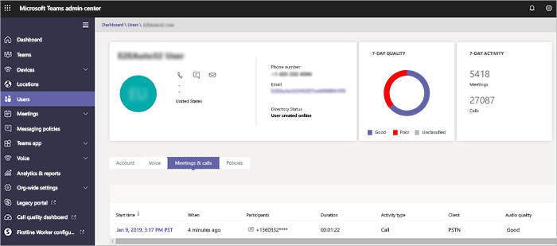

# Usar a Análise de Chamada para solucionar problemas de baixa qualidade da chamada

Este artigo explica como usar a Análise de Chamadas para solucionar problemas de baixa qualidade de chamadas ou reuniões do Microsoft Teams para usuários individuais se você tiver a função de administrador do Teams, especialista de suporte de comunicações do Teams ou engenheiro de suporte de comunicações do Teams.

## Permissões de Análise de Chamadas

Este artigo pressupõe que você já configurou o Call Analytics. Caso contrário, leia Configurar [a análise de chamadas para o Teams](set-up-call-analytics.md).

## Introdução à Análise de Chamadas

A Análise de Chamadas mostra informações detalhadas sobre chamadas e reuniões do Teams para cada usuário em sua Office 365 conta. Ele inclui informações sobre dispositivos, redes, conectividade e qualidade de chamada (qualquer um deles pode ser um fator na baixa qualidade da chamada ou da reunião). Se você carregar informações de prédio, site e locatário, essas informações também serão mostradas para cada chamada e reunião. Use a Análise de Chamadas para ajudá-lo a descobrir por que um usuário teve uma experiência ruim de chamada ou reunião.

A Análise de Chamadas mostra cada segmento de uma chamada ou reunião – por exemplo, de um participante para um segundo participante. Analisando esses detalhes, um administrador do Teams pode isolar áreas problemáticas e identificar a causa raiz da baixa qualidade.

Como administrador do Teams, você obtém acesso completo a todos os dados do Call Analytics para cada usuário. Além disso, você pode atribuir funções do Azure Active Directory para dar suporte à equipe. Para saber mais sobre essas funções, leia [Conceder permissão para suporte e equipe de assistência técnica](set-up-call-analytics.md#give-permission-to-support-and-helpdesk-staff). Não perca o que [cada função de Suporte do Teams faz?](#what-does-each-teams-support-role-do) Abaixo.

## Onde encontrar a Análise de Chamadas por usuário

Para ver todas as informações de chamada e dados de um usuário, acesse o Centro [de administração do Teams](https://admin.teams.microsoft.com). Em **Usuários**, selecione um usuário e abra a guia **Reuniões & Chamadas** na página de perfil do usuário. Aqui você encontrará todas as chamadas e reuniões para esse usuário nos últimos 30 dias.

Para obter informações adicionais sobre uma determinada sessão, incluindo estatísticas detalhadas de rede e mídia, clique em uma sessão para ver os detalhes.

## O que cada função de Suporte do Teams faz?

O **especialista em suporte de comunicações do Teams** (suporte à Camada 1) lida com problemas básicos de qualidade de chamada. Eles não investigam problemas com reuniões. Em vez disso, eles coletam informações relacionadas e, em seguida, escalonam para um engenheiro de suporte de comunicações do Teams.

O **engenheiro de suporte de** comunicações do Teams (suporte à Camada 2) vê informações em logs de chamadas detalhados que estão ocultos do especialista de suporte de comunicações do Teams. A tabela a seguir lista as informações disponíveis para cada função de suporte de comunicação do Teams.

A tabela a seguir informa quais informações por usuário estão disponíveis para cada função de suporte de comunicações.

|Atividade|Informações|O que as comunicações o *especialista em* suporte vê|O que as comunicações engenheiro *de suporte* vê|
|---|---|---|---|
|**Chamadas**|Nome do chamador|Somente o nome do usuário para o qual o agente pesquisou.|Nome de usuário.|
||Nome do destinatário|Mostra como Usuário Interno ou Usuário Externo.|Nome do destinatário.|
||Número de telefone do chamador|O número de telefone inteiro, exceto os últimos três dígitos, é ofuscado com símbolos de asterisco. Por exemplo, 15552823\*\*\*.|O número de telefone inteiro, exceto os últimos três dígitos, é ofuscado com símbolos de asterisco. Por exemplo, 15552823\*\*\*.|
||Número de telefone do destinatário|O número de telefone inteiro, exceto os últimos três dígitos, é ofuscado com símbolos de asterisco. Por exemplo, 15552823\*\*\*.|O número de telefone inteiro, exceto os últimos três dígitos, é ofuscado com símbolos de asterisco. Por exemplo, 15552823\*\*\*.|
||**Detalhes da Chamada** \> **Guia** Avançado|Informações não mostradas.|Todos os detalhes mostrados, como nomes de dispositivo, endereço IP, mapeamento de sub-rede e muito mais.|
||**Detalhes da Chamada** \> **Avançado** \> **Guia Depurar**|Informações não mostradas.|Todos os detalhes mostrados, como sufixo DNS e SSID.|
|**Reuniões**|Nomes de participantes|Somente o nome do usuário para o qual o agente pesquisou. Outros participantes identificados como Usuário Interno ou Usuário Externo.|Todos os nomes mostrados.|
||Contagem de participantes|Número de participantes.|Número de participantes.|
||Detalhes da sessão|Detalhes da sessão mostrados com exceções. Somente o nome do usuário para o qual o agente pesquisou é mostrado. Outros participantes identificados como Usuário Interno ou Usuário Externo. Últimos três dígitos de número de telefone ofuscados com símbolos de asterisco.|Detalhes da sessão mostrados. Nomes de usuário e detalhes da sessão mostrados. Últimos três dígitos de número de telefone ofuscados com símbolos de asterisco.|
||||

> [!NOTE]
> As informações contidas na seção "Outros" da guia Avançado e na guia Depuração contêm dados de telemetria e diagnóstico de serviço destinados a ajudar os engenheiros de suporte da Microsoft. Sem o contexto dos dados adicionais disponíveis para os engenheiros de suporte, eles podem parecer redundantes, impreciso ou confusos. Embora o dispomos para usuários avançados que estão procurando outro nível de detalhe na solução de problemas de chamada, não recomendamos fazer julgamentos com base nos dados sem o suporte da Microsoft.

## Solucionar problemas de qualidade de chamada do usuário

1. Abra o centro de administração do Teams (<https://admin.teams.microsoft.com>) e entre com o suporte de comunicações do Teams ou as credenciais de Administrador do Teams.

2. No **Painel,** na Pesquisa de **Usuário, comece** a digitar o nome ou o endereço SIP do usuário cujas chamadas você deseja solucionar ou selecione Exibir usuários  para ver uma lista de usuários.

3. Selecione o usuário na lista.

4. Selecione **Histórico de** chamadas e, em seguida, selecione a chamada ou reunião que você deseja solucionar problemas.

5. Selecione a **guia Avançado** e procure itens amarelos e vermelhos que indiquem baixa qualidade de chamada ou problemas de conexão.

   Nos detalhes da sessão de cada chamada ou reunião, os problemas secundários aparecem em amarelo. Se algo é amarelo, está fora do intervalo normal e pode estar contribuindo para o problema, mas é improvável que seja a causa principal do problema. Se algo estiver vermelho, será um problema significativo e provavelmente será a principal causa da baixa qualidade da chamada para esta sessão.

Em casos raros, os dados de Qualidade da Experiência não são recebidos para sessões de áudio. Geralmente, isso é causado por uma chamada descartada ou quando a conexão com o cliente é encerrada. Quando isso ocorre, a classificação da sessão fica **indisponível**.

Para sessões de áudio que têm dados de QoE (Qualidade da Experiência), a tabela a seguir descreve os principais problemas que qualificam uma sessão como **ruim**.

|Problema|Área|Descrição|
|---|---|---|
|Configuração de chamada|Sessão|O código de erro Ms-diag 20-29 indica que a configuração da chamada falhou. O usuário não pôde ingressar na chamada ou na reunião.|
|Chamada ruim classificada pela rede de áudio|Sessão|Problemas de qualidade de rede (como perda de pacotes, tremulação, degradação de NMOS, RTT ou taxa oculta) foram encontrados.|
|O dispositivo não está funcionando|Dispositivo|Um dispositivo não está funcionando corretamente. As taxas de dispositivo que não estão funcionando são: 
 DeviceRenderNotFunctioningEventRatio >= 0,005    DeviceCaptureNotFunctioningEventRatio >= 0,005|
||||

## Tópicos relacionados

[Configurar a análise de chamadas por usuário](set-up-call-analytics.md)
