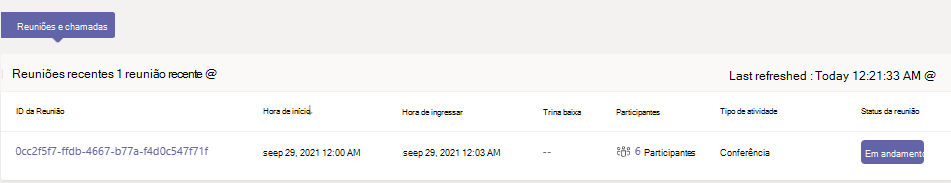
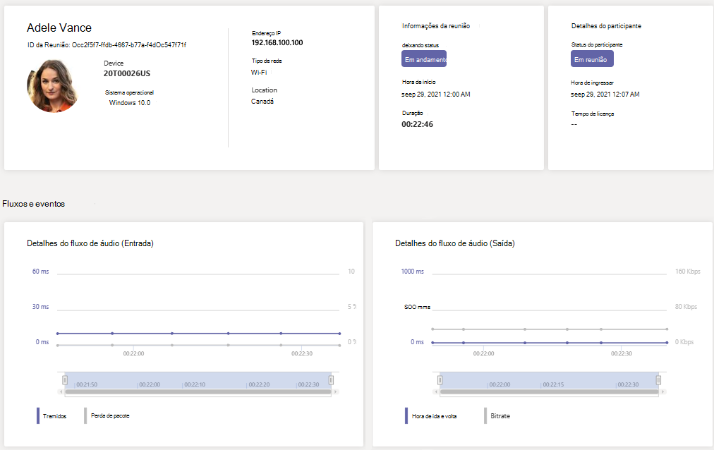

# Usar a telemetria em tempo real para solucionar problemas de qualidade de reunião ruim

> [!NOTE]
> Esse recurso está atualmente em visualização pública até o final de 2021. Após esse tempo, o complemento Comunicações Avançadas para Microsoft Teams será necessário para cada usuário cuja telemetria você deseja exibir em tempo real. Para obter mais informações, consulte [Complemento de Comunicações Avançadas para o Microsoft Teams ](/MicrosoftTeams/teams-add-on-licensing/advanced-communications).

Este artigo explica como usar o Real-Time Analytics (RTA) para solucionar problemas Microsoft Teams qualidade de reunião para usuários individuais. Você pode acessar Real-Time Analytics se tiver uma das seguintes funções:

- Administrador do Teams
- Teams Especialista em Suporte de Comunicações
- Engenheiro de Suporte de Comunicações de Equipes

Para obter mais informações sobre Teams funções de administrador, consulte Use Microsoft Teams de administrador [para gerenciar Teams](/MicrosoftTeams/using-admin-roles).

Real-Time Analytics permite que os administradores de IT vejam as reuniões agendadas de seus usuários importantes e vejam áudio, vídeo, compartilhamento de conteúdo e problemas relacionados à rede. Como administrador, você pode usar essa telemetria para investigar esses problemas durante as reuniões e solucionar problemas em tempo real.

## O que é Real-Time Analytics?

Hoje, a solução de problemas de reunião individual está disponível para Teams administradores por meio do [Call Analytics](use-call-analytics-to-troubleshoot-poor-call-quality.md) após o final da reunião. Real-Time Analytics permite que os administradores solucionem problemas de reuniões agendadas enquanto estão em andamento.

Real-Time Analytics mostra informações detalhadas sobre Teams reuniões para cada usuário em sua conta Office 365, atualizadas em tempo real. Ele inclui informações sobre dispositivos, rede, conectividade, áudio, vídeo e problemas de compartilhamento de conteúdo, o que ajudará os administradores a solucionar problemas de qualidade de chamada com mais eficiência.

Como administrador Teams, você tem acesso total a todos os dados de telemetria em tempo real para cada usuário. Além disso, você pode atribuir Azure Active Directory funções para dar suporte à equipe. Para saber mais sobre essas funções, consulte [Give permission to support and help desk staff](set-up-call-analytics.md#give-permission-to-support-and-helpdesk-staff).

## Onde encontrar a telemetria de solução de problemas em tempo real por usuário

Para ver todas as informações de reunião e dados de um usuário, vá para o centro [Teams administrador.](https://admin.teams.microsoft.com) Em **Usuários**  >  **Gerenciar usuários,** selecione um usuário e abra a guia **Reuniões & chamadas** na página de perfil do usuário. Em **Reuniões recentes,** você verá uma lista de reuniões que o usuário participou nas últimas 24 horas para as quais *a telemetria* em tempo real está disponível , incluindo todas as reuniões em andamento. Se a reunião não estiver em andamento ou não tiver dados de telemetria em tempo real, ela será aparecer em **reuniões passadas.**

Para obter informações adicionais sobre os participantes de uma reunião em andamento, incluindo suas estatísticas  de dispositivo, rede  e áudio, encontre a reunião em Reuniões recentes e selecione o link na coluna Participantes.

Para ver a telemetria de um determinado usuário para uma reunião em andamento, incluindo informações sobre detalhes de compartilhamento de dispositivo, rede, áudio, vídeo e conteúdo, selecione a **ID** da Reunião .

## Medidas disponíveis no Real-Time Analytics

|Nome da Medida |Unidades |Limite bom |Descrição |
|:---|:---|:---|:---|
|Tremulação |Milissegundos |Menos de 30 ms |Treme é uma medida da variação no atraso de pacotes para um fluxo de dados. Quando isso é muito alto, o áudio pode ficar inso. | 
|Perda de pacote |Porcentagem |Menos de 5% |A perda de pacotes ocorre quando os pacotes de dados não conseguem chegar ao destino. A porcentagem de pacotes perdidos se baseia no número total de pacotes enviados. |
|Hora da viagem de ida e volta |Milissegundos |Menos de 500 ms |O tempo de viagem de ida e volta é o tempo necessário para que um único pacote viaje do cliente para o ponto de extremidade remoto e volte para o cliente. O tempo de viagem de ida e volta alto pode causar atrasos na reprodução do fluxo. Um exemplo disso é quando duas pessoas em uma reunião estão falando umas sobre as outras sem querer devido ao atraso. |
|Bitrate (Áudio) |Kilobits por segundo (Kbps) |Maior que 24 Kbps |Produtividade do fluxo de áudio expresso em quilobits por segundo. |
|Taxa de bits (compartilhamento & aplicativo de vídeo) |Megabits por segundo (Mbps) | Somente informações |Produtividade do fluxo de vídeo expresso em megabits por segundo. |
|Taxa de quadros (vídeo) |Quadros por segundo |360p ou melhor: 25-30 FPS   270p ou inferior: 7 a 15 FPS |Para fluxos de vídeo de saída, a taxa de quadros (FPS) é o número de quadros por segundo de vídeo que o cliente está enviando. Valores inferiores aos esperados aqui podem sugerir restrições de recursos do sistema, largura de banda de rede insuficiente ou dispositivos de captura de vídeo mal comportados. Resoluções diferentes têm diferentes intervalos de FPS aceitáveis. |
|Taxa de Quadros (Compartilhamento de aplicativos) |Quadros por segundo (FPS) |Somente informações |Para o compartilhamento de aplicativos, a taxa de quadros é ciente de conteúdo para garantir que o máximo de quadros necessários seja enviado para garantir uma boa experiência, evitando o envio de quadros se não for necessário. Por exemplo, o compartilhamento de um documento de texto na tela requer apenas 1 quadro por segundo para produzir uma boa experiência, enquanto o compartilhamento de um vídeo ou conteúdo com mais atividades aumentará quadros por segundo para um máximo de 30 FPS para produzir uma experiência mais suave. |

## Plataformas cliente com suporte para telemetria em tempo real

- Windows
- macOS
- Linux
- Android
- iOS

## Teams com suporte para telemetria em tempo real

- MTR - Surface Hub
- MTR - Teams Display
- MTR - Barra de colaboração
- Dispositivos ip Telefone ip

## Limitações

- A telemetria em tempo real só está disponível para reuniões agendadas. Para reuniões ad hoc como Meet Now, PSTN, chamadas 1:1 e chamadas de grupo, a telemetria em tempo real não está disponível.
- A telemetria em tempo real só está disponível para apresentadores de evento ao vivo agendado. No momento, ele não está disponível para participantes do evento ao vivo.
- Os dados de telemetria em tempo real estão disponíveis para uma reunião em **Reuniões recentes** por 24 horas após o fim da reunião. Após 24 horas, você não pode acessar os dados e a reunião muda para **reuniões passadas.** Se uma reunião for maior que 3 horas, a telemetria em tempo real só estará disponível nas *últimas 3 horas.*
- A telemetria não está disponível em tempo real ao usar versões mais antigas Teams. Se nenhuma telemetria estiver disponível, tente atualizar seu cliente.
- Se participantes externos ou usuários anônimos ingressarem  em uma reunião, seu nome de exibição mostrará como indisponível manter a privacidade entre locatários.

## Tópicos relacionados

[Configurar análise de chamada por usuário](set-up-call-analytics.md)

[Use Microsoft Teams funções de administrador para gerenciar Teams](/MicrosoftTeams/using-admin-roles).
