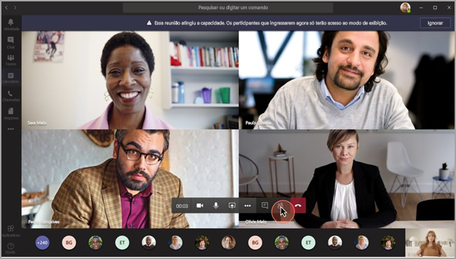
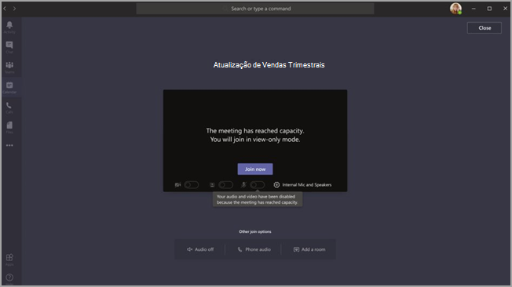

# <a name="teams-view-only-meeting-experience"></a>Experiência de reunião somente para visualização de Teams

> [!Note]
> As transmissões somente para visualização estão disponíveis no Microsoft 365 E3/E5 e Microsoft 365 A3/A5. Este recurso será habilitado em 1º de março de 2021 como DESLIGADO padrão. O recurso no Microsoft 365 Government Community Cloud (GCC) começará a ser implementado no final de março de 2021. Government Community Cloud High (GCCH) e Department of Defense (DoD) serão implementados posteriormente. Você deve alterar a política padrão após essa data se quiser que o recurso seja ativado por padrão. Use o Windows PowerShell para habilitar a política `Set-CsTeamsMeetingPolicy -Identity Global -StreamingAttendeeMode Enabled`.

> [!Note]
> Se sua reunião atingir a capacidade máxima, o Teams será perfeitamente escalonado para acomodar uma experiência de transmissão somente exibição para 10.000 pessoas. Além disso, durante este período de maior trabalho remoto, aproveite as transmissões ainda maiores para 20.000 pessoas até o final deste ano. Atualmente, os webinars não suportam uma experiência de transmissão somente exibição.

> [!Note]
> Uma Reunião do Teams não é um TLE (Evento Ao Vivo do Teams) e não aproveitará Microsoft eCDN. Para obter mais informações, consulte [Microsoft lista de verificação de integração do eCDN](/ecdn/integration/onboarding-checklist-for-tle-customers).

O Microsoft Teams permite que até 10.000 participantes participem de uma reunião do Teams. Depois que a capacidade da reunião principal for atingida (ou seja, quando 1.000 usuários entrarem em uma reunião), os participantes adicionais ingressarão com uma experiência somente exibição.

Os participantes que ingressarem primeiro na reunião, até a capacidade da reunião principal, terão a experiência completa de reunião do Teams. Eles podem compartilhar áudio e vídeo, ver vídeos compartilhados e participar do bate-papo da reunião.

Os participantes que ingressarem depois que a capacidade da reunião principal for atingida terão uma experiência somente para visualização.

Os participantes poderão ingressar na experiência somente exibição por meio da Área de trabalho, da Web e do Teams móvel (Android e iOS).

> [!Note]
> A capacidade limite atual da "reunião principal", ou em outras palavras, o número de usuários totalmente interativos, é de 1000 e inclui GCC e webinars.

## <a name="teams-view-only-experience-controls"></a>Controles de experiência somente exibição do Teams

Você habilita a experiência somente exibição usando o cmdlet [`Set-CsTeamsMeetingPolicy`](/powershell/module/skype/set-csteamsmeetingpolicy) do [módulo SkypeForBusiness PowerShell](/powershell/module/skype/) ou pelo menos a versão 2.0.0 do [módulo MicrosoftTeams](https://www.powershellgallery.com/packages/MicrosoftTeams).

Para usar o módulo `MicrosoftTeams` recomendado:

```PowerShell
Install-Module -Name "MicrosoftTeams" -MinimumVersion 2.0.0
Connect-MicrosoftTeams
```

Para habilitar a experiência somente exibição, você pode usar o seguinte trecho do PowerShell:

```PowerShell
Set-CsTeamsMeetingPolicy -Identity Global -StreamingAttendeeMode Enabled
```

Para desabilitar a experiência somente exibição, você também pode usar o PowerShell.

```PowerShell
Set-CsTeamsMeetingPolicy -Identity Global -StreamingAttendeeMode Disabled
```

No futuro, você poderá ativar ou desativar a experiência somente exibição no Centro de administração do Teams.

## <a name="impact-to-users"></a>Impacto nos usuários

A experiência de um usuário varia de acordo com vários fatores.

Quando a capacidade da reunião principal for atingida, um participante não poderá participar da reunião se alguma das seguintes condições for verdadeira:

- Um administrador desabilitou a experiência somente exibição do Teams para o organizador ou para todo o locatário.
- O participante somente exibição não pode ignorar o lobby. Como exemplo, se um organizador de uma reunião escolher ter apenas **pessoas na minha organização** para ignorar o lobby, e um participante que esteja fora da organização tentar participar como um participante somente exibição, ele não poderá participar.

Quando a capacidade da reunião principal for atingida, o organizador da reunião e os apresentadores verão uma faixa informando que os novos participantes ingressarão como participantes somente exibição.

  

Quando a capacidade da reunião principal for atingida, os participantes da reunião serão informados na tela de pré-entrada que eles estão entrando no modo somente visualização.

  

Se houver espaço, um usuário sempre participará da reunião principal. Se a reunião principal atingir a capacidade máxima e um ou mais participantes deixarem a reunião principal, a reunião principal terá capacidade disponível. Os participantes que ingressarem (ou reingressarem) na reunião entrarão na reunião principal até que ela atinja sua capacidade novamente. Os participantes que estão na experiência somente exibição não serão promovidos automaticamente para a reunião principal e não poderão ser promovidos manualmente para a reunião principal.

Se as funções de apresentador e participante tiverem sido definidas, e um apresentador tentar ingressar em uma reunião após a reunião principal ter atingido a capacidade, ele ingressará como um participante somente exibição e terá as mesmas limitações dos outros participantes somente exibição. O suporte para garantir que todos os apresentadores ingressem na reunião principal será implementado posteriormente. O organizador terá sempre espaço garantido na reunião principal.

## <a name="impact-to-meeting-presenters-and-organizers"></a>Impacto para os apresentadores e organizadores da reunião

As limitações para os apresentadores e organizadores da reunião incluem:

- Você não terá informações sobre o participante somente visualização. Não oferecemos suporte ao E-discovery para participantes somente para visualização.
- Os usuários na reunião principal não podem ver os participantes somente exibição.
- Você não pode remover um participante somente visualização da reunião.

> [!Note]
> A contagem de participantes refletirá apenas as pessoas na reunião principal e não as pessoas na sala somente exibição. Portanto, os apresentadores não podem obter uma contagem exata de quem está na experiência somente visualização.

## <a name="experience-for-view-only-attendees"></a>Experiência para participantes somente visualização

A experiência do Teams apenas para visualização permite que os participantes:

- Ouça os participantes da reunião das equipes principais.
- Veja o feed de vídeo do locutor ativo (se o locutor ativo estiver compartilhando vídeo).
- Veja o conteúdo sendo compartilhado usando a funcionalidade compartilhar tela ou área de trabalho.

O participante somente visualização não poderá experimentar as seguintes opções nas reuniões:

- Participe da reunião se o participante não tiver permissão para ignorar o lobby com base nas políticas ou opções de lobby definidas.
- Entre na sala somente para visualização usando a conferência de áudio.
- Ingresse na sala somente exibição usando o sistema de Salas do Microsoft Teams ou os serviços de Interoperabilidade de Vídeo em Nuvem (CVI).
- Compartilhe seu áudio ou vídeo.
- Veja ou participe do chat da reunião.
- Veja o feed de vídeo dos participantes da reunião, a menos que o participante seja o palestrante ativo.
- Veja os arquivos do PowerPoint que são compartilhados usando a funcionalidade do PowerPoint Live ou compartilhamentos de aplicativos individuais (que não sejam compartilhamento de tela ou área de trabalho).
- Levante sua mão na reunião.
- Enviar ou ver as reações.
- Interaja com qualquer aplicativo 3P integrado na Reunião do Teams, incluindo Votações.
- Acesso à gravação da reunião.

## <a name="view-only-feature-limitations"></a>Limitações do recurso somente visualização

- Em somente exibição os participantes poderão ver apenas as legendas ao vivo na Área de trabalho e na Web. Apenas legendas em inglês são suportadas no momento.
- Os participantes de visualização apenas não podem se registrar em Webinars.
- Os participantes somente para visualização terão o suporte da tecnologia de streaming.
- Os participantes somente para visualização não serão incluídos no relatório de presença.
- Os participantes somente para visualização terão uma única experiência de vídeo. Eles podem ver o locutor ativo ou o conteúdo que está sendo compartilhado, mas não ambos.
- No momento, não oferecemos suporte para **Galeria**, **Galeria grande** ou **Modo conferência** layouts para participantes somente para visualização.
- Os participantes somente exibição só são apoiados pelas seguintes políticas de lobby: "Pessoas na minha organização", "Pessoas na minha organização e convidados", "Pessoas em minha organização, organizações confiáveis e convidados" e "Todos". Se você utilizar uma política de lobby que tem suporte para participantes Somente exibição, os participantes Somente exibição serão rejeitado da reunião. 
- Os participantes somente para visualização não terão a mesma latência de um participante normal. <sup>1</sup>

  <sup>1</sup> Os participantes somente para visualização terão um atraso de 30 segundos de vídeo e áudio na reunião.  
