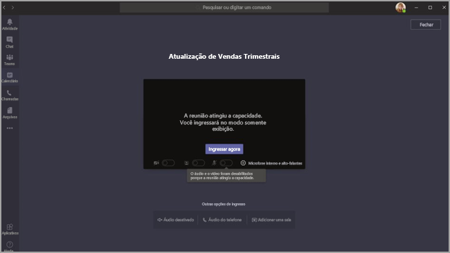

# <a name="teams-view-only-meeting-experience"></a>Experiência de reunião somente para exibição do Teams

> [!Note]
> A experiência de reunião somente para exibição estará disponível no início de março de 2021.

> [!Note]
> Aumentamos temporariamente a experiência somente para exibição para 20.000 participantes, mas reverteremos o suporte para 10.000 participantes em 30 de junho de 2021.

O Microsoft Teams permite que até 10.000 participantes participem de uma reunião do Teams. Depois que a capacidade da reunião principal tiver sido atingida, os participantes adicionais ingressarão com uma experiência somente para exibição.

Os participantes que ingressarem na reunião primeiro, até a capacidade da reunião, terão a experiência completa de reunião do Teams. Eles podem compartilhar áudio e vídeo, ver vídeos compartilhados e participar do chat da reunião.

Os participantes que ingressarem depois que a capacidade principal da reunião tiver sido atingido terão uma experiência somente para exibição.

Temos suporte móvel completo para Android e iOS para um participante ingressar.

> [!Note]
> O limite atual para o número de pessoas que podem conversar e ligar para uma reunião é 300 na WW e 250 no GCC, GCC High e DoD.

A experiência somente para exibição é habilitada por padrão para qualquer organizador que tenha SKU E3/E5/A3/A5. Nenhuma configuração ou configuração é necessária.

### <a name="disable-teams-view-only-experience"></a>Desabilitar a experiência somente para exibição do Teams

Os administradores podem desabilitar a experiência somente para exibição usando o PowerShell.

```PowerShell
Set-CsTeamsMeetingPolicy -Identity Global -StreamingAttendeeMode Disabled
```

No futuro, também será possível que os administradores desabilitem a experiência somente para exibição no Centro de administração do Teams.

## <a name="impact-to-users"></a>Impacto para os usuários

A experiência de um usuário variará dependendo de vários fatores.

Quando a capacidade da reunião principal tiver sido atingida, um participante não poderá ingressar na reunião se qualquer um dos seguintes fatores for verdadeiro:

- Um administrador desabilitou a experiência somente para exibição do Teams.
- O participante não tem permissão para ignorar o lobby.

Quando a capacidade da reunião principal for atingida, o organizador da reunião e os apresentadores verão uma faixa informando que a capacidade da reunião foi atingida e que novos participantes ingressarão em um participante somente para exibição.

  

Quando a capacidade da reunião principal tiver sido atingida, os participantes da reunião serão informados na tela de pré-entrada de que estão in ingressar no modo somente para exibição.

  

Se houver espaço, um usuário sempre ingressará na reunião principal. Se a reunião principal atingir a capacidade e um ou mais participantes saírem da reunião principal, a reunião principal terá capacidade disponível. Os participantes que ingressarem (ou reaparecer) na reunião ingressarão na reunião principal até que ela atinja a capacidade novamente. Os participantes que estão na experiência somente para exibição não serão promovidos automaticamente para a reunião principal e não podem ser promovidos manualmente para a reunião principal.

Se as funções de apresentador/participante não foram definidas, os espaços na reunião principal serão preenchidos por primeira vez. Depois que a capacidade de reunião tiver sido atingida, todos os outros usuários ingressarão com uma experiência somente para exibição.

## <a name="impact-to-meeting-presenters"></a>Impacto nos apresentadores da reunião

Reservaremos espaço na reunião normal para usuários explicitamente indicados como apresentadores nas opções da reunião. Se um apresentador sair e depois reapresentar a reunião, ele será deixado na reunião como apresentador.

As limitações para apresentadores de reunião incluem:

- Você não terá nenhuma informação sobre o participante somente para exibição. Não há suporte para descoberta de E para participantes somente para exibição.
- Os usuários não podem ver os participantes somente para exibição.
- Não é possível remover um participante somente para exibição da reunião.

> [!Note]
> A contagem de participantes refletirá apenas as pessoas na reunião e não as pessoas na sala excedente. Portanto, os apresentadores não conseguem obter uma contagem exata de quem está na experiência somente para exibição.

## <a name="experience-for-view-only-attendees"></a>Experiência para participantes somente para exibição

A experiência somente para exibição do Teams permite que os participantes:

- Ouça os participantes da reunião principal do Teams.
- Veja o feed de vídeo do alto-falante ativo (se o alto-falante ativo estiver compartilhando vídeo).
- Veja o conteúdo sendo compartilhado usando a funcionalidade compartilhar da área de trabalho.

O participante somente para exibição não poderá experimentar as seguintes opções em reuniões:

- In join the meeting if the attendee doesn't have permission to bypass the lobby based on set lobby policies or options.
- In join the Overflow Room via AudioConferência.
- In join the Overflow Room via Microsoft Teams Room system or via Cloud Video Interop (CVI).
- In join the Overflow Room via the Teams Android mobile app.
- Compartilhe seu áudio ou vídeo.
- Veja ou participe do chat da reunião.
- Veja o feed de vídeo dos participantes da reunião, a menos que o participante seja o orador ativo.
- Veja arquivos do PowerPoint que são compartilhados usando a funcionalidade nativa do PowerPoint ou compartilhamentos de aplicativos individuais (além do compartilhamento de área de trabalho).

## <a name="view-only-feature-limitations"></a>Limitações de recursos somente para exibição

- Os participantes somente para exibição sempre verão legendas ao vivo, independentemente da configuração de legendas ao vivo para essa reunião. No momento, só há suporte para legendas em inglês.
- Os participantes somente para exibição terão suporte de tecnologia de streaming.
- Os participantes somente para exibição não serão incluídos no relatório de presença.
- Os participantes somente para exibição terão uma única experiência com vídeo. Eles podem ver o orador ativo ou o conteúdo que está sendo compartilhado, mas não ambos.
- No momento, não há suporte para  layouts de **modo Galeria,** Galeria Grande ou Modo Juntos para participantes somente para exibição.  
- Os participantes somente para exibição não terão a mesma latência que um participante comum. <sup>1</sup>

  <sup>1</sup> Os participantes somente para exibição terão um atraso de áudio e vídeo de 30 segundos na reunião.  

## <a name="related-topics"></a>Tópicos relacionados

- [Complemento de comunicações avançadas para o Teams](teams-add-on-licensing/advanced-communications.md)
- [Especificações e limites do Teams](limits-specifications-teams.md)
