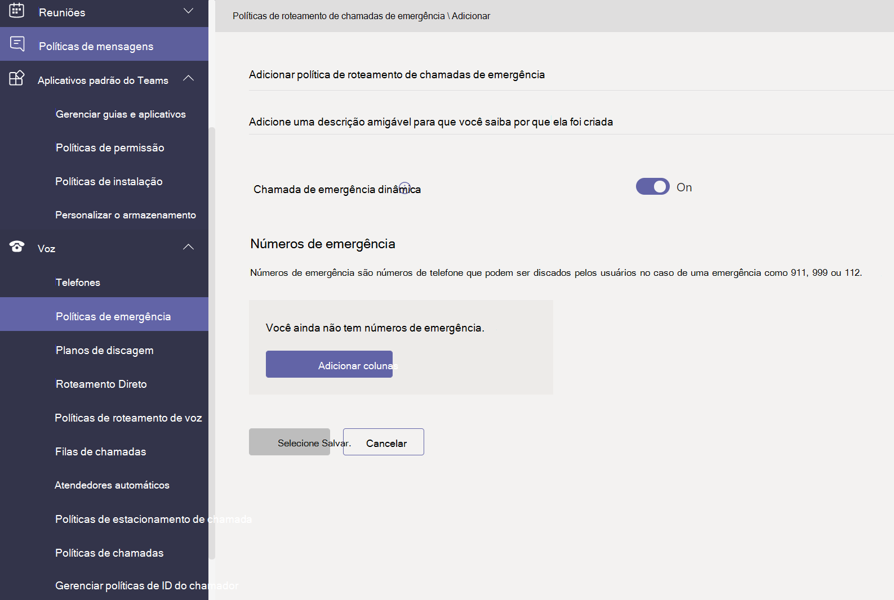
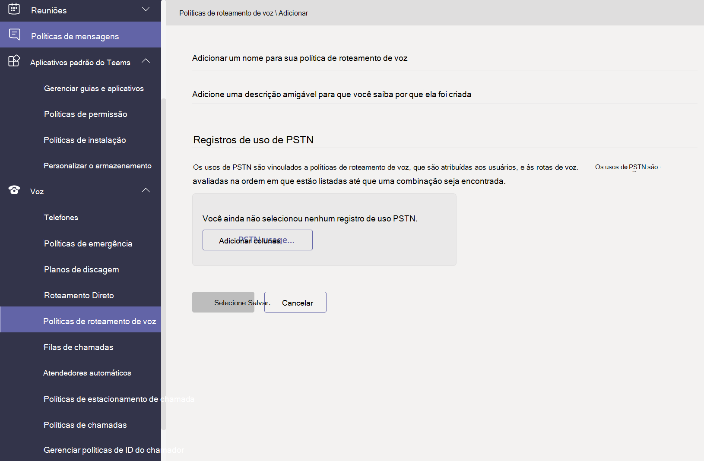
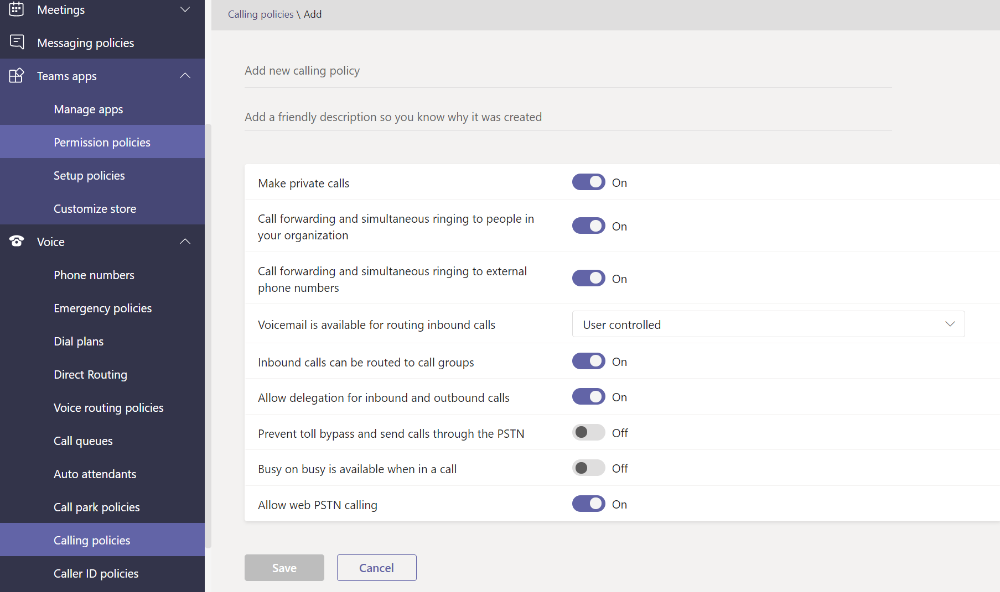

# Gerenciar políticas de voz e chamadas no Microsoft TeamsManage voice and calling policies in Microsoft Teams

As políticas de voz e chamada são usadas para controlar a voz e a chamada no Microsoft Teams.Voice and calling policies are used to control voice and calling in Microsoft Teams.

## Políticas de chamada de emergênciaEmergency calling policies

Você usa [políticas de chamada de](manage-emergency-calling-policies.md) emergência para configurar o que acontece quando um usuário em sua organização faz uma chamada de emergência.You use [emergency calling policies](manage-emergency-calling-policies.md) to configure what happens when a user in your organization makes an emergency call. Essas políticas são gerenciadas no centro de administração do Teams ou usando Windows PowerShell.These policies are managed in the Teams admin center or using Windows PowerShell.

## Políticas de roteamento de chamadas de emergênciaEmergency call routing policies

Se sua organização tiver implantado o Roteamento Direto do Sistema de Telefonia **,** você poderá usar políticas de roteamento de chamadas de emergência para determinar para onde as chamadas de emergência são roteadas, se os serviços de emergência aprimorados estão habilitados e quais números são usados para serviços de emergência. If your organization has deployed **Phone System Direct Routing**, you can use [emergency call routing policies](manage-emergency-call-routing-policies.md) to determine where emergency calls are routed, whether enhanced emergency services are enabled, and which numbers are used for emergency services. Essas políticas são gerenciadas usando o PowerShell ou no centro de administração do Microsoft Teams.These policies are managed using PowerShell or in the Microsoft Teams admin center.

## Políticas de ID do chamadorCaller ID policies

[As políticas de ID do chamador](caller-id-policies.md) são usadas para alterar ou bloquear a ID do chamador.[Caller ID policies](caller-id-policies.md) are used to change or block caller ID.

## Políticas de roteamento de vozVoice routing policies

Uma [política de roteamento de](manage-voice-routing-policies.md) voz é um contêiner para registros de uso da PSTN (Rede Telefônica Pública Comugada).A [voice routing policy](manage-voice-routing-policies.md) is a container for Public Switched Telephone Network (PSTN) usage records. Você pode usar essas políticas se sua organização tiver implantado **o Roteamento Direto do Sistema de Telefonia.**You can use these policies if your organization has deployed **Phone System Direct Routing**. As políticas de roteamento de voz podem ser gerenciadas com o PowerShell ou no Centro de administração do Teams.Voice routing policies can be managed with PowerShell or in the Teams admin center.

## Políticas de chamadasCalling policies

[As políticas de](teams-calling-policy.md) chamada controlam quais recursos de encaminhamento de chamadas e chamadas estão disponíveis para os usuários, incluindo se um usuário pode fazer chamadas privadas, enviar chamadas para grupos de chamadas e encaminhar chamadas para a caixa postal.[Calling policies](teams-calling-policy.md) control which calling and call forwarding features are available to users including whether a user can make private calls, send calls to call groups, and route calls to voicemail.

## Estacionamento de chamada e políticas de recuperaçãoCall park and retrieve policies

[O estacionamento de chamada e a](call-park-and-retrieve.md) recuperação permitem que os usuários coloquem outros usuários em espera e habilitam o mesmo usuário ou outra pessoa a continuar a chamada.[Call park and retrieve](call-park-and-retrieve.md) lets users put other users on hold and enables the same user or someone else to continue the call.

## Criar e gerenciar planos de discagemCreate and manage dial plans

[Planos de discagem](create-and-manage-dial-plans.md) traduzem números de telefone discados para autorização e roteamento de chamadas.[Dial plans](create-and-manage-dial-plans.md) translate dialed phone numbers for call authorization and routing. Você pode criar e gerenciar planos de discagem por meio do PowerShell ou no Centro de administração do Microsoft Teams.You can create and manage dial plans through PowerShell or in the Microsoft Teams admin center.

## Tópicos relacionadosRelated topics

* [Gerenciar políticas de chamada de emergência no Microsoft TeamsManage emergency calling policies in Microsoft Teams](manage-emergency-calling-policies.md)
* [Gerenciar políticas de roteamento de chamadaManage emergency call routing policies](manage-emergency-call-routing-policies.md)
* [Gerenciar políticas de identificação de chamadas no Microsoft TeamsManage caller ID policies in Microsoft Teams](caller-id-policies.md)
* [Gerenciar políticas de roteamento de vozManage voice routing policies](manage-voice-routing-policies.md)
* [Políticas de chamada no Microsoft TeamsCalling policies in Microsoft Teams](teams-calling-policy.md)
* [Estacionamento e recuperação de chamadas no Microsoft TeamsCall park and retrieve in Microsoft Teams](call-park-and-retrieve.md)
* [Criar e gerenciar planos de discagemCreate and manage dial plans](create-and-manage-dial-plans.md)
* [Gerenciar o Teams com políticasManage Teams with policies](manage-teams-with-policies.md)
