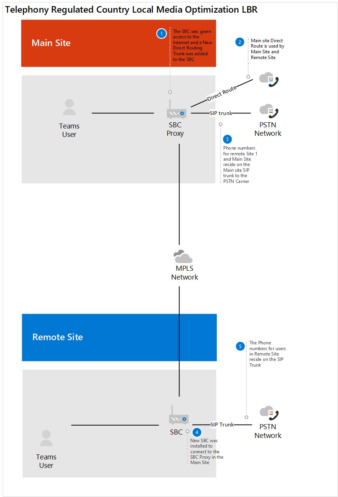

# Estudo de caso da Contoso: roteamento baseado em localização

O roteamento baseado em local (LBR) é um recurso que restringe o intervalo de chamadas com base na política e na localização física do usuário no momento da inserção ou recebimento de uma chamada.  

## Visão geral

A contoso tem dois escritórios em um país onde é ilegal ignorar o provedor PSTN (rede telefônica pública comutada) para reduzir os custos de chamadas de longa distância. O escritório principal tem uma conexão à Internet que é usada pelo escritório principal e pelo segundo Office. Cada escritório tem seu próprio controlador de borda de sessão (SBC) conectado a uma operadora PSTN.  
 
Neste país, a Contoso tinha LBR configurado para a implantação do Skype for Business. Para determinar como configurar o LBR para Teams, o [roteamento baseado em local de plano de leitura da Contoso para roteamento direto](location-based-routing-plan.md). A contoso determinou que o Microsoft Teams e o Skype for Business seguem os mesmos cenários em que uma chamada pode ser feita, quando ela pode ser recebida, quando uma chamada PSTN pode ser transferida para um usuário do Teams e quando você pode transferir outro usuário do Team para a chamada PSTN.  

Para o Skype for Business, o LBR foi configurado com o tronco SIP do controlador de borda de sessão (SBC) conectado à operadora PSTN. Para este SBC, a contoso analisou a [lista de SBCS certificado](direct-routing-border-controllers.md) e determinou que o SBC implantado é certificado para roteamento direto, mas não é certificado para bypass de mídia. Para dar suporte ao LBR, o roteamento direto precisa ser configurado para o SBC no local, deve ser um egresso de Internet local, e o SBC precisa estar configurado para bypass de mídia. Com base nessas informações, a Contoso decidiu o seguinte:

- Para atrasar a habilitação de Teams LBR até que o SBC existente seja certificado para bypass de mídia.   

- A Contoso decidiu usar o SBC do site principal para a rota direta para o Office 365.  O SBC do site principal será o SBC do proxy para o site remoto.  

- A contoso usou um consultor de terceiros baseado na Índia para auxiliar na certificação da configuração do LBR com a empresa de telefonia do país.  

- Para dar suporte a usuários que trabalham fora do escritório para fazer chamadas PSTN, o celular emitido pela empresa foi fornecido para seus funcionários. 

Os diagramas a seguir mostram as implantações antes e depois de um país com regulamentos de telefonia que exigem roteamento baseado em localização:

**Implantação original**

**Implantação com roteamento direto**

## Configuração 

Para configurar os componentes de rede no Teams, a contoso seguiu as instruções em [gerenciar a topologia de rede para recursos de voz na nuvem](manage-your-network-topology.md). A contoso concluiu as etapas abaixo para configurar o roteamento baseado em localização: 

- Definir regiões de rede-uma região de rede foi definida. 

- Definir sites de rede-dois sites de rede foram definidos. Um site para cada local do escritório na região.

- Definir sub-redes de rede: cada andar dentro de um local de escritório tem sua própria sub-rede para a rede com fio e sem fio. Essa configuração resultou em 20 sub-redes para contoso. 

- Definir endereços IP confiáveis-os endereços IP externos para o SBC foram adicionados ao endereço IP confiável.  

