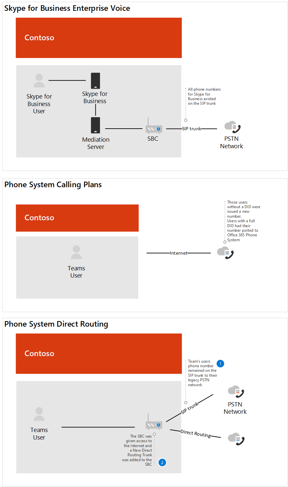

# Estudo de caso contoso: Sistema de Telefonia para uma empresa multi-nacional

Dependendo da localização geográfica e de outros fatores, a Contoso tinha escritórios usando as seguintes soluções de telefonia:

- Tipo de site A: Skype for Business Enterprise Voice

- Tipo de site B: Sistemas de telefonia herdados tradicionais

- Tipo de site C: uma combinação de Skype for Business Enterprise Voice e sistemas de telefonia herdados tradicionais

Para implementar uma solução Telefone Microsoft System para toda a organização, a Contoso&mdash; precisava determinar para cada tipo de site&mdash; qual das seguintes opções seria usada com o Sistema de Telefonia para se conectar à PSTN (Rede Telefônica Pública Comucionária):

- Sistema de Telefonia com Plano de Chamada 

- Sistema de Telefonia com a própria operadora PSTN por meio de Roteamento Direto 

- Combinação de Sistema de Telefonia com Plano de Chamadas e Sistema de Telefonia com a própria operadora PSTN por meio de Roteamento Direto
 
Para determinar a solução certa para sua organização, a Contoso usou [Plan your Teams voice solution](/microsoftteams/cloud-voice-landing-page) e a sessão Ignite 2019 [Calling in Microsoft Teams](https://myignite.techcommunity.microsoft.com/sessions/83170?source=sessions).  

## Tipo de site A: Skype for Business Enterprise Voice 

Contoso Skype for Business Enterprise Voice foi configurada como hub e falada. Havia um local central que mantinha o gateway PSTN na região que forneceu a conexão com o PSTN para os usuários Skype for Business Enterprise Voice no país. Muitas vezes, esses escritórios via satélite não têm sua própria saída da Internet. Os números desses usuários residiam no tronco SIP que se conecta a um SBC existente. 

Para determinar se o SBC já implantado está certificado para Roteamento Direto e Desvio de Mídia, a Contoso verificou a Lista de Controladores de Borda de Sessão [certificados para Roteamento Direto](direct-routing-border-controllers.md).  

Os hábitos de discagem do usuário eram discar um usuário no sistema de telefonia herdado usando uma extensão, mesmo quando o usuário tem um cliente Skype for Business disponível para áudio ponto a ponto. 

A Contoso baseou sua decisão nas seguintes perguntas:

- Q. Precisamos manter a funcionalidade fornecida pela implantação local? 
  A. Não 

- Q. Precisamos interoperar com sistemas PBX de terceiros e outros equipamentos de telefonia? 
  A. Não 

- Q. Precisamos manter nossa operadora de terceiros atual?  A. Sim (países regulamentados) e Não 

- Q. Precisamos implantar o ROI em SBCs?  A. Sim e Não  

- Q. Os Planos de Chamada PSTN da Microsoft estão disponíveis nesta região?  A. Sim e Não 

Com base nas respostas às suas perguntas, a Contoso decidiu:

- Mova os usuários que estão localizados em uma região onde os planos de chamada PSTN estão disponíveis para Sistema de Telefonia com Planos de Chamada. 

- Mova os usuários que não estão localizados em uma região onde os planos de chamadas PSTN estão disponíveis, os usuários localizados em um site onde o ROI nos SBCs ainda não foram atendidos e os usuários que residiram em um país que tenha regulamentações de telefonia para Sistema de Telefonia com Roteamento Direto. 

O diagrama a seguir mostra a implantação Skype for Business Enterprise Voice inicial e como essa implantação foi migrada para planos de chamadas da Microsoft e roteamento direto:

## Tipo de site B: Sistemas de telefonia herdados tradicionais

A Contoso tinha muitos escritórios que utilizava sistemas de telefonia herdados. Havia um subconjunto de usuários que tinham um número de telefone E1.64 enquanto outros tinham apenas uma extensão. Esses números residiam no tronco TDM para o gateway PSTN. A discagem intra-site foi configurada aproveitando um código de site em frente à extensão para determinar para onde encaminhar a chamada. Os hábitos de discagem dos usuários eram discar por extensão.   

A Contoso baseou sua decisão nas seguintes perguntas:

- Q. Precisamos manter a funcionalidade fornecida pela implantação local? 
  A. Não 

- Q. Precisamos interoperar com sistemas PBX de terceiros e outros equipamentos de telefonia?  A. Sim

- Q. Precisamos manter nossa operadora de terceiros atual?  A. Não 

- Q. O Plano de Chamada da Microsoft PSTN está disponível em nossa região?  A. Sim e Não 

Com base nas respostas às suas perguntas, a Contoso decidiu: 

- Mova os usuários que estão localizados em uma região onde os planos de chamada PSTN estão disponíveis para Sistema de Telefonia com Planos de Chamada. 

- Mova os usuários que não estão localizados em uma região onde os planos de chamadas PSTN estão disponíveis para Sistema de Telefonia com Roteamento Direto. 

- Mantenha uma conexão PSTN com dispositivos analógicos críticos de negócios.

Os diagramas a seguir mostram a implantação do sistema herdados original com sites remotos e a migração para uma implantação de Roteamento Direto com Otimização de Mídia Local:

**Implantação herdda original** 

**Implantação com Roteamento Direto**

 
## Tipo de site C: combinação de Skype for Business Enterprise Voice e sistemas de telefonia herdados tradicionais

A Contoso Skype for Business Enterprise Voice os números dos usuários residem no tronco SIP para o SBC da operadora. Os números dos sistemas de telefonia tradicionais residiam no tronco TDM para o gateway PSTN.   

A Contoso baseou sua decisão nas seguintes perguntas:

- Q. Precisamos manter a funcionalidade fornecida pela implantação local? 
  A. Não 

- Q. Precisamos interoperar com sistemas PBX de terceiros e outros equipamentos de telefonia?  A. Não 

- Q. Precisamos manter nossa operadora de terceiros atual?  A. Não 

- Q. Precisamos implantar o ROI em SBCs?  A. Sim e Não  

- Q. O Plano de Chamada PSTN da Microsoft está disponível nesta região?  A. Não 

Com base nas respostas às suas perguntas, a Contoso decidiu o seguinte: 

- Para os usuários de telefonia herdados que serão habilitados para Roteamento Direto, a Contoso portava os números do tronco TDM para o Tronco SIP do SBC, já que o SBC é certificado para Roteamento Direto. 

- Para dar suporte a um subconjunto de usuários que Sistema de Telefonia e permitir o roteamento contínuo pelo sistema herdado, o sistema de telefonia herdado foi definido como o próximo salto para o SBC.   

- Além disso, para incentivar a mudança de comportamento do usuário e remover a dependência da discagem de extensão entre e dentro do site, a Contoso forneceu orientações para usar o Teams para todas as chamadas internas.  

Os diagramas a seguir mostram a implantação do sistema de telefonia Skype for Business Enterprise Voice e herdada e a migração para uma implantação mista usando Roteamento Direto:

**Implantação mista original**

**Implantação mista com Roteamento Direto**

## Planos de Chamadas

Para determinar os requisitos de configuração para Planos de Chamada, a Contoso analisou as decisões principais de [implantação do Plano de Chamada](calling-plan-landing-page.md#core-deployment-decisions). As decisões resultantes foram tomadas: 

- Q. Meus usuários precisam de chamada internacional?  A. Sim 

- Q. Cada um dos meus usuários tem um número de telefone DID direto para dentro?  R. Não hoje. Todos os usuários habilitados receberão um DID. 

- Q. Quero mascarar ou desabilitar a ID do chamador?  A. A ID do chamador de um usuário será mascarada para o número local da Contoso. 

## Roteamento Direto

A Contoso participou do Ignite para se manter Office 365 recursos, incluindo aqueles disponíveis com Telefone sistema e Roteamento Direto. Líderes técnicos e arquitetos usaram as diretrizes fornecidas durante o Ignite 2019 para determinar sua direção.  Principais sessões que foram usadas: 

- [Planejar o sucesso com Microsoft Teams Roteamento Direto](https://myignite.techcommunity.microsoft.com/sessions/80381?source=sessions)

- [Atualizações para Roteamento Direto](https://myignite.techcommunity.microsoft.com/sessions/80381?source=sessions)

## Configuração

### Sites de Planos de Chamada

Para obter licenças e atribuir números de telefone aos usuários, a Contoso seguiu as etapas em [Configurar Planos de Chamadas](set-up-calling-plans.md). 

Devido ao número de usuários que precisavam ser atribuídos números de telefone, a Contoso decidiu usar o PowerShell para atribuir os números de telefone. Para saber como atribuir números usando o PowerShellin&mdash;&mdash; além de outras configuraçõesContoso usou o [Teams Visão Geral do PowerShell](teams-powershell-overview.md).  

### Sites de Roteamento Direto

Para conectar a infraestrutura de telefonia local da Contoso ao Microsoft Teams, o administrador da Contoso seguiu as etapas em [Configurar](direct-routing-configure.md) Roteamento Direto e reviu o vídeo [Roteamento](https://www.youtube.com/watch?v=1ASftX_Msb8&index=10&list=PLaSOUojkSiGnKuE30ckcjnDVkMNqDv0Vl) Direto no Microsoft Teams para obter orientação.  A Contoso também se referiu à documentação de implantação de roteamento direto pelo fornecedor SBC certificado. 

Depois que o Roteamento Direto foi configurado entre o SBC e o Telefone Microsoft System, foi necessário que a Contoso testa a configuração. Para fazer isso, os administradores da Contoso usaram o cliente testador SIP que foi discutido na sessão Atualizações para Roteamento Direto no [Ignite 2019](https://myignite.techcommunity.microsoft.com/sessions/83178?source=sessions). O script e a documentação do cliente do Testador SIP foram baixados do script do PowerShell para testar conexões do Controlador de Borda de Sessão de Roteamento Direto.   

### Otimização de mídia local

A Contoso viu a oportunidade de aproveitar a Otimização de Mídia Local nas diferentes regiões do mundo. Os cenários com suporte para Contoso são descritos em [Otimização de Mídia Local para Roteamento Direto](direct-routing-media-optimization.md). A configuração da otimização de mídia local foi concluída seguindo as diretrizes do fornecedor SBC e da Microsoft. As etapas de configuração para Otimização de Mídia Local incluem: 

- Configurar o usuário e os sites SBC 

- Configurar o SBC de acordo com a especificação do fornecedor SBC, 

- Adicionar endereços IP confiáveis externos a cada site usado para Otimização de Mídia Local    

- Definir a topologia de rede 

- Definir a topologia de rede virtual 

- Determinar o modo: Sempre Ignorar ou Somente para usuários locais 

## Considerações sobre rede

A Contoso tinha vários usuários que precisavam trabalhar remotamente por um longo período de tempo depois que eles estavam habilitados para Sistema de Telefonia. Os usuários usavam VPN para acessar determinados aplicativos de Linha de Negócios. Durante a VPN, os usuários Sistema de Telefonia experimentaram uma degradação da qualidade da chamada. 

Para resolver o problema de qualidade, a Contoso implementou o túnel dividido de VPN, o que permitiu que seu tráfego Office 365 atravessasse a Internet enquanto a conexão com os aplicativos internos permanecesse na VPN. Para implementar o túnel dividido de VPN, a Contoso seguiu as diretrizes em Implementar o túnel [dividido de VPN para](/office365/enterprise/office-365-vpn-implement-split-tunnel) Office 365.  

